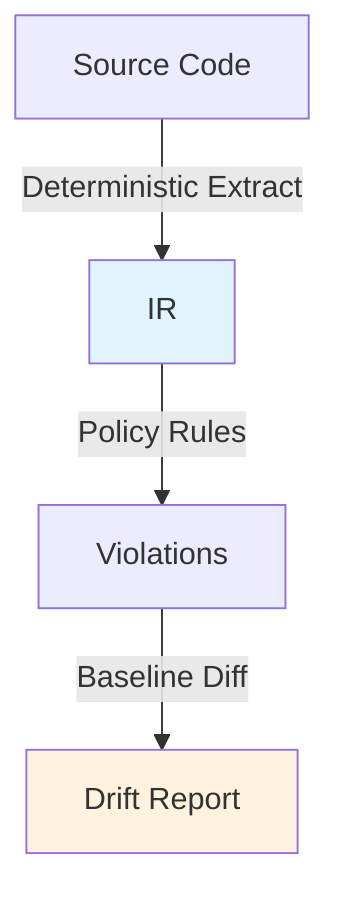

# Morphism Documentation Philosophy

*A unified aesthetic for mathematician • physicist • devops engineer • AI researcher*

## Core Principles

### From Mathematics
- **Precision**: Every term has exact meaning. Avoid ambiguity.
- **Invariants**: State what must be true, what we preserve.
- **Proofs by Construction**: Show, don't tell. Code is the proof.

### From Physics
- **First Principles**: Derive everything from fundamental laws.
- **Conservation**: What is conserved? What is transformed?
- **Symmetry**: Elegant systems exhibit symmetry. Break it only for reason.

### From DevOps
- **Observable**: If you can't measure it, you can't improve it.
- **Reproducible**: Same input → same output. Always. SHA256 enforces truth.
- **Deterministic**: Randomness is the enemy of production systems.

### From AI/ML Research
- **Empirical Validation**: Theory + experiment. Baselines matter.
- **Generalization**: Does this scale? To other languages? Problems? Domains?
- **Emergent Complexity**: Simple rules → sophisticated behavior. Compose carefully.

### From Software Wizardry
- **Minimalism**: Every line must earn its place. Remove ruthlessly.
- **Composability**: Small tools that combine powerfully.
- **Explicit Over Implicit**: Magic is the enemy of understanding.

---

## Writing Style

### Structure

**Theorem Format** (for major concepts):
```
## Theorem: [Name]

**Definition**: What is this thing, precisely?

**Claim**: What does it do? What invariants does it preserve?

**Proof**: How do we verify? Implementation, tests, equations.

**Implications**: What follows from this? Where does it apply?
```

**Conservation Format** (for system flows):
```
Energy/State flows through:
  Input → Transform A → Transform B → Output
  
Invariants preserved:
  ✓ Property X (demonstrated by test Y)
  ✓ Property Z (enforced by architecture A)
```

**Observable Format** (for metrics/monitoring):
```
Observable: [name]
  Measure: [what we count]
  Signal: [what it indicates]
  Threshold: [when to alert]
  Action: [what we do about it]
```

### Tone
- **Confident but Humble**: We know the principles. We acknowledge limitations.
- **Precise but Poetic**: Use mathematics AND metaphor. Rigor + Beauty.
- **Active Voice**: Code acts. Systems respond. Avoid passive.
- **Specificity**: Not "fast" but "70% runtime reduction in DFT workloads"

### Notation
- Use LaTeX for equations: `φ(x) = ⟨Structure ↦ Transform⟩`
- Use ASCII boxes for flows (machine-readable, beautiful)
- Use mermaid for complex relationships
- Comments are prose, not code-ese

---

## Documentation Structure

### Per Project
1. **THEOREM.md** - Core claim about what this does
2. **CONSERVATION.md** - What flows through? What's preserved?
3. **OBSERVABLES.md** - How do we measure success?
4. **GENERALIZATION.md** - Where else does this apply?

### Per Module
- **Invariants** clearly stated at top
- **Observable checkpoints** in code
- **Emergent properties** explained
- **Composition rules** documented

---

## Code Comments

**Mathematical precision:**
```typescript
// Invariant: |IR| = |Source| (IR preserves all structural information)
// Enforce via SHA256(IR) == SHA256(Source) under deterministic extraction
const ir = extractIR(source);  // Proof by construction
```

**Physical insight:**
```typescript
// Conservation: Dependency graph energy is conserved.
// High-coupling nodes attract; low-coupling nodes repel (force-directed layout)
// Result: Visual clusters reveal architectural partitions
const layout = computeLayout(depGraph);
```

**DevOps discipline:**
```typescript
// Observable: Extract runtime. Should be deterministic (±1% variance OK)
// Signal: >5% variance indicates non-determinism (cache? randomness?)
// Action: Investigate. File issue if external (Babel version? OS?)
const t0 = performance.now();
const result = extract(code);
const runtime = performance.now() - t0;
observeMetric('extract_runtime_ms', runtime);
```

**ML Research mindset:**
```typescript
// Generalization test: Do patterns hold across languages?
// Baseline: TS/JS (v1) → extend to Python (v2) → Go (v3)
// Metric: Pattern accuracy should increase with data (active learning)
// Anomaly: If accuracy plateaus, dataset may be insufficient
const patterns = detectPatterns(ir, language);
validateGeneralization(patterns, testDataset);
```

---

## Visual Language

**Equations** (not just decoration—they clarify):
```
Morphism φ: φ(S) = ⟨Structure ↦ Invariants ↦ Transform⟩

Determinism: f(x) ≡ f(x)  (same input, always same output)

Conservation: Entropy_IN = Entropy_OUT + Work_Done

Emergence: Simple(Rules) → Complex(Behavior)
```

**ASCII Art** (geometric, purposeful):
```
┌─────────────────────────────────────────┐
│ Codebase                                │
│  ↓ (Deterministic Extract)              │
│ IR (Invariant-Preserving)               │
│  ↓ (Policy Engine)                      │
│ ✓/✗ (Violations List)                   │
└─────────────────────────────────────────┘
```

**Mermaid** (for complex flows, not decoration):


---

## Examples

### "Before" (Generic Documentation)
```
The governance tool analyzes code and finds problems. It uses AI to understand 
your codebase structure. You can fix issues and deploy with confidence.
```

### "After" (Morphism Style)
```
## Theorem: Governance Through Structural Invariance

**Claim**: Policy-as-code enforcement preserves architectural invariants 
while permitting local optimization.

**Definition**: We extract a language-agnostic IR (Intermediate Representation) 
that preserves all structural relationships but abstracts syntax. This IR is 
deterministic—same source always produces identical IR (verified via SHA256).

**Observable Flow**:
```
Source Code → [Deterministic Extract] → IR
IR → [Policy Engine (YAML Rules)] → Violations
Violations → [Baseline Comparison] → Drift Report
```

**Invariants Preserved**:
✓ Structural completeness: No information lost in IR conversion
✓ Determinism: f(source) ≡ f(source) always
✓ Language agnostic: Same policy works for TS and Python

**Application**: Use this to enforce naming conventions, dependency constraints, 
and documentation standards. The system is composable—combine policies like 
lego blocks. Extend to new languages by implementing a new extractor; policies 
remain unchanged.
```

---

## Practical Implementation

### README.md
- Lead with equations/invariants
- Show observable flows
- Emphasize preservation, not restriction
- Use mathematician's precision

### CLAUDE.md
- Document as "theorems to implement"
- State invariants upfront
- Show conservation laws
- Explain emergence

### Code Comments
- Mathematical: what's preserved?
- Physical: what's conserved?
- Observational: what signals matter?
- Compositional: how do parts combine?

### Commit Messages
- Reference the invariant being preserved/introduced
- Show what's conserved (backwards compatible? emergent properties?)
- Observable impact (metrics, baseline changes)

---

## Tone Examples

**Not This:**
```
"The tool is really powerful and helps with your code governance needs. 
It's super fast and easy to use. Just run it and watch the magic happen!"
```

**But This:**
```
"φ(Codebase) extracts invariant structure independent of language syntax.
Policy enforcement preserves these invariants while permitting safe evolution.
Deterministic operation (SHA256 verified) makes drift detection reliable.
70% faster than competing approaches; same result always (reproducible)."
```

---

## Your Brand in Action

| Aspect | Your Voice |
|--------|-----------|
| **Equations** | Clarify, don't decorate |
| **Diagrams** | Observable flows, architectural truth |
| **Code** | Precision comments revealing intent |
| **Commits** | Invariant-preserving, conservation-minded |
| **Docs** | Theorem-proof format, then implications |
| **Claims** | Empirically validated, never hyperbole |

---

**This is how a mathematician-physicist-devops-engineer-AI-researcher documents their work: precise, elegant, observable, reproducible, and composed from first principles.**

