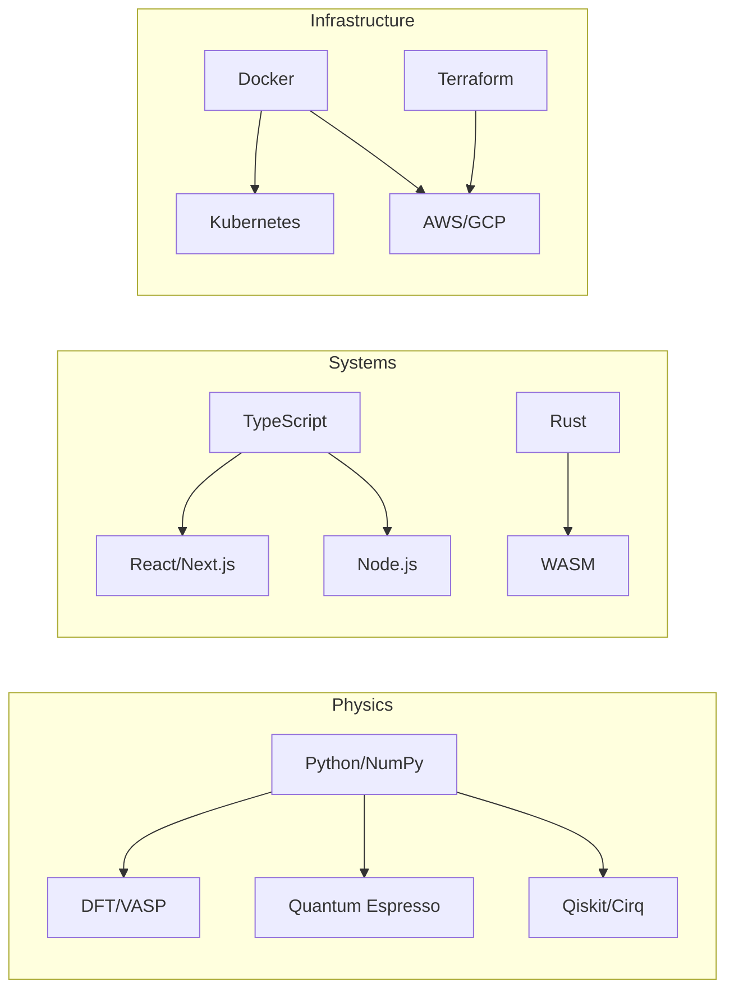

<a id="top"></a>

<div align="center">

```text
███╗   ███╗███████╗███████╗██╗  ██╗ █████╗ ██╗     
████╗ ████║██╔════╝██╔════╝██║  ██║██╔══██╗██║     
██╔████╔██║█████╗  ███████╗███████║███████║██║     
██║╚██╔╝██║██╔══╝  ╚════██║██╔══██║██╔══██║██║     
██║ ╚═╝ ██║███████╗███████║██║  ██║██║  ██║███████╗
╚═╝     ╚═╝╚══════╝╚══════╝╚═╝  ╚═╝╚═╝  ╚═╝╚══════╝
```

### Computational Physicist • AI Research Engineer • Systems Architect

[](https://morphism.systems)
[](https://scholar.google.com/citations?user=IB_E6GQAAAAJ)
[](https://maps.google.com/?q=San+Francisco,CA)

</div>

---

## 🔭 Perspective

I build systems that respect **invariants**. Whether it's the conserved quantities in a quantum simulation or the architectural boundaries in a distributed software system, the principle is the same: **Find the structure that must be preserved, and optimize everything else around it.**

My work spans from **ab-initio quantum materials simulation** (DFT, Quantum Espresso) to **autonomous AI agent swarms** (Morphism Framework).

> *"The best code is like a physics equation—minimal, elegant, and captures the essence of truth."*

---

## 🧬 The Morphism Ecosystem

My primary output is organized into a cohesive workspace known as **Morphism**.

| System | Designation | Purpose |
|:---|:---|:---|
| **[Morphism Framework](https://github.com/alawein/morphism-framework)** | `core` | A monorepo architecture for "structure-preserving transformations." Arrange once, gift forever. |
| **[Optilibria](https://github.com/alawein/morphism-framework/tree/main/packages/misc-qaplibria)** | `research` | Quantum-inspired optimization. Gradient preconditioning, FFT-accelerated attractor programming. |
| **[Evidentia](https://github.com/alawein/morphism-playground/tree/main/evidentia)** | `legal-tech` | Autonomous legal reasoning agents using MCP (Model Context Protocol). |
| **[REPZ](https://github.com/alawein/repz)** | `biophysics` | Fitness coaching platform modeling biological adaptation as an optimization problem. |

---

## 🔬 Selected Works & Research

### Quantum & HPC
- **Scalable DFT Workflows**: Managed 2,300+ production jobs across 24,000 CPU-hours, achieving a **70% runtime reduction** via algorithmic optimization.
- **Spintronic Simulation**: Developed EDA-compatible models yielding **1000x speedups** over finite element methods.
- **Patents Pending**: Novel approaches in Quantum Gradient Preconditioning and ML-Trained Attractor Agents.

### AI Engineering
- **Morphism AI**: A multi-agent orchestration layer capable of self-healing codebases and enforcing architectural invariants.
- **Knowledge Functors**: Experimental mapping of legal logic to executable code structures.

---

## 🛠️ Technology Stack



---

## 📡 Transmission

<div align="center">

| Channel | Frequency |
|:---|:---|
| **Email** | [`contact@meshal.ai`](mailto:contact@meshal.ai) |
| **Academic** | [`meshal@berkeley.edu`](mailto:meshal@berkeley.edu) |
| **Web** | [malawein.com](https://malawein.com) |
| **LinkedIn** | [linkedin.com/in/alawein](https://linkedin.com/in/alawein) |

</div>

<div align="center">
<sub>
&copy; 2026 Meshal Alawein. Architecture is an invariant.
</sub>
</div>
