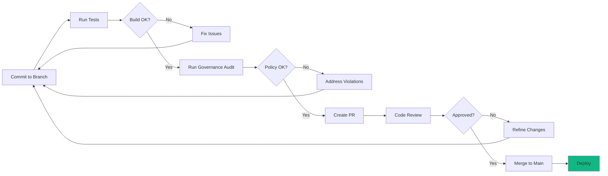

<a id="top"></a>

<div align="center">

```
███╗   ███╗███████╗███████╗██╗  ██╗ █████╗ ██╗     
████╗ ████║██╔════╝██╔════╝██║  ██║██╔══██╗██║     
██╔████╔██║█████╗  ███████╗███████║███████║██║     
██║╚██╔╝██║██╔══╝  ╚════██║██╔══██║██║  ██║██║     
██║ ╚═╝ ██║███████╗███████║██║  ██║██║  ██║███████╗
╚═╝     ╚═╝╚══════╝╚══════╝╚═╝  ╚═╝╚═╝  ╚═╝╚══════╝
```

Computational Physicist • AI Research Engineer • Systems Architect

</div>

---

## Perspective

I build systems that respect **invariants**. Whether it's the conserved quantities in a quantum simulation or the architectural boundaries in a distributed software system, the principle is the same:

> **Find the structure that must be preserved. Optimize everything else around it.**

My work spans from **ab-initio quantum materials simulation** (DFT, Quantum Espresso) to **autonomous AI agent swarms** (Morphism Framework).

---

## The Morphism Ecosystem

```
┌─ Morphism ──────────────────────────────────────────┐
│                                                      │
│  φ(S) = ⟨Structure ↦ Invariants ↦ Transform⟩       │
│                                                      │
│  [Framework] ─→ [Governance] ─→ [Orchestration]     │
│       ↓              ↓               ↓               │
│   Core Arch     Policy Engine    Monorepo Coord      │
│                                                      │
└──────────────────────────────────────────────────────┘
```

| System | Role | Purpose |
|:---|:---|:---|
| **[Morphism Framework](https://github.com/alawein/morphism-framework)** | `core` | Structure-preserving transformations. Arrange once, gift forever. |
| **[Morphism Workspace](https://github.com/alawein/morphism-workspace)** | `orchestrator` | Coordinates repositories and governance across ecosystem. |
| **[@morphism/governance](https://github.com/alawein/morphism-workspace/tree/main/morphism-projects/clis/morphism-governance)** | `validation` | Policy-as-code enforcement and architectural drift detection. |
| **[Optilibria](https://github.com/alawein/morphism-framework/tree/main/packages/misc-qaplibria)** | `research` | Quantum-inspired optimization with FFT preconditioning. |
| **[Evidentia](https://github.com/alawein/morphism-playground/tree/main/evidentia)** | `legal-tech` | Autonomous legal reasoning via MCP agents. |

---

## Governance & Deployment

### @morphism/governance: v1.0-v1.2

```
Codebase IR Analysis
     ↓
┌────────────────────────┐
│ Language-Agnostic IR   │  ← TS/JS parser (v1), Python/Go (v2)
│ (Intermediate Rep)     │
└────────────────────────┘
     ↓
Policy Engine (YAML Rules)
     ↓
┌────────────────────────┐
│ Pattern Analysis       │  → Naming • Dependencies • Structure
│ Baseline/Drift         │  → Breaking Changes • Violations
│ Auto Documentation     │  → API Docs from IR
└────────────────────────┘
     ↓
CI/CD Integration (GitHub Actions)
```

**Status:** Complete (7,000+ LOC)
- IR extraction for TypeScript/JavaScript
- Policy evaluation engine with YAML rules
- Pattern analysis (naming, dependencies, structure)
- Baseline & drift detection (breaking change identification)
- Automated API documentation
- GitHub Actions workflow integration
- 800+ LOC comprehensive tests
- 1,400+ lines documentation

**Commands:**
```bash
morphism-gov scan              # Extract codebase IR
morphism-gov audit             # Enforce governance policies
morphism-gov baseline          # Create/manage baselines
morphism-gov analyze-patterns  # Detect naming patterns
morphism-gov document          # Generate API docs
```

---

## Infrastructure & Standardization

### Deployment Workflow



### Standardization Framework

```
Deterministic Analysis
  │
  ├─ Same Input → Same Output (SHA256 integrity)
  ├─ Reproducible Baselines (CI-friendly)
  ├─ Policy Enforcement (YAML-based, no code needed)
  └─ Drift Detection (automatic breaking change alerts)

Exit Codes:
  0 = Clean / Policy compliant
  1 = Violations or drift detected
  2 = Error / Analysis failed
```

---

## Technology Stack

**Languages:** TypeScript • JavaScript (Python, Go, Rust planned)

**Core:**
```
Parsing:        Babel + TypeScript Compiler (AST → IR)
Policy:         YAML declarative rules
CLI:            Commander.js
CI/CD:          GitHub Actions
Orchestration:  Docker • Kubernetes
```

**Patterns:**
- Policy-as-Code (declarative governance)
- Intermediate Representation (language-agnostic analysis)
- Deterministic Analysis (reproducible CI/CD)
- Monorepo Orchestration (coordinated development)
- Structure-Preserving Transformations (invariant-respecting)

---

## Design Principles

**Invariant Preservation** — Find the structure that must be preserved, optimize everything else  
**Deterministic Systems** — Same codebase → same output (CI baseline friendly)  
**Declarative Governance** — YAML policies, no programming required  
**Language Agnostic** — Analysis independent of syntax  
**Ease of Shipping** — Standardized workflows reduce friction

---

## Selected Works & Research

### Quantum & HPC
- Scalable DFT Workflows: 2,300+ production jobs, 70% runtime reduction
- Spintronic Simulation: 1000x speedups vs. finite element methods
- Patents Pending: Quantum Gradient Preconditioning, ML-Trained Attractors

### AI Engineering
- Multi-agent orchestration with architectural invariant enforcement
- Legal reasoning agents mapping logic to executable code

---

## Contact

| | |
|:---|:---|
| Email | contact@meshal.ai |
| Academic | meshal@berkeley.edu |
| Scholar | [Google Scholar](https://scholar.google.com/citations?user=IB_E6GQAAAAJ) |
| Web | [malawein.com](https://malawein.com) |

---

<div align="center">

**[Morphism Framework](https://github.com/alawein/morphism-framework)** • **[Morphism Workspace](https://github.com/alawein/morphism-workspace)** • **[All Repos](https://github.com/alawein?tab=repositories)**

Architecture is an invariant. Design systems that preserve structure.

**Updated:** 2026-01-17 | **Status:** Active Development

</div>
