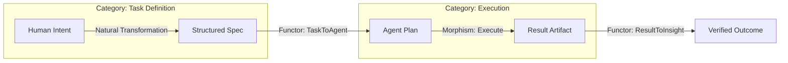
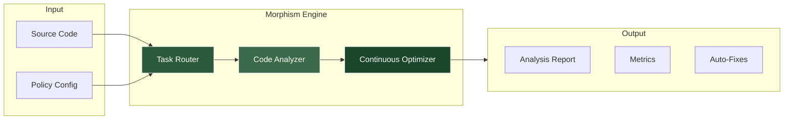

# Morphism Systems

<div align="center">

```text
███╗   ███╗███████╗███████╗██╗  ██╗ █████╗ ██╗     
████╗ ████║██╔════╝██╔════╝██║  ██║██╔══██╗██║     
██╔████╔██║█████╗  ███████╗███████║███████║██║     
██║╚██╔╝██║██╔══╝  ╚════██║██╔══██║██╔══██║██║     
██║ ╚═╝ ██║███████╗███████║██║  ██║██║  ██║███████╗
╚═╝     ╚═╝╚══════╝╚══════╝╚═╝  ╚═╝╚═╝  ╚═╝╚══════╝
```

**Computational Physicist • AI Research Engineer • Systems Architect**

[](https://github.com/alawein) [](https://linkedin.com/in/meshal-alawien) [](https://meshal.ai) [](mailto:contact@meshal.ai)
---

## Perspective

I build systems that respect **invariants**.

Whether it's tracking conserved quantities through a quantum simulation or holding architectural boundaries steady in a distributed system, the principle remains the same: **Find what must be preserved. Optimize everything else.**

My work applies this philosophy across three distinct distinct domains:
1.  **Physics:** High-performance quantum materials simulation.
2.  **Architecture:** Self-healing, structure-preserving software frameworks.
3.  **Agents:** Autonomous systems that reason within strict boundary conditions.

> *"The best code reads like physics. Minimal. Elegant. True."*

---

## Technical Portfolio

My work is divided into distinct, standalone systems.

| System | Domain | Description |
|:---|:---|:---|
| **[Morphism Framework](https://github.com/alawein/morphism-framework)** | `Systems Architecture` | A project-agnostic, self-healing monorepo architecture. It provides the *structure* for complex systems but is decoupled from their *domain logic*. |
| **[Optilibria](https://github.com/alawein/morphism-framework/tree/main/packages/misc-qaplibria)** | `Computational Physics` | Quantum-inspired optimization research. Focuses on gradient preconditioning and FFT-accelerated attractor programming. |
| **[Evidentia](https://github.com/alawein/morphism-dev/tree/main/apps/evidentia)** | `Legal Tech` | Autonomous legal reasoning agents. Maps unstructured evidence to structured claims using the Model Context Protocol. |
| **[REPZ](https://github.com/alawein/repz)** | `Biophysics` | Fitness coaching engine that models biological adaptation as a rigorous optimization problem. |

---

## The Mathematical Framework

The Morphism ecosystem is not just a collection of tools; it is a realization of applied Category Theory.

### 🧠 The Codex of Functorial Intelligence

We map software engineering and AI concepts directly to mathematical structures, ensuring rigorous composability and type safety at the architectural level.

| Mathematical Concept | Software Realization |
|:---|:---|
| **Category** | A Domain (e.g., `LLM Model Family`, `DevOps Pipeline`). A collection of objects and morphisms. |
| **Object** | A specific instance or state (e.g., `GPT-4`, `Production Environment v1.2`). |
| **Morphism** | A transformation process (e.g., `Fine-tuning`, `Deployment`). Maps one object to another within a category. |
| **Functor** | A structure-preserving map between domains (e.g., `TextToEmbeddings`). Transforms a Task definition into an Agent workflow without losing semantic meaning. |
| **Isomorphism** | An invertible transformation (e.g., `Code <-> AST`). Ensures we can translate between representations with zero information loss. |
| **Homomorphism** | A structure-preserving transformation where structure is maintained but data might be simplified (e.g., `System Logs -> Metrics`). |

### 🔄 Isomorphic Workflows



**Key Functors:**
*   **`TextToEmbeddings`**: Maps the category of Text to the category of Vector Spaces. Preserves semantic relationships.
*   **`TaskToAgent`**: Maps a defined Task schema to an executable Agent workflow. Preserves intent and constraints.

---

## System Architecture

The Morphism ecosystem is designed as a self-correcting feedback loop.



## Decision Logic

Every artifact in the system has a deterministic home. This decision tree ensures architectural entropy remains zero.

```text
Is it a standalone tool usable without morphism-framework?
├── YES → morphism-prod/
└── NO → Is it experimental/research?
    ├── YES → morphism-dev/
    └── NO → Is it a reusable package?
        ├── YES → morphism-framework/packages/
        └── NO → Is it a product/application?
            ├── YES → portfolio-products/
            └── NO → morphism-framework/tools/
```

---

## Technology Stack

**Physics & Simulation**


**Systems & Interfaces**


**Infrastructure**


---

## Transmission

<div align="center">

[Email](mailto:contact@meshal.ai) • [Business](mailto:contact@morphism.systems) • [Portfolio](https://meshal.ai) • [GitHub](https://github.com/alawein) • [LinkedIn](https://linkedin.com/in/meshal-alawein)

<sub>*Architecture is an invariant. © 2026 Meshal Alawein.*</sub>

</div>
