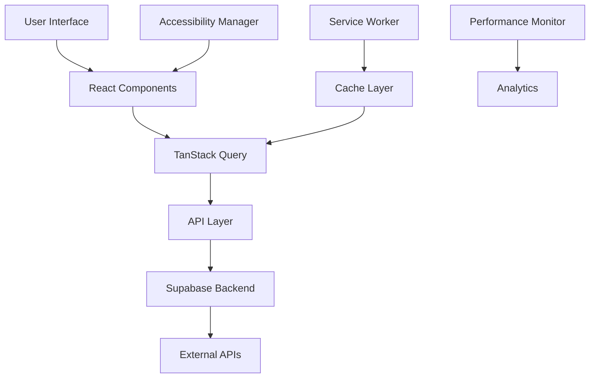

# LLM Works Developer Guide

## Table of Contents

1. [Development Setup](#development-setup)
2. [Architecture Overview](#architecture-overview)
3. [Project Structure](#project-structure)
4. [Component Development](#component-development)
5. [State Management](#state-management)
6. [API Integration](#api-integration)
7. [Testing Strategy](#testing-strategy)
8. [Performance Optimization](#performance-optimization)
9. [Accessibility Implementation](#accessibility-implementation)
10. [Deployment](#deployment)
11. [Contributing Guidelines](#contributing-guidelines)

## Development Setup

### Prerequisites

- **Node.js**: v18+ (LTS recommended)
- **npm**: v9+ (or pnpm/yarn)
- **Git**: Latest version
- **VS Code**: Recommended editor with extensions

### Quick Start

```bash
# Clone the repository
git clone https://github.com/alawein/aegis-ai-evaluator.git
cd aegis-ai-evaluator

# Install dependencies
npm install

# Start development server
npm run dev

# Open browser to http://localhost:8082
```

### Environment Configuration

Create a `.env.local` file for development:

```bash
# Development settings
VITE_NODE_ENV=development
VITE_API_BASE_URL=http://localhost:3001
VITE_WS_BASE_URL=ws://localhost:3001

# Feature flags
VITE_ENABLE_PERFORMANCE_MONITORING=true
VITE_ENABLE_ACCESSIBILITY_TOOLBAR=true
VITE_ENABLE_DEBUG_MODE=true

# Optional: API keys for testing
VITE_OPENAI_API_KEY=sk-test-key
VITE_ANTHROPIC_API_KEY=sk-ant-test-key
```

### Recommended VS Code Extensions

```json
{
  "recommendations": [
    "bradlc.vscode-tailwindcss",
    "esbenp.prettier-vscode",
    "dbaeumer.vscode-eslint",
    "ms-vscode.vscode-typescript-next",
    "formulahendry.auto-rename-tag",
    "christian-kohler.path-intellisense",
    "ms-vscode.vscode-json"
  ]
}
```

## Architecture Overview

### Tech Stack

- **Frontend**: React 18 with TypeScript
- **Build Tool**: Vite 5 with SWC
- **UI Framework**: shadcn/ui (Radix UI + Tailwind CSS)
- **State Management**: TanStack Query + React Context
- **Routing**: React Router v6
- **Backend**: Supabase (auth, database, real-time)
- **Deployment**: Vercel/Netlify with GitHub Actions

### Core Principles

1. **Performance First**: Code splitting, lazy loading, service workers
2. **Accessibility by Design**: WCAG 2.2 AA compliance throughout
3. **Type Safety**: Strict TypeScript with proper error boundaries  
4. **Component Isolation**: Each component is self-contained with clear interfaces
5. **Progressive Enhancement**: Works without JS, enhanced with React

### Data Flow



## Project Structure

```
src/
├── components/           # Reusable UI components
│   ├── ui/              # shadcn/ui components (auto-generated)
│   ├── accessibility/   # Accessibility-specific components
│   ├── arena/          # Arena-specific components  
│   ├── bench/          # Benchmark components
│   ├── settings/       # Settings and configuration
│   └── analytics/      # Analytics and monitoring
├── pages/              # Route components
├── hooks/              # Custom React hooks
├── lib/                # Utility functions and configurations
├── integrations/       # External service integrations
│   └── supabase/      # Supabase client and types
├── types/              # TypeScript type definitions
└── assets/            # Static assets

public/
├── sw.js              # Service worker
├── robots.txt         # SEO configuration
├── sitemap.xml        # Site map
└── icons/             # App icons and favicons

docs/                  # Documentation
├── API_REFERENCE.md   # API documentation
├── USER_GUIDE.md      # User manual
├── DEVELOPER_GUIDE.md # This file
└── CONTRIBUTING.md    # Contribution guidelines
```

### File Naming Conventions

- **Components**: PascalCase (`UserProfile.tsx`)
- **Pages**: PascalCase (`Dashboard.tsx`)
- **Hooks**: camelCase with `use` prefix (`useKeyboardShortcuts.ts`)
- **Utils**: camelCase (`formatters.ts`)
- **Constants**: UPPER_SNAKE_CASE (`API_ENDPOINTS.ts`)
- **Types**: PascalCase (`UserTypes.ts`)

## Component Development

### Component Structure

```typescript
import { memo, useState, useEffect } from 'react';
import { Button } from '@/components/ui/button';
import { useToast } from '@/hooks/use-toast';

interface ComponentProps {
  required: string;
  optional?: boolean;
  children?: React.ReactNode;
}

export const Component = memo(({
  required,
  optional = false,
  children
}: ComponentProps) => {
  const [state, setState] = useState<string>('');
  const { toast } = useToast();

  useEffect(() => {
    // Effect logic
  }, []);

  const handleAction = () => {
    // Event handler
  };

  return (
    <div className="component-container">
      <Button onClick={handleAction}>
        {children}
      </Button>
    </div>
  );
});

Component.displayName = 'Component';
```

### Design System Usage

#### Colors and Theming

```typescript
// Use CSS custom properties for theming
const styles = {
  primary: 'hsl(var(--primary))',
  background: 'hsl(var(--background))',
  foreground: 'hsl(var(--foreground))'
};

// Use Tailwind classes with semantic names
<div className="bg-background text-foreground border-border">
  <Button variant="default" size="sm">
    Primary Action
  </Button>
</div>
```

#### Responsive Design

```typescript
// Mobile-first approach with Tailwind breakpoints
<div className="grid grid-cols-1 md:grid-cols-2 lg:grid-cols-3 gap-4">
  <Card className="p-4 md:p-6 lg:p-8">
    Content adapts to screen size
  </Card>
</div>
```

#### Accessibility Integration

```typescript
import { announceToScreenReader } from '@/lib/screen-reader';

const AccessibleComponent = () => {
  const handleSubmit = () => {
    // Announce success to screen readers
    announceToScreenReader('Form submitted successfully');
  };

  return (
    <form onSubmit={handleSubmit}>
      <label htmlFor="input-id" className="block mb-2">
        Descriptive Label
      </label>
      <input 
        id="input-id"
        aria-describedby="input-help"
        required
      />
      <div id="input-help" className="text-sm text-muted-foreground">
        Helper text for additional context
      </div>
    </form>
  );
};
```

### Component Testing

```typescript
import { render, screen } from '@testing-library/react';
import { userEvent } from '@testing-library/user-event';
import { Component } from './Component';

describe('Component', () => {
  test('renders with required props', () => {
    render(<Component required="test" />);
    expect(screen.getByText('test')).toBeInTheDocument();
  });

  test('handles user interactions', async () => {
    const user = userEvent.setup();
    render(<Component required="test" />);
    
    await user.click(screen.getByRole('button'));
    expect(screen.getByText('clicked')).toBeInTheDocument();
  });

  test('meets accessibility requirements', async () => {
    render(<Component required="test" />);
    
    // Check for proper ARIA labels
    expect(screen.getByRole('button')).toHaveAttribute('aria-label');
    
    // Test keyboard navigation
    const button = screen.getByRole('button');
    button.focus();
    expect(button).toHaveFocus();
  });
});
```

## State Management

### TanStack Query for Server State

```typescript
import { useQuery, useMutation, useQueryClient } from '@tanstack/react-query';

// Query hook
export const useEvaluations = () => {
  return useQuery({
    queryKey: ['evaluations'],
    queryFn: async () => {
      const response = await fetch('/api/evaluations');
      return response.json();
    },
    staleTime: 5 * 60 * 1000, // 5 minutes
    cacheTime: 10 * 60 * 1000, // 10 minutes
  });
};

// Mutation hook
export const useCreateEvaluation = () => {
  const queryClient = useQueryClient();
  
  return useMutation({
    mutationFn: async (data: EvaluationRequest) => {
      const response = await fetch('/api/evaluations', {
        method: 'POST',
        body: JSON.stringify(data),
      });
      return response.json();
    },
    onSuccess: () => {
      queryClient.invalidateQueries(['evaluations']);
    },
  });
};
```

### React Context for UI State

```typescript
import { createContext, useContext, useState } from 'react';

interface UIState {
  sidebarOpen: boolean;
  theme: 'light' | 'dark' | 'system';
  accessibilityMode: boolean;
}

const UIContext = createContext<{
  state: UIState;
  actions: {
    toggleSidebar: () => void;
    setTheme: (theme: UIState['theme']) => void;
    toggleAccessibility: () => void;
  };
} | null>(null);

export const UIProvider = ({ children }: { children: React.ReactNode }) => {
  const [state, setState] = useState<UIState>({
    sidebarOpen: false,
    theme: 'system',
    accessibilityMode: false,
  });

  const actions = {
    toggleSidebar: () => setState(s => ({ ...s, sidebarOpen: !s.sidebarOpen })),
    setTheme: (theme: UIState['theme']) => setState(s => ({ ...s, theme })),
    toggleAccessibility: () => setState(s => ({ ...s, accessibilityMode: !s.accessibilityMode })),
  };

  return (
    <UIContext.Provider value={{ state, actions }}>
      {children}
    </UIContext.Provider>
  );
};

export const useUI = () => {
  const context = useContext(UIContext);
  if (!context) throw new Error('useUI must be used within UIProvider');
  return context;
};
```

### LocalStorage Integration

```typescript
import { useState, useEffect } from 'react';

function useLocalStorage<T>(key: string, defaultValue: T) {
  const [value, setValue] = useState<T>(() => {
    try {
      const item = window.localStorage.getItem(key);
      return item ? JSON.parse(item) : defaultValue;
    } catch {
      return defaultValue;
    }
  });

  useEffect(() => {
    try {
      window.localStorage.setItem(key, JSON.stringify(value));
    } catch (error) {
      console.warn(`Failed to save ${key} to localStorage:`, error);
    }
  }, [key, value]);

  return [value, setValue] as const;
}
```

## API Integration

### API Client Setup

```typescript
// lib/api-client.ts
class APIClient {
  private baseURL: string;
  private apiKey?: string;

  constructor(baseURL: string, apiKey?: string) {
    this.baseURL = baseURL;
    this.apiKey = apiKey;
  }

  private async request<T>(
    endpoint: string,
    options: RequestInit = {}
  ): Promise<T> {
    const url = `${this.baseURL}${endpoint}`;
    const headers = {
      'Content-Type': 'application/json',
      ...(this.apiKey && { Authorization: `Bearer ${this.apiKey}` }),
      ...options.headers,
    };

    const response = await fetch(url, {
      ...options,
      headers,
    });

    if (!response.ok) {
      throw new APIError(
        `Request failed: ${response.status}`,
        response.status,
        await response.text()
      );
    }

    return response.json();
  }

  // Evaluation methods
  async createEvaluation(data: EvaluationRequest) {
    return this.request<Evaluation>('/evaluations', {
      method: 'POST',
      body: JSON.stringify(data),
    });
  }

  async getEvaluation(id: string) {
    return this.request<Evaluation>(`/evaluations/${id}`);
  }

  // Model methods
  async listModels() {
    return this.request<Model[]>('/models');
  }

  async testModel(id: string) {
    return this.request<ModelTestResult>(`/models/${id}/test`, {
      method: 'POST',
    });
  }
}

export const apiClient = new APIClient(
  import.meta.env.VITE_API_BASE_URL,
  import.meta.env.VITE_API_KEY
);
```

### Error Handling

```typescript
class APIError extends Error {
  constructor(
    message: string,
    public status: number,
    public details?: string
  ) {
    super(message);
    this.name = 'APIError';
  }
}

// Error boundary for API errors
export const APIErrorBoundary = ({ children }: { children: React.ReactNode }) => {
  return (
    <ErrorBoundary
      fallback={({ error, retry }) => (
        <div className="p-4 border border-destructive rounded">
          <h3>API Error</h3>
          <p>{error.message}</p>
          <Button onClick={retry}>Try Again</Button>
        </div>
      )}
    >
      {children}
    </ErrorBoundary>
  );
};
```

### WebSocket Integration

```typescript
import { useEffect, useRef, useState } from 'react';

interface WebSocketState {
  connected: boolean;
  error: string | null;
  data: any[];
}

export const useWebSocket = (url: string) => {
  const ws = useRef<WebSocket | null>(null);
  const [state, setState] = useState<WebSocketState>({
    connected: false,
    error: null,
    data: [],
  });

  useEffect(() => {
    ws.current = new WebSocket(url);

    ws.current.onopen = () => {
      setState(s => ({ ...s, connected: true, error: null }));
    };

    ws.current.onmessage = (event) => {
      const data = JSON.parse(event.data);
      setState(s => ({ ...s, data: [...s.data, data] }));
    };

    ws.current.onerror = () => {
      setState(s => ({ ...s, error: 'WebSocket connection error' }));
    };

    ws.current.onclose = () => {
      setState(s => ({ ...s, connected: false }));
    };

    return () => {
      ws.current?.close();
    };
  }, [url]);

  const sendMessage = (message: any) => {
    if (ws.current?.readyState === WebSocket.OPEN) {
      ws.current.send(JSON.stringify(message));
    }
  };

  return { ...state, sendMessage };
};
```

## Testing Strategy

### Unit Testing with Vitest

```typescript
// vitest.config.ts
import { defineConfig } from 'vitest/config';
import react from '@vitejs/plugin-react-swc';
import path from 'path';

export default defineConfig({
  plugins: [react()],
  test: {
    environment: 'jsdom',
    globals: true,
    setupFiles: ['./src/test/setup.ts'],
  },
  resolve: {
    alias: {
      '@': path.resolve(__dirname, './src'),
    },
  },
});
```

### Test Setup

```typescript
// src/test/setup.ts
import { beforeAll, vi } from 'vitest';
import '@testing-library/jest-dom';

// Mock API responses
beforeAll(() => {
  global.fetch = vi.fn();
  
  // Mock IntersectionObserver
  global.IntersectionObserver = vi.fn(() => ({
    observe: vi.fn(),
    unobserve: vi.fn(),
    disconnect: vi.fn(),
  }));

  // Mock WebSocket
  global.WebSocket = vi.fn(() => ({
    send: vi.fn(),
    close: vi.fn(),
    addEventListener: vi.fn(),
  }));
});
```

### Component Testing

```typescript
import { render, screen } from '@testing-library/react';
import { userEvent } from '@testing-library/user-event';
import { QueryClient, QueryClientProvider } from '@tanstack/react-query';
import { EvaluationForm } from './EvaluationForm';

const renderWithProviders = (ui: React.ReactElement) => {
  const queryClient = new QueryClient({
    defaultOptions: {
      queries: { retry: false },
      mutations: { retry: false },
    },
  });

  return render(
    <QueryClientProvider client={queryClient}>
      {ui}
    </QueryClientProvider>
  );
};

describe('EvaluationForm', () => {
  test('submits form with valid data', async () => {
    const user = userEvent.setup();
    const onSubmit = vi.fn();
    
    renderWithProviders(<EvaluationForm onSubmit={onSubmit} />);
    
    await user.type(screen.getByLabelText(/name/i), 'Test Evaluation');
    await user.selectOptions(screen.getByLabelText(/type/i), 'arena');
    await user.click(screen.getByRole('button', { name: /submit/i }));
    
    expect(onSubmit).toHaveBeenCalledWith({
      name: 'Test Evaluation',
      type: 'arena',
    });
  });
});
```

### E2E Testing with Playwright

```typescript
// tests/e2e/evaluation.spec.ts
import { test, expect } from '@playwright/test';

test.describe('Evaluation Flow', () => {
  test('can create and run arena evaluation', async ({ page }) => {
    await page.goto('/');
    
    // Navigate to Arena
    await page.click('[data-testid="arena-link"]');
    
    // Configure evaluation
    await page.fill('[data-testid="evaluation-name"]', 'Test Arena');
    await page.selectOption('[data-testid="model-select"]', 'gpt-4');
    await page.fill('[data-testid="prompt-input"]', 'Test prompt');
    
    // Start evaluation
    await page.click('[data-testid="start-evaluation"]');
    
    // Wait for completion
    await expect(page.locator('[data-testid="evaluation-status"]')).toContainText('completed');
    
    // Verify results
    await expect(page.locator('[data-testid="evaluation-results"]')).toBeVisible();
  });
});
```

## Performance Optimization

### Code Splitting

```typescript
// Lazy load heavy components
const Dashboard = lazy(() => import('./pages/Dashboard'));
const Arena = lazy(() => import('./pages/Arena'));

// Route-based splitting
const AppRouter = () => (
  <Suspense fallback={<PageLoader />}>
    <Routes>
      <Route path="/" element={<Index />} />
      <Route path="/arena" element={<Arena />} />
      <Route path="/dashboard" element={<Dashboard />} />
    </Routes>
  </Suspense>
);
```

### Bundle Analysis

```bash
# Generate bundle analysis
npm run build

# Open stats.html in browser to analyze bundle
open dist/stats.html
```

### Performance Monitoring

```typescript
import { initPerformanceMonitoring } from '@/lib/performance';

// Initialize in App.tsx
useEffect(() => {
  initPerformanceMonitoring({
    trackCoreWebVitals: true,
    trackNavigation: true,
    reportingEndpoint: '/api/analytics/performance',
  });
}, []);
```

### Optimization Techniques

1. **Image Optimization**:
   ```typescript
   import { createLazyImage } from '@/lib/image-optimization';
   
   const OptimizedImage = ({ src, alt }: { src: string; alt: string }) => {
     const [imgRef, setImgRef] = useState<HTMLImageElement | null>(null);
     
     useEffect(() => {
       const img = createLazyImage({
         src,
         alt,
         loading: 'lazy',
         className: 'rounded-lg shadow-md',
       });
       setImgRef(img);
     }, [src, alt]);
     
     return imgRef ? <div ref={(el) => el?.appendChild(imgRef)} /> : null;
   };
   ```

2. **Memoization**:
   ```typescript
   const ExpensiveComponent = memo(({ data }: { data: ComplexData }) => {
     const processedData = useMemo(() => {
       return processComplexData(data);
     }, [data]);
     
     return <div>{processedData.result}</div>;
   });
   ```

3. **Virtual Scrolling** (for large lists):
   ```typescript
   import { FixedSizeList as List } from 'react-window';
   
   const VirtualizedList = ({ items }: { items: any[] }) => (
     <List
       height={600}
       itemCount={items.length}
       itemSize={50}
       itemData={items}
     >
       {({ index, style, data }) => (
         <div style={style}>
           {data[index].name}
         </div>
       )}
     </List>
   );
   ```

## Accessibility Implementation

### WCAG 2.2 AA Compliance

```typescript
// Screen reader announcements
import { announceToScreenReader } from '@/lib/screen-reader';

const AccessibleButton = ({ onClick, children }: ButtonProps) => {
  const handleClick = () => {
    onClick();
    announceToScreenReader('Action completed successfully');
  };

  return (
    <button
      onClick={handleClick}
      aria-describedby="button-help"
      className="focus:outline-none focus:ring-2 focus:ring-primary"
    >
      {children}
      <span id="button-help" className="sr-only">
        Click to perform action
      </span>
    </button>
  );
};
```

### Keyboard Navigation

```typescript
import { useKeyboardShortcuts } from '@/hooks/useKeyboardShortcuts';

const KeyboardEnabledComponent = () => {
  // Global shortcuts are handled by useKeyboardShortcuts hook
  useKeyboardShortcuts();
  
  // Component-specific shortcuts
  useEffect(() => {
    const handleKeyDown = (e: KeyboardEvent) => {
      if (e.key === 'Enter' && e.ctrlKey) {
        handleSubmit();
      }
    };
    
    document.addEventListener('keydown', handleKeyDown);
    return () => document.removeEventListener('keydown', handleKeyDown);
  }, []);
};
```

### Focus Management

```typescript
import { manageFocus } from '@/lib/screen-reader';

const Modal = ({ isOpen, onClose, children }: ModalProps) => {
  const modalRef = useRef<HTMLDivElement>(null);
  
  useEffect(() => {
    if (isOpen && modalRef.current) {
      const cleanup = manageFocus.trapFocus(modalRef.current);
      manageFocus.focusFirst(modalRef.current);
      
      return cleanup;
    }
  }, [isOpen]);
  
  return isOpen ? (
    <div ref={modalRef} role="dialog" aria-modal="true">
      {children}
    </div>
  ) : null;
};
```

## Deployment

### Build Configuration

```typescript
// vite.config.ts
export default defineConfig({
  build: {
    target: 'es2020',
    rollupOptions: {
      output: {
        manualChunks: {
          'vendor-react': ['react', 'react-dom'],
          'vendor-ui': ['@radix-ui/react-tabs', '@radix-ui/react-dialog'],
          'vendor-charts': ['recharts', 'lucide-react'],
        },
      },
    },
    minify: 'terser',
    terserOptions: {
      compress: {
        drop_console: true,
        drop_debugger: true,
      },
    },
  },
});
```

### GitHub Actions

```yaml
# .github/workflows/deploy.yml
name: Deploy to Production

on:
  push:
    branches: [main]

jobs:
  test:
    runs-on: ubuntu-latest
    steps:
      - uses: actions/checkout@v3
      - uses: actions/setup-node@v3
        with:
          node-version: '18'
      - run: npm ci
      - run: npm run lint
      - run: npm run test
      - run: npm run build

  deploy:
    needs: test
    runs-on: ubuntu-latest
    steps:
      - uses: actions/checkout@v3
      - uses: actions/setup-node@v3
      - run: npm ci
      - run: npm run build
      - uses: peaceiris/actions-gh-pages@v3
        with:
          github_token: ${{ secrets.GITHUB_TOKEN }}
          publish_dir: ./dist
```

### Environment Variables

```bash
# Production
VITE_NODE_ENV=production
VITE_API_BASE_URL=https://api.llmworks.dev
VITE_WS_BASE_URL=wss://api.llmworks.dev
VITE_ENABLE_PERFORMANCE_MONITORING=true
VITE_ANALYTICS_ID=GA_MEASUREMENT_ID
```

## Contributing Guidelines

### Development Workflow

1. **Fork and Clone**: Fork the repository and clone your fork
2. **Branch**: Create a feature branch (`feature/new-feature`)
3. **Develop**: Make changes following our coding standards
4. **Test**: Ensure all tests pass and add new tests for features
5. **Document**: Update documentation for any API changes
6. **Submit**: Create a pull request with a clear description

### Code Standards

```typescript
// Use TypeScript strictly
interface Props {
  required: string;
  optional?: number;
}

// Use meaningful names
const calculateEvaluationScore = (results: EvaluationResult[]) => {
  return results.reduce((total, result) => total + result.score, 0) / results.length;
};

// Add JSDoc for complex functions
/**
 * Processes evaluation results and generates a performance report
 * @param results - Array of evaluation results
 * @param options - Configuration options for report generation
 * @returns Formatted performance report
 */
export const generatePerformanceReport = (
  results: EvaluationResult[],
  options: ReportOptions = {}
): PerformanceReport => {
  // Implementation
};
```

### Pull Request Template

```markdown
## Description
Brief description of changes

## Type of Change
- [ ] Bug fix
- [ ] New feature  
- [ ] Breaking change
- [ ] Documentation update

## Testing
- [ ] Unit tests pass
- [ ] E2E tests pass
- [ ] Manual testing completed
- [ ] Accessibility testing completed

## Checklist
- [ ] Code follows style guidelines
- [ ] Self-review completed
- [ ] Documentation updated
- [ ] No new warnings or errors
```

### Release Process

1. **Version Bump**: Update version in `package.json`
2. **Changelog**: Update `CHANGELOG.md` with new features and fixes
3. **Tag**: Create git tag with version number
4. **Release**: GitHub Actions will automatically deploy
5. **Announcement**: Update documentation and notify users

For questions or support, join our [GitHub Discussions](https://github.com/alawein/aegis-ai-evaluator/discussions) or contact the development team.