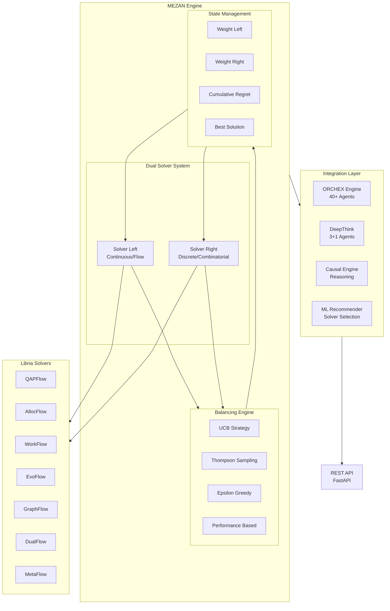
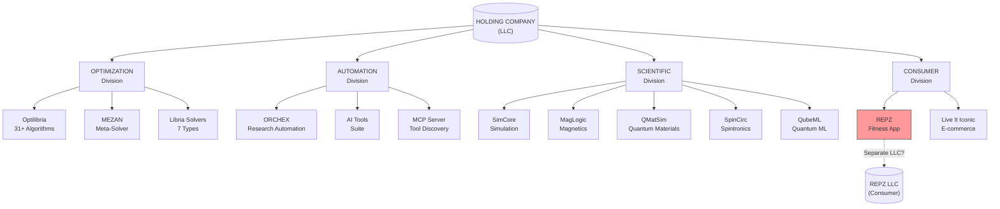

# Complete Technology Portfolio Audit & Naming Research

**Date:** December 4, 2025  
**Author:** Meshal Alawein  
**Purpose:** Comprehensive audit of all tools/software for LLC formation and branding decisions

---

## Table of Contents

1. [Executive Summary](#1-executive-summary)
2. [Complete Product Inventory](#2-complete-product-inventory)
3. [Architecture Diagrams](#3-architecture-diagrams)
4. [Detailed Product Audit](#4-detailed-product-audit)
5. [LLC Structure Options](#5-llc-structure-options)
6. [Deep Research Prompt for Naming](#6-deep-research-prompt-for-naming)
7. [Action Items](#7-action-items)

---

## 1. Executive Summary

### What You're Building

A **multi-product technology company** spanning:

- **Optimization & Decision Systems** - Mathematical optimization, solvers, algorithms
- **AI/ML Tools & Automation** - Agent orchestration, workflow automation, LLM tools
- **Scientific Computing** - Physics simulation, quantum materials, magnetic systems
- **Consumer Applications** - Fitness tracking, e-commerce platforms
- **Developer Infrastructure** - CLI tools, APIs, deployment systems

### Current State

```
┌─────────────────────────────────────────────────────────────────────────────┐
│                        CURRENT PORTFOLIO OVERVIEW                           │
├─────────────────────────────────────────────────────────────────────────────┤
│  OPTIMIZATION (Core IP)          │  AUTOMATION (Infrastructure)            │
│  ├── Optilibria (31+ algorithms) │  ├── ORCHEX CLI (research automation)    │
│  ├── MEZAN (meta-solver engine)  │  ├── AI Orchestrator (49 prompts)       │
│  ├── Librex.QAP (QAP solver)      │  ├── Workflow Engine (11 workflows)     │
│  └── Libria Solvers (7 types)    │  └── Agent System (24 agents)           │
├─────────────────────────────────────────────────────────────────────────────┤
│  SCIENTIFIC (Research)           │  CONSUMER (Revenue)                     │
│  ├── SimCore (simulation)        │  ├── Repz (fitness app) ← SEPARATE LLC? │
│  ├── MagLogic (magnetic systems) │  ├── Live It Iconic (e-commerce)        │
│  ├── QMatSim (quantum materials) │  └── Marketing Automation               │
│  ├── SpinCirc (spintronics)      │                                         │
│  └── QubeML (quantum ML)         │                                         │
├─────────────────────────────────────────────────────────────────────────────┤
│  AI TOOLS (Developer)            │  INFRASTRUCTURE                         │
│  ├── TalAI (AI testing)          │  ├── MCP Server (tool discovery)        │
│  ├── LLMWorks (LLM utilities)    │  ├── DevOps Templates                   │
│  ├── HELIOS (orchestration)      │  └── Governance Policies                │
│  └── Attributa (attribution)     │                                         │
└─────────────────────────────────────────────────────────────────────────────┘
```

### Key Numbers

| Category                    | Count  | Status       |
| --------------------------- | ------ | ------------ |
| **Optimization Algorithms** | 31+    | Production   |
| **AI Agents**               | 24     | Production   |
| **Prompts/Superprompts**    | 49     | Production   |
| **Workflows**               | 11     | Production   |
| **Scientific Tools**        | 6      | Research/Dev |
| **Consumer Apps**           | 3      | Active       |
| **Total Lines of Code**     | ~150K+ | Estimated    |

---

## 2. Complete Product Inventory

### 2.1 Optimization Suite (Core IP)

```
OPTIMIZATION PRODUCTS
=====================

┌─────────────────────────────────────────────────────────────┐
│                      OPTILIBRIA                             │
│              Universal Optimization Framework               │
├─────────────────────────────────────────────────────────────┤
│  31+ Algorithms:                                            │
│  ├── Genetic Algorithms (GPU-accelerated)                   │
│  ├── Simulated Annealing (GPU-accelerated)                  │
│  ├── Particle Swarm Optimization (GPU-accelerated)          │
│  ├── Gradient Descent variants                              │
│  ├── Evolutionary Strategies                                │
│  ├── Multi-objective optimization (NSGA-II, MOEA/D)         │
│  ├── Constraint handling methods                            │
│  └── Hybrid/adaptive methods                                │
│                                                             │
│  Features:                                                  │
│  ├── GPU acceleration (JAX/CUDA)                            │
│  ├── Multi-GPU distributed computing                        │
│  ├── Warm-start capabilities                                │
│  ├── AI-based algorithm selection                           │
│  └── Benchmarking suite                                     │
├─────────────────────────────────────────────────────────────┤
│  Tech: Python, JAX, CUDA, NumPy                             │
│  Status: Production v1.0.0                                  │
│  Location: organizations/AlaweinOS/Optilibria/              │
└─────────────────────────────────────────────────────────────┘

┌─────────────────────────────────────────────────────────────┐
│                        MEZAN                                │
│       Meta-Equilibrium Zero-regret Assignment Network       │
├─────────────────────────────────────────────────────────────┤
│  Core Concept:                                              │
│  Dual-solver balancing with adaptive trust allocation       │
│                                                             │
│       Solver_L              Solver_R                        │
│       (continuous)          (discrete)                      │
│            \                    /                           │
│             \                  /                            │
│              ┌──────────────┐                               │
│              │    MEZAN     │                               │
│              │   ENGINE     │                               │
│              └──────────────┘                               │
│             /                  \                            │
│            /                    \                           │
│       feedback_L            feedback_R                      │
│                                                             │
│  Balancing Strategies:                                      │
│  ├── UCB (Upper Confidence Bound)                           │
│  ├── Thompson Sampling (Bayesian)                           │
│  ├── Epsilon-greedy                                         │
│  └── Performance-based gradient                             │
│                                                             │
│  Integration:                                               │
│  ├── 40+ ORCHEX research agents                              │
│  ├── DeepThink (3+1 agent system)                           │
│  ├── Causal reasoning engine                                │
│  └── ML-based solver recommendation                         │
├─────────────────────────────────────────────────────────────┤
│  Tech: Python, FastAPI, NumPy                               │
│  Status: Production v3.5.0                                  │
│  Location: organizations/AlaweinOS/MEZAN/                   │
└─────────────────────────────────────────────────────────────┘

┌─────────────────────────────────────────────────────────────┐
│                    LIBRIA SOLVERS                           │
│              Domain-Specific Optimization                   │
├─────────────────────────────────────────────────────────────┤
│  Solver Types:                                              │
│  ├── QAPFlowSolver    - Quadratic Assignment Problem        │
│  ├── AllocFlowSolver  - Resource Allocation                 │
│  ├── WorkFlowSolver   - Workflow Optimization               │
│  ├── EvoFlowSolver    - Evolutionary Optimization           │
│  ├── GraphFlowSolver  - Graph Optimization                  │
│  ├── DualFlowSolver   - Dual Optimization                   │
│  └── MetaFlowSolver   - Meta-heuristic Optimization         │
├─────────────────────────────────────────────────────────────┤
│  Tech: Python, JAX                                          │
│  Status: Production                                         │
│  Location: organizations/AlaweinOS/MEZAN/Libria/            │
└─────────────────────────────────────────────────────────────┘
```

### 2.2 AI/ML Tools & Automation

```
AI & AUTOMATION PRODUCTS
========================

┌─────────────────────────────────────────────────────────────┐
│                    ORCHEX SYSTEM                             │
│           Autonomous Research & AI Orchestration            │
├─────────────────────────────────────────────────────────────┤
│  Components:                                                │
│  ├── ATLASEngine - Core research automation                 │
│  ├── ATLASBlackboard - Shared knowledge store               │
│  ├── ResearchAgent - Autonomous research agents             │
│  ├── UltrathinkOrchestrator - 5-team parallel agents        │
│  ├── DeepThinkOrchestrator - 3+1 optimized agents           │
│  └── CausalReasoningEngine - Opus-level intelligence        │
│                                                             │
│  Agent Types (24 total):                                    │
│  ├── scientist_agent      - Research & hypothesis           │
│  ├── coder_agent          - Code generation                 │
│  ├── reviewer_agent       - Code review                     │
│  ├── architect_agent      - System design                   │
│  ├── security_agent       - Security analysis               │
│  ├── devops_agent         - Infrastructure                  │
│  ├── data_agent           - Data engineering                │
│  ├── ml_agent             - Machine learning                │
│  ├── qa_agent             - Quality assurance               │
│  └── ... (15 more specialized agents)                       │
├─────────────────────────────────────────────────────────────┤
│  Tech: Python, TypeScript, FastAPI                          │
│  Status: Production v3.5.0                                  │
│  Location: tools/orchex/, automation/                        │
└─────────────────────────────────────────────────────────────┘

┌─────────────────────────────────────────────────────────────┐
│                 AUTOMATION SYSTEM                           │
│            Unified AI Orchestration Platform                │
├─────────────────────────────────────────────────────────────┤
│  Assets:                                                    │
│  ├── 49 Prompts (9 system, 24 project, 16 task)             │
│  ├── 24 Agent definitions (YAML-first)                      │
│  ├── 11 Workflows (Anthropic patterns)                      │
│  ├── 5 Orchestration patterns                               │
│  └── 4 Crew definitions                                     │
│                                                             │
│  Patterns (Anthropic-based):                                │
│  ├── prompt_chaining     - Sequential with gates            │
│  ├── routing             - Classify → Route                 │
│  ├── parallelization     - Concurrent execution             │
│  ├── orchestrator_workers - Central LLM delegates           │
│  └── evaluator_optimizer - Iterative refinement             │
│                                                             │
│  CLI Commands:                                              │
│  ├── ORCHEX prompts list                                     │
│  ├── ORCHEX agents list                                      │
│  ├── ORCHEX workflows list                                   │
│  ├── ORCHEX route "task description"                         │
│  └── ORCHEX execute <workflow>                               │
├─────────────────────────────────────────────────────────────┤
│  Tech: TypeScript, Python, YAML                             │
│  Status: Production                                         │
│  Location: automation/                                      │
└─────────────────────────────────────────────────────────────┘

┌─────────────────────────────────────────────────────────────┐
│                    AI TOOLS SUITE                           │
│              Developer AI Infrastructure                    │
├─────────────────────────────────────────────────────────────┤
│  tools/ai/ Components:                                      │
│  ├── api/           - OpenAPI specifications                │
│  ├── cache.ts       - AI response caching (13KB)            │
│  ├── compliance.ts  - AI compliance checking (15KB)         │
│  ├── dashboard.ts   - AI metrics dashboard (8KB)            │
│  ├── errors.ts      - Error handling (16KB)                 │
│  ├── issues.ts      - Issue tracking (13KB)                 │
│  ├── mcp/           - MCP server (tool discovery)           │
│  ├── monitor.ts     - AI monitoring (15KB)                  │
│  ├── orchestrator.ts - AI orchestration (10KB)              │
│  ├── security.ts    - AI security (16KB)                    │
│  ├── sync.ts        - Sync utilities (7KB)                  │
│  └── telemetry.ts   - Telemetry (17KB)                      │
├─────────────────────────────────────────────────────────────┤
│  Tech: TypeScript                                           │
│  Status: Production                                         │
│  Location: tools/ai/                                        │
└─────────────────────────────────────────────────────────────┘

┌─────────────────────────────────────────────────────────────┐
│                      TalAI                                  │
│        Autonomous Testing & Laboratory Analysis             │
├─────────────────────────────────────────────────────────────┤
│  Features:                                                  │
│  ├── Turing test capabilities                               │
│  ├── AI interrogation systems                               │
│  ├── Self-refutation testing                                │
│  ├── Autonomous experiment design                           │
│  └── Scientific analysis automation                         │
├─────────────────────────────────────────────────────────────┤
│  Tech: Python, PyTorch                                      │
│  Status: Experimental                                       │
│  Location: organizations/AlaweinOS/TalAI/                   │
└─────────────────────────────────────────────────────────────┘

┌─────────────────────────────────────────────────────────────┐
│                      HELIOS                                 │
│           Next-Gen Orchestration Platform                   │
├─────────────────────────────────────────────────────────────┤
│  Purpose: Advanced AI orchestration (overlaps with ORCHEX)   │
│  Status: Experimental (candidate for merge with ORCHEX)      │
│  Location: organizations/AlaweinOS/HELIOS/                  │
└─────────────────────────────────────────────────────────────┘

┌─────────────────────────────────────────────────────────────┐
│                     LLMWorks                                │
│              LLM Utilities & Integration                    │
├─────────────────────────────────────────────────────────────┤
│  Features:                                                  │
│  ├── LLM API wrappers                                       │
│  ├── Prompt templates                                       │
│  ├── Response parsing                                       │
│  └── Supabase integration                                   │
├─────────────────────────────────────────────────────────────┤
│  Tech: TypeScript, Supabase                                 │
│  Status: Active                                             │
│  Location: organizations/AlaweinOS/LLMWorks/                │
└─────────────────────────────────────────────────────────────┘
```

### 2.3 Scientific Computing

```
SCIENTIFIC COMPUTING PRODUCTS
=============================

┌─────────────────────────────────────────────────────────────┐
│                      SimCore                                │
│          High-Performance Simulation Engine                 │
├─────────────────────────────────────────────────────────────┤
│  Capabilities:                                              │
│  ├── Large-scale physics simulations                        │
│  ├── Performance prediction                                 │
│  ├── System optimization                                    │
│  └── HPC computing integration                              │
├─────────────────────────────────────────────────────────────┤
│  Tech: Python, NumPy, SciPy, HPC                            │
│  Status: Research                                           │
│  Location: organizations/AlaweinOS/SimCore/                 │
└─────────────────────────────────────────────────────────────┘

┌─────────────────────────────────────────────────────────────┐
│                     MagLogic                                │
│         Magnetic Systems Modeling Framework                 │
├─────────────────────────────────────────────────────────────┤
│  Capabilities:                                              │
│  ├── Spin dynamics simulation                               │
│  ├── Magnetic materials modeling                            │
│  ├── Magnetization calculations                             │
│  └── GPU-accelerated simulations                            │
├─────────────────────────────────────────────────────────────┤
│  Tech: Python, NumPy, JAX, CUDA                             │
│  Status: Research                                           │
│  Location: organizations/alaweimm90-science/MagLogic/       │
└─────────────────────────────────────────────────────────────┘

┌─────────────────────────────────────────────────────────────┐
│                     QMatSim                                 │
│          Quantum Materials Simulation Engine                │
├─────────────────────────────────────────────────────────────┤
│  Capabilities:                                              │
│  ├── Electronic structure calculations                      │
│  ├── Band theory implementations                            │
│  ├── Materials property predictions                         │
│  └── DFT-based methods                                      │
├─────────────────────────────────────────────────────────────┤
│  Tech: Python, NumPy, SciPy                                 │
│  Status: Research                                           │
│  Location: organizations/alaweimm90-science/QMatSim/        │
└─────────────────────────────────────────────────────────────┘

┌─────────────────────────────────────────────────────────────┐
│                     SpinCirc                                │
│            Spin Circuit Theory & Simulation                 │
├─────────────────────────────────────────────────────────────┤
│  Capabilities:                                              │
│  ├── Spintronics circuit design                             │
│  ├── Spin transport modeling                                │
│  └── Circuit optimization                                   │
├─────────────────────────────────────────────────────────────┤
│  Tech: Python                                               │
│  Status: Research                                           │
│  Location: organizations/alaweimm90-science/SpinCirc/       │
└─────────────────────────────────────────────────────────────┘

┌─────────────────────────────────────────────────────────────┐
│                      QubeML                                 │
│           Quantum Machine Learning Platform                 │
├─────────────────────────────────────────────────────────────┤
│  Capabilities:                                              │
│  ├── Quantum-enhanced ML algorithms                         │
│  ├── Hybrid quantum-classical optimization                  │
│  ├── Materials informatics                                  │
│  └── Quantum computing integration                          │
├─────────────────────────────────────────────────────────────┤
│  Tech: Python, Quantum Computing                            │
│  Status: Research                                           │
│  Location: organizations/alaweimm90-science/QubeML/         │
└─────────────────────────────────────────────────────────────┘

┌─────────────────────────────────────────────────────────────┐
│                      SciComp                                │
│         High-Performance Scientific Computing               │
├─────────────────────────────────────────────────────────────┤
│  Capabilities:                                              │
│  ├── Parallel computing frameworks                          │
│  ├── GPU acceleration                                       │
│  ├── Performance optimization                               │
│  └── Research infrastructure                                │
├─────────────────────────────────────────────────────────────┤
│  Tech: Python, Cython, CUDA                                 │
│  Status: Research                                           │
│  Location: organizations/alaweimm90-science/SciComp/        │
└─────────────────────────────────────────────────────────────┘
```

### 2.4 Consumer Applications

```
CONSUMER APPLICATIONS
=====================

┌─────────────────────────────────────────────────────────────┐
│                       REPZ                                  │
│        AI-Powered Athletic Performance Platform             │
├─────────────────────────────────────────────────────────────┤
│  Features:                                                  │
│  ├── Workout tracking & logging                             │
│  ├── AI-powered coaching                                    │
│  ├── Performance analytics                                  │
│  ├── Progress visualization                                 │
│  ├── Social features                                        │
│  └── Subscription-based monetization                        │
│                                                             │
│  Tech Stack:                                                │
│  ├── Frontend: React, TypeScript, TailwindCSS               │
│  ├── Backend: Supabase (Edge Functions)                     │
│  ├── Database: PostgreSQL                                   │
│  ├── Auth: Supabase Auth                                    │
│  └── Deployment: Vercel                                     │
│                                                             │
│  Business Model:                                            │
│  ├── Freemium with premium features                         │
│  ├── B2B licensing to gyms/trainers                         │
│  └── API access for integrations                            │
├─────────────────────────────────────────────────────────────┤
│  Status: Production (Active Development)                    │
│  Location: organizations/alaweimm90-business/Repz/          │
│                                                             │
│  ⚠️  CANDIDATE FOR SEPARATE LLC                             │
│  Rationale: Consumer-facing, different liability profile,   │
│  potential for independent funding/sale                     │
└─────────────────────────────────────────────────────────────┘

┌─────────────────────────────────────────────────────────────┐
│                   Live It Iconic                            │
│        Enterprise E-commerce Platform                       │
├─────────────────────────────────────────────────────────────┤
│  Features:                                                  │
│  ├── AI-powered recommendations                             │
│  ├── Advanced analytics                                     │
│  ├── Enterprise scalability                                 │
│  └── B2B integration                                        │
├─────────────────────────────────────────────────────────────┤
│  Tech: Python, Node.js, PostgreSQL                          │
│  Status: Active                                             │
│  Location: organizations/alaweimm90-business/LiveItIconic/  │
└─────────────────────────────────────────────────────────────┘

┌─────────────────────────────────────────────────────────────┐
│                Marketing Automation                         │
│            Business Process Automation                      │
├─────────────────────────────────────────────────────────────┤
│  Features:                                                  │
│  ├── Campaign automation                                    │
│  ├── Lead scoring                                           │
│  ├── Analytics dashboards                                   │
│  └── CRM integration                                        │
├─────────────────────────────────────────────────────────────┤
│  Status: Active                                             │
│  Location: organizations/alaweimm90-business/               │
│            MarketingAutomation/                             │
└─────────────────────────────────────────────────────────────┘
```

### 2.5 Infrastructure & DevOps

```
INFRASTRUCTURE & DEVOPS
=======================

┌─────────────────────────────────────────────────────────────┐
│                    MCP Server                               │
│           Model Context Protocol Server                     │
├─────────────────────────────────────────────────────────────┤
│  Features:                                                  │
│  ├── Tool discovery & registration                          │
│  ├── AI tool routing                                        │
│  ├── Context management                                     │
│  └── Multi-agent coordination                               │
├─────────────────────────────────────────────────────────────┤
│  Tech: TypeScript                                           │
│  Status: Production                                         │
│  Location: tools/ai/mcp/                                    │
└─────────────────────────────────────────────────────────────┘

┌─────────────────────────────────────────────────────────────┐
│                  DevOps Templates                           │
│            Infrastructure as Code                           │
├─────────────────────────────────────────────────────────────┤
│  Templates:                                                 │
│  ├── CI/CD pipelines (GitHub Actions)                       │
│  ├── Docker configurations                                  │
│  ├── Kubernetes manifests                                   │
│  ├── Terraform modules                                      │
│  └── Monitoring setups                                      │
├─────────────────────────────────────────────────────────────┤
│  Status: Production                                         │
│  Location: tools/devops/, .github/workflows/                │
└─────────────────────────────────────────────────────────────┘

┌─────────────────────────────────────────────────────────────┐
│                 Governance System                           │
│            Policy Enforcement & Compliance                  │
├─────────────────────────────────────────────────────────────┤
│  Policies:                                                  │
│  ├── Protected files (YAML)                                 │
│  ├── OPA/Rego policies                                      │
│  ├── Security policies                                      │
│  └── Dependency policies                                    │
├─────────────────────────────────────────────────────────────┤
│  Status: Production                                         │
│  Location: .metaHub/policies/                               │
└─────────────────────────────────────────────────────────────┘
```

---

## 3. Architecture Diagrams

### 3.1 Overall System Architecture

```
┌─────────────────────────────────────────────────────────────────────────────────────┐
│                              COMPLETE SYSTEM ARCHITECTURE                           │
└─────────────────────────────────────────────────────────────────────────────────────┘

                                    ┌─────────────┐
                                    │   USERS     │
                                    │ ┌─────────┐ │
                                    │ │Developers│ │
                                    │ │Scientists│ │
                                    │ │Consumers │ │
                                    │ │Enterprise│ │
                                    │ └─────────┘ │
                                    └──────┬──────┘
                                           │
                    ┌──────────────────────┼──────────────────────┐
                    │                      │                      │
                    ▼                      ▼                      ▼
          ┌─────────────────┐    ┌─────────────────┐    ┌─────────────────┐
          │   CONSUMER      │    │   DEVELOPER     │    │   ENTERPRISE    │
          │   PRODUCTS      │    │     TOOLS       │    │    PRODUCTS     │
          │                 │    │                 │    │                 │
          │ ┌─────────────┐ │    │ ┌─────────────┐ │    │ ┌─────────────┐ │
          │ │    REPZ     │ │    │ │   ORCHEX     │ │    │ │  OPTILIBRIA │ │
          │ │  (Fitness)  │ │    │ │   (CLI)     │ │    │ │  (Optimize) │ │
          │ └─────────────┘ │    │ └─────────────┘ │    │ └─────────────┘ │
          │ ┌─────────────┐ │    │ ┌─────────────┐ │    │ ┌─────────────┐ │
          │ │Live It Iconic│    │ │  AI Tools   │ │    │ │    MEZAN    │ │
          │ │ (E-commerce)│ │    │ │   Suite     │ │    │ │  (Solver)   │ │
          │ └─────────────┘ │    │ └─────────────┘ │    │ └─────────────┘ │
          └────────┬────────┘    └────────┬────────┘    └────────┬────────┘
                   │                      │                      │
                   └──────────────────────┼──────────────────────┘
                                          │
                                          ▼
                              ┌───────────────────────┐
                              │    CORE PLATFORM      │
                              │                       │
                              │  ┌─────────────────┐  │
                              │  │   AUTOMATION    │  │
                              │  │    ENGINE       │  │
                              │  │  (49 prompts,   │  │
                              │  │   24 agents,    │  │
                              │  │  11 workflows)  │  │
                              │  └─────────────────┘  │
                              │                       │
                              │  ┌─────────────────┐  │
                              │  │  OPTIMIZATION   │  │
                              │  │     CORE        │  │
                              │  │ (31+ algorithms)│  │
                              │  └─────────────────┘  │
                              └───────────┬───────────┘
                                          │
                    ┌─────────────────────┼─────────────────────┐
                    │                     │                     │
                    ▼                     ▼                     ▼
          ┌─────────────────┐   ┌─────────────────┐   ┌─────────────────┐
          │   SCIENTIFIC    │   │  INFRASTRUCTURE │   │    AI/ML        │
          │    RESEARCH     │   │                 │   │   PLATFORM      │
          │                 │   │                 │   │                 │
          │ • SimCore       │   │ • MCP Server    │   │ • LLMWorks      │
          │ • MagLogic      │   │ • DevOps        │   │ • TalAI         │
          │ • QMatSim       │   │ • Governance    │   │ • HELIOS        │
          │ • SpinCirc      │   │ • CI/CD         │   │ • Attributa     │
          │ • QubeML        │   │                 │   │                 │
          │ • SciComp       │   │                 │   │                 │
          └─────────────────┘   └─────────────────┘   └─────────────────┘
```

### 3.2 MEZAN Engine Architecture (Mermaid)



### 3.3 Automation System Architecture (Mermaid)

```mermaid
flowchart LR
    subgraph Input["User Input"]
        CLI[CLI Command]
        API[API Request]
        IDE[IDE Integration]
    end

    subgraph Router["Task Router"]
        KW[Keyword Extraction]
        INT[Intent Classification]
        RT[Route Selection]
    end

    Input --> Router

    subgraph Assets["Asset Library"]
        P[49 Prompts]
        A[24 Agents]
        W[11 Workflows]
        T[Tools Registry]
    end

    Router --> Assets

    subgraph Patterns["Orchestration Patterns"]
        PC[Prompt Chaining]
        RO[Routing]
        PA[Parallelization]
        OW[Orchestrator-Workers]
        EO[Evaluator-Optimizer]
    end

    Assets --> Patterns

    subgraph Execution["Execution Engine"]
        PE[Parallel Executor]
        SE[Sequential Executor]
        DE[Debate Engine]
    end

    Patterns --> Execution

    subgraph Output["Output"]
        RES[Results]
        LOG[Logs]
        MET[Metrics]
    end

    Execution --> Output
```



### 3.4 Product Hierarchy (Mermaid)



---

## 4. Detailed Product Audit

### 4.1 Maturity Assessment

| Product            | Category     | Maturity     | Revenue Potential   | Risk Level |
| ------------------ | ------------ | ------------ | ------------------- | ---------- |
| **Optilibria**     | Optimization | Production   | High (Enterprise)   | Low        |
| **MEZAN**          | Optimization | Production   | High (Enterprise)   | Low        |
| **ORCHEX**          | Automation   | Production   | Medium (Developer)  | Low        |
| **AI Tools**       | Automation   | Production   | Medium (Developer)  | Low        |
| **Repz**           | Consumer     | Active Dev   | High (B2C/B2B)      | Medium     |
| **Live It Iconic** | Consumer     | Active       | Medium (E-commerce) | Medium     |
| **SimCore**        | Scientific   | Research     | Low (Academic)      | Low        |
| **MagLogic**       | Scientific   | Research     | Low (Academic)      | Low        |
| **QMatSim**        | Scientific   | Research     | Low (Academic)      | Low        |
| **TalAI**          | AI Tools     | Experimental | Medium (Enterprise) | High       |
| **HELIOS**         | Automation   | Experimental | Low (Redundant)     | Medium     |

### 4.2 Technical Debt Assessment

| Product              | Debt Level | Issues                        | Priority |
| -------------------- | ---------- | ----------------------------- | -------- |
| **Optilibria**       | Low        | Minor documentation gaps      | Low      |
| **MEZAN**            | Low        | Some code duplication         | Medium   |
| **ORCHEX**            | Medium     | Multiple CLI implementations  | High     |
| **Automation**       | Medium     | Python/TS duplication         | High     |
| **Repz**             | Medium     | Lint errors, incomplete tests | High     |
| **Scientific Tools** | High       | Placeholder READMEs           | Low      |
| **HELIOS**           | High       | Overlaps with ORCHEX           | High     |

### 4.3 Consolidation Recommendations

```
RECOMMENDED CONSOLIDATIONS
==========================

1. ORCHEX + HELIOS → ORCHEX
   - HELIOS functionality absorbed into ORCHEX
   - Single orchestration platform

2. Optilibria + Librex.QAP + Libria Solvers → LIBRIA
   - Unified optimization brand
   - Single package: `pip install libria`

3. Python Automation + TS Automation → Single CLI
   - TypeScript-first with Python bindings
   - Unified command interface

4. Scientific Tools → SCILAB (or similar)
   - Unified scientific computing brand
   - Shared infrastructure
```

---

## 5. LLC Structure Options

### Option A: Single Holding Company

```
┌─────────────────────────────────────────────────────────────┐
│              [COMPANY NAME] TECHNOLOGIES LLC                │
│                    (Single Entity)                          │
├─────────────────────────────────────────────────────────────┤
│                                                             │
│  All products under one LLC:                                │
│  • Optimization (Libria, MEZAN)                             │
│  • Automation (ORCHEX, AI Tools)                             │
│  • Scientific (SimCore, MagLogic, etc.)                     │
│  • Consumer (Repz, Live It Iconic)                          │
│                                                             │
│  PROS:                                                      │
│  ✓ Simpler administration                                   │
│  ✓ Lower costs                                              │
│  ✓ Unified branding                                         │
│                                                             │
│  CONS:                                                      │
│  ✗ Consumer liability exposure                              │
│  ✗ Harder to spin off products                              │
│  ✗ Mixed B2B/B2C messaging                                  │
│                                                             │
└─────────────────────────────────────────────────────────────┘
```

### Option B: Holding + Consumer Subsidiary

```
┌─────────────────────────────────────────────────────────────┐
│              [COMPANY NAME] TECHNOLOGIES LLC                │
│                   (Holding Company)                         │
├─────────────────────────────────────────────────────────────┤
│                                                             │
│  B2B/Enterprise Products:                                   │
│  • Optimization (Libria, MEZAN)                             │
│  • Automation (ORCHEX, AI Tools)                             │
│  • Scientific (SimCore, MagLogic, etc.)                     │
│                                                             │
└─────────────────────────────────────────────────────────────┘
                              │
                              │ owns
                              ▼
┌─────────────────────────────────────────────────────────────┐
│                      REPZ LLC                               │
│                 (Consumer Subsidiary)                       │
├─────────────────────────────────────────────────────────────┤
│                                                             │
│  Consumer Products:                                         │
│  • Repz (Fitness App)                                       │
│  • Live It Iconic (E-commerce)                              │
│  • Future consumer apps                                     │
│                                                             │
│  PROS:                                                      │
│  ✓ Liability isolation                                      │
│  ✓ Easier to sell/spin off                                  │
│  ✓ Clear B2C branding                                       │
│  ✓ Separate funding possible                                │
│                                                             │
│  CONS:                                                      │
│  ✗ More administrative overhead                             │
│  ✗ Higher costs (two LLCs)                                  │
│  ✗ More complex accounting                                  │
│                                                             │
└─────────────────────────────────────────────────────────────┘
```

### Recommendation

**Option B (Holding + Consumer Subsidiary)** is recommended because:

1. **Liability Protection**: Consumer apps have different risk profiles (user data, health claims for fitness app)
2. **Exit Flexibility**: Repz could be sold independently without affecting core tech business
3. **Funding Options**: Consumer apps can seek different investors than enterprise software
4. **Brand Clarity**: Enterprise clients see professional B2B company, consumers see consumer brand

---

## 6. Deep Research Prompt for Naming

Copy this prompt to Claude Deep Research, ChatGPT Deep Research, Perplexity, or similar:

---

### PROMPT FOR DEEP NAMING RESEARCH

```
I need comprehensive research to name a technology company. Please conduct deep research and provide detailed recommendations.

## COMPANY PROFILE

**Founder**: Meshal Alawein (PhD candidate, UC Berkeley, computational physics)
**Location**: United States (California)
**Industry**: Enterprise Software, Optimization, AI/ML, Scientific Computing

## PRODUCT PORTFOLIO

The company produces multiple software products across these categories:

### 1. OPTIMIZATION & DECISION SYSTEMS (Core IP)
- **Optilibria**: Universal optimization framework with 31+ algorithms (genetic, simulated annealing, PSO, gradient descent, evolutionary strategies, multi-objective)
- **MEZAN**: Meta-Equilibrium Zero-regret Assignment Network - dual-solver balancing engine with bandit-style learning
- **Libria Solvers**: Domain-specific solvers (QAP, resource allocation, workflow, evolutionary, graph, dual, meta-heuristic)
- **Key differentiator**: GPU-accelerated (JAX/CUDA), production-grade, enterprise-ready

### 2. AI/ML TOOLS & AUTOMATION
- **ORCHEX**: Research automation platform with 40+ AI agents, workflow orchestration
- **AI Tools Suite**: Caching, compliance, monitoring, telemetry, MCP server
- **TalAI**: AI testing and interrogation system (Turing test capabilities)
- **49 prompts, 24 agents, 11 workflows** in the automation system

### 3. SCIENTIFIC COMPUTING
- **SimCore**: High-performance simulation engine
- **MagLogic**: Magnetic systems modeling
- **QMatSim**: Quantum materials simulation
- **SpinCirc**: Spintronics circuit design
- **QubeML**: Quantum machine learning

### 4. CONSUMER APPLICATIONS (Potentially separate LLC)
- **Repz**: AI-powered fitness tracking and coaching app
- **Live It Iconic**: E-commerce platform

## NAMING REQUIREMENTS

### For the HOLDING COMPANY (LLC):
- Must work for a multi-product technology company
- Should NOT be tied to any single product category
- Professional enough for enterprise sales and investors
- Unique and trademarkable
- Easy to spell and pronounce
- Domain availability is important (.com, .io, .tech)
- Can be founder-named (like Bloomberg, Dell) or abstract

### For PRODUCT BRANDS:
- Each major product line needs a name
- Names should be:
  - Short (1-2 syllables preferred)
  - Technical but not jargon-heavy
  - Memorable and unique
  - Work as package names (pip install X, npm install X)

## RESEARCH TASKS

Please research and provide:

1. **LLC NAME OPTIONS (10-15 suggestions)**
   - For each name:
     - Meaning/etymology
     - Domain availability check
     - Trademark conflict analysis
     - Pros and cons
     - Similar companies using this pattern
   - Include both founder-named and abstract options
   - Rank your top 5 with detailed reasoning

2. **PRODUCT BRAND OPTIONS**
   - For the optimization platform (currently Optilibria/MEZAN)
   - For the automation platform (currently ORCHEX)
   - For the scientific computing suite
   - For each, provide 5-7 options with analysis

3. **NAMING PATTERNS ANALYSIS**
   - Research successful tech company naming patterns
   - Analyze competitors in optimization/AI space
   - Identify naming trends to follow or avoid

4. **LINGUISTIC ANALYSIS**
   - Check pronunciation in major languages
   - Identify potential negative connotations
   - Verify no unfortunate meanings in other languages

5. **TRADEMARK & DOMAIN RESEARCH**
   - Check USPTO for conflicts
   - Check domain availability
   - Check GitHub handle availability
   - Check npm/PyPI package name availability

## CONTEXT FOR NAMING

The company's technical identity centers on:
- **Mathematical optimization** (finding optimal solutions)
- **Equilibrium/balance** (MEZAN = balance in Arabic)
- **Search/exploration** (traversing solution spaces)
- **Intelligence/decision systems** (AI-enhanced optimization)
- **Scientific rigor** (PhD-level research)
- **Performance** (GPU-accelerated, enterprise-scale)

Words/concepts that resonate:
- Argmin (mathematical term for "argument that minimizes")
- Equilibrium, balance, convergence
- Traverse, search, explore, navigate
- Lattice, manifold, graph (mathematical structures)
- Flow, flux, gradient (optimization concepts)
- Quantum, spin, field (physics concepts)

Words/concepts to AVOID:
- Generic "AI" or "ML" (oversaturated)
- "Synergy", "Nexus", "Vertex" (meaningless corporate speak)
- Made-up words that sound like pharmaceuticals
- Anything hard to spell or pronounce

## OUTPUT FORMAT

Please structure your response as:

1. **Executive Summary** (top 3 LLC names, top product names)
2. **Detailed LLC Name Analysis** (10-15 options)
3. **Product Brand Recommendations** (by category)
4. **Competitive Landscape** (how competitors are named)
5. **Domain/Trademark Availability Matrix**
6. **Final Recommendations** with implementation roadmap

Thank you for conducting thorough research on this naming decision.
```

---

## 7. Action Items

### Immediate (Today)

1. [ ] **Decide on LLC structure**: Single vs. Holding + Consumer subsidiary
2. [ ] **Run deep research prompt** on Claude/ChatGPT/Perplexity
3. [ ] **Check domain availability** for top candidates
4. [ ] **Check state LLC name availability**
5. [ ] **File LLC formation** with chosen name

### This Week

1. [ ] **Reserve domains** for chosen names
2. [ ] **Reserve GitHub handles**
3. [ ] **Reserve npm/PyPI package names**
4. [ ] **Update codebase** with new naming (if changing)
5. [ ] **Create brand guidelines** document

### This Month

1. [ ] **Trademark search** for product names
2. [ ] **File trademark applications** if needed
3. [ ] **Update all documentation** with new names
4. [ ] **Create marketing materials** with new branding
5. [ ] **Announce rebrand** (if applicable)

---

_Document generated: December 4, 2025_
_For: Meshal Alawein_
_Purpose: LLC Formation and Product Branding_
