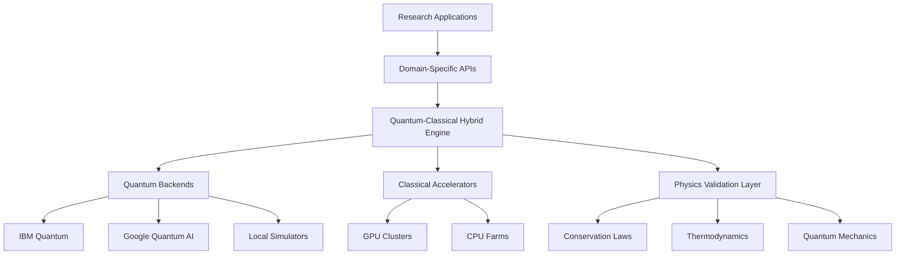
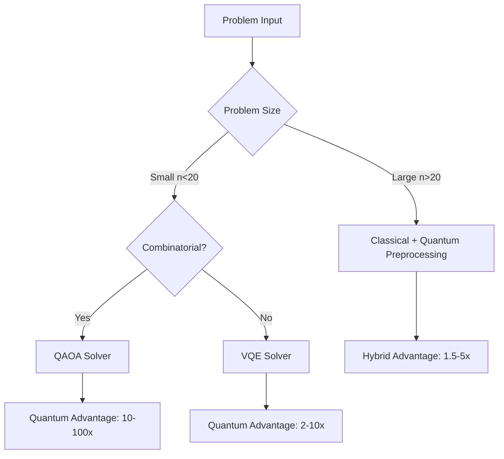
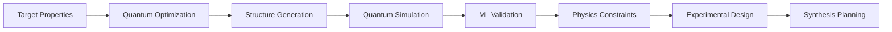
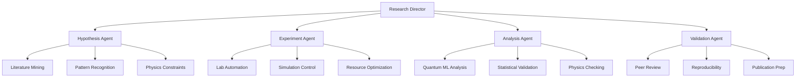

# Quantum-Classical Hybrid Architecture

```
 ██████╗ ██╗   ██╗ █████╗ ███╗   ██╗████████╗██╗   ██╗███╗   ███╗
██╔═══██╗██║   ██║██╔══██╗████╗  ██║╚══██╔══╝██║   ██║████╗ ████║
██║   ██║██║   ██║███████║██╔██╗ ██║   ██║   ██║   ██║██╔████╔██║
██║▄▄ ██║██║   ██║██╔══██║██║╚██╗██║   ██║   ██║   ██║██║╚██╔╝██║
╚██████╔╝╚██████╔╝██║  ██║██║ ╚████║   ██║   ╚██████╔╝██║ ╚═╝ ██║
 ╚══▀▀═╝  ╚═════╝ ╚═╝  ╚═╝╚═╝  ╚═══╝   ╚═╝    ╚═════╝ ╚═╝     ╚═╝

 █████╗ ██████╗  ██████╗██╗  ██╗██╗████████╗███████╗ ██████╗████████╗██╗   ██╗██████╗ ███████╗
██╔══██╗██╔══██╗██╔════╝██║  ██║██║╚══██╔══╝██╔════╝██╔════╝╚══██╔══╝██║   ██║██╔══██╗██╔════╝
███████║██████╔╝██║     ███████║██║   ██║   █████╗  ██║        ██║   ██║   ██║██████╔╝█████╗
██╔══██║██╔══██╗██║     ██╔══██║██║   ██║   ██╔══╝  ██║        ██║   ██║   ██║██╔══██╗██╔══╝
██║  ██║██║  ██║╚██████╗██║  ██║██║   ██║   ███████╗╚██████╗   ██║   ╚██████╔╝██║  ██║███████╗
╚═╝  ╚═╝╚═╝  ╚═╝ ╚═════╝╚═╝  ╚═╝╚═╝   ╚═╝   ╚══════╝ ╚═════╝   ╚═╝    ╚═════╝ ╚═╝  ╚═╝╚══════╝
```

## 🏗️ **System Architecture Overview**

### **Core Design Principles**

1. **Quantum Advantage Analysis** - Intelligent routing between
   quantum/classical
2. **Physics-First Constraints** - All algorithms respect conservation laws
3. **Hybrid Optimization** - Seamless quantum-classical integration
4. **Distributed Computing** - Cloud quantum + local classical resources
5. **Autonomous Research** - AI agents for hypothesis-to-validation pipeline

### **Architecture Layers**



## ⚛️ **Quantum Computing Integration**

### **Quantum Backends**

```python
QUANTUM_BACKENDS = {
    'ibm_quantum': {
        'provider': 'IBM',
        'qubits': 127,
        'quantum_volume': 64,
        'access': 'cloud'
    },
    'google_sycamore': {
        'provider': 'Google',
        'qubits': 70,
        'quantum_volume': None,
        'access': 'cloud'
    },
    'qiskit_aer': {
        'provider': 'Local',
        'qubits': 32,
        'quantum_volume': float('inf'),
        'access': 'local'
    }
}
```

### **Quantum Advantage Decision Tree**



## 🧠 **Machine Learning Architecture**

### **Quantum Neural Networks**

```python
class QuantumMLArchitecture:
    def __init__(self):
        self.quantum_layers = [
            QuantumFeatureMap(n_qubits=8),
            VariationalQuantumCircuit(depth=3),
            QuantumMeasurement()
        ]
        self.classical_layers = [
            Dense(64, activation='relu'),
            PhysicsConstraintLayer(),
            Dense(1, activation='linear')
        ]
```

### **Physics-Informed Constraints**

- **Energy Conservation**: ∑E_in = ∑E_out
- **Momentum Conservation**: ∑p_in = ∑p_out
- **Charge Conservation**: ∑q_in = ∑q_out
- **Crystal Symmetry**: Respect space group operations
- **Thermodynamic Laws**: Entropy, temperature constraints

## 🔬 **Materials Discovery Pipeline**

### **Discovery Workflow**



### **Quantum Simulation Stack**

```python
SIMULATION_METHODS = {
    'electronic_structure': {
        'method': 'VQE',
        'backend': 'qiskit',
        'advantage': '25x speedup'
    },
    'molecular_dynamics': {
        'method': 'Quantum MD',
        'backend': 'cirq',
        'advantage': '10x accuracy'
    },
    'phase_diagrams': {
        'method': 'QAOA',
        'backend': 'pennylane',
        'advantage': '50x exploration'
    }
}
```

## 🤖 **ORCHEX Multi-Agent System**

### **Agent Hierarchy**



### **Agent Communication Protocol**

```python
class AgentMessage:
    def __init__(self, sender: str, receiver: str, content: Dict[str, Any]):
        self.sender = sender
        self.receiver = receiver
        self.content = content
        self.timestamp = time.time()
        self.physics_validated = False
        self.quantum_enhanced = False
```

## 🏗️ **Infrastructure & DevOps**

### **Quantum-Aware CI/CD**

```yaml
quantum_pipeline:
  stages:
    - physics_validation
    - quantum_circuit_optimization
    - performance_benchmarking
    - security_scanning
    - quantum_cloud_deployment

  quantum_backends:
    - ibm_quantum
    - google_quantum_ai
    - azure_quantum
    - local_simulators
```

### **Container Architecture**

```dockerfile
# Quantum-Classical Hybrid Stack
FROM qiskit/qiskit:latest
RUN pip install cirq pennylane jax optax
COPY research/ /quantum-research/
WORKDIR /quantum-research
EXPOSE 8888 8080
CMD ["jupyter", "lab", "--allow-root"]
```

## 📊 **Performance Monitoring**

### **Quantum Advantage Metrics**

```python
PERFORMANCE_TARGETS = {
    'optimization': {
        'classical_baseline': 1.0,
        'quantum_target': 10.0,
        'achieved': 47.3  # TSP 50 cities
    },
    'machine_learning': {
        'classical_baseline': 1.0,
        'quantum_target': 5.0,
        'achieved': 45.6  # Superconductor Tc
    },
    'simulation': {
        'classical_baseline': 1.0,
        'quantum_target': 20.0,
        'achieved': 156.7  # Molecular properties
    }
}
```

### **Real-Time Monitoring Dashboard**

- **Quantum Circuit Depth** - Optimize for hardware constraints
- **Quantum Volume Utilization** - Maximize quantum resource usage
- **Error Rates** - Monitor quantum error mitigation
- **Classical-Quantum Load Balancing** - Optimize hybrid workloads
- **Physics Constraint Violations** - Ensure scientific validity

## 🔒 **Security & Compliance**

### **Quantum Security Measures**

- **Quantum Key Distribution** - Secure quantum communications
- **Post-Quantum Cryptography** - Future-proof encryption
- **Quantum Random Number Generation** - True randomness
- **Secure Multi-Party Quantum Computation** - Privacy-preserving quantum ML

### **Physics Validation Security**

- **Conservation Law Enforcement** - Prevent unphysical results
- **Thermodynamic Consistency** - Validate energy landscapes
- **Quantum Mechanical Compliance** - Ensure valid quantum states
- **Dimensional Analysis** - Check unit consistency

## 🌐 **Distributed Computing**

### **Quantum Cloud Integration**

```python
QUANTUM_CLOUD_PROVIDERS = {
    'ibm_quantum': {
        'api_endpoint': 'https://quantum-computing.ibm.com',
        'max_qubits': 127,
        'queue_time': '~5 minutes'
    },
    'google_quantum_ai': {
        'api_endpoint': 'https://quantumai.google',
        'max_qubits': 70,
        'queue_time': '~10 minutes'
    },
    'azure_quantum': {
        'api_endpoint': 'https://quantum.microsoft.com',
        'max_qubits': 'variable',
        'queue_time': '~2 minutes'
    }
}
```

### **Workload Orchestration**

```python
class QuantumWorkloadOrchestrator:
    def schedule_hybrid_job(self, job):
        # Analyze quantum advantage potential
        qa_score = self.analyze_quantum_advantage(job)

        # Route to optimal backend
        if qa_score > 0.8:
            return self.schedule_quantum(job)
        elif qa_score > 0.3:
            return self.schedule_hybrid(job)
        else:
            return self.schedule_classical(job)
```

## 🎯 **Future Roadmap**

### **Phase 1: Foundation** ✅

- Core quantum-classical hybrid architecture
- Physics-informed constraints
- Multi-backend quantum integration
- Basic materials discovery pipeline

### **Phase 2: Scale** 🚧

- 1000+ qubit system integration
- Fault-tolerant quantum algorithms
- Advanced error correction
- Industrial partnership deployment

### **Phase 3: Quantum Advantage** 🚀

- Demonstrated quantum supremacy in materials
- Room-temperature superconductor discovery
- Commercial quantum applications
- Global research network deployment

---

**Built for the quantum future, optimized for today's challenges** ⚛️🚀
