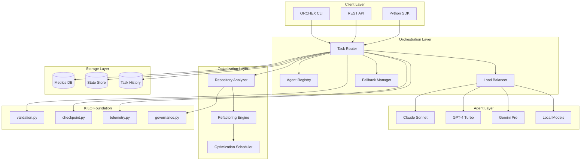
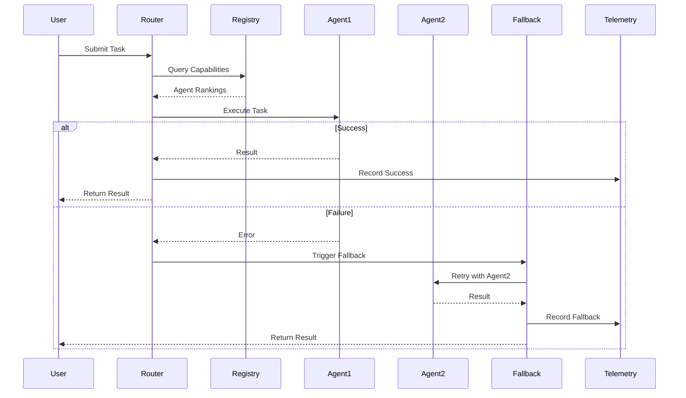
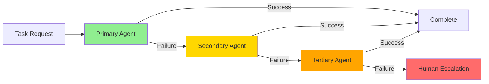
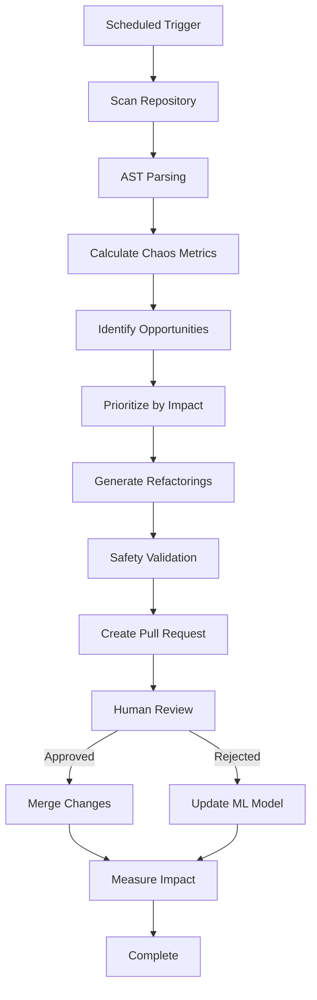
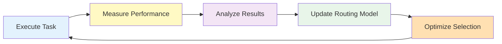
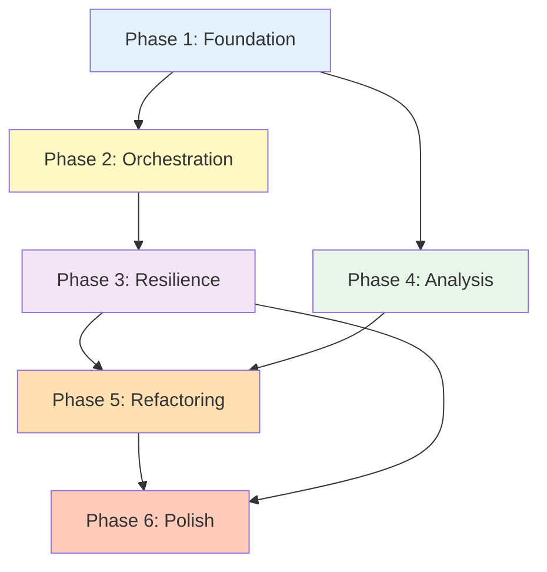

# ORCHEX System Architecture

**Autonomous Technical Leadership & Adaptive System**

**Version:** 1.0.0  
**Date:** 2025-11-29  
**Status:** Design Phase  
**Foundation:** KILO Radical Simplification (73% tool reduction, 4 unified CLIs)

---

## Table of Contents

1. [System Overview](#system-overview)
2. [Architecture Diagrams](#architecture-diagrams)
3. [Component Specifications](#component-specifications)
4. [Data Models](#data-models)
5. [Algorithms](#algorithms)
6. [API Specifications](#api-specifications)
7. [Integration Points](#integration-points)
8. [Implementation Roadmap](#implementation-roadmap)

---

## System Overview

### Purpose and Goals

ORCHEX is an enterprise-grade multiagent LLM orchestration platform designed to provide:

1. **Intelligent Agent Routing** - Automatically select the best AI agent for each task based on capabilities, performance history, and current load
2. **Resilient Execution** - Multi-tier fallback chains ensure task completion even when primary agents fail
3. **Continuous Optimization** - Automated repository analysis and refactoring to reduce technical debt
4. **Adaptive Learning** - System improves routing decisions based on historical performance data
5. **Enterprise Observability** - Comprehensive telemetry, metrics, and audit trails

### Key Capabilities

- **Multi-Agent Orchestration**: Route tasks to Claude, GPT-4, Gemini, or local models based on task requirements
- **Intelligent Fallback**: 3-tier fallback chain (primary → secondary → tertiary) with automatic retry logic
- **Repository Optimization**: AST-based code analysis, chaos metrics calculation, automated refactoring suggestions
- **Continuous Improvement**: Scheduled optimization runs, technical debt tracking, automated PR generation
- **Health Monitoring**: Agent health checks, performance tracking, cost optimization
- **Governance Integration**: Leverages KILO validation, checkpoint, and telemetry infrastructure

### Integration with KILO

ORCHEX builds directly on the KILO foundation:

```
KILO Foundation (Existing)          ORCHEX Extensions (New)
├── tools/lib/validation.py    →   Agent capability validation
├── tools/lib/checkpoint.py     →   Task state management
├── tools/lib/telemetry.py      →   Agent performance tracking
├── tools/cli/governance.py     →   Repository compliance checks
└── tools/cli/orchestrate.py    →   Workflow execution engine
```

**Key Integration Points:**

- Uses [`validation.py`](../tools/lib/validation.py) for agent capability validation
- Extends [`checkpoint.py`](../tools/lib/checkpoint.py) for task recovery
- Leverages [`telemetry.py`](../tools/lib/telemetry.py) for performance metrics
- Integrates with [`governance.py`](../tools/cli/governance.py) for compliance
- Builds on [`orchestrate.py`](../tools/cli/orchestrate.py) for workflows

---

## Architecture Diagrams

### System Architecture



### Agent Orchestration Flow



### Fallback Chain Diagram



### Repository Optimization Pipeline



### Continuous Improvement Loop



---

## Component Specifications

### 1. Agent Registry

**Purpose:** Maintain catalog of available agents with capabilities, health status, and performance metrics.

**Responsibilities:**

- Register and deregister agents
- Track agent capabilities and constraints
- Monitor agent health and availability
- Store performance history
- Provide agent discovery and selection

**Interface:**

```python
class AgentRegistry:
    def register_agent(
        self,
        agent_id: str,
        capabilities: List[str],
        constraints: Dict[str, Any],
        metadata: Dict[str, Any]
    ) -> bool:
        """Register a new agent with the system."""

    def get_agent(self, agent_id: str) -> Optional[Agent]:
        """Retrieve agent by ID."""

    def query_agents(
        self,
        required_capabilities: List[str],
        constraints: Optional[Dict[str, Any]] = None
    ) -> List[Agent]:
        """Find agents matching requirements."""

    def update_health(
        self,
        agent_id: str,
        health_status: HealthStatus,
        metrics: Dict[str, float]
    ) -> None:
        """Update agent health metrics."""

    def get_performance_history(
        self,
        agent_id: str,
        window_hours: int = 24
    ) -> PerformanceHistory:
        """Get agent performance over time window."""
```

**Data Storage:**

- Agent metadata: `.metaHub/ORCHEX/agents/registry.json`
- Health metrics: `.metaHub/ORCHEX/agents/health.jsonl`
- Performance history: `.metaHub/ORCHEX/agents/performance.jsonl`

---

### 2. Task Router

**Purpose:** Intelligently route tasks to the most appropriate agent based on capabilities, performance, and current load.

**Responsibilities:**

- Analyze task requirements
- Score available agents
- Select optimal agent
- Handle task delegation
- Manage task lifecycle

**Routing Algorithm:**

```python
def route_task(task: Task) -> Agent:
    """
    Route task to optimal agent using weighted scoring.

    Score = (0.4 × capability_match) +
            (0.3 × performance_score) +
            (0.2 × availability_score) +
            (0.1 × cost_efficiency)
    """
    candidates = registry.query_agents(task.required_capabilities)

    scores = []
    for agent in candidates:
        capability_score = calculate_capability_match(agent, task)
        performance_score = get_performance_score(agent)
        availability_score = get_availability_score(agent)
        cost_score = calculate_cost_efficiency(agent, task)

        total_score = (
            0.4 * capability_score +
            0.3 * performance_score +
            0.2 * availability_score +
            0.1 * cost_score
        )
        scores.append((agent, total_score))

    # Select highest scoring agent
    return max(scores, key=lambda x: x[1])[0]
```

**Interface:**

```python
class TaskRouter:
    def route(self, task: Task) -> RoutingDecision:
        """Route task to optimal agent."""

    def calculate_score(
        self,
        agent: Agent,
        task: Task
    ) -> float:
        """Calculate routing score for agent-task pair."""

    def get_fallback_chain(
        self,
        task: Task,
        exclude: List[str] = None
    ) -> List[Agent]:
        """Generate fallback chain for task."""
```

---

### 3. Load Balancer

**Purpose:** Distribute tasks across agents to optimize throughput and prevent overload.

**Responsibilities:**

- Monitor agent load
- Distribute tasks evenly
- Prevent agent overload
- Handle rate limiting
- Queue management

**Distribution Strategy:**

```python
class LoadBalancer:
    def distribute(
        self,
        task: Task,
        candidates: List[Agent]
    ) -> Agent:
        """
        Distribute task using weighted round-robin with load awareness.

        Weight = base_weight × (1 - current_load_ratio)
        """
        weighted_agents = []
        for agent in candidates:
            load_ratio = agent.current_load / agent.max_capacity
            weight = agent.base_weight * (1 - load_ratio)
            weighted_agents.append((agent, weight))

        # Select using weighted random selection
        return weighted_random_choice(weighted_agents)

    def check_capacity(self, agent: Agent) -> bool:
        """Check if agent has capacity for new task."""
        return agent.current_load < agent.max_capacity * 0.9

    def queue_task(self, task: Task, agent: Agent) -> None:
        """Queue task if agent at capacity."""
```

---

### 4. Fallback Manager

**Purpose:** Handle agent failures with intelligent fallback and retry logic.

**Responsibilities:**

- Detect agent failures
- Execute fallback chain
- Implement retry logic with exponential backoff
- Track failure patterns
- Escalate to human when needed

**Fallback Logic:**

```python
class FallbackManager:
    def execute_with_fallback(
        self,
        task: Task,
        primary_agent: Agent
    ) -> TaskResult:
        """
        Execute task with 3-tier fallback chain.

        Tier 1: Primary agent (3 retries with exponential backoff)
        Tier 2: Secondary agent (2 retries)
        Tier 3: Tertiary agent (1 retry)
        Final: Human escalation
        """
        fallback_chain = self.router.get_fallback_chain(task)

        for tier, agent in enumerate(fallback_chain):
            max_retries = 3 - tier  # Decreasing retries per tier

            for attempt in range(max_retries):
                try:
                    result = agent.execute(task)
                    self.telemetry.record_success(agent, task, tier, attempt)
                    return result
                except AgentError as e:
                    backoff = 2 ** attempt  # Exponential backoff
                    time.sleep(backoff)
                    self.telemetry.record_failure(agent, task, tier, attempt, e)

        # All fallbacks exhausted
        return self.escalate_to_human(task)
```

**Interface:**

```python
class FallbackManager:
    def execute_with_fallback(
        self,
        task: Task,
        primary_agent: Agent
    ) -> TaskResult:
        """Execute task with fallback handling."""

    def handle_failure(
        self,
        task: Task,
        agent: Agent,
        error: Exception
    ) -> Optional[Agent]:
        """Handle agent failure and return next fallback."""

    def escalate_to_human(self, task: Task) -> TaskResult:
        """Escalate task to human intervention."""
```

---

### 5. Repository Analyzer

**Purpose:** Analyze repository code to identify technical debt and optimization opportunities.

**Responsibilities:**

- Parse code using AST
- Calculate chaos metrics
- Identify code smells
- Detect duplication
- Measure complexity
- Generate optimization reports

**Analysis Process:**

```python
class RepositoryAnalyzer:
    def analyze(self, repo_path: Path) -> AnalysisReport:
        """
        Comprehensive repository analysis.

        Steps:
        1. Parse all source files to AST
        2. Calculate chaos metrics per file
        3. Identify refactoring opportunities
        4. Prioritize by impact vs risk
        5. Generate actionable report
        """
        files = self.discover_source_files(repo_path)

        chaos_metrics = {}
        opportunities = []

        for file_path in files:
            ast_tree = self.parse_to_ast(file_path)
            metrics = self.calculate_chaos_metrics(ast_tree)
            chaos_metrics[file_path] = metrics

            if metrics.total_score > self.threshold:
                opps = self.identify_opportunities(ast_tree, metrics)
                opportunities.extend(opps)

        prioritized = self.prioritize_opportunities(opportunities)

        return AnalysisReport(
            chaos_metrics=chaos_metrics,
            opportunities=prioritized,
            summary=self.generate_summary(chaos_metrics, opportunities)
        )
```

**Chaos Metrics Formula:**

```python
def calculate_chaos_score(ast_tree: AST) -> ChaosMetrics:
    """
    Calculate weighted chaos score.

    Chaos Score = (0.3 × complexity) +
                  (0.25 × duplication) +
                  (0.2 × coupling) +
                  (0.15 × size) +
                  (0.1 × documentation_gap)

    Scale: 0-100 (higher = more chaotic)
    """
    complexity = calculate_cyclomatic_complexity(ast_tree)
    duplication = detect_code_duplication(ast_tree)
    coupling = measure_coupling(ast_tree)
    size = count_lines_and_functions(ast_tree)
    doc_gap = calculate_documentation_coverage(ast_tree)

    # Normalize each metric to 0-100 scale
    norm_complexity = min(complexity / 20 * 100, 100)
    norm_duplication = duplication * 100
    norm_coupling = min(coupling / 10 * 100, 100)
    norm_size = min(size / 500 * 100, 100)
    norm_doc_gap = (1 - doc_gap) * 100

    total_score = (
        0.30 * norm_complexity +
        0.25 * norm_duplication +
        0.20 * norm_coupling +
        0.15 * norm_size +
        0.10 * norm_doc_gap
    )

    return ChaosMetrics(
        complexity=complexity,
        duplication=duplication,
        coupling=coupling,
        size=size,
        documentation_coverage=doc_gap,
        total_score=total_score
    )
```

---

### 6. Refactoring Engine

**Purpose:** Generate and apply safe code refactorings to reduce technical debt.

**Responsibilities:**

- Generate refactoring operations
- Validate safety of changes
- Apply transformations
- Run tests to verify correctness
- Create pull requests

**Refactoring Operations:**

```python
class RefactoringEngine:
    OPERATIONS = {
        'extract_function': ExtractFunctionRefactoring,
        'rename_variable': RenameVariableRefactoring,
        'simplify_conditional': SimplifyConditionalRefactoring,
        'remove_duplication': RemoveDuplicationRefactoring,
        'reduce_complexity': ReduceComplexityRefactoring,
        'improve_naming': ImproveNamingRefactoring,
        'add_type_hints': AddTypeHintsRefactoring,
        'extract_constant': ExtractConstantRefactoring,
    }

    def generate_refactoring(
        self,
        opportunity: RefactoringOpportunity
    ) -> Refactoring:
        """Generate refactoring for opportunity."""
        operation_class = self.OPERATIONS[opportunity.type]
        return operation_class.generate(opportunity)

    def validate_safety(self, refactoring: Refactoring) -> SafetyReport:
        """
        Validate refactoring safety.

        Checks:
        1. Syntax validity
        2. Type correctness
        3. Test coverage
        4. Breaking changes
        5. Performance impact
        """
        checks = [
            self.check_syntax(refactoring),
            self.check_types(refactoring),
            self.check_tests(refactoring),
            self.check_breaking_changes(refactoring),
            self.check_performance(refactoring),
        ]

        return SafetyReport(
            safe=all(c.passed for c in checks),
            checks=checks,
            risk_level=self.calculate_risk_level(checks)
        )

    def apply_refactoring(
        self,
        refactoring: Refactoring,
        dry_run: bool = False
    ) -> RefactoringResult:
        """Apply refactoring with safety checks."""
        safety = self.validate_safety(refactoring)

        if not safety.safe:
            return RefactoringResult(
                success=False,
                error="Safety validation failed",
                safety_report=safety
            )

        if dry_run:
            return RefactoringResult(
                success=True,
                dry_run=True,
                changes=refactoring.preview_changes()
            )

        # Apply changes
        refactoring.apply()

        # Run tests
        test_result = self.run_tests()

        if not test_result.passed:
            refactoring.rollback()
            return RefactoringResult(
                success=False,
                error="Tests failed after refactoring",
                test_result=test_result
            )

        return RefactoringResult(
            success=True,
            changes=refactoring.get_changes(),
            test_result=test_result
        )
```

---

### 7. Optimization Service

**Purpose:** Continuously monitor and optimize repositories on a schedule.

**Responsibilities:**

- Schedule optimization runs
- Coordinate analysis and refactoring
- Generate pull requests
- Track optimization impact
- Learn from feedback

**Continuous Loop:**

```python
class OptimizationService:
    def run_continuous_optimization(self):
        """
        Continuous optimization loop.

        Schedule:
        - Daily: Quick analysis (chaos metrics only)
        - Weekly: Full analysis + refactoring suggestions
        - Monthly: Deep analysis + automated refactorings
        """
        schedule = {
            'daily': self.quick_analysis,
            'weekly': self.full_analysis,
            'monthly': self.deep_optimization,
        }

        while True:
            for frequency, task in schedule.items():
                if self.should_run(frequency):
                    try:
                        result = task()
                        self.telemetry.record_optimization(frequency, result)

                        if result.has_opportunities:
                            self.create_pull_request(result)
                    except Exception as e:
                        self.telemetry.record_error(frequency, e)

            time.sleep(3600)  # Check every hour

    def quick_analysis(self) -> OptimizationResult:
        """Quick chaos metrics calculation."""
        metrics = self.analyzer.calculate_metrics_only()
        return OptimizationResult(type='quick', metrics=metrics)

    def full_analysis(self) -> OptimizationResult:
        """Full analysis with refactoring suggestions."""
        report = self.analyzer.analyze(self.repo_path)
        opportunities = report.opportunities[:10]  # Top 10
        return OptimizationResult(
            type='full',
            metrics=report.chaos_metrics,
            opportunities=opportunities
        )

    def deep_optimization(self) -> OptimizationResult:
        """Deep analysis with automated refactorings."""
        report = self.analyzer.analyze(self.repo_path)

        # Apply safe refactorings automatically
        applied = []
        for opp in report.opportunities:
            if opp.risk_level == 'low':
                refactoring = self.engine.generate_refactoring(opp)
                result = self.engine.apply_refactoring(refactoring)
                if result.success:
                    applied.append(result)

        return OptimizationResult(
            type='deep',
            metrics=report.chaos_metrics,
            opportunities=report.opportunities,
            applied_refactorings=applied
        )
```

---

## Data Models

### Agent Metadata Schema

```json
{
  "$schema": "http://json-schema.org/draft-07/schema#",
  "type": "object",
  "required": ["agent_id", "name", "provider", "capabilities"],
  "properties": {
    "agent_id": {
      "type": "string",
      "description": "Unique agent identifier"
    },
    "name": {
      "type": "string",
      "description": "Human-readable agent name"
    },
    "provider": {
      "type": "string",
      "enum": ["anthropic", "openai", "google", "local"],
      "description": "LLM provider"
    },
    "model": {
      "type": "string",
      "description": "Specific model version"
    },
    "capabilities": {
      "type": "array",
      "items": {
        "type": "string",
        "enum": [
          "code_generation",
          "code_review",
          "debugging",
          "refactoring",
          "documentation",
          "testing",
          "architecture",
          "security_analysis"
        ]
      }
    },
    "constraints": {
      "type": "object",
      "properties": {
        "max_tokens": { "type": "integer" },
        "max_concurrent_tasks": { "type": "integer" },
        "rate_limit_per_minute": { "type": "integer" },
        "cost_per_1k_tokens": { "type": "number" }
      }
    },
    "health": {
      "type": "object",
      "properties": {
        "status": {
          "type": "string",
          "enum": ["healthy", "degraded", "unhealthy", "offline"]
        },
        "last_check": { "type": "string", "format": "date-time" },
        "uptime_percentage": { "type": "number", "minimum": 0, "maximum": 100 },
        "avg_response_time_ms": { "type": "number" }
      }
    },
    "performance": {
      "type": "object",
      "properties": {
        "success_rate": { "type": "number", "minimum": 0, "maximum": 1 },
        "avg_quality_score": { "type": "number", "minimum": 0, "maximum": 100 },
        "total_tasks_completed": { "type": "integer" },
        "total_failures": { "type": "integer" }
      }
    }
  }
}
```

### Task Specification Schema

```json
{
  "$schema": "http://json-schema.org/draft-07/schema#",
  "type": "object",
  "required": ["task_id", "type", "description"],
  "properties": {
    "task_id": {
      "type": "string",
      "description": "Unique task identifier"
    },
    "type": {
      "type": "string",
      "enum": [
        "code_generation",
        "code_review",
        "debugging",
        "refactoring",
        "documentation",
        "testing",
        "architecture",
        "security_analysis"
      ]
    },
    "description": {
      "type": "string",
      "description": "Task description"
    },
    "context": {
      "type": "object",
      "properties": {
        "repository": { "type": "string" },
        "files": { "type": "array", "items": { "type": "string" } },
        "language": { "type": "string" },
        "framework": { "type": "string" }
      }
    },
    "requirements": {
      "type": "object",
      "properties": {
        "required_capabilities": {
          "type": "array",
          "items": { "type": "string" }
        },
        "max_tokens": { "type": "integer" },
        "timeout_seconds": { "type": "integer" },
        "priority": {
          "type": "string",
          "enum": ["low", "medium", "high", "critical"]
        }
      }
    },
    "constraints": {
      "type": "object",
      "properties": {
        "max_cost_usd": { "type": "number" },
        "preferred_providers": {
          "type": "array",
          "items": { "type": "string" }
        },
        "excluded_agents": {
          "type": "array",
          "items": { "type": "string" }
        }
      }
    }
  }
}
```

### Chaos Metrics Schema

```json
{
  "$schema": "http://json-schema.org/draft-07/schema#",
  "type": "object",
  "required": ["file_path", "total_score", "timestamp"],
  "properties": {
    "file_path": {
      "type": "string",
      "description": "Path to analyzed file"
    },
    "total_score": {
      "type": "number",
      "minimum": 0,
      "maximum": 100,
      "description": "Overall chaos score"
    },
    "complexity": {
      "type": "object",
      "properties": {
        "cyclomatic": { "type": "integer" },
        "cognitive": { "type": "integer" },
        "nesting_depth": { "type": "integer" }
      }
    },
    "duplication": {
      "type": "object",
      "properties": {
        "percentage": { "type": "number", "minimum": 0, "maximum": 1 },
        "duplicated_blocks": { "type": "integer" }
      }
    },
    "coupling": {
      "type": "object",
      "properties": {
        "afferent": { "type": "integer" },
        "efferent": { "type": "integer" },
        "instability": { "type": "number", "minimum": 0, "maximum": 1 }
      }
    },
    "size": {
      "type": "object",
      "properties": {
        "lines_of_code": { "type": "integer" },
        "functions": { "type": "integer" },
        "classes": { "type": "integer" }
      }
    },
    "documentation": {
      "type": "object",
      "properties": {
        "coverage": { "type": "number", "minimum": 0, "maximum": 1 },
        "missing_docstrings": { "type": "integer" }
      }
    },
    "timestamp": {
      "type": "string",
      "format": "date-time"
    }
  }
}
```

### Refactoring Opportunity Schema

```json
{
  "$schema": "http://json-schema.org/draft-07/schema#",
  "type": "object",
  "required": ["opportunity_id", "type", "file_path", "impact", "risk"],
  "properties": {
    "opportunity_id": {
      "type": "string",
      "description": "Unique opportunity identifier"
    },
    "type": {
      "type": "string",
      "enum": [
        "extract_function",
        "rename_variable",
        "simplify_conditional",
        "remove_duplication",
        "reduce_complexity",
        "improve_naming",
        "add_type_hints",
        "extract_constant"
      ]
    },
    "file_path": {
      "type": "string",
      "description": "File containing the opportunity"
    },
    "location": {
      "type": "object",
      "properties": {
        "start_line": { "type": "integer" },
        "end_line": { "type": "integer" },
        "start_column": { "type": "integer" },
        "end_column": { "type": "integer" }
      }
    },
    "description": {
      "type": "string",
      "description": "Human-readable description"
    },
    "impact": {
      "type": "object",
      "properties": {
        "complexity_reduction": { "type": "number" },
        "maintainability_improvement": { "type": "number" },
        "readability_improvement": { "type": "number" },
        "estimated_time_saved_hours": { "type": "number" }
      }
    },
    "risk": {
      "type": "object",
      "properties": {
        "level": {
          "type": "string",
          "enum": ["low", "medium", "high"]
        },
        "breaking_change_probability": { "type": "number", "minimum": 0, "maximum": 1 },
        "test_coverage": { "type": "number", "minimum": 0, "maximum": 1 }
      }
    },
    "priority_score": {
      "type": "number",
      "description": "Calculated priority (impact / risk)"
    }
  }
}
```

### Technical Debt Report Schema

```json
{
  "$schema": "http://json-schema.org/draft-07/schema#",
  "type": "object",
  "required": ["repository", "timestamp", "summary"],
  "properties": {
    "repository": {
      "type": "string",
      "description": "Repository path or URL"
    },
    "timestamp": {
      "type": "string",
      "format": "date-time"
    },
    "summary": {
      "type": "object",
      "properties": {
        "total_files_analyzed": { "type": "integer" },
        "avg_chaos_score": { "type": "number" },
        "high_chaos_files": { "type": "integer" },
        "total_opportunities": { "type": "integer" },
        "estimated_debt_hours": { "type": "number" }
      }
    },
    "chaos_metrics": {
      "type": "object",
      "additionalProperties": {
        "$ref": "#/definitions/ChaosMetrics"
      }
    },
    "opportunities": {
      "type": "array",
      "items": {
        "$ref": "#/definitions/RefactoringOpportunity"
      }
    },
    "trends": {
      "type": "object",
      "properties": {
        "chaos_score_change": { "type": "number" },
        "debt_hours_change": { "type": "number" },
        "files_improved": { "type": "integer" },
        "files_degraded": { "type": "integer" }
      }
    }
  }
}
```

---

## Algorithms

### Agent Selection Algorithm

```python
def select_agent(task: Task, agents: List[Agent]) -> Agent:
    """
    Select optimal agent using multi-criteria scoring.

    Score Components:
    1. Capability Match (40%): How well agent capabilities match task requirements
    2. Performance Score (30%): Historical success rate and quality
    3. Availability Score (20%): Current load and response time
    4. Cost Efficiency (10%): Cost per token vs budget

    Formula:
    Total Score = 0.4 × CM + 0.3 × PS + 0.2 × AS + 0.1 × CE

    Where:
    - CM = Capability Match Score (0-100)
    - PS = Performance Score (0-100)
    - AS = Availability Score (0-100)
    - CE = Cost Efficiency Score (0-100)
    """

    def capability_match_score(agent: Agent, task: Task) -> float:
        """Calculate capability match percentage."""
        required = set(task.required_capabilities)
        available = set(agent.capabilities)

        if not required:
            return 100.0

        matched = required.intersection(available)
        return (len(matched) / len(required)) * 100

    def performance_score(agent: Agent) -> float:
        """Calculate performance score from history."""
        history = agent.performance_history

        # Success rate (0-100)
        success_rate = history.success_rate * 100

        # Quality score (0-100)
        quality_score = history.avg_quality_score

        # Weighted average
        return 0.6 * success_rate + 0.4 * quality_score

    def availability_score(agent: Agent) -> float:
        """Calculate availability score."""
        # Load factor (0-1, inverted so lower load = higher score)
        load_factor = 1 - (agent.current_load / agent.max_capacity)

        # Response time factor (normalized to 0-1)
        # Assume 1000ms is baseline, lower is better
        response_factor = max(0, 1 - (agent.avg_response_time_ms / 1000))

        # Health status factor
        health_factor = {
            'healthy': 1.0,
            'degraded': 0.7,
            'unhealthy': 0.3,
            'offline': 0.0
        }[agent.health_status]

        # Weighted average
        return (0.4 * load_factor + 0.3 * response_factor + 0.3 * health_factor) * 100

    def cost_efficiency_score(agent: Agent, task: Task) -> float:
        """Calculate cost efficiency score."""
        if not task.max_cost_usd:
            return 100.0  # No cost constraint

        estimated_cost = agent.cost_per_1k_tokens * (task.estimated_tokens / 1000)

        if estimated_cost > task.max_cost_usd:
            return 0.0  # Over budget

        # Score based on how much budget is left
        efficiency = 1 - (estimated_cost / task.max_cost_usd)
        return efficiency * 100

    # Calculate scores for all agents
    scored_agents = []
    for agent in agents:
        cm = capability_match_score(agent, task)
        ps = performance_score(agent)
        as_score = availability_score(agent)
        ce = cost_efficiency_score(agent, task)

        total_score = 0.4 * cm + 0.3 * ps + 0.2 * as_score + 0.1 * ce

        scored_agents.append((agent, total_score, {
            'capability_match': cm,
            'performance': ps,
            'availability': as_score,
            'cost_efficiency': ce
        }))

    # Sort by total score descending
    scored_agents.sort(key=lambda x: x[1], reverse=True)

    # Return highest scoring agent
    return scored_agents[0][0]
```

### Chaos Score Calculation

```python
def calculate_chaos_score(ast_tree: AST, file_path: Path) -> ChaosMetrics:
    """
    Calculate comprehensive chaos score for a file.

    Formula:
    Chaos Score = 0.30 × Complexity +
                  0.25 × Duplication +
                  0.20 × Coupling +
                  0.15 × Size +
                  0.10 × Documentation Gap

    Each component normalized to 0-100 scale.
    Higher score = more chaotic = needs refactoring
    """

    # 1. Complexity (30% weight)
    complexity = calculate_complexity(ast_tree)
    norm_complexity = normalize_complexity(complexity)

    # 2. Duplication (25% weight)
    duplication = detect_duplication(ast_tree)
    norm_duplication = duplication.percentage * 100

    # 3. Coupling (20% weight)
    coupling = measure_coupling(ast_tree)
    norm_coupling = normalize_coupling(coupling)

    # 4. Size (15% weight)
    size = measure_size(ast_tree)
    norm_size = normalize_size(size)

    # 5. Documentation (10% weight)
    doc_coverage = calculate_documentation_coverage(ast_tree)
    norm_doc_gap = (1 - doc_coverage) * 100

    # Calculate weighted total
    total_score = (
        0.30 * norm_complexity +
        0.25 * norm_duplication +
        0.20 * norm_coupling +
        0.15 * norm_size +
        0.10 * norm_doc_gap
    )

    return ChaosMetrics(
        file_path=str(file_path),
        total_score=total_score,
        complexity=complexity,
        duplication=duplication,
        coupling=coupling,
        size=size,
        documentation_coverage=doc_coverage,
        timestamp=datetime.now().isoformat()
    )

def normalize_complexity(complexity: ComplexityMetrics) -> float:
    """
    Normalize complexity to 0-100 scale.

    Thresholds:
    - Cyclomatic < 10: Good (0-30)
    - Cyclomatic 10-20: Moderate (30-60)
    - Cyclomatic > 20: High (60-100)
    """
    cyclomatic = complexity.cyclomatic
    cognitive = complexity.cognitive
    nesting = complexity.nesting_depth

    # Normalize each metric
    cyc_score = min((cyclomatic / 20) * 100, 100)
    cog_score = min((cognitive / 30) * 100, 100)
    nest_score = min((nesting / 5) * 100, 100)

    # Weighted average
    return 0.5 * cyc_score + 0.3 * cog_score + 0.2 * nest_score

def normalize_coupling(coupling: CouplingMetrics) -> float:
    """
    Normalize coupling to 0-100 scale.

    Uses instability metric: I = Ce / (Ca + Ce)
    Where Ce = efferent coupling, Ca = afferent coupling

    Higher instability = higher score (more problematic)
    """
    instability = coupling.instability
    return instability * 100

def normalize_size(size: SizeMetrics) -> float:
    """
    Normalize size to 0-100 scale.

    Thresholds:
    - < 200 LOC: Good (0-30)
    - 200-500 LOC: Moderate (30-60)
    - > 500 LOC: High (60-100)
    """
    loc = size.lines_of_code
    functions = size.functions

    # LOC score
    loc_score = min((loc / 500) * 100, 100)

    # Functions per file score (ideal: 5-10)
    if functions < 5:
        func_score = 20
    elif functions <= 10:
        func_score = 0
    else:
        func_score = min(((functions - 10) / 20) * 100, 100)

    # Weighted average
    return 0.7 * loc_score + 0.3 * func_score
```

### Refactoring Prioritization

```python
def prioritize_opportunities(
    opportunities: List[RefactoringOpportunity]
) -> List[RefactoringOpportunity]:
    """
    Prioritize refactoring opportunities by impact vs risk.

    Priority Score = (Impact Score / Risk Score) × Urgency Multiplier

    Where:
    - Impact Score = weighted sum of improvements (0-100)
    - Risk Score = weighted risk level (1-10)
    - Urgency Multiplier = based on chaos score (1.0-2.0)
    """

    def calculate_impact_score(opp: RefactoringOpportunity) -> float:
        """Calculate impact score from improvements."""
        impact = opp.impact

        # Weighted impact components
        score = (
            0.35 * impact.complexity_reduction +
            0.30 * impact.maintainability_improvement +
            0.20 * impact.readability_improvement +
            0.15 * (impact.estimated_time_saved_hours * 10)  # Scale to 0-100
        )

        return min(score, 100)

    def calculate_risk_score(opp: RefactoringOpportunity) -> float:
        """Calculate risk score (1-10 scale)."""
        risk = opp.risk

        # Base risk by level
        base_risk = {
            'low': 2,
            'medium': 5,
            'high': 8
        }[risk.level]

        # Adjust by breaking change probability
        breaking_adjustment = risk.breaking_change_probability * 3

        # Adjust by test coverage (lower coverage = higher risk)
        coverage_adjustment = (1 - risk.test_coverage) * 2

        total_risk = base_risk + breaking_adjustment + coverage_adjustment
        return min(total_risk, 10)

    def calculate_urgency_multiplier(opp: RefactoringOpportunity) -> float:
        """Calculate urgency multiplier based on chaos score."""
        # Get file's chaos score
        chaos_score = get_file_chaos_score(opp.file_path)

        if chaos_score >= 80:
            return 2.0  # Critical
        elif chaos_score >= 60:
            return 1.5  # High
        elif chaos_score >= 40:
            return 1.2  # Medium
        else:
            return 1.0  # Low

    # Calculate priority scores
    for opp in opportunities:
        impact = calculate_impact_score(opp)
        risk = calculate_risk_score(opp)
        urgency = calculate_urgency_multiplier(opp)

        # Priority = (Impact / Risk) × Urgency
        opp.priority_score = (impact / risk) * urgency

    # Sort by priority score descending
    opportunities.sort(key=lambda x: x.priority_score, reverse=True)

    return opportunities
```

### Fallback Chain Execution

```python
def execute_with_fallback(
    task: Task,
    fallback_chain: List[Agent]
) -> TaskResult:
    """
    Execute task with fallback chain and retry logic.

    Retry Strategy:
    - Tier 1 (Primary): 3 retries with exponential backoff (1s, 2s, 4s)
    - Tier 2 (Secondary): 2 retries with exponential backoff (1s, 2s)
    - Tier 3 (Tertiary): 1 retry with 1s backoff
    - Final: Human escalation

    Backoff Formula: delay = base_delay × (2 ^ attempt)
    """

    max_retries_per_tier = [3, 2, 1]  # Decreasing retries
    base_delay = 1.0  # seconds

    for tier_index, agent in enumerate(fallback_chain):
        max_retries = max_retries_per_tier[tier_index]

        for attempt in range(max_retries):
            try:
                # Record attempt
                telemetry.record_event(
                    'task_attempt',
                    'started',
                    metadata={
                        'task_id': task.task_id,
                        'agent_id': agent.agent_id,
                        'tier': tier_index,
                        'attempt': attempt
                    }
                )

                # Execute task
                start_time = time.time()
                result = agent.execute(task)
                duration_ms = (time.time() - start_time) * 1000

                # Record success
                telemetry.record_event(
                    'task_attempt',
                    'success',
                    metadata={
                        'task_id': task.task_id,
                        'agent_id': agent.agent_id,
                        'tier': tier_index,
                        'attempt': attempt,
                        'duration_ms': duration_ms
                    }
                )

                return TaskResult(
                    success=True,
                    result=result,
                    agent_id=agent.agent_id,
                    tier=tier_index,
                    attempts=attempt + 1,
                    duration_ms=duration_ms
                )

            except AgentError as e:
                # Calculate backoff delay
                delay = base_delay * (2 ** attempt)

                # Record failure
                telemetry.record_event(
                    'task_attempt',
                    'failure',
                    metadata={
                        'task_id': task.task_id,
                        'agent_id': agent.agent_id,
                        'tier': tier_index,
                        'attempt': attempt,
                        'error': str(e),
                        'backoff_delay': delay
                    }
                )

                # Wait before retry (except on last attempt of last tier)
                if not (tier_index == len(fallback_chain) - 1 and
                       attempt == max_retries - 1):
                    time.sleep(delay)

                # Continue to next attempt or tier
                continue

    # All fallbacks exhausted - escalate to human
    return escalate_to_human(task)

def escalate_to_human(task: Task) -> TaskResult:
    """
    Escalate task to human intervention.

    Actions:
    1. Create GitHub issue with task details
    2. Send notification to team
    3. Record escalation in telemetry
    4. Return pending result
    """
    issue = create_github_issue(
        title=f"Task Escalation: {task.task_id}",
        body=f"""
        Task failed after all fallback attempts.

        **Task ID:** {task.task_id}
        **Type:** {task.type}
        **Description:** {task.description}

        **Attempted Agents:**
        {format_agent_attempts(task)}

        **Action Required:** Manual intervention needed
        """,
        labels=['escalation', 'ORCHEX', 'urgent']
    )

    send_notification(
        channel='#ORCHEX-escalations',
        message=f"Task {task.task_id} escalated to human. Issue: {issue.url}"
    )

    telemetry.record_event(
        'task_escalation',
        'created',
        metadata={
            'task_id': task.task_id,
            'issue_url': issue.url
        }
    )

    return TaskResult(
        success=False,
        error='All agents failed - escalated to human',
        escalation_issue=issue.url,
        requires_human=True
    )
```

---

## API Specifications

### REST API Endpoints

```python
# Base URL: /api/v1

# ============================================================================
# AGENT MANAGEMENT
# ============================================================================

POST /agents
"""Register a new agent."""
Request:
{
  "agent_id": "claude-sonnet-4",
  "name": "Claude Sonnet 4",
  "provider": "anthropic",
  "model": "claude-sonnet-4.5",
  "capabilities": ["code_generation", "code_review", "refactoring"],
  "constraints": {
    "max_tokens": 200000,
    "max_concurrent_tasks": 5,
    "rate_limit_per_minute": 50,
    "cost_per_1k_tokens": 0.003
  }
}
Response: 201 Created
{
  "agent_id": "claude-sonnet-4",
  "status": "registered",
  "health": "healthy"
}

GET /agents
"""List all registered agents."""
Response: 200 OK
{
  "agents": [
    {
      "agent_id": "claude-sonnet-4",
      "name": "Claude Sonnet 4",
      "status": "healthy",
      "current_load": 2,
      "max_capacity": 5
    }
  ]
}

GET /agents/{agent_id}
"""Get agent details."""
Response: 200 OK
{
  "agent_id": "claude-sonnet-4",
  "name": "Claude Sonnet 4",
  "provider": "anthropic",
  "capabilities": ["code_generation", "code_review"],
  "health": {
    "status": "healthy",
    "uptime_percentage": 99.5,
    "avg_response_time_ms": 1250
  },
  "performance": {
    "success_rate": 0.95,
    "avg_quality_score": 87.3,
    "total_tasks_completed": 1523
  }
}

PUT /agents/{agent_id}/health
"""Update agent health status."""
Request:
{
  "status": "healthy",
  "metrics": {
    "response_time_ms": 1200,
    "error_rate": 0.02
  }
}
Response: 200 OK

DELETE /agents/{agent_id}
"""Deregister an agent."""
Response: 204 No Content

# ============================================================================
# TASK MANAGEMENT
# ============================================================================

POST /tasks
"""Submit a new task."""
Request:
{
  "type": "code_generation",
  "description": "Create a REST API endpoint for user authentication",
  "context": {
    "repository": "my-app",
    "files": ["src/api/auth.py"],
    "language": "python",
    "framework": "fastapi"
  },
  "requirements": {
    "required_capabilities": ["code_generation", "security_analysis"],
    "max_tokens": 4000,
    "timeout_seconds": 300,
    "priority": "high"
  },
  "constraints": {
    "max_cost_usd": 0.50,
    "preferred_providers": ["anthropic", "openai"]
  }
}
Response: 202 Accepted
{
  "task_id": "task_abc123",
  "status": "queued",
  "estimated_completion": "2025-11-29T10:15:00Z"
}

GET /tasks/{task_id}
"""Get task status and result."""
Response: 200 OK
{
  "task_id": "task_abc123",
  "status": "completed",
  "result": {
    "code": "...",
    "explanation": "..."
  },
  "agent_id": "claude-sonnet-4",
  "tier": 0,
  "attempts": 1,
  "duration_ms": 2340,
  "cost_usd": 0.12
}

GET /tasks
"""List tasks with filtering."""
Query Parameters:
- status: queued|running|completed|failed
- agent_id: filter by agent
- since: ISO 8601 timestamp
Response: 200 OK
{
  "tasks": [...],
  "total": 150,
  "page": 1,
  "per_page": 20
}

DELETE /tasks/{task_id}
"""Cancel a queued or running task."""
Response: 200 OK
{
  "task_id": "task_abc123",
  "status": "cancelled"
}

# ============================================================================
# REPOSITORY ANALYSIS
# ============================================================================

POST /analyze
"""Analyze a repository."""
Request:
{
  "repository_path": "/path/to/repo",
  "analysis_type": "full",
  "options": {
    "include_metrics": true,
    "identify_opportunities": true,
    "max_opportunities": 20
  }
}
Response: 202 Accepted
{
  "analysis_id": "analysis_xyz789",
  "status": "running",
  "estimated_completion": "2025-11-29T10:20:00Z"
}

GET /analyze/{analysis_id}
"""Get analysis results."""
Response: 200 OK
{
  "analysis_id": "analysis_xyz789",
  "status": "completed",
  "summary": {
    "total_files_analyzed": 45,
    "avg_chaos_score": 42.3,
    "high_chaos_files": 8,
    "total_opportunities": 23,
    "estimated_debt_hours": 67.5
  },
  "chaos_metrics": {...},
  "opportunities": [...]
}

# ============================================================================
# REFACTORING
# ============================================================================

POST /refactor
"""Apply a refactoring."""
Request:
{
  "opportunity_id": "opp_123",
  "dry_run": false,
  "create_pr": true
}
Response: 202 Accepted
{
  "refactoring_id": "refactor_456",
  "status": "running"
}

GET /refactor/{refactoring_id}
"""Get refactoring result."""
Response: 200 OK
{
  "refactoring_id": "refactor_456",
  "status": "completed",
  "success": true,
  "changes": {
    "files_modified": 2,
    "lines_added": 15,
    "lines_removed": 42
  },
  "test_result": {
    "passed": true,
    "tests_run": 87,
    "coverage": 0.92
  },
  "pull_request": "https://github.com/org/repo/pull/123"
}

# ============================================================================
# METRICS & TELEMETRY
# ============================================================================

GET /metrics
"""Get system metrics."""
Query Parameters:
- period: 1h|24h|7d|30d
- metric_type: performance|cost|quality
Response: 200 OK
{
  "period": "24h",
  "total_tasks": 342,
  "success_rate": 0.94,
  "avg_duration_ms": 2150,
  "total_cost_usd": 45.67,
  "agents": {
    "claude-sonnet-4": {
      "tasks": 156,
      "success_rate": 0.96,
      "avg_quality": 88.2
    }
  }
}

GET /metrics/agents/{agent_id}
"""Get agent-specific metrics."""
Response: 200 OK
{
  "agent_id": "claude-sonnet-4",
  "period": "24h",
  "tasks_completed": 156,
  "success_rate": 0.96,
  "avg_duration_ms": 1980,
  "avg_quality_score": 88.2,
  "cost_usd": 18.45
}

# ============================================================================
# HEALTH & STATUS
# ============================================================================

GET /health
"""System health check."""
Response: 200 OK
{
  "status": "healthy",
  "version": "1.0.0",
  "uptime_seconds": 86400,
  "agents": {
    "total": 4,
    "healthy": 3,
    "degraded": 1,
    "offline": 0
  }
}

GET /status
"""Detailed system status."""
Response: 200 OK
{
  "system": "healthy",
  "components": {
    "router": "healthy",
    "registry": "healthy",
    "load_balancer": "healthy",
    "fallback_manager": "healthy",
    "analyzer": "healthy",
    "refactoring_engine": "healthy"
  },
  "queue": {
    "queued_tasks": 5,
    "running_tasks": 12,
    "avg_wait_time_ms": 450
  }
}
```

### CLI Command Structure

```bash
# ORCHEX CLI - Unified command interface

ORCHEX --version
ORCHEX --help

# ============================================================================
# AGENT COMMANDS
# ============================================================================

ORCHEX agent register \
  --id claude-sonnet-4 \
  --name "Claude Sonnet 4" \
  --provider anthropic \
  --capabilities code_generation,code_review,refactoring

ORCHEX agent list
ORCHEX agent show <agent-id>
ORCHEX agent health <agent-id>
ORCHEX agent remove <agent-id>

# ============================================================================
# TASK COMMANDS
# ============================================================================

ORCHEX task submit \
  --type code_generation \
  --description "Create REST API endpoint" \
  --context repository=my-app,language=python \
  --priority high

ORCHEX task status <task-id>
ORCHEX task list --status running
ORCHEX task cancel <task-id>
ORCHEX task retry <task-id>

# ============================================================================
# ANALYSIS COMMANDS
# ============================================================================

ORCHEX analyze <repository-path> \
  --type full \
  --output report.json

ORCHEX analyze status <analysis-id>
ORCHEX analyze report <analysis-id> --format markdown

# ============================================================================
# REFACTORING COMMANDS
# ============================================================================

ORCHEX refactor apply <opportunity-id> \
  --dry-run \
  --create-pr

ORCHEX refactor status <refactoring-id>
ORCHEX refactor list --repository <path>

# ============================================================================
# OPTIMIZATION COMMANDS
# ============================================================================

ORCHEX optimize start \
  --schedule daily \
  --repository <path>

ORCHEX optimize status
ORCHEX optimize stop
ORCHEX optimize report --period 7d

# ============================================================================
# METRICS COMMANDS
# ============================================================================

ORCHEX metrics show --period 24h
ORCHEX metrics agent <agent-id> --period 7d
ORCHEX metrics export --format json --output metrics.json

# ============================================================================
# SYSTEM COMMANDS
# ============================================================================

ORCHEX health
ORCHEX status
ORCHEX config show
ORCHEX config set <key> <value>
```

### Service Interface

```python
# Python SDK Interface

from ORCHEX import ORCHEX, Task, Agent

# Initialize ORCHEX client
ORCHEX = ORCHEX(api_url="http://localhost:8000")

# Register an agent
agent = Agent(
    agent_id="claude-sonnet-4",
    name="Claude Sonnet 4",
    provider="anthropic",
    capabilities=["code_generation", "code_review"]
)
ORCHEX.agents.register(agent)

# Submit a task
task = Task(
    type="code_generation",
    description="Create REST API endpoint",
    context={
        "repository": "my-app",
        "language": "python"
    }
)
result = ORCHEX.tasks.submit(task)

# Wait for completion
result.wait()
print(result.output)

# Analyze repository
analysis = ORCHEX.analyze(
    repository_path="/path/to/repo",
    analysis_type="full"
)
analysis.wait()
print(f"Chaos score: {analysis.summary.avg_chaos_score}")

# Apply refactoring
refactoring = ORCHEX.refactor.apply(
    opportunity_id="opp_123",
    create_pr=True
)
refactoring.wait()
print(f"PR created: {refactoring.pull_request}")

# Get metrics
metrics = ORCHEX.metrics.get(period="24h")
print(f"Success rate: {metrics.success_rate:.1%}")
```

---

## Integration Points

### How ORCHEX Uses KILO Tools

```python
# 1. Validation Integration
from tools.lib.validation import Validator

class AgentRegistry:
    def __init__(self):
        self.validator = Validator()

    def register_agent(self, agent: Agent) -> bool:
        """Validate agent capabilities before registration."""
        # Use KILO validation for agent metadata
        is_valid, errors = self.validator.validate_schema(
            agent.to_dict(),
            schema=AGENT_SCHEMA
        )
        if not is_valid:
            raise ValidationError(errors)

        # Register agent
        self._store_agent(agent)
        return True

# 2. Checkpoint Integration
from tools.lib.checkpoint import CheckpointManager

class TaskRouter:
    def __init__(self):
        self.checkpoint_mgr = CheckpointManager(workflow="ORCHEX")

    def route(self, task: Task) -> RoutingDecision:
        """Route task with checkpoint for recovery."""
        # Create checkpoint before routing
        checkpoint_id = self.checkpoint_mgr.create_checkpoint(
            workflow=f"task_{task.task_id}",
            context={
                "task": task.to_dict(),
                "timestamp": datetime.now().isoformat()
            }
        )

        # Route task
        agent = self._select_agent(task)

        return RoutingDecision(
            agent=agent,
            checkpoint_id=checkpoint_id
        )

# 3. Telemetry Integration
from tools.lib.telemetry import Telemetry

class FallbackManager:
    def __init__(self):
        self.telemetry = Telemetry()

    def execute_with_fallback(self, task: Task, agent: Agent) -> TaskResult:
        """Execute with telemetry tracking."""
        # Record task start
        self.telemetry.record_event(
            "task_start",
            "success",
            metadata={
                "task_id": task.task_id,
                "agent_id": agent.agent_id
            }
        )

        try:
            result = agent.execute(task)

            # Record success
            self.telemetry.record_event(
                "task_complete",
                "success",
                metadata={
                    "task_id": task.task_id,
                    "agent_id": agent.agent_id,
                    "duration_ms": result.duration_ms
                }
            )

            return result
        except Exception as e:
            # Record failure and trigger fallback
            self.telemetry.record_event(
                "task_failure",
                "failure",
                metadata={
                    "task_id": task.task_id,
                    "agent_id": agent.agent_id,
                    "error": str(e)
                }
            )

            return self._fallback(task, agent, e)
```

### How Agents Interact with ORCHEX

```python
# Agent SDK for integration

class ATLASAgent:
    """Base class for ORCHEX-compatible agents."""

    def __init__(self, agent_id: str, atlas_url: str):
        self.agent_id = agent_id
        self.orchex = ATLASClient(atlas_url)
        self.register()

    def register(self):
        """Register with ORCHEX system."""
        self.orchex.agents.register(
            agent_id=self.agent_id,
            capabilities=self.get_capabilities(),
            constraints=self.get_constraints()
        )

    def heartbeat(self):
        """Send health status to ORCHEX."""
        self.orchex.agents.update_health(
            agent_id=self.agent_id,
            status=self.get_health_status(),
            metrics=self.get_metrics()
        )

    def execute(self, task: Task) -> TaskResult:
        """Execute task and report result."""
        try:
            result = self._execute_internal(task)

            # Report success to ORCHEX
            self.orchex.tasks.complete(
                task_id=task.task_id,
                result=result
            )

            return result
        except Exception as e:
            # Report failure to ORCHEX
            self.orchex.tasks.fail(
                task_id=task.task_id,
                error=str(e)
            )
            raise

    @abstractmethod
    def get_capabilities(self) -> List[str]:
        """Return agent capabilities."""
        pass

    @abstractmethod
    def _execute_internal(self, task: Task) -> TaskResult:
        """Internal task execution logic."""
        pass

# Example: Claude Agent Implementation
class ClaudeAgent(ATLASAgent):
    def __init__(self, atlas_url: str):
        super().__init__("claude-sonnet-4", atlas_url)
        self.client = anthropic.Anthropic()

    def get_capabilities(self) -> List[str]:
        return [
            "code_generation",
            "code_review",
            "refactoring",
            "debugging",
            "documentation"
        ]

    def _execute_internal(self, task: Task) -> TaskResult:
        response = self.client.messages.create(
            model="claude-sonnet-4.5",
            max_tokens=task.max_tokens,
            messages=[{
                "role": "user",
                "content": task.description
            }]
        )

        return TaskResult(
            output=response.content[0].text,
            tokens_used=response.usage.total_tokens
        )
```

### How Optimization Feeds Back to Governance

```python
# Integration with governance CLI

class OptimizationService:
    def __init__(self):
        self.analyzer = RepositoryAnalyzer()
        self.engine = RefactoringEngine()
        # Import governance CLI
        from tools.cli.governance import cmd_enforce

    def run_optimization(self, repo_path: Path) -> OptimizationResult:
        """Run optimization and update governance."""
        # 1. Analyze repository
        analysis = self.analyzer.analyze(repo_path)

        # 2. Apply safe refactorings
        applied = []
        for opp in analysis.opportunities:
            if opp.risk.level == 'low':
                result = self.engine.apply_refactoring(opp)
                if result.success:
                    applied.append(result)

        # 3. Update governance metadata
        self._update_governance_metadata(repo_path, analysis)

        # 4. Run governance validation
        self._validate_governance(repo_path)

        # 5. Create PR with governance report
        pr = self._create_pr_with_governance_report(
            repo_path,
            analysis,
            applied
        )

        return OptimizationResult(
            analysis=analysis,
            applied_refactorings=applied,
            pull_request=pr
        )

    def _update_governance_metadata(
        self,
        repo_path: Path,
        analysis: AnalysisReport
    ):
        """Update .meta/repo.yaml with optimization results."""
        meta_file = repo_path / ".meta" / "repo.yaml"

        with open(meta_file, 'r') as f:
            metadata = yaml.safe_load(f)

        # Add optimization metrics
        metadata['optimization'] = {
            'last_run': datetime.now().isoformat(),
            'chaos_score': analysis.summary.avg_chaos_score,
            'technical_debt_hours': analysis.summary.estimated_debt_hours,
            'opportunities_identified': len(analysis.opportunities)
        }

        with open(meta_file, 'w') as f:
            yaml.dump(metadata, f)

    def _validate_governance(self, repo_path: Path):
        """Run governance validation after optimization."""
        # Use governance CLI to validate
        result = subprocess.run(
            ['python', 'tools/cli/governance.py', 'enforce', str(repo_path)],
            capture_output=True,
            text=True
        )

        if result.returncode != 0:
            raise GovernanceValidationError(result.stderr)
```

---

## Implementation Roadmap

### 6-Week Phased Approach

#### **Phase 1: Foundation (Week 1-2)**

**Goal:** Establish core infrastructure and agent registry

**Tasks:**

1. Create ORCHEX directory structure
   - `.metaHub/ORCHEX/agents/`
   - `.metaHub/ORCHEX/tasks/`
   - `.metaHub/ORCHEX/metrics/`

2. Implement Agent Registry
   - Agent metadata storage
   - Health monitoring
   - Performance tracking
   - Registration API

3. Implement Task Router (basic)
   - Task submission
   - Simple capability matching
   - Basic agent selection

4. Set up telemetry integration
   - Extend KILO telemetry for ORCHEX events
   - Create ORCHEX-specific event types
   - Implement metrics collection

**Deliverables:**

- `tools/orchex/registry.py` - Agent registry implementation
- `tools/orchex/router.py` - Basic task router
- `tools/orchex/models.py` - Data models
- Tests for core components

**Success Criteria:**

- Can register agents
- Can submit and route tasks
- Telemetry captures all events
- 80%+ test coverage

---

#### **Phase 2: Orchestration (Week 3)**

**Goal:** Implement intelligent routing and load balancing

**Tasks:**

1. Enhance Task Router
   - Implement scoring algorithm
   - Add capability matching logic
   - Performance-based selection

2. Implement Load Balancer
   - Weighted distribution
   - Capacity checking
   - Queue management

3. Create CLI interface
   - `ORCHEX agent` commands
   - `ORCHEX task` commands
   - `ORCHEX metrics` commands

4. Integration testing
   - Multi-agent scenarios
   - Load testing
   - Performance benchmarks

**Deliverables:**

- `tools/orchex/balancer.py` - Load balancer
- `tools/cli/ORCHEX.py` - CLI interface
- Integration tests
- Performance benchmarks

**Success Criteria:**

- Routing score calculation works correctly
- Load balancing distributes evenly
- CLI commands functional
- Can handle 100+ concurrent tasks

---

#### **Phase 3: Resilience (Week 4)**

**Goal:** Implement fallback chains and error recovery

**Tasks:**

1. Implement Fallback Manager
   - 3-tier fallback chain
   - Exponential backoff retry
   - Failure pattern detection
   - Human escalation

2. Enhance checkpoint integration
   - Task state checkpointing
   - Recovery from failures
   - Rollback capabilities

3. Add monitoring and alerting
   - Health checks
   - Performance alerts
   - Failure notifications

4. Create REST API
   - Agent endpoints
   - Task endpoints
   - Metrics endpoints

**Deliverables:**

- `tools/orchex/fallback.py` - Fallback manager
- `tools/orchex/api.py` - REST API server
- Monitoring dashboard
- Alert configuration

**Success Criteria:**

- Fallback chain executes correctly
- Tasks recover from failures
- API endpoints functional
- Alerts trigger appropriately

---

#### **Phase 4: Repository Analysis (Week 5)**

**Goal:** Implement code analysis and chaos metrics

**Tasks:**

1. Implement Repository Analyzer
   - AST parsing for Python/TypeScript
   - Chaos metrics calculation
   - Opportunity identification

2. Create analysis algorithms
   - Complexity calculation
   - Duplication detection
   - Coupling measurement

3. Implement prioritization
   - Impact vs risk scoring
   - Opportunity ranking
   - Report generation

4. Integration with governance
   - Metadata updates
   - Compliance checking
   - Report storage

**Deliverables:**

- `tools/orchex/analyzer.py` - Repository analyzer
- `tools/orchex/metrics.py` - Chaos metrics
- Analysis reports
- Governance integration

**Success Criteria:**

- Can analyze Python and TypeScript repos
- Chaos scores calculated accurately
- Opportunities identified correctly
- Integrates with governance CLI

---

#### **Phase 5: Refactoring Engine (Week 6)**

**Goal:** Implement automated refactoring capabilities

**Tasks:**

1. Implement Refactoring Engine
   - Refactoring operations
   - Safety validation
   - Test execution
   - PR creation

2. Create refactoring operations
   - Extract function
   - Simplify conditional
   - Remove duplication
   - Improve naming

3. Implement Optimization Service
   - Scheduled runs
   - Continuous loop
   - PR automation

4. End-to-end testing
   - Full workflow tests
   - Real repository testing
   - Performance validation

**Deliverables:**

- `tools/orchex/refactoring.py` - Refactoring engine
- `tools/orchex/optimizer.py` - Optimization service
- Refactoring operations
- E2E tests

**Success Criteria:**

- Can apply safe refactorings
- Tests pass after refactoring
- PRs created automatically
- Optimization loop runs continuously

---

#### **Phase 6: Polish & Documentation (Week 6)**

**Goal:** Finalize system and create comprehensive documentation

**Tasks:**

1. Performance optimization
   - Profile and optimize hot paths
   - Reduce latency
   - Improve throughput

2. Security hardening
   - Input validation
   - Authentication/authorization
   - Audit logging

3. Documentation
   - API documentation
   - User guide
   - Architecture guide
   - Deployment guide

4. Production readiness
   - Docker containers
   - Kubernetes manifests
   - Monitoring setup
   - Backup/restore procedures

**Deliverables:**

- Complete documentation
- Docker images
- K8s manifests
- Production runbook

**Success Criteria:**

- All documentation complete
- System production-ready
- Security audit passed
- Performance targets met

---

### Dependencies Between Phases



### Success Criteria Summary

| Phase   | Key Metrics                                      | Target                |
| ------- | ------------------------------------------------ | --------------------- |
| Phase 1 | Agent registration, task routing                 | 80%+ test coverage    |
| Phase 2 | Routing accuracy, load distribution              | 100+ concurrent tasks |
| Phase 3 | Fallback success rate, recovery time             | 95%+ task completion  |
| Phase 4 | Analysis accuracy, chaos score validity          | 90%+ accuracy         |
| Phase 5 | Refactoring safety, test pass rate               | 100% test pass        |
| Phase 6 | Documentation completeness, production readiness | 100% complete         |

---

## Conclusion

ORCHEX represents a comprehensive enterprise-grade solution for multiagent LLM orchestration and continuous repository optimization. By building on the solid KILO foundation, ORCHEX provides:

1. **Intelligent Orchestration** - Smart agent selection and load balancing
2. **Resilient Execution** - Multi-tier fallback chains ensure reliability
3. **Continuous Optimization** - Automated code analysis and refactoring
4. **Enterprise Observability** - Comprehensive telemetry and metrics
5. **Seamless Integration** - Leverages existing KILO infrastructure

The 6-week implementation roadmap provides a clear path from foundation to production-ready system, with well-defined phases, dependencies, and success criteria.

---

**Document Status:** ✅ Complete  
**Next Steps:** Review and approval → Switch to Code mode for implementation  
**Estimated Implementation Time:** 6 weeks  
**Team Size:** 2-3 developers  
**Risk Level:** Medium (well-defined architecture, proven foundation)
