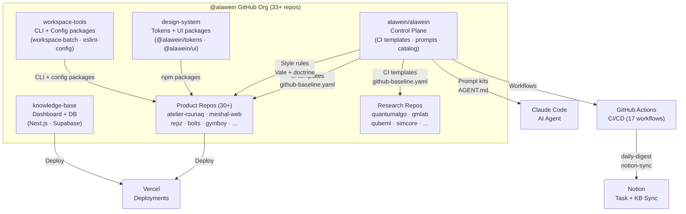
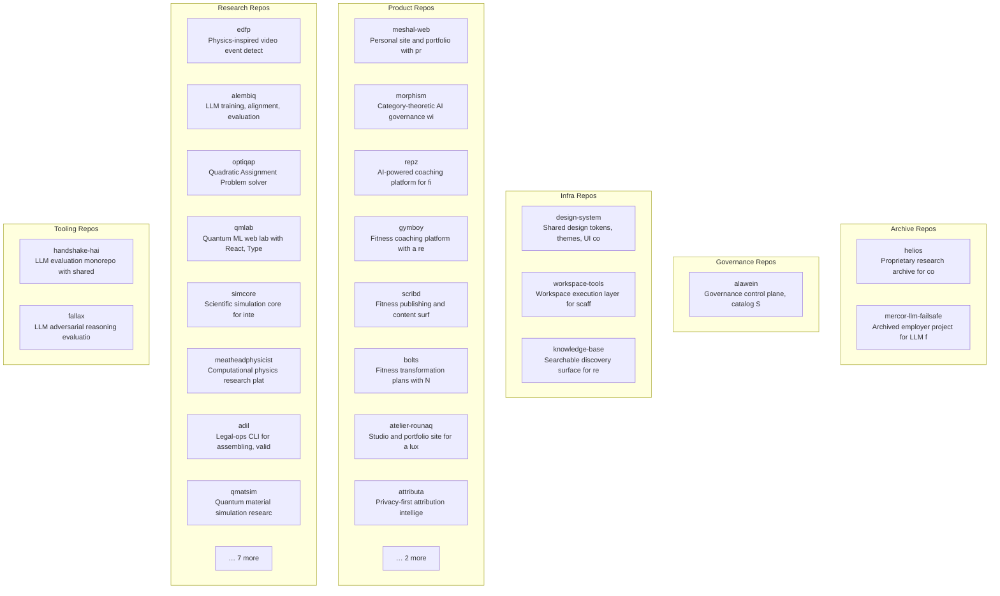
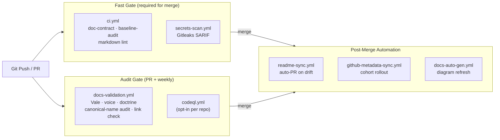
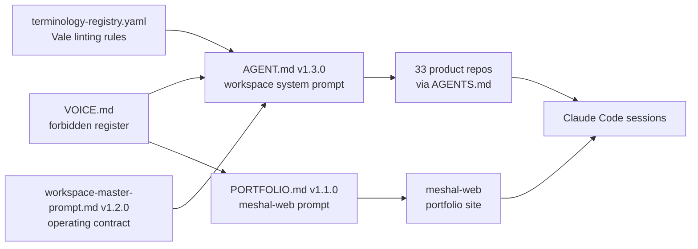
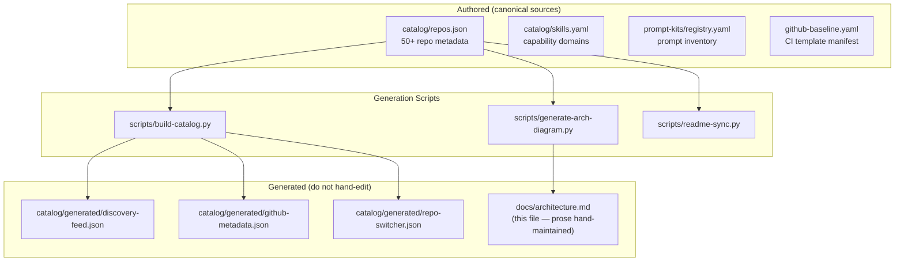
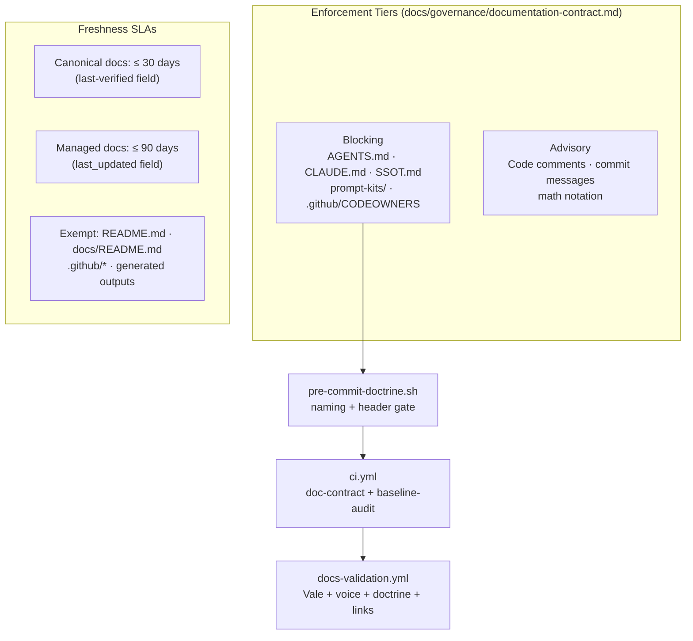

# Alawein Workspace Architecture

<!-- Prose sections are hand-maintained. Diagrams are auto-generated from
     catalog/repos.json + .github/workflows/ via scripts/generate-arch-diagram.py.
     To regenerate: python scripts/generate-arch-diagram.py -->

## System Context

`alawein/alawein` is the governance control plane for the `@alawein` GitHub org.
It owns CI policy templates, canonical prompt kits, voice contracts, docs doctrine,
and the catalog registry that governs 33+ sibling repos. No product code lives here.

<!-- AUTO-GENERATED REPO TOPOLOGY START -->
<!-- last updated: 2026-05-04 — do not edit; run scripts/generate-arch-diagram.py -->

### Repo Topology (auto-generated from catalog/repos.json)

<!-- AUTO-GENERATED REPO TOPOLOGY END -->
## CI/CD Pipeline

Every push to `main` and every PR triggers this pipeline. Status checks gate merges.

## Prompt Kit Dependency Map

## Catalog & Registry Architecture

## Governance Layer

## Key File Index

| Path | Purpose |
|------|---------|
| `github-baseline.yaml` | CI template manifest — which repos use which template |
| `catalog/repos.json` | Canonical repo registry (50+ repos, full metadata) |
| `catalog/skills.yaml` | Capability domain registry |
| `prompt-kits/AGENT.md` | Workspace system prompt (v1.3.0) |
| `prompt-kits/PORTFOLIO.md` | meshal-web system prompt (v1.1.0) |
| `prompt-kits/registry.yaml` | Prompt inventory with rollout status |
| `docs/governance/workspace-master-prompt.md` | 6-rule operating contract |
| `docs/governance/documentation-contract.md` | Doc class SLAs and naming rules |
| `docs/governance/prompt-rollout.md` | Prompt versioning and rollout protocol |
| `docs/style/VOICE.md` | Canonical voice contract (forbidden/preferred register) |
| `docs/style/terminology-registry.yaml` | Vale linting source |
| `scripts/validate-doctrine.py` | Full-repo doc doctrine validator |
| `scripts/validate-prompt-kit.py` | Prompt kit structure + frontmatter validator |
| `scripts/github-baseline-audit.py` | Action pinning + CI coverage auditor |
| `scripts/generate-arch-diagram.py` | This diagram's source generator |
| `.github/rulesets/main-protection.json` | Branch ruleset definition (apply via GitHub UI) |
