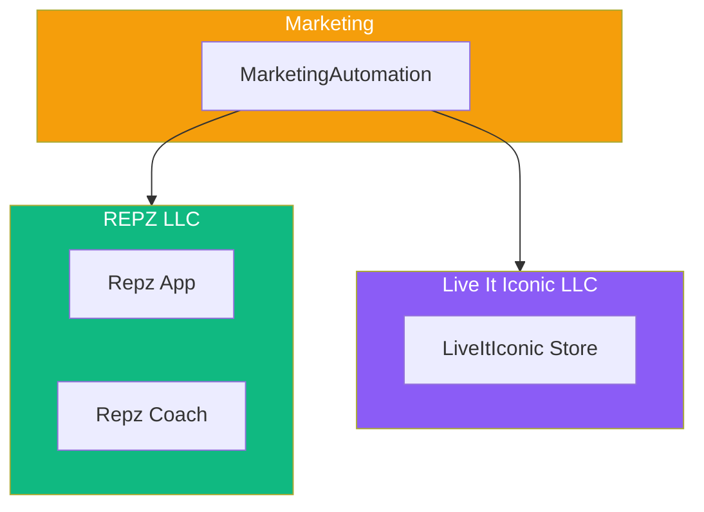

# Business Projects Codemap

> **Location:** `.archive/organizations/alawein-business/` **Projects:** Repz,
> LiveItIconic, MarketingAutomation **Status:** Development

---

## Overview



---

## Repz - AI Fitness Tracking

**Primary Location:** `C:\Users\mesha\Desktop\REPZ` (ACTIVE) **Archive
Location:** `.archive/organizations/alawein-business/Repz/` **Domain:**
getrepz.app ✅

### Active Repo Structure (Desktop/REPZ)

```
REPZ/
├── src/                         # React source
├── packages/                    # Monorepo packages
├── public/                      # Static assets
├── scripts/                     # Build scripts
├── supabase/                    # Supabase config
├── tests/                       # Test suites
├── docs/                        # Documentation
├── _graveyard/                  # Deprecated code
├── package.json                 # Dependencies
├── vite.config.ts               # Vite config
├── tailwind.config.ts           # Tailwind config
└── [90+ config/doc files]       # Various configs
```

### Archive Structure

```
Repz/
├── REPZ/
│   └── platform/                # Full platform code
│       ├── node_modules/        # Dependencies
│       ├── src/                 # Source
│       └── docs/                # Docs
├── app/                         # Mobile app
├── assets/                      # Assets
├── demos/                       # Demo content
├── docs/                        # Documentation
├── infrastructure/              # Infra configs
├── performance/                 # Performance tests
├── profile/                     # User profiles
├── public/                      # Public assets
├── scripts/                     # Scripts
├── supabase/                    # Supabase
└── tests/                       # Tests
```

### Key Features

- AI-powered workout tracking
- Rep counting with computer vision
- Progress analytics
- Social features
- Subscription tiers

---

## LiveItIconic - Luxury E-commerce

**Location:** `.archive/organizations/alawein-business/LiveItIconic/`
**Domain:** liveiticonic.com

```
LiveItIconic/
├── app/                         # Next.js app
├── docs/                        # Documentation
│   ├── ai/                      # AI superprompt
│   ├── deployment/              # Deploy guides
│   ├── guides/                  # User guides
│   └── reference/               # Reference docs
├── infrastructure/              # Infra configs
├── perf-reports/                # Performance reports
├── postman/                     # API collections
├── profile/                     # Store profile
├── public/                      # Static assets
├── reports/                     # Generated reports
├── scripts/                     # Build scripts
├── src/                         # Source code
├── supabase/                    # Supabase config
├── tests/                       # Tests
└── .brand/                      # Brand assets
    ├── identity/                # Brand identity
    └── marketing/               # Marketing materials
```

### Key Features

- Luxury product catalog
- Shopify integration
- SEO optimized
- Analytics dashboard
- YouTube strategy integration

---

## MarketingAutomation

**Location:** `.archive/organizations/alawein-business/MarketingAutomation/`

```
MarketingAutomation/
├── frontend/                    # React frontend
├── services/                    # Backend services
├── shared/                      # Shared utilities
├── src/                         # Source code
└── tests/                       # Tests
```

### Purpose

Marketing automation tools for Repz and LiveItIconic campaigns.

---

## Existing Superprompt

| Project | Superprompt           |
| ------- | --------------------- |
| Repz    | `REPZ_SUPERPROMPT.md` |

---

## Deployment Status

| Project             | Platform | Status         |
| ------------------- | -------- | -------------- |
| Repz                | Vercel   | 🟡 Development |
| LiveItIconic        | Vercel   | 🟡 Development |
| MarketingAutomation | -        | 🔴 Planned     |

---

_Last Updated: December 5, 2025_
