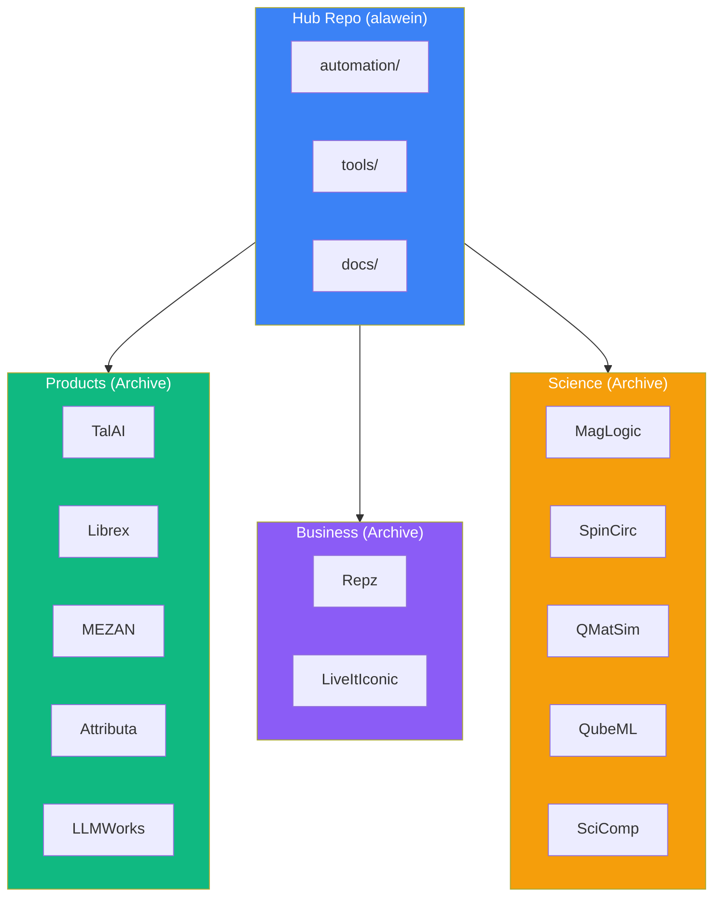

# Codemaps Index

> **Purpose:** Navigation hub for all project codemaps **Last Updated:**
> December 5, 2025

---

## Quick Navigation

| Codemap                                                        | Projects                 | Status         |
| -------------------------------------------------------------- | ------------------------ | -------------- |
| [TALAI_CODEMAP.md](./TALAI_CODEMAP.md)                         | TalAI (50 modules)       | 🟡 Development |
| [LIBREX_CODEMAP.md](./LIBREX_CODEMAP.md)                       | Librex, Librex.QAP       | 🟡 Development |
| [MEZAN_CODEMAP.md](./MEZAN_CODEMAP.md)                         | MEZAN, ATLAS, Libria     | 🟡 Development |
| [BUSINESS_PROJECTS_CODEMAP.md](./BUSINESS_PROJECTS_CODEMAP.md) | Repz, LiveItIconic       | 🟡 Development |
| [SCIENCE_PROJECTS_CODEMAP.md](./SCIENCE_PROJECTS_CODEMAP.md)   | MagLogic, SpinCirc, etc. | 🔴 Research    |
| [INFRASTRUCTURE_CODEMAP.md](./INFRASTRUCTURE_CODEMAP.md)       | automation/, tools/      | ✅ Active      |

---

## Project Hierarchy



---

## Archive Locations

All project code is preserved in `.archive/organizations/`:

```
.archive/organizations/
├── AlaweinOS/                   # Alawein Technologies
│   ├── Attributa/
│   ├── Foundry/
│   ├── HELIOS/
│   ├── LLMWorks/
│   ├── Librex/
│   ├── Librex.QAP/
│   ├── MEZAN/
│   ├── QMLab/
│   ├── SimCore/
│   └── TalAI/                   # 50 modules
├── alawein-business/
│   ├── LiveItIconic/
│   ├── MarketingAutomation/
│   └── Repz/
├── alawein-science/
│   ├── MagLogic/
│   ├── QMatSim/
│   ├── QubeML/
│   ├── SciComp/
│   └── SpinCirc/
└── MeatheadPhysicist/
```

---

## Related Documents

- [REPOSITORY_CONSOLIDATION_SUPERPROMPT.md](../../REPOSITORY_CONSOLIDATION_SUPERPROMPT.md) -
  Master superprompt
- [CODEMAP.md](../CODEMAP.md) - Original system codemap
- [projects/README.md](../../projects/README.md) - Project registry

---

## Superprompt Locations

All project superprompts are in `automation/prompts/project/`:

| Project  | Superprompt File                     |
| -------- | ------------------------------------ |
| TalAI    | `TALAI_SUPERPROMPT.md`               |
| Repz     | `REPZ_SUPERPROMPT.md`                |
| SimCore  | `SIMCORE_CLAUDE_CODE_SUPERPROMPT.md` |
| MagLogic | `MAG_LOGIC_SUPERPROMPT.md`           |
| SpinCirc | `SPIN_CIRC_SUPERPROMPT.md`           |
| QMatSim  | `QMAT_SIM_SUPERPROMPT.md`            |
| QubeML   | `QUBE_ML_SUPERPROMPT.md`             |
| SciComp  | `SCI_COMP_SUPERPROMPT.md`            |

---

## Usage

### For AI Agents

1. Start with this INDEX.md
2. Read relevant project codemap
3. Check superprompt in `automation/prompts/project/`
4. Reference `REPOSITORY_CONSOLIDATION_SUPERPROMPT.md` for full context

### For Developers

1. Check codemap for project structure
2. Find source in `.archive/organizations/`
3. Use superprompt for AI-assisted development

---

_Last Updated: December 5, 2025_
