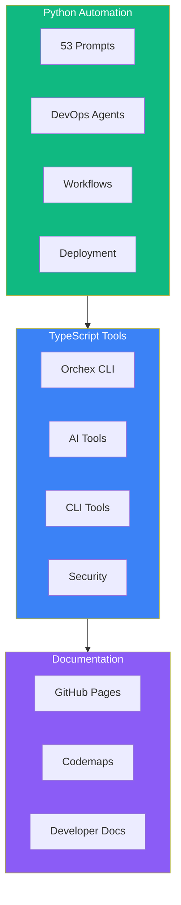
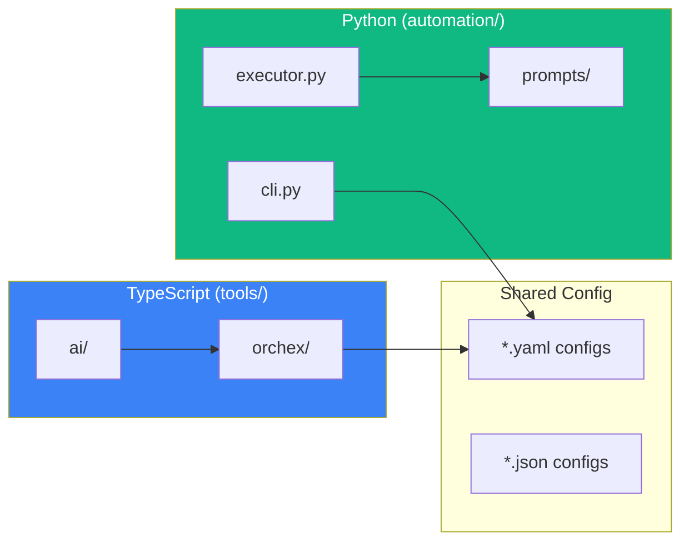

# Infrastructure Codemap

> **Active Systems:** automation/, tools/, docs/ **Status:** ACTIVE - Do not
> archive

---

## Overview



---

## automation/ (Python)

**Location:** `c:\Users\mesha\Desktop\GitHub\automation\`

```
automation/
├── __init__.py                  # Package init
├── cli.py                       # Main CLI (7KB)
├── executor.py                  # Workflow executor (15KB)
├── validation.py                # Asset validation (14KB)
├── utils.py                     # Utilities (5KB)
│
├── prompts/                     # 53 prompts total
│   ├── CATALOG.md               # Prompt catalog
│   ├── system/                  # 9 system prompts
│   ├── project/                 # 28 project superprompts
│   │   ├── TALAI_SUPERPROMPT.md
│   │   ├── REPZ_SUPERPROMPT.md
│   │   ├── SIMCORE_CLAUDE_CODE_SUPERPROMPT.md
│   │   ├── MAG_LOGIC_SUPERPROMPT.md
│   │   ├── SPIN_CIRC_SUPERPROMPT.md
│   │   ├── QMAT_SIM_SUPERPROMPT.md
│   │   ├── QUBE_ML_SUPERPROMPT.md
│   │   ├── SCI_COMP_SUPERPROMPT.md
│   │   ├── LOVABLE_FULLSTACK_TEMPLATE_SYSTEM.md (81KB!)
│   │   ├── LOVABLE_TEMPLATE_SUPERPROMPT.md (52KB)
│   │   └── ... (18 more)
│   └── tasks/                   # 16 task prompts
│
├── agents/
│   └── devops/                  # 6 DevOps agent configs
│
├── workflows/                   # Workflow definitions
│
├── deployment/                  # 16 deployment configs
│   └── DEPLOYMENT_GUIDE.md
│
├── orchestration/               # Multi-agent patterns
│
├── services/                    # Service integrations
│
├── core/                        # Core utilities
│
├── types/                       # Type definitions
│
├── cli/                         # CLI modules
│
└── __tests__/                   # Test suites
```

### CLI Commands

```bash
# Python CLI
python -m automation prompts list
python -m automation agents list
python -m automation workflows list
python -m automation route "task description"
python -m automation validate
python -m automation execute <workflow>
```

---

## tools/orchex/ (TypeScript)

**Location:** `c:\Users\mesha\Desktop\GitHub\tools\orchex\`

```
tools/orchex/
├── index.ts                     # Entry point
├── package.json                 # Dependencies
├── tsconfig.build.json          # Build config
│
├── cli/                         # 11 CLI modules
│   ├── commands.ts              # Command registry
│   └── ...
│
├── orchestration/               # 11 orchestration modules
│   ├── devops-agents.ts         # 20 DevOps agents
│   └── ...
│
├── analysis/                    # 7 analysis modules
│
├── services/                    # 8 service modules
│
├── adapters/                    # 5 adapters
│
├── api/                         # 5 API modules
│
├── storage/                     # 6 storage modules
│
├── refactoring/                 # 4 refactoring modules
│
├── core/                        # 3 core modules
│
├── agents/                      # 2 agent modules
│
├── integrations/                # 3 integrations
│
├── config/                      # 3 config files
│
├── types/                       # Type definitions
│
└── utils/                       # Utilities
```

### CLI Commands

```bash
npm run orchex -- agents
npm run orchex -- workflows
npm run orchex -- run <name>
npm run orchex -- devops ci
```

---

## tools/ai/ (AI Orchestration)

**Location:** `c:\Users\mesha\Desktop\GitHub\tools\ai\`

36 files for AI routing, MCP integration, and orchestration.

---

## docs/pages/ (GitHub Pages)

**Location:** `c:\Users\mesha\Desktop\GitHub\docs\pages\`

```
docs/pages/
├── index.html                   # Main landing page
├── CNAME                        # Custom domain config
├── brands/                      # Product landing pages
│   ├── talai/
│   │   └── index.html           # TalAI landing
│   ├── librex/
│   │   └── index.html           # Librex landing
│   ├── mezan/
│   │   └── index.html           # MEZAN landing
│   └── repz/
│       └── index.html           # Repz landing
└── personas/                    # Persona pages
```

---

## Key Integration Points



---

## Protected Files

From `CLAUDE.md`:

- `automation/` - Never delete
- `tools/` - Never delete
- `.metaHub/` - Governance policies
- `docs/pages/` - Landing pages

---

_Last Updated: December 5, 2025_
