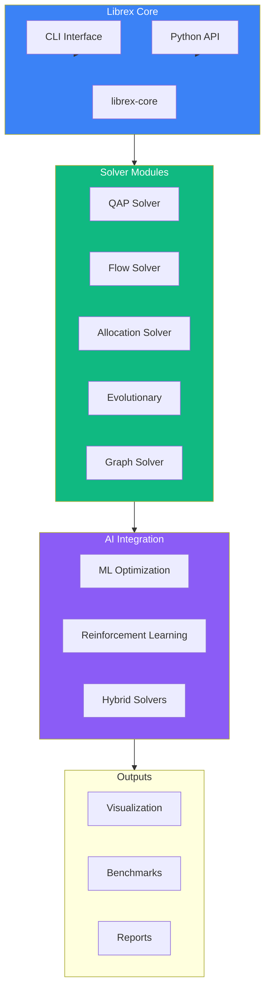
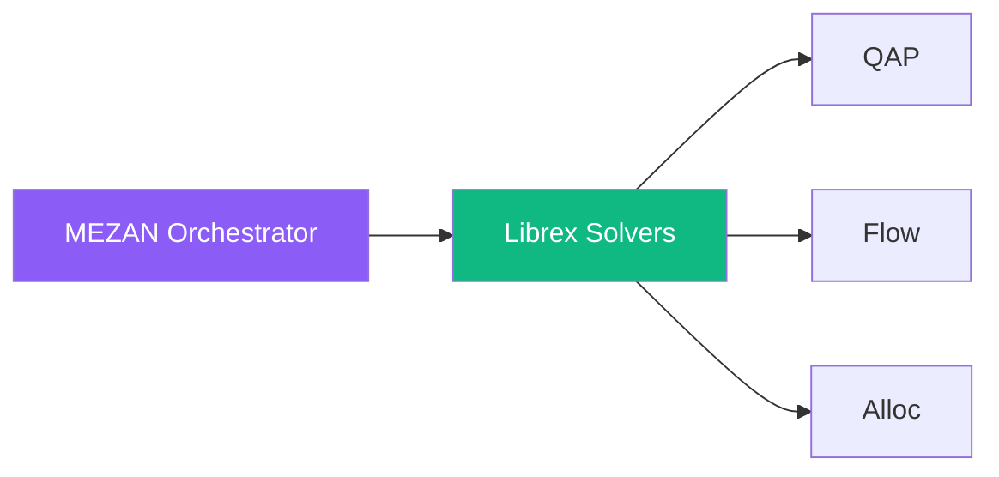

# Librex Codemap

> **Location:** `.archive/organizations/AlaweinOS/Librex/` + `Librex.QAP/`
> **Status:** Development **Domain:** librex.dev (to register)

---

## Architecture Overview



---

## Directory Structure

### Librex Core

```
Librex/
├── src/                         # Core library source
├── ai/                          # AI/ML integration
├── benchmarks/                  # Performance benchmarks
├── data/                        # Test datasets
├── docs/                        # Documentation
├── Librex/                  # Equilibrium solvers
│   └── quantum/                 # Quantum optimization
├── examples/                    # Usage examples
├── governance/                  # Project governance
├── reports/                     # Generated reports
├── scripts/                     # Utility scripts
├── tests/                       # Test suites
└── tools/                       # Development tools
```

### Librex.QAP (Separate Module)

```
Librex.QAP/
├── src/                         # QAP solver source
├── docs/
│   ├── community/               # Community docs
│   ├── deployment/              # Deployment guides
│   ├── launch/                  # Launch playbooks
│   ├── research/                # Research docs
│   └── templates/               # Templates
├── tests/
└── .archive/                    # Historical docs
```

---

## Solver Inventory

| Solver    | Problem Domain       | Status  | Location      |
| --------- | -------------------- | ------- | ------------- |
| **QAP**   | Quadratic Assignment | Active  | `Librex.QAP/` |
| **Flow**  | Network Flow         | Planned | `Librex/`     |
| **Alloc** | Resource Allocation  | Planned | `Librex/`     |
| **Evo**   | Evolutionary         | Planned | `Librex/`     |
| **Graph** | Graph Optimization   | Planned | `Librex/`     |
| **Dual**  | Dual Problems        | Planned | `Librex/`     |
| **Meta**  | Meta-optimization    | Planned | `Librex/`     |

---

## Key Files

| File                     | Purpose                |
| ------------------------ | ---------------------- |
| `src/librex/__init__.py` | Main package           |
| `src/librex/solvers/`    | Solver implementations |
| `src/librex/models/`     | Problem models         |
| `ai/`                    | ML-enhanced solvers    |
| `benchmarks/`            | Performance tests      |

---

## Integration with MEZAN



MEZAN uses Librex as its solver backend, orchestrating multiple solvers for
complex optimization problems.

---

## Deployment

- **Package:** PyPI (`pip install librex`)
- **Docs:** GitHub Pages
- **Benchmarks:** Automated CI

---

_Last Updated: December 5, 2025_
