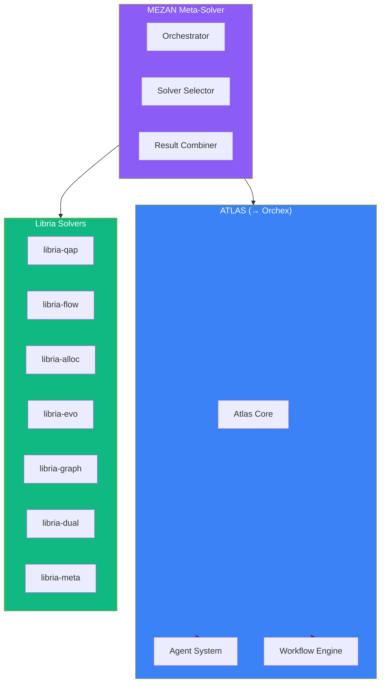

# MEZAN Codemap

> **Location:** `.archive/organizations/AlaweinOS/MEZAN/` **Components:** ATLAS,
> Libria, MEZAN Core **Status:** Development

---

## Architecture Overview



---

## Directory Structure

```
MEZAN/
├── ATLAS/                       # Orchestration system (→ Orchex)
│   ├── atlas-core/              # Core orchestration
│   ├── docs/                    # ATLAS documentation
│   ├── examples/                # Usage examples
│   ├── src/                     # Source code
│   └── tests/                   # Test suites
│
├── Libria/                      # Solver library
│   ├── libria-qap/              # Quadratic Assignment
│   ├── libria-flow/             # Network Flow
│   ├── libria-alloc/            # Resource Allocation
│   ├── libria-evo/              # Evolutionary
│   ├── libria-graph/            # Graph Optimization
│   ├── libria-dual/             # Dual Problems
│   ├── libria-meta/             # Meta-optimization
│   ├── libria-integration/      # Integration layer
│   ├── benchmarking/            # Benchmark suite
│   ├── consolidation/           # Consolidation tools
│   ├── meta/                    # Meta-information
│   ├── prompts/                 # AI prompts
│   └── quick_reference/         # Quick reference docs
│
├── MEZAN/                       # MEZAN core
│   └── docs/                    # Core documentation
│
├── core/                        # Shared core utilities
│   └── tests/                   # Core tests
│
├── docs/                        # Project documentation
│   └── specs/                   # Specifications
│
├── scripts/                     # Utility scripts
├── src/                         # Main source
├── tests/                       # Integration tests
└── visualization/               # Visualization tools
```

---

## Component Relationships

### ATLAS → Orchex Migration

ATLAS was renamed to Orchex and moved to `tools/orchex/` in the main repo. The
archive contains the original ATLAS code.


### Libria Solver Details

| Solver         | Purpose              | Algorithms                   |
| -------------- | -------------------- | ---------------------------- |
| `libria-qap`   | Quadratic Assignment | Simulated Annealing, Genetic |
| `libria-flow`  | Network Flow         | Ford-Fulkerson, Push-Relabel |
| `libria-alloc` | Resource Allocation  | Linear Programming           |
| `libria-evo`   | Evolutionary         | GA, ES, DE                   |
| `libria-graph` | Graph Problems       | Dijkstra, A\*, TSP           |
| `libria-dual`  | Dual Problems        | Lagrangian Relaxation        |
| `libria-meta`  | Meta-optimization    | Hyper-parameter tuning       |

---

## Key Files

| File                         | Purpose              |
| ---------------------------- | -------------------- |
| `MEZAN/src/mezan.py`         | Main orchestrator    |
| `Libria/libria-integration/` | Solver integration   |
| `ATLAS/src/`                 | Orchestration engine |
| `visualization/`             | Result visualization |

---

## Integration Points

1. **Librex** - Uses Libria solvers as backend
2. **TalAI** - Uses MEZAN for research optimization
3. **Orchex** - Evolved from ATLAS

---

_Last Updated: December 5, 2025_
