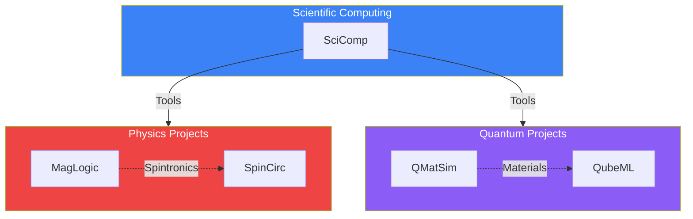

# Science Projects Codemap

> **Location:** `.archive/organizations/alawein-science/` **Projects:** 5
> research projects **Status:** Research/Archive

---

## Overview



---

## MagLogic - Magnetic Logic Circuits

**Location:** `alawein-science/MagLogic/`

```
MagLogic/
├── config/                      # Configuration files
├── docker/                      # Docker setup
├── docs/                        # Documentation
├── examples/                    # Example simulations
├── matlab/                      # MATLAB scripts
├── mumax3/                      # MuMax3 simulations
├── oommf/                       # OOMMF simulations
├── python/                      # Python interface
├── scripts/                     # Utility scripts
├── src/                         # Core source
└── tests/                       # Test suites
```

**Purpose:** Simulation of magnetic logic circuits using micromagnetic solvers
(MuMax3, OOMMF).

---

## SpinCirc - Spintronics Circuits

**Location:** `alawein-science/SpinCirc/`

```
SpinCirc/
├── config/                      # Configuration
├── docker/                      # Docker setup
├── docs/                        # Documentation
├── examples/                    # Examples
├── matlab/                      # MATLAB scripts
├── python/                      # Python interface
├── scripts/                     # Scripts
├── src/                         # Source code
└── tests/                       # Tests
```

**Purpose:** Spintronics circuit simulation and analysis.

---

## QMatSim - Quantum Material Simulation

**Location:** `alawein-science/QMatSim/`

```
QMatSim/
├── docs/                        # Documentation
├── lammps/                      # LAMMPS integration
├── qmatsim/                     # Core package
├── scripts/                     # Utility scripts
├── src/                         # Source code
└── tests/                       # Tests
```

**Purpose:** Quantum material property simulation using molecular dynamics
(LAMMPS).

---

## QubeML - Quantum Machine Learning

**Location:** `alawein-science/QubeML/`

```
QubeML/
├── data/                        # Datasets
├── docs/                        # Documentation
├── integrative_projects/        # Cross-domain projects
├── materials_informatics/       # Materials ML
├── quantum_computing/           # Quantum algorithms
├── scripts/                     # Scripts
├── src/                         # Source code
└── tests/                       # Tests
```

**Purpose:** Machine learning for quantum systems and materials informatics.

---

## SciComp - Scientific Computing Tools

**Location:** `alawein-science/SciComp/`

```
SciComp/
├── MATLAB/                      # MATLAB tools
├── Mathematica/                 # Mathematica notebooks
├── Python/                      # Python tools
├── docs/                        # Documentation
├── examples/                    # Examples
├── notebooks/                   # Jupyter notebooks
├── scripts/                     # Scripts
├── src/                         # Source code
└── tests/                       # Tests
```

**Purpose:** General scientific computing utilities across MATLAB, Mathematica,
and Python.

---

## Existing Superprompts

Each project has a superprompt in `automation/prompts/project/`:

| Project  | Superprompt                |
| -------- | -------------------------- |
| MagLogic | `MAG_LOGIC_SUPERPROMPT.md` |
| SpinCirc | `SPIN_CIRC_SUPERPROMPT.md` |
| QMatSim  | `QMAT_SIM_SUPERPROMPT.md`  |
| QubeML   | `QUBE_ML_SUPERPROMPT.md`   |
| SciComp  | `SCI_COMP_SUPERPROMPT.md`  |

---

## Activation Priority

These are research projects - activate when:

1. Research resumes
2. Publication preparation
3. Grant applications

---

_Last Updated: December 5, 2025_
