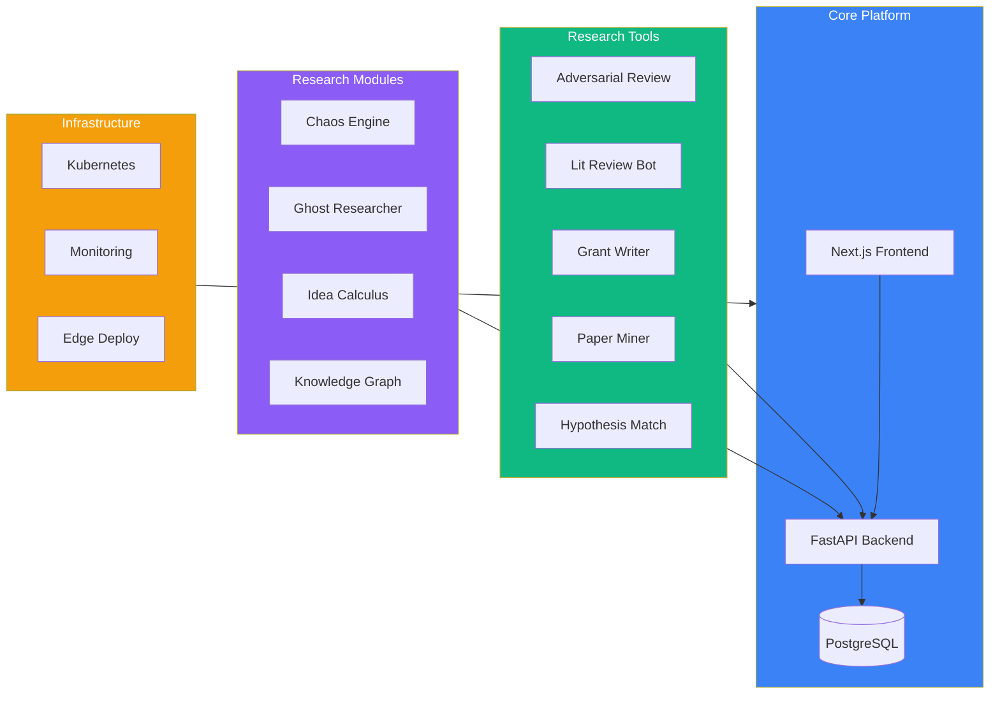
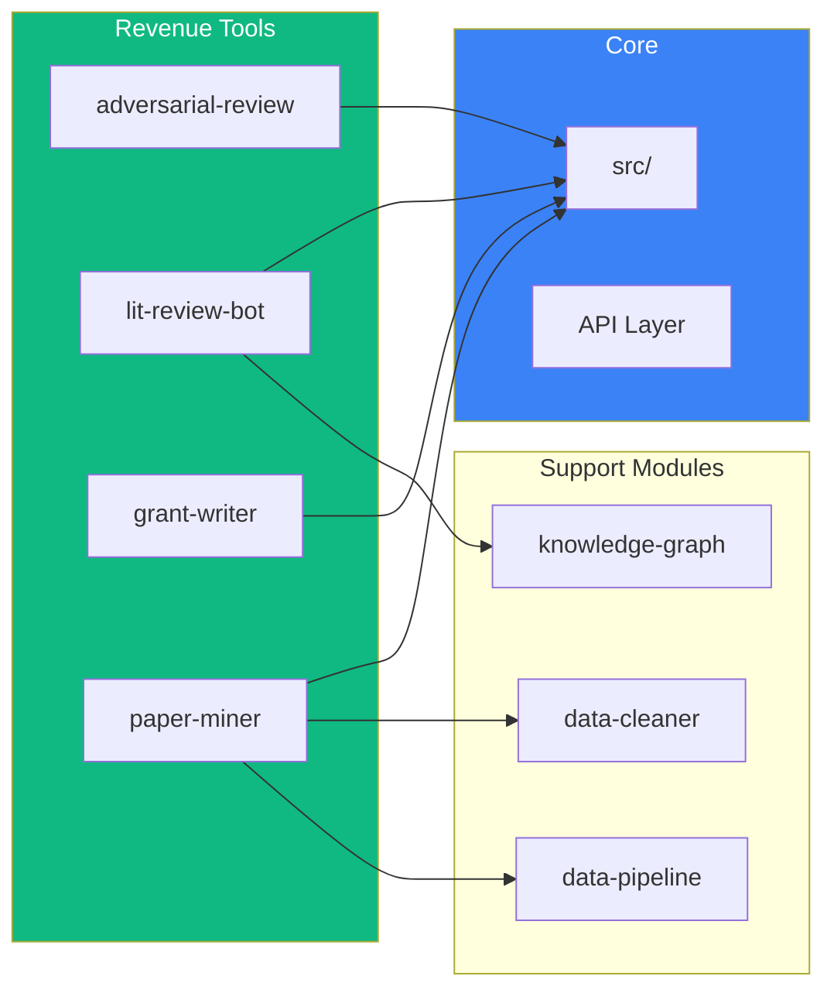

# TalAI Codemap

> **Location:** `.archive/organizations/AlaweinOS/TalAI/` **Modules:** 50
> **Status:** Development **Domain:** talai.dev (to register)

---

## Architecture Overview



---

## Directory Structure

```
TalAI/
├── src/                         # Core source code
├── docs/                        # Documentation
├── tests/                       # Test suites
├── examples/                    # Example code
├── brand/                       # Branding assets
│
├── # REVENUE-READY TOOLS (P0)
├── adversarial-review/          # AI peer review simulation
├── lit-review-bot/              # Literature review automation
├── grant-writer/                # Grant proposal assistance
├── paper-miner/                 # Paper data extraction
├── hypothesis-match/            # Hypothesis generation
│
├── # RESEARCH TOOLS (P1)
├── abstract-writer/             # Publication abstract generation
├── active-learning/             # Active learning pipelines
├── analytics/                   # Research analytics dashboard
├── causal-inference/            # Causal analysis tools
├── citation-predictor/          # Citation impact prediction
├── data-cleaner/                # Automated data cleaning
├── experiment-designer/         # Optimal experiment design
├── failure-db/                  # Database of failed experiments
├── ghost-researcher/            # Autonomous exploration agent
├── idea-calculus/               # Idea combination engine
├── ideaforge/                   # Creative ideation tools
├── knowledge-graph/             # Research knowledge graphs
├── research-pricer/             # Research cost estimation
│
├── # PROMPT ENGINEERING
├── prompt-marketplace/          # Prompt trading platform
├── promptforge/                 # Prompt engineering tools
├── promptforge-lite/            # Lightweight prompt tools
│
├── # INFRASTRUCTURE
├── atlas-autonomous-research/   # Autonomous research agent
├── atlas-orchestrator/          # Multi-agent orchestration
├── buildforge/                  # Build automation
├── chaos-engine/                # Stress-testing research methods
├── data-pipeline/               # Data processing pipelines
├── edge/                        # Edge deployment
├── enterprise/                  # Enterprise features
├── federated/                   # Federated learning
├── k8s/                         # Kubernetes configs
├── monitoring/                  # Monitoring & observability
├── nginx/                       # Web server configs
├── performance/                 # Performance optimization
├── validation/                  # Research validation
│
├── # DOMAIN-SPECIFIC
├── materials-science/           # Materials research tools
├── meta-science/                # Meta-science analysis
├── multimodal/                  # Multimodal AI tools
├── neuroscience/                # Neuroscience tools
├── synthetic-biology/           # Synthetic bio tools
├── turing-features/             # AI testing (8 sub-modules)
├── turingo/                     # Turing test tools
│
├── # OTHER
├── alaweinos/                   # AlaweinOS integration
├── consortia/                   # Research consortia tools
└── PEDs-Playbook/               # Research performance guide
```

---

## Module Dependencies



---

## Key Files

| File            | Purpose           |
| --------------- | ----------------- |
| `src/main.py`   | Main entry point  |
| `src/api/`      | FastAPI routes    |
| `src/models/`   | Data models       |
| `src/services/` | Business logic    |
| `docs/`         | API documentation |

---

## Deployment

- **Target:** Vercel (frontend) + Railway/Render (backend)
- **Database:** Supabase PostgreSQL
- **Auth:** Supabase Auth
- **Payments:** Stripe

---

## Priority Modules for MVP

1. **adversarial-review/** - First product to monetize
2. **lit-review-bot/** - High demand from researchers
3. **grant-writer/** - Clear value proposition
4. **paper-miner/** - Data extraction utility
5. **promptforge/** - Prompt engineering tools

---

_Last Updated: December 5, 2025_
