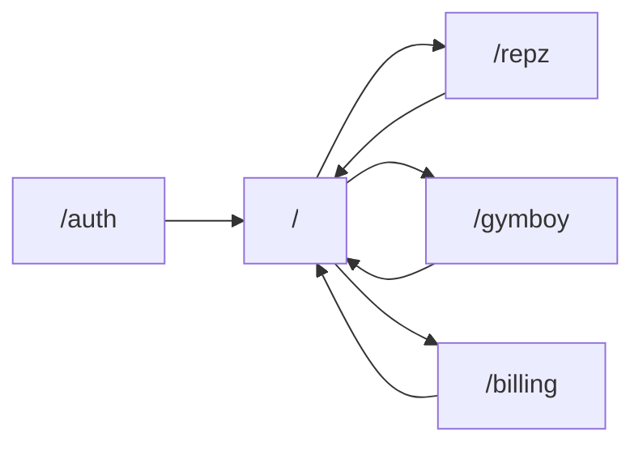
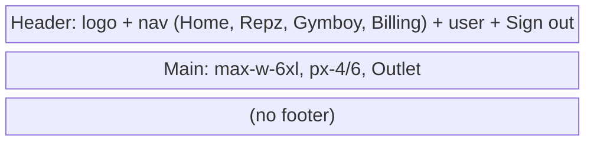
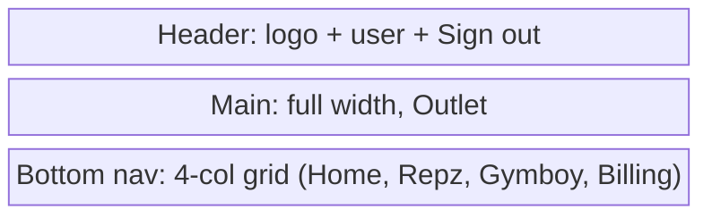
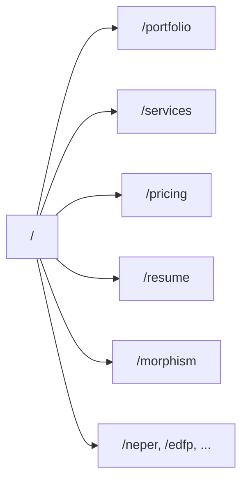
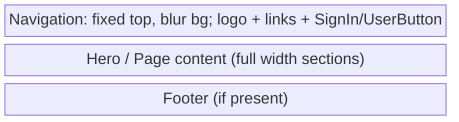
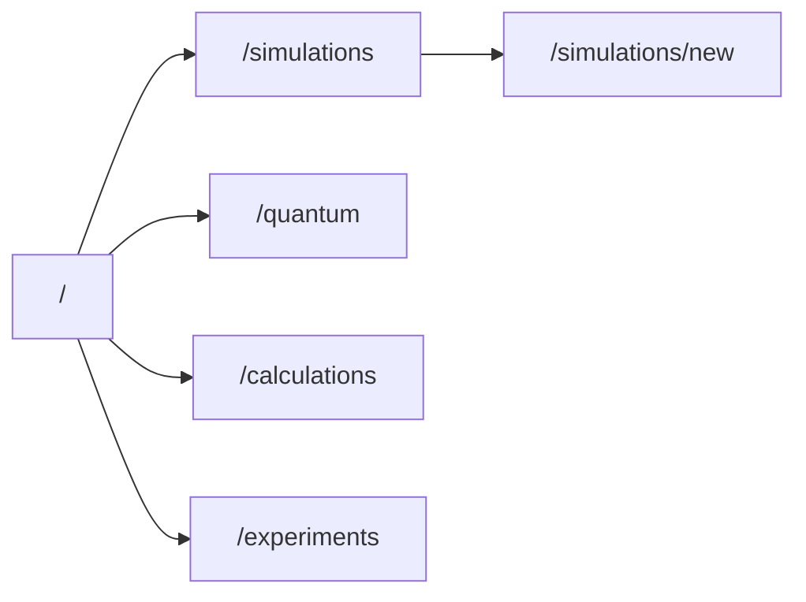
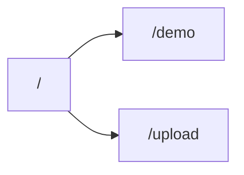
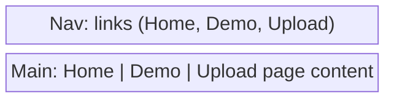
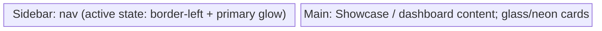

```mermaid
block-beta
  columns 12
  header["Header: logo (Atom + SimCore) + links (Home, Simulations, Quantum, Calculations, Experiments) + CTA"]
  sidebar["Sidebar (if present)"] main["Main: simulation / dashboard content"]
  footer["Footer: extended (sections + social + copyright)"]
```

# Wireframes and Component Hierarchies

Low-fidelity layout, user flow, and component trees for each platform. Breakpoints: mobile &lt;768px, tablet 768–1024, desktop &gt;1024.

---

## 1. Attributa (RPG fitness SaaS)

**Routes:** `/auth` → `/` (Home) → `/repz` | `/gymboy` | `/billing`; `*` → NotFound.

### User flow



### Layout wireframe (desktop)



### Layout wireframe (mobile)



### Responsive behavior

- **&lt;768px:** Bottom nav visible (fixed), top nav links hidden; main full width.
- **≥768px:** Top nav with links; bottom nav hidden.

### Component hierarchy

```
Page (route)
└── AppShell
    ├── Header (sticky)
    │   ├── Link (logo: icon + "Repz + Gymboy")
    │   ├── Nav (desktop: NavLink × 4)
    │   └── User block + Button (Sign out)
    ├── Main (Outlet)
    │   └── HomePage | RepzPage | GymboyPage | BillingPage
    └── Nav (mobile, fixed bottom)
        └── NavLink × 4 (icons + labels)

HomePage: StatTile(s), CTA
RepzPage: WorkoutLogger, WorkoutHistory, ProgressCharts
GymboyPage: QuestBoard, AchievementCabinet, PixelAvatar
BillingPage: (billing UI)
```

---

## 2. Meshal-web (portfolio & showcase)

**Routes:** `/`, `/portfolio`, `/services`, `/pricing`, `/resume`, `/morphism`, `/neper`, `/edfp`, `/qaplibria`, `/repz`, `/llmworks`, `/portal`; `*` → NotFound.

### User flow (simplified)



### Layout wireframe (all pages)



### Responsive behavior

- Navigation: hamburger + drawer on small viewport; full links on desktop. Scroll-based background opacity.
- Portfolio: hash links (#about, #skills, #projects, #contact); smooth scroll.

### Component hierarchy

```
App (Routes)
└── Route → Landing | Portfolio | Services | ... | NotFound
    ├── Navigation (fixed header)
    │   ├── Logo
    │   ├── Nav links (or drawer on mobile)
    │   └── Clerk: SignInButton | UserButton
    ├── Page content (lazy Morphism, Neper, Edfp, etc.)
    └── Footer (layout)
```

---

## 3. Simcore (scientific computing)

**Routes:** Dashboard, simulations, quantum lab, calculations, experiments (config in layout.tsx).

### User flow



### Layout wireframe (desktop)



### Responsive behavior

- Sidebar collapses or becomes overlay on small viewport (per shared-layouts).
- Touch targets min 44px; spacing-mobile / tablet / desktop tokens.

### Component hierarchy

```
Layout (@morphism/shared-layouts + simcoreLayoutConfig)
├── Header
│   ├── Logo (Atom + "SimCore")
│   ├── Nav links
│   └── CTA (Start Simulation)
├── Main content
│   └── SimulationDashboard | ScientificComputing | QuantumTunneling | ...
│       ├── Sidebar (optional)
│       ├── PhysicsVisualizationEngine | EnhancedPhysicsControls
│       ├── DocumentationPanel | TheoryPanel
│       └── Cards / Controls
└── Footer (extended: sections, links, social, copyright)
```

---

## 4. EDF (event-discovery-framework)

**Routes:** `/`, `/demo`, `/upload`.

### User flow



### Layout wireframe



### Component hierarchy

```
App
├── Nav (links)
└── Routes
    ├── Home
    ├── Demo
    └── Upload (VideoUploader, DetectionTimeline, EnergyChart, MetaChip)
```

---

## 5. Repz (fitness/coaching)

Showcase + theme/tokens workflow; layout: desktop sidebar + mobile bottom nav (MainLayout).

### Layout wireframe (desktop)



### Responsive behavior

- Desktop: sidebar + main. Mobile: bottom nav + main.

### Component hierarchy

```
MainLayout
├── Sidebar (desktop)
│   └── Nav items (active state, patterns)
├── Main
│   └── Showcase / registry / component examples
└── Bottom nav (mobile)
```

---

## 6. Gainboy, Bolts, Rounaq-atelier, Llmworks, Qmlab, Scribd

- **Gainboy:** SPA; D-2 Game Boy palette; single main content area.
- **Bolts:** Next.js; Header (Logo, nav); app pages.
- **Rounaq-atelier:** Landing, Contact, NotFound; DesertHeader, FullScreenNav, Footer.
- **Llmworks / Qmlab / Scribd:** Vite or Next.js; standard shell (header + main) or dashboard; Radix + Tailwind.

Shared pattern: **Shell (header or sidebar + main)** → **Page** → **Sections / Cards / Forms**. Use devkit tokens and DESIGN-INVENTORY per-app theme table for consistency.
