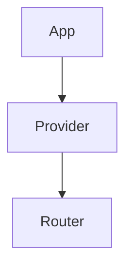

Visual code map generator for the Alawein monorepo. Generates ASCII, Mermaid,
and SVG diagrams from codebase analysis.

## Quick Start

```bash
cd scripts/codemap
npm install
npx ts-node cli.ts list
npx ts-node cli.ts generate --all
```

## Commands

| Command    | Description             |
| ---------- | ----------------------- |
| `generate` | Generate diagram(s)     |
| `list`     | List available diagrams |
| `help`     | Show help message       |

## Options

| Option             | Description                         |
| ------------------ | ----------------------------------- |
| `--all`            | Generate all diagrams               |
| `--name <name>`    | Generate specific diagram           |
| `--category <cat>` | Generate all diagrams in category   |
| `--format <fmt>`   | Output format (ascii, mermaid, svg) |
| `--output <dir>`   | Output directory                    |

## Categories

| Category       | Count | Description                  |
| -------------- | ----- | ---------------------------- |
| `architecture` | 8     | System architecture diagrams |
| `database`     | 4     | Database schema ERDs         |
| `components`   | 5     | React component hierarchies  |
| `state`        | 3     | State management flows       |
| `api`          | 5     | API service diagrams         |
| `cicd`         | 3     | CI/CD pipeline diagrams      |
| `testing`      | 2     | Testing strategy diagrams    |

## Examples

```bash
# Generate architecture diagrams
npx ts-node cli.ts generate --category architecture

# Generate specific diagram as Mermaid
npx ts-node cli.ts generate --name auth-flow --format mermaid

# Generate database ERDs
npx ts-node cli.ts generate --category database

# Generate to custom directory
npx ts-node cli.ts generate --all --output ./docs/diagrams
```

## Output Formats

### ASCII (`.txt`)

Terminal-friendly text diagrams for quick reference.

```text
┌────────────────────────────────────────┐
│           ALAWEIN MONOREPO             │
├────────────────────────────────────────┤
│  platforms/  │  packages/  │  orgs/   │
└────────────────────────────────────────┘
```

### Mermaid (`.mmd`)

GitHub-rendered diagrams, interactive in VS Code.



### SVG (`.svg`)

High-quality scalable graphics for documentation.

## Architecture

```text
scripts/codemap/
├── cli.ts                 # Main CLI entry point
├── analyzers/
│   ├── structure.ts       # Directory structure analyzer
│   ├── components.ts      # React component analyzer
│   ├── database.ts        # SQL schema analyzer
│   └── workflows.ts       # GitHub Actions analyzer
├── generators/
│   ├── ascii.ts           # ASCII art generator
│   ├── mermaid.ts         # Mermaid diagram generator
│   └── svg.ts             # SVG generator
└── output/                # Generated diagrams
```

## Hybrid Approach: Cascade Integration

For complex SVG diagrams beyond the CLI's templates, use Cascade:

```text
"Generate detailed SVG diagram for the REPZ database schema"
"Create architecture SVG showing all platform interactions"
"Generate component hierarchy SVG with full styling"
```

The CLI handles quick, repeatable generation. Cascade handles complex,
context-aware visualizations that require deeper code analysis.

## Available Diagrams

### Architecture (8)

- `monorepo-structure` - Root directory layout
- `platform-overview` - 7 platforms overview
- `llc-ownership` - LLC ownership hierarchy
- `tech-stack` - Technology stack layers
- `deployment-architecture` - Deployment flow
- `data-flow` - Data flow sequence
- `package-dependencies` - Package relationships
- `ci-cd-pipeline` - CI/CD workflow

### Database (4)

- `repz-schema` - REPZ database ERD
- `liveiticonic-schema` - LiveItIconic ERD
- `shared-tables` - Shared tables ERD
- `rls-policies` - RLS policy map

### Components (5)

- `component-tree` - React component hierarchy
- `ui-package` - @monorepo/ui structure
- `feature-modules` - Feature module structure
- `provider-stack` - Provider hierarchy
- `hook-dependencies` - Hook dependencies

### State (3)

- `state-layers` - State management layers
- `auth-state-machine` - Auth state machine
- `react-query-cache` - React Query cache

### API (5)

- `api-service` - ApiService class diagram
- `edge-functions` - Edge function map
- `request-flow` - Request flow sequence
- `error-hierarchy` - Error class hierarchy
- `auth-flow` - Authentication flow

### CI/CD (3)

- `workflow-map` - GitHub Actions map
- `pr-pipeline` - PR check pipeline
- `deployment-pipeline` - Deployment pipeline

### Testing (2)

- `testing-pyramid` - Testing pyramid
- `test-coverage` - Coverage by package

## Viewing Diagrams

### Mermaid

- **VS Code**: Install "Mermaid Preview" extension
- **GitHub**: Mermaid renders automatically in `.md` files
- **Online**: Use [mermaid.live](https://mermaid.live)

### SVG

- Open in any browser
- Embed in documentation
- Use in presentations

### ASCII

- View in terminal: `cat output/monorepo-structure.txt`
- Include in code comments
- Use in CLI help text
