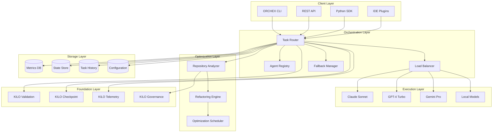
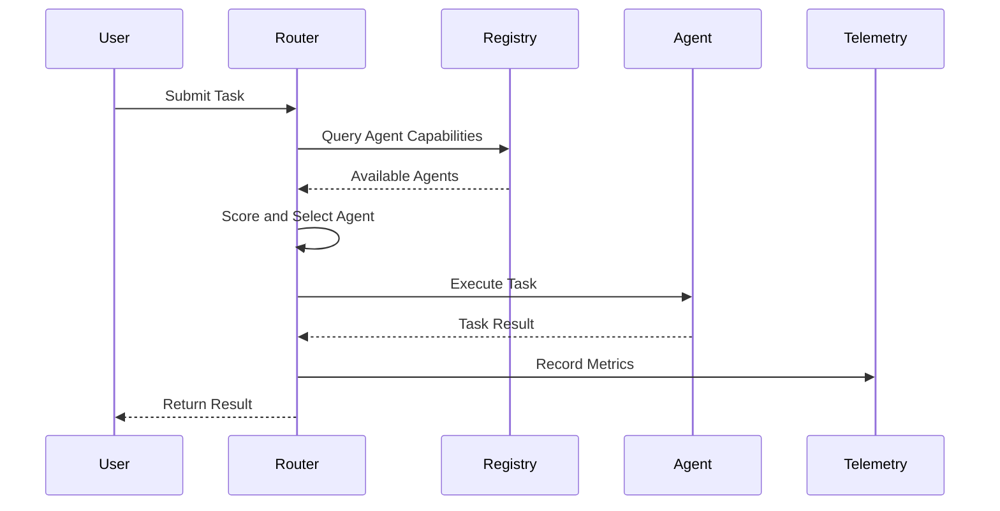
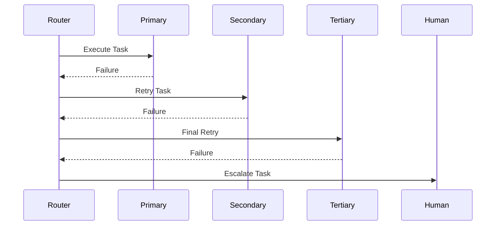
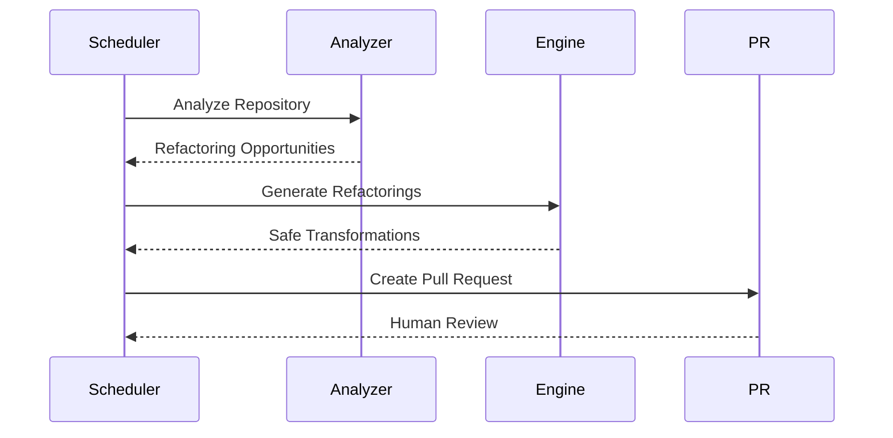

# System Architecture Overview

High-level overview of the ORCHEX system architecture, including core
components, data flow, and integration patterns.

---

## System Purpose and Goals

ORCHEX (Autonomous Technical Leadership & Adaptive System) is an
enterprise-grade multiagent LLM orchestration platform designed to:

- **🤖 Intelligent Agent Routing**: Automatically select optimal AI agents based
  on task requirements, performance history, and current load
- **🛡️ Resilient Execution**: Multi-tier fallback chains ensure task completion
  even when primary agents fail
- **🔄 Continuous Optimization**: Automated repository analysis and refactoring
  to reduce technical debt
- **📊 Enterprise Observability**: Comprehensive telemetry, metrics, and audit
  trails for governance and compliance

---

## Core Architecture Principles

### 1. Multi-Agent Orchestration

ORCHEX orchestrates multiple AI agents (Claude, GPT-4, Gemini, etc.) with
intelligent routing based on:

- Task type and complexity
- Agent capabilities and performance history
- Cost efficiency and availability
- Quality requirements and constraints

### 2. Resilience Through Fallback

Three-tier fallback system ensures reliability:

- **Primary Agent**: First-choice agent for the task
- **Secondary Agent**: Backup agent with similar capabilities
- **Tertiary Agent**: Final fallback with broader capabilities
- **Human Escalation**: Manual intervention when all automated attempts fail

### 3. Continuous Learning and Optimization

System improves over time through:

- Performance tracking and analysis
- Routing model refinement
- Automated repository optimization
- Quality metric collection and analysis

### 4. Enterprise Integration

Built on KILO foundation with:

- Governance and compliance validation
- DevOps automation integration
- Enterprise security and audit capabilities
- Multi-repository management support

---

## High-Level Architecture

---

## Component Overview

### Client Layer

**Purpose**: Provide interfaces for human users and automated systems to
interact with ORCHEX.

#### ORCHEX CLI

- Command-line interface for direct interaction
- Supports all major platforms (Linux, macOS, Windows)
- Shell completion and scripting support
- Batch processing and automation capabilities

#### REST API

- HTTP/HTTPS RESTful API for programmatic access
- JSON-based request/response format
- Authentication and authorization support
- Rate limiting and request throttling

#### SDKs

- **Python SDK**: Native Python integration for automation scripts
- **TypeScript SDK**: Type-safe integration for Node.js applications
- **Go SDK**: High-performance integration for backend services

#### IDE Plugins

- Visual Studio Code extension
- JetBrains IDE integration
- Vim/Neovim plugins
- Emacs integration

### Orchestration Layer

**Purpose**: Intelligently manage task execution across multiple agents with
resilience and optimization.

#### Task Router

- Analyzes incoming tasks and requirements
- Scores available agents based on multiple criteria
- Selects optimal agent for task execution
- Manages task lifecycle and state transitions

#### Agent Registry

- Maintains catalog of available AI agents
- Tracks agent capabilities, constraints, and health
- Stores performance history and metrics
- Provides agent discovery and selection services

#### Load Balancer

- Distributes tasks across agents to prevent overload
- Monitors agent capacity and response times
- Implements queue management for high-load scenarios
- Supports weighted distribution algorithms

#### Fallback Manager

- Implements multi-tier fallback chains
- Handles agent failures with retry logic
- Manages escalation to human intervention
- Tracks failure patterns for system improvement

### Execution Layer

**Purpose**: Interface with various AI providers and manage task execution.

#### AI Agent Adapters

- **Claude Adapter**: Integration with Anthropic's Claude models
- **GPT-4 Adapter**: Integration with OpenAI's GPT-4 models
- **Gemini Adapter**: Integration with Google's Gemini models
- **Local Model Adapter**: Support for locally-hosted models

#### Execution Management

- Task submission and monitoring
- Response parsing and validation
- Error handling and recovery
- Cost tracking and optimization

### Optimization Layer

**Purpose**: Continuously analyze and improve codebases through automated
optimization.

#### Repository Analyzer

- AST-based code parsing and analysis
- Chaos metrics calculation (complexity, duplication, coupling)
- Refactoring opportunity identification
- Impact and risk assessment

#### Refactoring Engine

- Safe code transformation generation
- Pre-flight safety validation
- Automated testing integration
- Pull request creation and management

#### Optimization Scheduler

- Configurable optimization schedules
- Batch processing of refactoring opportunities
- Progress tracking and reporting
- Rollback capabilities for failed optimizations

### Storage Layer

**Purpose**: Persist system state, metrics, and historical data for analysis and
recovery.

#### Metrics Database

- Performance metrics and KPIs
- Agent health and availability data
- Cost and usage analytics
- System performance trends

#### State Store

- Task execution state and checkpoints
- Agent registration and configuration
- System configuration and settings
- Recovery and rollback information

#### Task History

- Complete audit trail of all tasks
- Execution results and outcomes
- Failure analysis and debugging data
- Compliance and governance records

### Foundation Layer (KILO Integration)

**Purpose**: Leverage KILO's enterprise capabilities for governance, security,
and DevOps.

#### Validation Service

- Agent capability validation
- Task requirement verification
- Code quality and security checks
- Compliance rule enforcement

#### Checkpoint Service

- Task state persistence for recovery
- Transaction-like semantics for operations
- Rollback and replay capabilities
- Distributed state management

#### Telemetry Service

- Comprehensive event tracking
- Performance monitoring and alerting
- Audit logging for compliance
- Real-time metrics collection

#### Governance Service

- Policy enforcement and compliance
- Repository governance rules
- Access control and authorization
- Audit and reporting capabilities

---

## Data Flow Patterns

### Task Execution Flow

### Fallback Execution Flow

### Optimization Flow

---

## Integration Patterns

### Synchronous Integration

Direct, blocking operations for immediate results:

- Task submission and execution
- Agent health checks
- Configuration validation

### Asynchronous Integration

Non-blocking operations with callbacks or polling:

- Long-running analysis tasks
- Batch processing operations
- Background optimization runs

### Event-Driven Integration

Reactive processing based on events:

- KILO governance events triggering ORCHEX analysis
- Agent health changes affecting routing decisions
- Task completion triggering follow-up actions

### Batch Processing Integration

High-throughput processing for bulk operations:

- Repository-wide analysis
- Multiple task parallel execution
- Large-scale refactoring operations

---

## Security and Compliance

### Authentication and Authorization

- API key-based authentication
- Role-based access control (RBAC)
- JWT token support for sessions
- Integration with enterprise identity providers

### Data Protection

- End-to-end encryption for sensitive data
- Secure API key storage and rotation
- Audit logging for all operations
- Compliance with GDPR, SOC 2, and other standards

### Network Security

- TLS 1.3 encryption for all communications
- Certificate-based authentication
- IP whitelisting and rate limiting
- DDoS protection and monitoring

### Operational Security

- Container security scanning
- Dependency vulnerability monitoring
- Automated security updates
- Incident response and forensics capabilities

---

## Scalability and Performance

### Horizontal Scaling

- Stateless orchestration layer
- Distributed agent execution
- Sharded metrics and history storage
- Load-balanced API endpoints

### Performance Optimization

- Intelligent caching layers
- Asynchronous processing pipelines
- Connection pooling and reuse
- Query optimization and indexing

### Resource Management

- Dynamic agent pool sizing
- Cost-based resource allocation
- Auto-scaling based on demand
- Resource usage monitoring and alerting

---

## Deployment and Operations

### Deployment Models

#### Single-Node Deployment

- Simple installation for development
- All components on single machine
- SQLite-based storage
- Limited to low-volume usage

#### Distributed Deployment

- Multi-node orchestration layer
- Separate execution and storage tiers
- PostgreSQL/Redis for persistence
- High availability and scalability

#### Cloud-Native Deployment

- Kubernetes-native deployment
- Microservices architecture
- Cloud storage integration
- Auto-scaling and self-healing

### Monitoring and Observability

#### Metrics Collection

- System performance metrics
- Agent health and availability
- Task success rates and latency
- Cost and usage analytics

#### Logging and Tracing

- Structured logging with correlation IDs
- Distributed tracing for request flows
- Error tracking and alerting
- Audit trails for compliance

#### Alerting and Notification

- Configurable alert rules
- Multiple notification channels
- Escalation policies
- Integration with monitoring platforms

---

## Future Evolution

### Planned Enhancements

#### Advanced AI Capabilities

- Multi-modal task processing
- Custom model fine-tuning
- Agent specialization and learning
- Predictive task routing

#### Enhanced Automation

- Self-healing system capabilities
- Predictive maintenance
- Automated scaling decisions
- Intelligent resource optimization

#### Extended Integration

- Support for additional AI providers
- Deeper DevOps platform integration
- Enterprise system connectors
- API marketplace integration

### Architectural Principles for Evolution

#### Modularity

- Plugin-based architecture for extensibility
- Microservices design for independent scaling
- API-first design for integration flexibility
- Container-native deployment model

#### Resilience

- Circuit breaker patterns for fault tolerance
- Graceful degradation under load
- Automated recovery mechanisms
- Comprehensive error handling

#### Observability

- Full-stack observability capabilities
- Real-time monitoring and alerting
- Performance profiling and optimization
- Comprehensive audit and compliance logging

---

## Conclusion

ORCHEX represents a comprehensive solution for enterprise AI orchestration,
combining intelligent agent routing, resilient execution, and continuous
optimization. Built on the solid KILO foundation, it provides the reliability,
security, and governance capabilities required for production enterprise use
while maintaining the flexibility and performance needed for modern development
workflows.

The architecture is designed for scalability, maintainability, and
extensibility, ensuring that ORCHEX can evolve with the rapidly changing AI
landscape while maintaining backward compatibility and operational
stability.</instructions>
