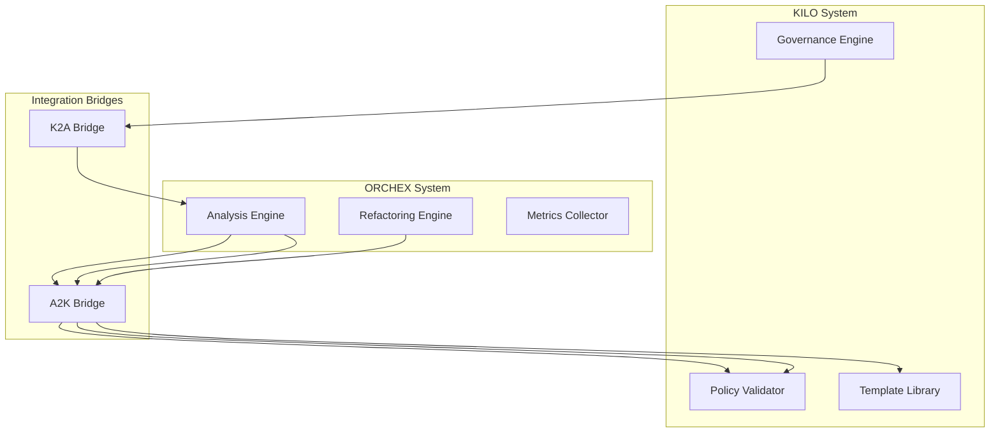

# ORCHEX-KILO Integration Documentation

## Overview

The ORCHEX-KILO integration represents a powerful convergence of two
complementary development tools: **ORCHEX** (Advanced Tool for Learning and
Analysis System) and **KILO** (Knowledge Infrastructure for Learning
Operations). This integration enables seamless collaboration between ORCHEX's
intelligent code analysis and refactoring capabilities with KILO's governance,
validation, and DevOps automation features.

### What is ORCHEX?

ORCHEX is an AI-powered code analysis and optimization platform that provides:

- Intelligent code complexity analysis
- Automated refactoring suggestions
- Repository health assessment
- Performance optimization recommendations
- Code quality metrics and insights

### What is KILO?

KILO is a comprehensive DevOps and governance platform that offers:

- Policy enforcement and compliance checking
- DevOps template management
- Infrastructure as Code (IaC) automation
- Security validation and monitoring
- Multi-repository governance

### Integration Benefits

The ORCHEX-KILO integration unlocks several key advantages:

1. **Unified Workflow**: Single command interface for both analysis and
   governance operations
2. **Automated Validation**: ORCHEX refactoring operations are automatically
   validated against KILO policies
3. **Template Integration**: Access to KILO's DevOps templates directly from
   ORCHEX operations
4. **Compliance Assurance**: Ensure all code changes meet organizational
   standards
5. **Enhanced Automation**: End-to-end automation from code analysis to
   deployment

## Architecture

The integration is built around two primary bridge components:

### K2A Bridge (KILO → ORCHEX)

Routes governance events from KILO to trigger ORCHEX analysis operations. When
KILO detects policy violations or compliance issues, it can automatically
initiate ORCHEX code analysis and optimization.

### A2K Bridge (ORCHEX → KILO)

Enables ORCHEX operations to leverage KILO's validation and template systems.
ORCHEX refactoring operations are validated against KILO policies, and ORCHEX
can access KILO's DevOps templates for infrastructure setup.



## Key Features

### Unified CLI

A single command-line interface that provides access to both ORCHEX and KILO
functionality:

```bash
# Analyze repository with governance validation
ORCHEX analyze repo /path/to/repo --governance-check

# Get DevOps templates with compliance validation
ORCHEX template get cicd/github-actions --validate
```

### Shared Configuration

Common configuration system that works across both platforms, enabling
consistent settings and policies.

### Automated Workflows

Pre-built workflow templates that combine ORCHEX analysis with KILO governance
operations.

## Quick Start

1. **Installation**: Ensure both ORCHEX and KILO are installed and configured
2. **Bridge Setup**: Initialize the integration bridges
3. **Configuration**: Set up shared configuration
4. **First Workflow**: Run an integrated analysis and validation

See the [Quick Start Guide](quick-start.md) for detailed setup instructions.

## Documentation Structure

- **[Integration Overview](overview.md)** - Detailed architecture and benefits
- **[Bridge Documentation](bridges/)** - K2A and A2K bridge specifications
- **[CLI Reference](cli/)** - Complete command reference
- **[Configuration Guide](configuration/)** - Shared configuration setup
- **[Workflow Examples](examples/)** - Common integrated workflows
- **[API Reference](api/)** - TypeScript interfaces and schemas
- **[Troubleshooting](troubleshooting.md)** - Common issues and solutions
- **[Migration Guide](migration.md)** - Transitioning from separate systems

## Requirements

- Node.js 16+
- ORCHEX CLI v1.0+
- KILO CLI v1.0+
- Valid KILO governance policies configured

## Support

For issues specific to the ORCHEX-KILO integration:

- Check the [Troubleshooting Guide](troubleshooting.md)
- Review bridge status: `ORCHEX bridge status`
- Enable debug logging: `ORCHEX --debug`

For ORCHEX or KILO specific issues, refer to their respective documentation.
