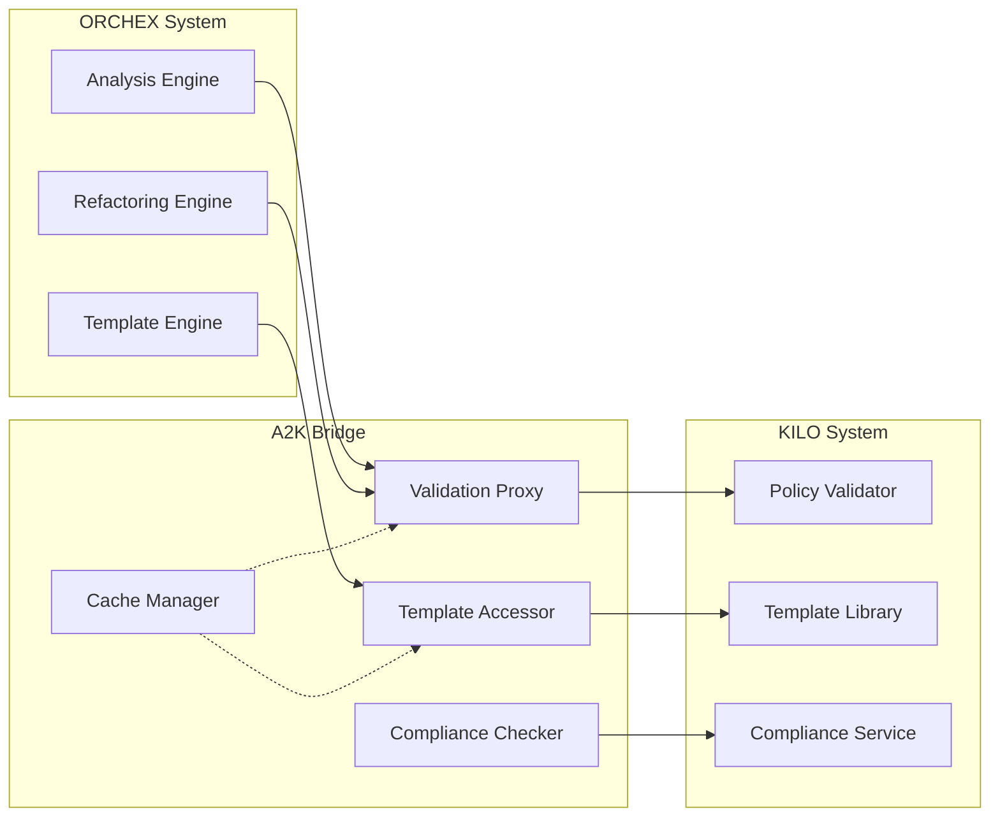

# A2K Bridge (ORCHEX → KILO Integration)

The A2K Bridge enables ORCHEX operations to leverage KILO's governance,
validation, and template services. This service-oriented bridge allows ORCHEX to
validate refactoring operations against organizational policies and access
KILO's DevOps templates.

## Overview

The A2K Bridge operates as a service bridge where ORCHEX makes synchronous and
asynchronous requests to KILO services. This ensures that ORCHEX operations
comply with organizational standards and can utilize KILO's infrastructure
automation capabilities.

## Architecture



## Core Components

### Validation Proxy

Handles validation requests from ORCHEX refactoring operations:

```typescript
class ValidationProxy {
  constructor(private config: ValidationConfig) {}

  async validateRefactoring(
    operation: RefactoringOperation,
  ): Promise<ValidationResult> {
    // Syntax validation
    const syntaxCheck = await this.validateSyntax(operation);

    // Type checking
    const typeCheck = await this.validateTypes(operation);

    // Safety validation
    const safetyCheck = this.validateSafety(operation);

    return this.aggregateResults([syntaxCheck, typeCheck, safetyCheck]);
  }
}
```

### Template Accessor

Manages access to KILO's DevOps templates:

```typescript
class TemplateAccessor {
  constructor(private config: TemplateConfig) {}

  async getTemplates(request: TemplateRequest): Promise<TemplateResponse> {
    // Check cache first
    const cached = await this.checkCache(request);
    if (cached) return cached;

    // Load from KILO
    const template = await this.loadTemplate(request);

    // Apply parameters
    const processed = this.applyParameters(template, request.parameters);

    // Cache result
    await this.updateCache(request, processed);

    return processed;
  }
}
```

### Compliance Checker

Validates code against organizational policies:

```typescript
class ComplianceChecker {
  constructor(private config: ComplianceConfig) {}

  async checkCompliance(check: ComplianceCheck): Promise<ComplianceResult> {
    const violations: ComplianceViolation[] = [];

    for (const policy of this.config.enabledPolicies) {
      const policyViolations = await this.checkPolicy(check, policy);
      violations.push(...policyViolations);
    }

    return {
      isCompliant: violations.every((v) => v.severity !== 'critical'),
      violations,
      recommendations: this.generateRecommendations(violations),
    };
  }
}
```

## Core Interfaces

### RefactoringOperation

Represents a code refactoring operation from ORCHEX:

```typescript
interface RefactoringOperation {
  id: string;
  type: RefactoringType;
  filePath: string;
  changes: CodeChange[];
  metadata: {
    riskLevel: 'low' | 'medium' | 'high';
    estimatedImpact: number;
    requiresValidation: boolean;
  };
}

type RefactoringType =
  | 'extract_function'
  | 'rename_variable'
  | 'simplify_conditional'
  | 'remove_duplication'
  | 'reduce_complexity'
  | 'improve_naming'
  | 'add_type_hints'
  | 'extract_constant';

interface CodeChange {
  type: 'add' | 'remove' | 'modify';
  startLine: number;
  endLine: number;
  content: string;
  originalContent?: string;
}
```

### ValidationResult

Result of validation operations:

```typescript
interface ValidationResult {
  isValid: boolean;
  errors: string[];
  warnings: string[];
  rollbackRequired: boolean;
  validationMetadata: {
    validatorVersion: string;
    validationTime: number;
    checksPerformed: string[];
  };
}
```

### TemplateRequest & TemplateResponse

Interfaces for template operations:

```typescript
interface TemplateRequest {
  category: 'cicd' | 'db' | 'iac' | 'k8s' | 'logging' | 'monitoring' | 'ui';
  name: string;
  version?: string;
  parameters: Record<string, any>;
}

interface TemplateResponse {
  templateId: string;
  files: TemplateFile[];
  metadata: {
    category: string;
    name: string;
    version: string;
    description: string;
    dependencies: string[];
  };
}

interface TemplateFile {
  path: string;
  content: string;
  placeholders: string[];
}
```

### ComplianceCheck & ComplianceResult

Interfaces for compliance validation:

```typescript
interface ComplianceCheck {
  code: string;
  language: string;
  context: {
    repository: string;
    filePath: string;
    framework?: string;
  };
  policies: string[];
}

interface ComplianceResult {
  isCompliant: boolean;
  violations: ComplianceViolation[];
  recommendations: string[];
  metadata: {
    checkedPolicies: string[];
    complianceScore: number;
    checkTime: number;
  };
}

interface ComplianceViolation {
  policy: string;
  severity: 'low' | 'medium' | 'high' | 'critical';
  message: string;
  location?: {
    line: number;
    column: number;
  };
  suggestion: string;
}
```

## Configuration

### Bridge Configuration

```typescript
interface A2KBridgeConfig {
  validation: {
    strictness: 'lenient' | 'standard' | 'strict';
    timeoutMs: number;
    enableRollback: boolean;
  };
  templates: {
    cacheEnabled: boolean;
    cacheTtlMs: number;
    basePath: string;
  };
  compliance: {
    enabledPolicies: string[];
    failOnWarning: boolean;
  };
}
```

### Example Configuration

```json
{
  "a2kBridge": {
    "validation": {
      "strictness": "standard",
      "timeoutMs": 30000,
      "enableRollback": true
    },
    "templates": {
      "cacheEnabled": true,
      "cacheTtlMs": 3600000,
      "basePath": "./templates/devops"
    },
    "compliance": {
      "enabledPolicies": ["security", "code_quality", "performance"],
      "failOnWarning": false
    }
  }
}
```

## Usage Examples

### Refactoring Validation

```typescript
import { AtlasKiloBridge, RefactoringOperation } from '@ORCHEX/integrations';

const bridge = new AtlasKiloBridge();

const operation: RefactoringOperation = {
  id: 'extract-method-123',
  type: 'extract_function',
  filePath: './src/utils.ts',
  changes: [
    {
      type: 'add',
      startLine: 10,
      endLine: 15,
      content:
        'function calculateTotal(items) {\n  return items.reduce((sum, item) => sum + item.price, 0);\n}',
    },
  ],
  metadata: {
    riskLevel: 'low',
    estimatedImpact: 5,
    requiresValidation: true,
  },
};

const result = await bridge.validateRefactoring(operation);
if (result.isValid) {
  console.log('Refactoring approved');
  // Proceed with the refactoring
} else {
  console.log('Validation failed:', result.errors);
  if (result.rollbackRequired) {
    // Rollback changes
  }
}
```

### Template Access

```typescript
// Request a CI/CD template
const templateRequest: TemplateRequest = {
  category: 'cicd',
  name: 'github-actions',
  version: 'latest',
  parameters: {
    nodeVersion: '18',
    testCommand: 'npm test',
    buildCommand: 'npm run build',
  },
};

const template = await bridge.getTemplates(templateRequest);

// Use the template files
for (const file of template.files) {
  console.log(`Creating ${file.path}`);
  // Write file.content to file.path
}
```

### Compliance Checking

```typescript
const complianceCheck: ComplianceCheck = {
  code: `
    function authenticateUser(username, password) {
      const query = "SELECT * FROM users WHERE username = '" + username + "' AND password = '" + password + "'";
      return database.query(query);
    }
  `,
  language: 'javascript',
  context: {
    repository: 'my-app',
    filePath: 'src/auth.js',
    framework: 'express',
  },
  policies: ['security', 'code_quality'],
};

const result = await bridge.checkCompliance(complianceCheck);
if (!result.isCompliant) {
  console.log('Compliance violations found:');
  result.violations.forEach((violation) => {
    console.log(`- ${violation.severity}: ${violation.message}`);
    console.log(`  Suggestion: ${violation.suggestion}`);
  });
}
```

## Policy Types

### Security Policies

Checks for common security vulnerabilities:

- **Hardcoded Secrets**: Detects API keys, passwords, tokens in code
- **SQL Injection**: Identifies vulnerable string concatenation in queries
- **XSS Vulnerabilities**: Checks for unsafe HTML rendering
- **CSRF Protection**: Validates CSRF token implementation

### Code Quality Policies

Enforces coding standards:

- **TODO/FIXME Comments**: Flags incomplete code
- **Console Logging**: Detects debug statements in production code
- **Unused Variables**: Identifies dead code
- **Naming Conventions**: Checks variable and function naming

### Performance Policies

Optimizes for performance:

- **Nested Loops**: Detects potential O(n²) complexity
- **Memory Leaks**: Identifies potential memory issues
- **Inefficient Algorithms**: Flags suboptimal implementations

### Maintainability Policies

Ensures long-term code health:

- **Function Length**: Checks for overly complex functions
- **Cyclomatic Complexity**: Measures decision complexity
- **Code Duplication**: Identifies repeated code patterns

## Error Handling

### Validation Errors

```typescript
class ValidationError extends A2KBridgeError {
  constructor(
    message: string,
    public operation: RefactoringOperation,
  ) {
    super(message, 'VALIDATION_FAILED', 'validation');
  }
}

// Usage
try {
  await bridge.validateRefactoring(operation);
} catch (error) {
  if (error instanceof ValidationError) {
    console.log(`Validation failed for operation ${error.operation.id}`);
    // Handle validation-specific error
  }
}
```

### Template Errors

```typescript
class TemplateError extends A2KBridgeError {
  constructor(
    message: string,
    public request: TemplateRequest,
  ) {
    super(message, 'TEMPLATE_ERROR', 'templates');
  }
}
```

### Compliance Errors

```typescript
class ComplianceError extends A2KBridgeError {
  constructor(
    message: string,
    public check: ComplianceCheck,
  ) {
    super(message, 'COMPLIANCE_ERROR', 'compliance');
  }
}
```

## Caching Strategy

### Template Caching

Templates are cached to improve performance:

```typescript
interface CacheEntry {
  data: TemplateResponse;
  timestamp: number;
  ttl: number;
}

class TemplateCache {
  private cache = new Map<string, CacheEntry>();

  get(key: string): TemplateResponse | null {
    const entry = this.cache.get(key);
    if (!entry) return null;

    if (Date.now() - entry.timestamp > entry.ttl) {
      this.cache.delete(key);
      return null;
    }

    return entry.data;
  }

  set(key: string, data: TemplateResponse, ttl: number): void {
    this.cache.set(key, {
      data,
      timestamp: Date.now(),
      ttl,
    });
  }
}
```

### Validation Result Caching

Frequently validated patterns are cached to reduce processing time.

## Performance Optimization

### Batch Operations

Multiple operations can be batched for efficiency:

```typescript
async validateBatch(operations: RefactoringOperation[]): Promise<ValidationResult[]> {
  // Group by risk level
  const byRisk = operations.reduce((acc, op) => {
    acc[op.metadata.riskLevel] = acc[op.metadata.riskLevel] || [];
    acc[op.metadata.riskLevel].push(op);
    return acc;
  }, {} as Record<string, RefactoringOperation[]>);

  const results: ValidationResult[] = [];

  // Process high-risk operations first
  if (byRisk.high) {
    results.push(...await this.validateOperations(byRisk.high));
  }

  // Process medium-risk operations
  if (byRisk.medium) {
    results.push(...await this.validateOperations(byRisk.medium));
  }

  // Process low-risk operations
  if (byRisk.low) {
    results.push(...await this.validateOperations(byRisk.low));
  }

  return results;
}
```

### Connection Pooling

Maintains persistent connections to KILO services to reduce latency.

## Monitoring and Metrics

### Key Metrics

- Validation request rate
- Template request rate
- Compliance check rate
- Average response times
- Error rates by operation type
- Cache hit/miss ratios

### Health Checks

```typescript
interface BridgeHealth {
  status: 'healthy' | 'degraded' | 'unhealthy';
  components: {
    validation: ComponentStatus;
    templates: ComponentStatus;
    compliance: ComponentStatus;
  };
  metrics: BridgeMetrics;
}

const health = await bridge.getHealthStatus();
if (health.status !== 'healthy') {
  // Alert administrators
}
```

## Security Considerations

### Request Validation

All requests are validated for:

- Schema compliance
- Parameter sanitization
- Authentication tokens
- Rate limiting

### Data Protection

- Sensitive validation results are encrypted
- Template parameters are sanitized
- Audit logs track all operations

## Integration Patterns

### Synchronous Validation

For immediate feedback during refactoring:

```typescript
// In ORCHEX refactoring workflow
async function applyRefactoring(operation: RefactoringOperation) {
  // Pre-validation
  const validation = await bridge.validateRefactoring(operation);
  if (!validation.isValid) {
    throw new Error(`Validation failed: ${validation.errors.join(', ')}`);
  }

  // Apply changes
  await applyChanges(operation.changes);

  // Post-validation
  const postValidation = await bridge.validateRefactoring(operation);
  if (!postValidation.isValid && postValidation.rollbackRequired) {
    await rollbackChanges(operation.changes);
  }
}
```

### Asynchronous Template Generation

For background template processing:

```typescript
async function generateInfrastructure(templateRequest: TemplateRequest) {
  // Start async generation
  const generationPromise = bridge.getTemplates(templateRequest);

  // Continue with other work
  await setupEnvironment();

  // Wait for template
  const template = await generationPromise;

  // Apply template
  await applyTemplate(template);
}
```

## Troubleshooting

### Common Issues

**Validation Timeouts**

- Increase timeout in configuration
- Check KILO service availability
- Review operation complexity

**Template Not Found**

- Verify template name and category
- Check KILO template library
- Update bridge configuration

**Compliance Check Failures**

- Review enabled policies
- Check code context information
- Validate policy configurations

### Debug Mode

Enable detailed logging:

```typescript
const bridge = new AtlasKiloBridge({
  debug: true,
  logLevel: 'debug',
});
```

## Future Enhancements

### Planned Features

- **Advanced Validation Rules**: Custom validation logic
- **Template Composition**: Combine multiple templates
- **Real-time Validation**: Streaming validation results
- **Machine Learning**: Predictive compliance scoring
- **Plugin Architecture**: Extensible validation engines
