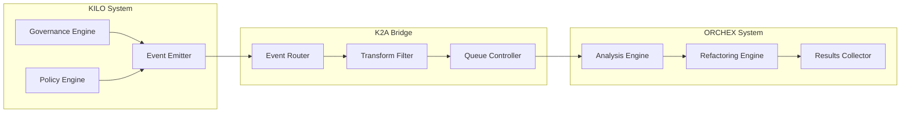

# K2A Bridge (KILO → ORCHEX Integration)

The K2A Bridge enables KILO governance operations to trigger ORCHEX analysis and
optimization workflows. This event-driven bridge allows KILO to leverage
ORCHEX's intelligent code analysis capabilities when governance events occur.

## Overview

The K2A Bridge operates as an event-driven system where KILO governance events
are automatically routed to ORCHEX for analysis and potential remediation. This
creates a proactive development workflow where policy violations and compliance
issues trigger intelligent code improvements.

## Architecture



## Core Interfaces

### GovernanceEvent

Represents events generated by the KILO governance system:

```typescript
enum GovernanceEventType {
  POLICY_VIOLATION = 'policy_violation',
  COMPLIANCE_FAILURE = 'compliance_failure',
  STRUCTURE_VIOLATION = 'structure_violation',
  SECURITY_ISSUE = 'security_issue',
  DEPENDENCY_RISK = 'dependency_risk',
}

interface GovernanceEvent {
  id: string;
  type: GovernanceEventType;
  repository: string;
  organization: string;
  timestamp: Date;
  severity: 'low' | 'medium' | 'high' | 'critical';
  details?: {
    filePath?: string;
    lineNumber?: number;
    policy?: string;
    description?: string;
  };
}
```

### K2ABridge Interface

The main interface for K2A bridge implementations:

```typescript
interface K2ABridge {
  onGovernanceEvent(event: GovernanceEvent): Promise<void>;
  getBridgeStatus(): BridgeStatus;
  configure(config: K2ABridgeConfig): void;
}

interface BridgeStatus {
  isActive: boolean;
  version: string;
  eventCount: number;
  lastEventTime?: Date;
  errorCount: number;
}
```

## Usage Examples

### Basic Event Handling

```typescript
import { KiloAtlasBridge, GovernanceEvent } from '@ORCHEX/integrations';

const bridge = new KiloAtlasBridge();

// Handle a policy violation event
const event: GovernanceEvent = {
  id: 'violation-123',
  type: 'policy_violation',
  repository: 'my-project',
  organization: 'my-org',
  timestamp: new Date(),
  severity: 'high',
  details: {
    filePath: 'src/security.ts',
    policy: 'no-hardcoded-secrets',
    description: 'Hardcoded API key detected',
  },
};

await bridge.onGovernanceEvent(event);
```

### Bridge Status Monitoring

```typescript
// Check bridge health
const status = bridge.getBridgeStatus();
console.log(`Bridge active: ${status.isActive}`);
console.log(`Events processed: ${status.eventCount}`);
console.log(`Last event: ${status.lastEventTime}`);
```

## Configuration

### Bridge Configuration

```typescript
interface K2ABridgeConfig {
  enabled: boolean;
  eventTypes: GovernanceEventType[];
  analysis: {
    autoTrigger: boolean;
    priorityMapping: {
      low: 'background';
      medium: 'normal';
      high: 'high';
      critical: 'immediate';
    };
  };
  filtering: {
    repositoryFilter?: string[];
    organizationFilter?: string[];
    severityThreshold: 'low' | 'medium' | 'high' | 'critical';
  };
  retry: {
    maxAttempts: number;
    backoffMs: number;
  };
}
```

### Example Configuration

```json
{
  "k2aBridge": {
    "enabled": true,
    "eventTypes": ["policy_violation", "security_issue", "compliance_failure"],
    "analysis": {
      "autoTrigger": true,
      "priorityMapping": {
        "low": "background",
        "medium": "normal",
        "high": "high",
        "critical": "immediate"
      }
    },
    "filtering": {
      "severityThreshold": "medium",
      "repositoryFilter": ["important-repo-*"]
    },
    "retry": {
      "maxAttempts": 3,
      "backoffMs": 1000
    }
  }
}
```

## Event Processing Flow

### 1. Event Reception

The bridge receives governance events from KILO through the `onGovernanceEvent`
method.

### 2. Event Filtering

Events are filtered based on configuration:

- Event type inclusion
- Repository/organization filters
- Severity threshold

### 3. Event Transformation

Events are transformed into ORCHEX analysis requests:

- Map governance data to analysis parameters
- Set appropriate priority levels
- Add context information

### 4. Analysis Triggering

ORCHEX analysis is triggered based on the event:

- Security issues → Security analysis
- Policy violations → Code quality analysis
- Compliance failures → Comprehensive audit

### 5. Result Processing

Analysis results are processed and may trigger:

- Automated refactoring suggestions
- Notification to development teams
- Integration with CI/CD pipelines

## Event Types and Analysis Mapping

| Governance Event Type | Triggered ORCHEX Analysis   | Priority |
| --------------------- | --------------------------- | -------- |
| `policy_violation`    | Code quality analysis       | Medium   |
| `compliance_failure`  | Security & compliance audit | High     |
| `structure_violation` | Architecture analysis       | Medium   |
| `security_issue`      | Security vulnerability scan | Critical |
| `dependency_risk`     | Dependency analysis         | High     |

## Error Handling

### Transient Failures

- Network timeouts
- Service unavailability
- Temporary ORCHEX overload

**Recovery Strategy**: Exponential backoff retry with configurable maximum
attempts.

### Permanent Failures

- Invalid event data
- Unsupported event types
- Configuration errors

**Recovery Strategy**: Log error, notify administrators, continue processing
other events.

### Circuit Breaker Pattern

The bridge implements a circuit breaker to prevent cascade failures:

```typescript
class CircuitBreaker {
  private failureCount = 0;
  private lastFailureTime?: Date;
  private state: 'closed' | 'open' | 'half-open' = 'closed';

  async execute<T>(operation: () => Promise<T>): Promise<T> {
    if (this.state === 'open') {
      if (this.shouldAttemptReset()) {
        this.state = 'half-open';
      } else {
        throw new Error('Circuit breaker is open');
      }
    }

    try {
      const result = await operation();
      this.onSuccess();
      return result;
    } catch (error) {
      this.onFailure();
      throw error;
    }
  }
}
```

## Monitoring and Metrics

### Key Metrics

- Events received per minute
- Events processed successfully
- Average processing time
- Error rate by event type
- Bridge availability percentage

### Health Checks

- Bridge connectivity to ORCHEX
- Event queue depth
- Memory usage
- Thread pool utilization

## Security Considerations

### Event Validation

All incoming events are validated for:

- Schema compliance
- Authentication tokens
- Origin verification
- Data integrity

### Access Control

- Bridge operations require proper authentication
- Event routing respects repository permissions
- Analysis results are scoped to authorized users

## Performance Optimization

### Event Batching

Multiple events can be batched for efficient processing:

```typescript
async processBatch(events: GovernanceEvent[]): Promise<void> {
  // Group events by repository
  const byRepo = groupBy(events, 'repository');

  // Process each repository batch
  for (const [repo, repoEvents] of Object.entries(byRepo)) {
    await this.processRepositoryBatch(repo, repoEvents);
  }
}
```

### Caching

Frequently accessed analysis results and configurations are cached to reduce
latency.

### Async Processing

Non-critical analysis operations are processed asynchronously to maintain
responsiveness.

## Integration Examples

### CI/CD Pipeline Integration

```yaml
# .github/workflows/governance-analysis.yml
name: Governance-Driven Analysis
on:
  repository_dispatch:
    types: [governance-event]

jobs:
  analyze:
    runs-on: ubuntu-latest
    steps:
      - uses: actions/checkout@v3
      - name: Run ORCHEX Analysis
        run: ORCHEX analyze repo . --governance-event --format json
      - name: Process Results
        run: ./scripts/process-analysis-results.sh
```

### Real-time Dashboard Integration

```typescript
// Dashboard component for bridge monitoring
class BridgeDashboard extends React.Component {
  state = {
    status: null,
    events: [],
  };

  componentDidMount() {
    this.loadBridgeStatus();
    this.subscribeToEvents();
  }

  async loadBridgeStatus() {
    const status = await bridge.getBridgeStatus();
    this.setState({ status });
  }

  subscribeToEvents() {
    // WebSocket or Server-Sent Events subscription
    eventSource.onmessage = (event) => {
      const newEvent = JSON.parse(event.data);
      this.setState((prevState) => ({
        events: [newEvent, ...prevState.events.slice(0, 99)],
      }));
    };
  }
}
```

## Troubleshooting

### Common Issues

**Events Not Being Processed**

- Check bridge configuration
- Verify ORCHEX service availability
- Review event filtering rules

**High Latency**

- Monitor queue depth
- Check network connectivity
- Review batch processing settings

**Authentication Failures**

- Validate API keys
- Check token expiration
- Review access permissions

### Debug Mode

Enable debug logging for detailed event processing information:

```bash
export K2A_DEBUG=true
ORCHEX bridge k2a --debug
```

## Future Enhancements

### Planned Features

- **Machine Learning Analysis**: AI-powered event prioritization
- **Predictive Analysis**: Proactive issue detection
- **Custom Event Types**: User-defined governance events
- **Advanced Filtering**: Complex rule-based event routing
- **Real-time Streaming**: WebSocket-based event streaming
