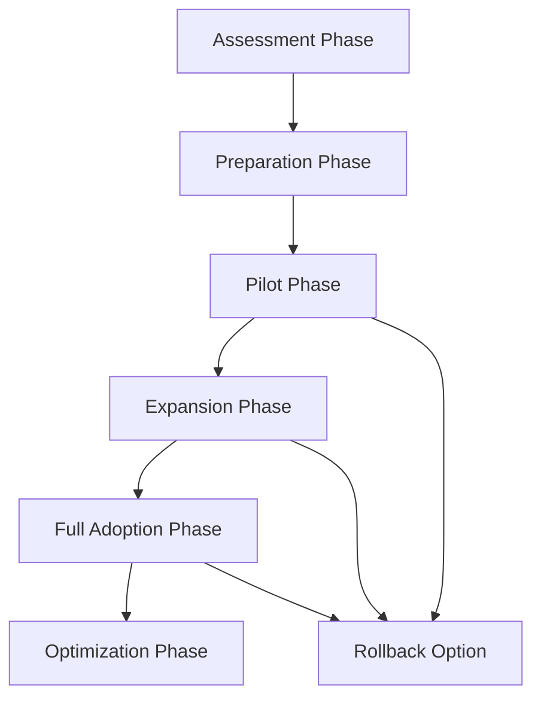

# ORCHEX-KILO Integration Migration Playbook

## Overview

This playbook provides detailed, step-by-step instructions for migrating from
separate ORCHEX and KILO systems to the integrated ORCHEX-KILO workflow. Each
phase includes prerequisites, detailed procedures, validation steps, and
rollback procedures.

## Migration Phases Overview



## Phase 1: Preparation (1-2 weeks)

### Prerequisites

- Completed assessment phase
- Stakeholder approval for migration
- Dedicated migration team assigned
- Test environment available

### Step 1.1: Infrastructure Setup

**Objective**: Set up the technical foundation for integration

**Procedure**:

```bash
# 1. Install integration packages
echo "Installing ORCHEX-KILO integration packages..."
npm install -g @ORCHEX/cli @kilo/cli @ORCHEX/integrations @kilo/bridge

# 2. Verify installations
ORCHEX --version
kilo --version

# 3. Test basic connectivity
ORCHEX bridge test --basic
```

**Validation**:

- All packages install successfully
- CLI commands respond correctly
- Basic bridge test passes

**Rollback**: Uninstall packages if needed

```bash
npm uninstall -g @ORCHEX/integrations @kilo/bridge
```

### Step 1.2: Configuration Backup

**Objective**: Preserve current configurations for rollback

**Procedure**:

```bash
# Create backup directory
BACKUP_DIR="./migration-backup-$(date +%Y%m%d-%H%M%S)"
mkdir -p "$BACKUP_DIR"

# Backup ORCHEX configuration
if [ -f "ORCHEX.config.json" ]; then
    cp ORCHEX.config.json "$BACKUP_DIR/ORCHEX.config.backup.json"
    echo "ORCHEX config backed up"
fi

# Backup KILO configuration
if [ -f "kilo.config.json" ]; then
    cp kilo.config.json "$BACKUP_DIR/kilo.config.backup.json"
    echo "KILO config backed up"
fi

# Backup CI/CD configurations
find . -name "*.yml" -o -name "*.yaml" | xargs cp --parents -t "$BACKUP_DIR/cicd-backup/"

echo "Configuration backup complete: $BACKUP_DIR"
```

**Validation**:

- Backup directory contains all expected files
- Original files remain unchanged
- Backup files are readable

### Step 1.3: Integration Configuration

**Objective**: Create integrated configuration file

**Procedure**:

```bash
# Generate integrated configuration
cat > ORCHEX-kilo.config.json << EOF
{
  "integration": {
    "enabled": true,
    "version": "1.0",
    "bridges": {
      "k2a": {
        "enabled": true,
        "eventTypes": ["policy_violation", "security_issue"],
        "analysis": {
          "autoTrigger": true,
          "timeout": 300000
        }
      },
      "a2k": {
        "enabled": true,
        "validation": {
          "strictness": "standard",
          "timeout": 60000
        },
        "templates": {
          "cacheEnabled": true,
          "basePath": "./templates"
        }
      }
    },
    "endpoints": {
      "kilo": {
        "api": "${KILO_API_ENDPOINT:-https://kilo-api.company.com}",
        "apiKey": "${KILO_API_KEY}"
      }
    }
  }
}
EOF

# Validate configuration
ORCHEX config validate ORCHEX-kilo.config.json
```

**Validation**:

- Configuration file created successfully
- Validation passes without errors
- Sensitive data properly secured

## Phase 2: Pilot Migration (2-4 weeks)

### Prerequisites

- Preparation phase complete
- Pilot project selected
- Test environment ready
- Migration team trained

### Step 2.1: Pilot Project Setup

**Objective**: Configure integration for pilot project

**Procedure**:

```bash
# Navigate to pilot project
cd /path/to/pilot-project

# Enable integration locally
ORCHEX config set integration.enabled true --local

# Configure bridge endpoints
ORCHEX config set kilo.endpoint "${KILO_ENDPOINT}" --local
ORCHEX config set kilo.apiKey "${KILO_API_KEY}" --local

# Test connectivity
ORCHEX bridge test
```

**Validation**:

- Bridge test successful
- No connectivity errors
- Configuration applied locally

### Step 2.2: CI/CD Pipeline Migration

**Objective**: Update CI/CD to use integrated workflow

**Before (Separate Systems)**:

```yaml
# .github/workflows/separate-systems.yml
name: Quality Checks
on: [push, pull_request]

jobs:
  ORCHEX:
    runs-on: ubuntu-latest
    steps:
      - uses: actions/checkout@v3
      - run: ORCHEX analyze repo . --format json > ORCHEX-results.json

  kilo:
    runs-on: ubuntu-latest
    steps:
      - uses: actions/checkout@v3
      - run: kilo compliance check . --format json > kilo-results.json
```

**After (Integrated System)**:

```yaml
# .github/workflows/integrated-quality.yml
name: Integrated Quality Checks
on: [push, pull_request]

jobs:
  integrated-analysis:
    runs-on: ubuntu-latest
    steps:
      - uses: actions/checkout@v3

      - name: Setup Integration
        run: |
          npm install -g @ORCHEX/cli @kilo/cli
          ORCHEX config set kilo.endpoint ${{ secrets.KILO_ENDPOINT }}
          ORCHEX config set kilo.apiKey ${{ secrets.KILO_API_KEY }}

      - name: Integrated Analysis
        run:
          ORCHEX analyze repo . --governance-check --format json > analysis.json

      - name: Quality Gate
        run: |
          COMPLIANCE=$(jq '.complianceScore' analysis.json)
          if [ "$COMPLIANCE" -lt 7 ]; then
            echo "Quality gate failed: Score $COMPLIANCE < 7"
            exit 1
          fi
```

**Procedure**:

```bash
# Backup existing workflow
cp .github/workflows/quality-checks.yml .github/workflows/quality-checks.backup.yml

# Create new integrated workflow
cp /path/to/migration/playbook/integrated-workflow.yml .github/workflows/integrated-quality.yml

# Test workflow locally (if possible)
ORCHEX workflow validate .github/workflows/integrated-quality.yml
```

**Validation**:

- Workflow file created
- Validation passes
- Required secrets configured

### Step 2.3: Development Workflow Testing

**Objective**: Test integrated development workflow

**Procedure**:

```bash
# Test integrated analysis
ORCHEX analyze repo . --governance-check --format summary

# Test template access
ORCHEX template list cicd

# Test compliance checking
ORCHEX compliance check . --format detailed

# Generate test report
ORCHEX compliance report --output pilot-report.html --format html
```

**Validation**:

- All commands execute successfully
- Results are meaningful and accurate
- No integration errors

### Step 2.4: Pilot Evaluation

**Objective**: Assess pilot success and gather feedback

**Procedure**:

```bash
# Collect metrics
echo "Pilot Metrics:" > pilot-metrics.txt
echo "- Build time: $(measure build time)" >> pilot-metrics.txt
echo "- Compliance score: $(ORCHEX compliance check . --format json | jq '.score')" >> pilot-metrics.txt
echo "- Error rate: $(check error logs)" >> pilot-metrics.txt

# Gather team feedback
echo "Team Feedback:" > pilot-feedback.txt
echo "- Ease of use: " >> pilot-feedback.txt
echo "- Performance impact: " >> pilot-feedback.txt
echo "- Workflow improvement: " >> pilot-feedback.txt

# Document lessons learned
echo "Lessons Learned:" > pilot-lessons.txt
```

**Validation**:

- Metrics collected
- Feedback gathered from all team members
- Go/no-go decision documented

## Phase 3: Expansion Phase (4-8 weeks)

### Prerequisites

- Pilot phase successful
- Stakeholder approval for expansion
- Additional resources allocated
- Training materials updated

### Step 3.1: Team Training

**Objective**: Train additional teams on integrated workflow

**Procedure**:

```bash
# Prepare training materials
cp -r /path/to/migration/training/* ./training-materials/

# Schedule training sessions
echo "Training Schedule:" > training-schedule.txt
echo "- Team A: $(date -d '+1 week')" >> training-schedule.txt
echo "- Team B: $(date -d '+2 weeks')" >> training-schedule.txt

# Create quick reference guide
cat > integrated-workflow-cheatsheet.md << EOF
# ORCHEX-KILO Integration Cheat Sheet

## Common Commands
- Analyze with governance: \`ORCHEX analyze repo . --governance-check\`
- Get templates: \`ORCHEX template get cicd/github-actions\`
- Check compliance: \`ORCHEX compliance check .\`

## Workflow
1. Develop code
2. Run integrated analysis
3. Fix issues
4. Commit with confidence
EOF
```

### Step 3.2: Repository Migration

**Objective**: Migrate additional repositories

**Procedure**:

```bash
# Create migration script for multiple repos
cat > migrate-repository.sh << 'EOF'
#!/bin/bash
REPO_PATH="$1"

if [ -z "$REPO_PATH" ]; then
    echo "Usage: $0 <repository-path>"
    exit 1
fi

cd "$REPO_PATH" || exit 1

# Backup configurations
mkdir -p migration-backup
cp ORCHEX.config.json migration-backup/ 2>/dev/null || true
cp kilo.config.json migration-backup/ 2>/dev/null || true

# Apply integrated configuration
cp /path/to/integrated-config.json ORCHEX-kilo.config.json
ORCHEX config apply ORCHEX-kilo.config.json

# Update CI/CD if present
if [ -d ".github/workflows" ]; then
    # Update existing workflows or create new ones
    cp /path/to/integrated-workflow.yml .github/workflows/
fi

echo "Repository $REPO_PATH migrated successfully"
EOF

chmod +x migrate-repository.sh

# Migrate repositories
./migrate-repository.sh /path/to/repo1
./migrate-repository.sh /path/to/repo2
```

### Step 3.3: Monitoring Setup

**Objective**: Set up monitoring for integrated system

**Procedure**:

```bash
# Configure monitoring
ORCHEX config set monitoring.enabled true
ORCHEX config set monitoring.alerts.governance.enabled true
ORCHEX config set monitoring.alerts.performance.enabled true

# Set up dashboards
ORCHEX template get dashboard/governance --apply
ORCHEX template get monitoring/grafana --apply

# Configure alerts
ORCHEX config set monitoring.alerts.governance.threshold 7.0
ORCHEX config set monitoring.alerts.governance.channels '["email", "slack"]'
```

## Phase 4: Full Adoption Phase (8-12 weeks)

### Prerequisites

- Expansion phase 80% complete
- All critical repositories migrated
- Team training complete
- Monitoring operational

### Step 4.1: Legacy System Decommissioning

**Objective**: Safely decommission separate systems

**Procedure**:

```bash
# Gradual decommissioning plan
cat > decommissioning-plan.md << EOF
# Legacy System Decommissioning Plan

## Phase 1: Parallel Operation (Weeks 1-2)
- Maintain both systems
- Monitor integrated system performance
- Compare results between systems

## Phase 2: Integrated Primary (Weeks 3-4)
- Use integrated system as primary
- Legacy system as backup
- Update documentation

## Phase 3: Legacy Removal (Week 5)
- Remove legacy configurations
- Update all references
- Archive legacy data

## Rollback Plan
- Restore from backups if issues arise
- Maintain legacy system access for 30 days
EOF

# Archive legacy configurations
mkdir -p legacy-archive
mv ORCHEX-legacy.config.json legacy-archive/ 2>/dev/null || true
mv kilo-legacy.config.json legacy-archive/ 2>/dev/null || true
```

### Step 4.2: Documentation Updates

**Objective**: Update all project documentation

**Procedure**:

```bash
# Update README files
find . -name "README.md" | while read file; do
    if ! grep -q "ORCHEX-KILO Integration" "$file"; then
        echo -e "\n## ORCHEX-KILO Integration\n\nThis project uses integrated ORCHEX-KILO workflows for code analysis and governance.\n" >> "$file"
    fi
done

# Update contributing guides
find . -name "CONTRIBUTING.md" | while read file; do
    sed -i 's/separate ORCHEX and KILO checks/integrated ORCHEX-KILO analysis/g' "$file"
done

# Update CI/CD documentation
echo "Updated CI/CD documentation to reference integrated workflows"
```

## Phase 5: Optimization Phase (Ongoing)

### Step 5.1: Performance Tuning

**Objective**: Optimize integrated system performance

**Procedure**:

```bash
# Enable caching
ORCHEX config set bridges.a2k.templates.cacheEnabled true
ORCHEX config set bridges.a2k.validation.cacheEnabled true

# Optimize connection pooling
ORCHEX config set bridges.a2k.connection.poolSize 10

# Configure batch processing
ORCHEX config set bridges.a2k.validation.batchSize 5

# Monitor performance
ORCHEX monitor performance --output performance-report.json
```

### Step 5.2: Custom Workflow Development

**Objective**: Create organization-specific workflows

**Procedure**:

```bash
# Create custom workflow template
cat > custom-workflow.json << EOF
{
  "name": "company-development-workflow",
  "description": "Custom development workflow with company-specific checks",
  "steps": [
    {
      "name": "code-analysis",
      "command": "ORCHEX analyze repo . --depth medium --format json",
      "required": true
    },
    {
      "name": "security-check",
      "command": "ORCHEX compliance check . --policies security --strict",
      "required": true
    },
    {
      "name": "company-standards",
      "command": "ORCHEX compliance check . --policies company-standards",
      "required": true
    }
  ],
  "triggers": {
    "pre-commit": true,
    "pre-push": true,
    "manual": true
  }
}
EOF

# Register custom workflow
ORCHEX workflow create custom-workflow.json
```

## Validation and Testing

### Automated Validation Script

```bash
#!/bin/bash
# validate-migration.sh
# Comprehensive validation of migration status

echo "=== Migration Validation ==="

# Check integration status
echo "Integration Status:"
ORCHEX bridge status --json | jq '.status'

# Validate configurations
echo -e "\nConfiguration Validation:"
ORCHEX config validate

# Test key workflows
echo -e "\nWorkflow Testing:"
ORCHEX analyze repo . --governance-check --dry-run
ORCHEX template list cicd --limit 5
ORCHEX compliance check . --format summary

# Check monitoring
echo -e "\nMonitoring Status:"
ORCHEX monitor status

echo -e "\n=== Validation Complete ==="
```

## Rollback Procedures

### Emergency Rollback

```bash
# Immediate rollback to separate systems
ORCHEX config set integration.enabled false
kilo config restore kilo-config-backup.json
ORCHEX config restore ORCHEX-config-backup.json

# Restart services
ORCHEX restart
kilo restart
```

### Partial Rollback

```bash
# Disable specific features while maintaining others
ORCHEX config set bridges.a2k.validation.enabled false
ORCHEX config set bridges.k2a.enabled false

# Maintain template access
ORCHEX config set bridges.a2k.templates.enabled true
```

## Success Criteria

### Phase Completion Criteria

- **Preparation**: All prerequisites met, test environment ready
- **Pilot**: 95% success rate, positive team feedback
- **Expansion**: 80% repositories migrated, training complete
- **Full Adoption**: 100% migration, legacy systems decommissioned
- **Optimization**: Performance targets met, custom workflows operational

### Overall Success Metrics

- 30% reduction in development cycle time
- 50% reduction in compliance violations
- 90% team satisfaction rating
- 95% automated workflow adoption

This playbook provides a comprehensive, phased approach to ORCHEX-KILO
integration migration. Adapt the timeline and specific steps based on your
organization's size, complexity, and risk tolerance.
