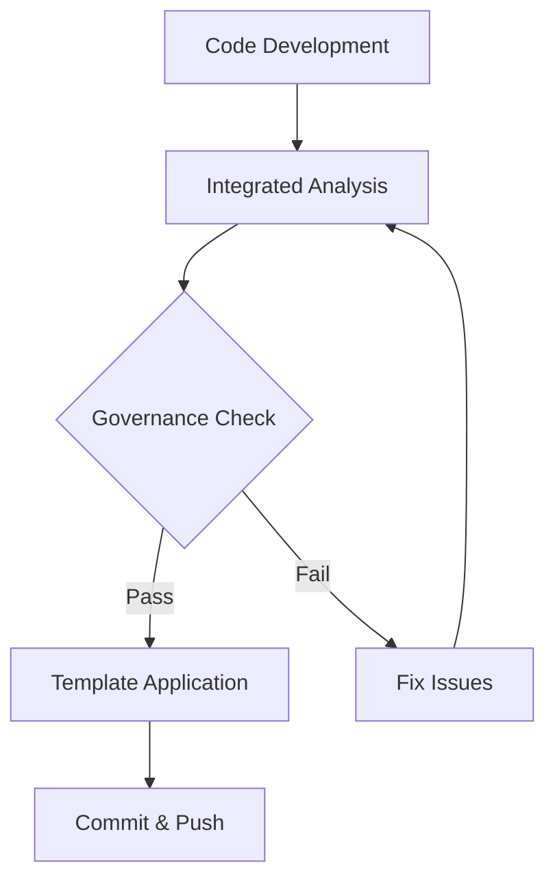
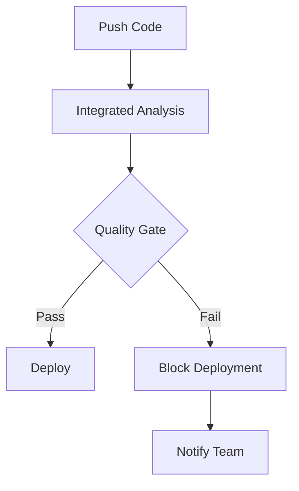

# ORCHEX-KILO Integration Training Materials

This directory contains comprehensive training materials for teams adopting the
ORCHEX-KILO integrated workflow. Materials are designed for different learning
styles and experience levels.

## Training Overview

### Target Audience

- **Developers**: Learn integrated development workflows
- **DevOps Engineers**: Understand CI/CD integration and automation
- **Team Leads**: Learn migration planning and team management
- **Platform Administrators**: Master system configuration and monitoring

### Training Objectives

By the end of training, participants should be able to:

- Execute integrated analysis and governance workflows
- Configure and troubleshoot integration bridges
- Migrate repositories to integrated systems
- Monitor integration health and performance
- Rollback to separate systems when needed

## Training Modules

### Module 1: Integration Fundamentals (2 hours)

#### Learning Objectives

- Understand ORCHEX-KILO integration architecture
- Identify integration benefits and use cases
- Recognize integration components and bridges

#### Materials

- [Integration Overview Presentation](presentations/integration-overview.pdf)
- [Architecture Diagrams](diagrams/)
- [Key Concepts Cheat Sheet](cheatsheets/concepts.md)

#### Hands-on Exercises

1. **Bridge Exploration**: Examine bridge configurations
2. **Component Identification**: Map integration components in your environment
3. **Benefit Analysis**: Identify specific benefits for your workflows

### Module 2: Development Workflow Integration (3 hours)

#### Learning Objectives

- Execute integrated code analysis
- Apply governance checks during development
- Use templates for infrastructure setup

#### Materials

- [Developer Workflow Guide](guides/developer-workflow.md)
- [Command Reference](references/commands.md)
- [Workflow Examples](examples/)

#### Hands-on Exercises

1. **Integrated Analysis**: Run combined ORCHEX-KILO analysis
2. **Template Usage**: Generate infrastructure using KILO templates
3. **Workflow Automation**: Create automated development workflows

### Module 3: CI/CD Pipeline Integration (2 hours)

#### Learning Objectives

- Update CI/CD pipelines for integration
- Configure automated quality gates
- Monitor pipeline performance

#### Materials

- [CI/CD Integration Guide](guides/cicd-integration.md)
- [Pipeline Examples](examples/cicd/)
- [Quality Gate Configuration](guides/quality-gates.md)

#### Hands-on Exercises

1. **Pipeline Migration**: Update existing pipelines
2. **Quality Gates**: Configure compliance checks
3. **Monitoring Setup**: Enable pipeline monitoring

### Module 4: Administration and Troubleshooting (2 hours)

#### Learning Objectives

- Configure integration settings
- Monitor system health
- Troubleshoot common issues
- Perform rollback procedures

#### Materials

- [Administration Guide](guides/administration.md)
- [Troubleshooting Playbook](playbooks/troubleshooting.md)
- [Monitoring Dashboard Guide](guides/monitoring.md)

#### Hands-on Exercises

1. **Configuration**: Set up integration for a new repository
2. **Monitoring**: Configure alerts and dashboards
3. **Troubleshooting**: Resolve common integration issues

## Training Formats

### Instructor-Led Training

- **Duration**: 1-2 days depending on audience
- **Format**: Classroom or virtual sessions
- **Materials**: Presentations, hands-on labs, Q&A sessions

### Self-Paced Learning

- **Duration**: 4-8 hours
- **Format**: Online modules with interactive exercises
- **Materials**: Video tutorials, documentation, quizzes

### Workshop Sessions

- **Duration**: 4 hours
- **Format**: Hands-on collaborative sessions
- **Materials**: Lab exercises, group discussions, expert guidance

## Quick Reference Materials

### Command Cheat Sheets

#### Basic Commands

```bash
# Integrated analysis
ORCHEX analyze repo . --governance-check

# Template access
ORCHEX template get cicd/github-actions

# Compliance checking
ORCHEX compliance check .

# Bridge status
ORCHEX bridge status
```

#### Advanced Commands

```bash
# Custom workflows
ORCHEX workflow run my-custom-workflow

# Batch operations
ORCHEX analyze repos --from repo-list.txt

# Monitoring
ORCHEX monitor performance --output report.json

# Troubleshooting
ORCHEX bridge test --verbose
```

### Workflow Diagrams

#### Development Workflow



#### CI/CD Workflow



## Assessment and Certification

### Knowledge Assessment

- **Format**: Multiple-choice and practical exercises
- **Coverage**: All training modules
- **Passing Score**: 80%

### Practical Assessment

- **Format**: Hands-on repository migration
- **Requirements**: Successfully migrate a test repository
- **Evaluation**: Automated testing and peer review

### Certification

- **Integration Developer**: Basic workflow usage
- **Integration Administrator**: System configuration and monitoring
- **Integration Expert**: Advanced troubleshooting and customization

## Training Delivery Options

### On-Site Training

- Delivered at customer location
- Customized for specific environments
- Includes hands-on labs with customer data

### Virtual Training

- Live instructor-led sessions
- Interactive virtual labs
- Recorded sessions for later reference

### Train-the-Trainer

- Equip internal staff to deliver training
- Provide training materials and guides
- Certification for internal trainers

## Support Resources

### During Training

- **Technical Support**: Live assistance during exercises
- **Documentation Access**: Complete reference materials
- **Community Forums**: Peer support and discussions

### Post-Training

- **Help Desk**: Technical support for integration issues
- **Documentation Portal**: Updated guides and best practices
- **User Community**: Ongoing peer support

## Customization Guidelines

### Adapting for Organization Size

- **Small Teams (< 50 developers)**: Focus on developer workflows, 1-day
  training
- **Medium Teams (50-200 developers)**: Include administration, 2-day training
- **Large Teams (> 200 developers)**: Add advanced topics, train-the-trainer
  model

### Industry-Specific Customization

- **Financial Services**: Emphasize compliance and audit trails
- **Healthcare**: Focus on security and data protection
- **E-commerce**: Highlight performance and scalability

## Training Effectiveness Measurement

### Immediate Feedback

- End-of-session surveys
- Knowledge assessments
- Practical exercise evaluations

### Long-term Success Metrics

- **Adoption Rate**: Percentage of teams using integrated workflows
- **Time to Productivity**: Days to achieve full workflow integration
- **Error Reduction**: Decrease in manual processes and errors
- **User Satisfaction**: Ongoing feedback and improvement suggestions

## Updates and Maintenance

### Content Updates

- Quarterly review of training materials
- Updates for new features and capabilities
- Incorporation of user feedback

### Version Control

- All materials versioned and tracked
- Change logs for significant updates
- Backward compatibility maintained

This training program ensures teams can effectively adopt and utilize
ORCHEX-KILO integration, maximizing the benefits of unified development
workflows.
