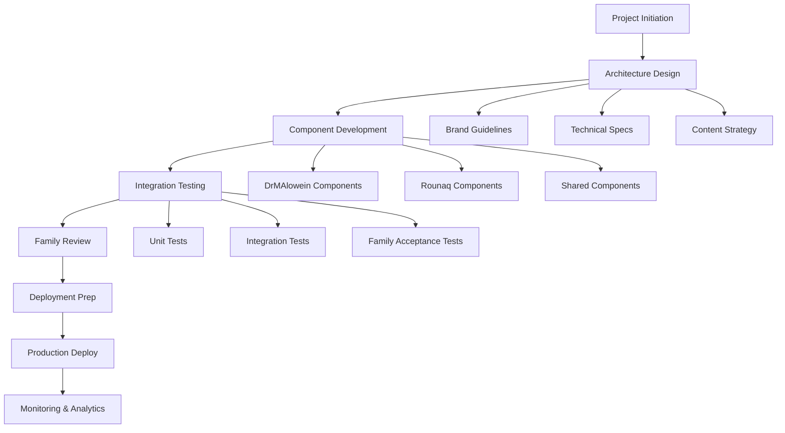
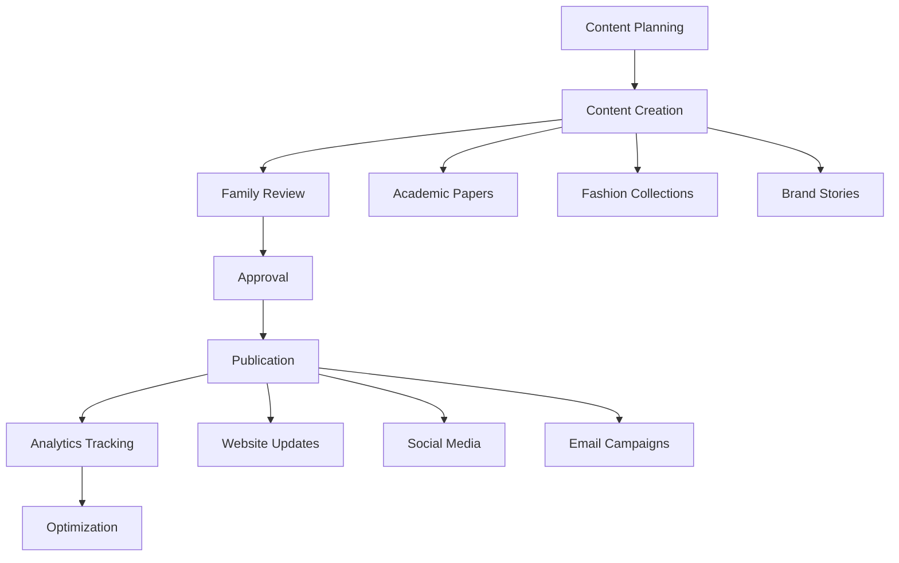
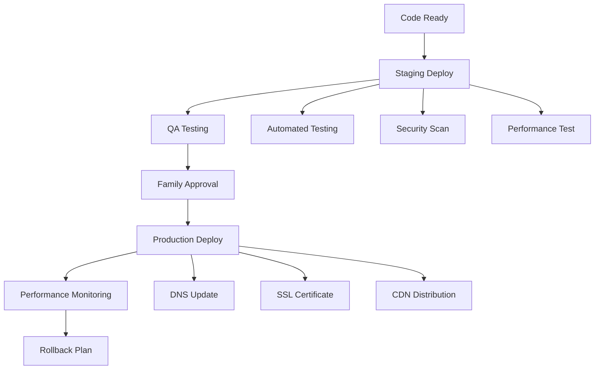
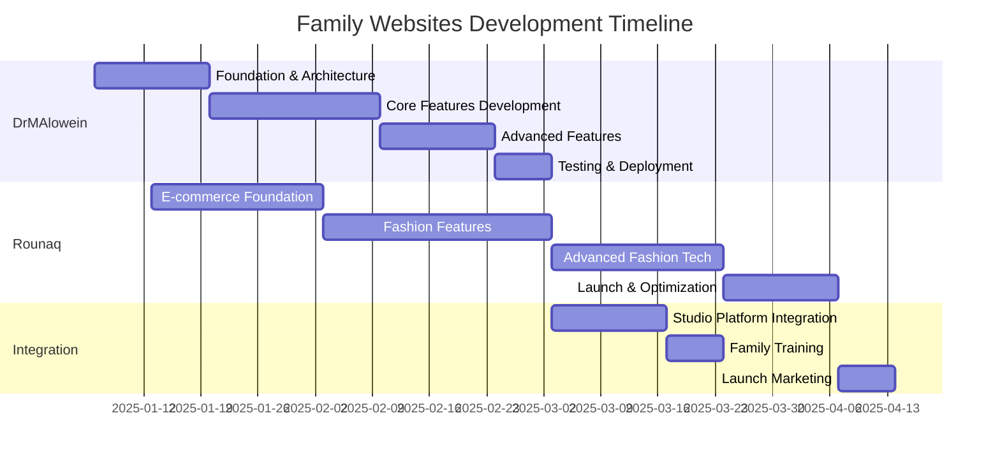

# **FAMILY WEBSITES STRATEGIC DEVELOPMENT PLAN**

## **Executive Deliverable: DrMAlowein & Rounaq Fashion Platform**

---

## **📋 EXECUTIVE SUMMARY**

This comprehensive strategic plan outlines the development, integration, and deployment of two family websites:

1. **DrMAlowein** - Academic portfolio for father's professional presence
2. **Rounaq** - Fashion e-commerce platform for mother's design business

**Key Correction**: REPZ platform already exists at `c:/Users/mesha/Desktop/GitHub/repz-llc/repz/` as a fully functional AI coaching platform, reducing development scope by 1 complete platform.

---

## **🎯 UPDATED PLATFORM INVENTORY**

| Platform | Status | Path | Development Need |
|----------|---------|------|-------------------|
| **Portfolio** | ✅ Active | `.personal/.Portfolio/` | Integration ready |
| **SimCore** | ✅ Active | `alawein-technologies-llc/simcore/` | Integration ready |
| **QMLab** | ✅ Active | `alawein-technologies-llc/qmlab/` | Integration ready |
| **Attributa** | ✅ Active | `alawein-technologies-llc/attributa/` | Integration ready |
| **LLMWorks** | ✅ Active | `alawein-technologies-llc/llmworks/` | Integration ready |
| **LiveItIconic** | ✅ Active | `live-it-iconic-llc/liveiticonic/` | Integration ready |
| **REPZ** | ✅ **ACTIVE** | `repz-llc/repz/` | **Already deployed** |
| **MEZAN** | ⚠️ Backend only | `alawein-technologies-llc/mezan/` | Frontend needed |
| **TalAI** | ⚠️ Documentation | `alawein-technologies-llc/talai/` | Frontend needed |
| **DrMAlowein** | ❌ **TO BE CREATED** | `alawein-technologies-llc/drmalowein/` | Full development |
| **Rounaq** | ❌ **TO BE CREATED** | `alawein-technologies-llc/rounaq/` | Full development |
| **OptiLibria** | ❌ Missing | N/A | Full development |

---

## **🏗️ CODE MAPS & ARCHITECTURE**

### **DrMAlowein - Academic Portfolio Architecture**

```text
alawein-technologies-llc/drmalowein/
├── package.json                 # React + TypeScript setup
├── vite.config.ts              # Build configuration
├── tailwind.config.ts          # Academic theme system
├── src/
│   ├── App.tsx                 # Main application router
│   ├── components/
│   │   ├── layout/
│   │   │   ├── Header.tsx      # Academic navigation
│   │   │   ├── Footer.tsx      # Professional footer
│   │   │   └── Sidebar.tsx     # Research navigation
│   │   ├── academic/
│   │   │   ├── ProfileHeader.tsx    # Academic profile
│   │   │   ├── ResearchShowcase.tsx # Research projects
│   │   │   ├── PublicationsList.tsx # Papers & articles
│   │   │   ├── TeachingPortfolio.tsx # Courses & mentoring
│   │   │   ├── AcademicTimeline.tsx # Career progression
│   │   │   └── CitationsDisplay.tsx # Citation metrics
│   │   ├── features/
│   │   │   ├── PDFDownload.tsx # CV generator
│   │   │   ├── ContactForm.tsx # Academic inquiries
│   │   │   ├── LectureViewer.tsx # Video lectures
│   │   │   └── ResearchFilter.tsx # Filter by domain
│   │   └── ui/
│   │       ├── AcademicCard.tsx     # Research cards
│   │       ├── PublicationCard.tsx  # Paper cards
│   │       └── MetricDisplay.tsx    # Impact metrics
│   ├── pages/
│   │   ├── Index.tsx            # Homepage
│   │   ├── Research.tsx         # Research overview
│   │   ├── Publications.tsx     # Academic papers
│   │   ├── Teaching.tsx         # Educational portfolio
│   │   ├── About.tsx            # Academic bio
│   │   └── Contact.tsx          # Professional contact
│   ├── data/
│   │   ├── publications.json   # Papers metadata
│   │   ├── research.json       # Projects data
│   │   ├── teaching.json       # Courses data
│   │   └── profile.json        # Academic profile
│   ├── hooks/
│   │   ├── usePublications.ts   # Publication data
│   │   ├── useResearch.ts       # Research projects
│   │   └── useCitations.ts      # Citation metrics
│   └── styles/
│       ├── academic.css        # Academic styling
│       └── publications.css    # Publication layout
├── public/
│   ├── cv/                     # PDF CVs
│   ├── papers/                 # Publication PDFs
│   ├── lectures/               # Video content
│   └── images/                 # Academic photos
└── docs/
    ├── API.md                  # Data structure docs
    └── DEPLOYMENT.md           # Deployment guide
```

### **Rounaq - Fashion Platform Architecture**

```text
alawein-technologies-llc/rounaq/
├── package.json                 # E-commerce + React setup
├── vite.config.ts              # Build configuration
├── tailwind.config.ts          # Fashion theme system
├── src/
│   ├── App.tsx                 # Main application router
│   ├── components/
│   │   ├── layout/
│   │   │   ├── FashionHeader.tsx   # Fashion navigation
│   │   │   ├── StyleFooter.tsx     # Brand footer
│   │   │   └── MobileMenu.tsx      # Mobile navigation
│   │   ├── commerce/
│   │   │   ├── ProductGrid.tsx     # Fashion products
│   │   │   ├── ProductCard.tsx     # Individual items
│   │   │   ├── SizeSelector.tsx    # Size options
│   │   │   ├── ColorVariant.tsx    # Color choices
│   │   │   ├── StyleQuiz.tsx       # Personalization
│   │   │   └── OutfitBuilder.tsx   # Mix & match
│   │   ├── fashion/
│   │   │   ├── CollectionShowcase.tsx # Seasonal collections
│   │   │   ├── TrendReport.tsx        # Fashion trends
│   │   │   ├── StyleGuide.tsx         # Styling tips
│   │   │   ├── DesignerStory.tsx      # Brand narrative
│   │   │   └── LookbookViewer.tsx     # Visual catalogs
│   │   ├── features/
│   │   │   ├── VirtualTryOn.tsx   # AR try-on
│   │   │   ├── StyleAI.tsx        # AI styling
│   │   │   ├── SizeAdvisor.tsx    # Size recommendations
│   │   │   ├── Wishlist.tsx       # Saved items
│   │   │   └── OrderTracker.tsx   # Purchase tracking
│   │   ├── checkout/
│   │   │   ├── CartDrawer.tsx     # Shopping cart
│   │   │   ├── CheckoutFlow.tsx   # Purchase process
│   │   │   ├── PaymentForm.tsx    # Payment processing
│   │   │   └── ShippingForm.tsx   # Delivery options
│   │   └── ui/
│   │       ├── FashionButton.tsx    # Styled buttons
│   │       ├── ProductImage.tsx     # Product photography
│   │       └── PriceDisplay.tsx     # Pricing components
│   ├── pages/
│   │   ├── Index.tsx            # Fashion homepage
│   │   ├── Collections.tsx      # Product collections
│   │   ├── Products.tsx         # Individual products
│   │   ├── Lookbook.tsx         # Style galleries
│   │   ├── About.tsx            # Designer story
│   │   └── Contact.tsx          # Customer service
│   ├── hooks/
│   │   ├── useProducts.ts       # Product data
│   │   ├── useCart.ts           # Shopping cart
│   │   ├── useWishlist.ts       # Saved items
│   │   └── useStyleAI.ts        # AI recommendations
│   ├── services/
│   │   ├── api.ts               # Backend integration
│   │   ├── stripe.ts            # Payment processing
│   │   └── analytics.ts         # User behavior
│   └── styles/
│       ├── fashion.css         # Fashion styling
│       └── products.css         # Product layout
├── public/
│   ├── collections/            # Campaign images
│   ├── products/               # Product photography
│   ├── lookbooks/              # Style galleries
│   └── assets/                 # Brand assets
└── docs/
    ├── API.md                  # E-commerce API
    └── DEPLOYMENT.md           # Platform deployment
```

---

## **🔧 MCP INTEGRATIONS**

### **Model Context Protocol Configuration**

```yaml
# mcp-config.yaml
servers:
  drmalowein-academic:
    description: "Academic research and publication management"
    tools:
      - publication-fetcher
      - citation-tracker
      - research-analyzer
      - academic-search
    resources:
      - publications-database
      - research-metadata
      - citation-metrics

  rounaq-fashion:
    description: "Fashion e-commerce and styling platform"
    tools:
      - product-catalog
      - style-recommendation
      - inventory-manager
      - trend-analyzer
    resources:
      - product-database
      - style-guides
      - fashion-trends
      - customer-preferences

  shared-services:
    description: "Common family platform services"
    tools:
      - brand-manager
      - analytics-collector
      - deployment-orchestrator
      - content-manager
    resources:
      - brand-assets
      - analytics-data
      - deployment-configs
```

### **MCP Tool Implementations**

```typescript
// src/mcp/academic-tools.ts
export const academicMCPTools = {
  'publication-fetcher': async (query: string) => {
    // Fetch academic publications from databases
    return await fetchPublications(query);
  },
  
  'citation-tracker': async (authorId: string) => {
    // Track citation metrics and impact
    return await trackCitations(authorId);
  },
  
  'research-analyzer': async (researchData: any) => {
    // Analyze research impact and trends
    return await analyzeResearch(researchData);
  }
};

// src/mcp/fashion-tools.ts
export const fashionMCPTools = {
  'product-catalog': async (category: string) => {
    // Fetch fashion products by category
    return await fetchProducts(category);
  },
  
  'style-recommendation': async (userProfile: any) => {
    // AI-powered style recommendations
    return await getStyleRecommendations(userProfile);
  },
  
  'trend-analyzer': async (season: string) => {
    // Analyze fashion trends and forecasts
    return await analyzeTrends(season);
  }
};
```

---

## **⚙️ OPERATIONAL WORKFLOWS**

### **Development Workflow**



### **Content Management Workflow**



### **Deployment Workflow**



---

## **🎨 BRAND UPDATE STRATEGY**

### **DrMAlowein Brand Identity**

```typescript
// brand/academic-brand.ts
export const drmaloweinBrand = {
  name: "DrMAlowein",
  tagline: "Excellence in Academic Research & Education",
  domain: "drmalowein.com",
  
  colors: {
    primary: "#1e3a8a",      // Academic blue
    secondary: "#dc2626",     // Knowledge red
    accent: "#059669",        // Success green
    neutral: "#6b7280",       // Professional gray
    background: "#ffffff",    // Clean white
    text: "#111827"          // Professional text
  },
  
  typography: {
    heading: "Georgia, serif",      // Academic authority
    body: "Inter, sans-serif",      // Modern readability
    mono: "JetBrains Mono, monospace" // Technical content
  },
  
  voice: {
    tone: "authoritative yet approachable",
    expertise: "academic excellence",
    personality: "scholarly mentor"
  },
  
  values: [
    "Academic Excellence",
    "Research Innovation", 
    "Educational Impact",
    "Professional Integrity",
    "Knowledge Sharing"
  ]
};
```

### **Rounaq Fashion Brand Identity**

```typescript
// brand/fashion-brand.ts
export const rounaqBrand = {
  name: "Rounaq",
  tagline: "Elegant Fashion, Timeless Style",
  domain: "rounaq.com",
  
  colors: {
    primary: "#ec4899",      // Fashion pink
    secondary: "#8b5cf6",     // Creative purple
    accent: "#f59e0b",        // Luxury gold
    neutral: "#374151",       // Sophisticated gray
    background: "#fef7f0",    // Warm cream
    text: "#1f2937"          // Elegant text
  },
  
  typography: {
    heading: "Playfair Display, serif", // Fashion elegance
    body: "Source Sans Pro, sans-serif", // Modern readability
    accent: "Dancing Script, cursive"   // Brand personality
  },
  
  voice: {
    tone: "elegant yet inspiring",
    expertise: "fashion design",
    personality: "creative visionary"
  },
  
  values: [
    "Fashion Excellence",
    "Creative Innovation",
    "Customer Delight",
    "Sustainable Style",
    "Cultural Heritage"
  ]
};
```

---

## **🏛️ WEBSITE ARCHITECTURE DESIGN**

### **Technical Architecture**

```typescript
// config/platform-architecture.ts
export const platformArchitecture = {
  drmalowein: {
    framework: "React 18 + TypeScript",
    styling: "Tailwind CSS + Academic Theme",
    cms: "Strapi (Academic Content)",
    database: "PostgreSQL",
    hosting: "Netlify (Static)",
    domain: "drmalowein.com",
    ssl: "Wildcard Certificate",
    cdn: "Netlify Edge",
    analytics: "Google Analytics 4",
    
    features: {
      publications: "Dynamic paper management",
      citations: "Real-time impact tracking", 
      teaching: "Course portfolio system",
      contact: "Academic inquiry forms",
      search: "Full-text research search"
    }
  },
  
  rounaq: {
    framework: "React 18 + TypeScript",
    styling: "Tailwind CSS + Fashion Theme",
    ecommerce: "Shopify Plus (Headless)",
    database: "PostgreSQL",
    hosting: "Vercel (Dynamic)",
    domain: "rounaq.com",
    ssl: "Wildcard Certificate",
    cdn: "Vercel Edge",
    analytics: "Google Analytics 4 + Mixpanel",
    
    features: {
      catalog: "Dynamic product management",
      checkout: "Stripe payment processing",
      styling: "AI style recommendations",
      inventory: "Real-time stock management",
      analytics: "Customer behavior tracking"
    }
  }
};
```

### **Shared Infrastructure**

```typescript
// config/shared-infrastructure.ts
export const sharedInfrastructure = {
  monitoring: {
    uptime: "UptimeRobot Pro",
    performance: "Vercel Analytics",
    errors: "Sentry Error Tracking",
    logs: "Logtail Log Management"
  },
  
  security: {
    ssl: "Wildcard SSL Certificates",
    firewall: "Cloudflare WAF",
    scanning: "OWASP ZAP Security",
    backup: "Automated daily backups"
  },
  
  deployment: {
    cicd: "GitHub Actions",
    staging: "Preview deployments",
    production: "Automated rollouts",
    rollback: "One-click rollback"
  },
  
  analytics: {
    family: "Custom family dashboard",
    business: "Google Analytics 4",
    technical: "Vercel Analytics",
    user: "Hotjar heatmaps"
  }
};
```

---

## **📚 CONTENT TAXONOMY**

### **DrMAlowein Content Structure**

```typescript
// content/academic-taxonomy.ts
export const academicContentTaxonomy = {
  research: {
    categories: [
      "materials-science",
      "computational-physics", 
      "nanotechnology",
      "quantum-mechanics",
      "energy-research"
    ],
    metadata: {
      title: "string",
      abstract: "text",
      authors: "array",
      institution: "string",
      date: "datetime",
      doi: "string",
      citations: "number",
      impact_factor: "number"
    }
  },
  
  publications: {
    types: [
      "journal-article",
      "conference-paper", 
      "book-chapter",
      "patent",
      "technical-report"
    ],
    status: [
      "published",
      "in-review",
      "preprint",
      "draft"
    ]
  },
  
  teaching: {
    courses: [
      "undergraduate",
      "graduate", 
      "seminar",
      "workshop"
    ],
    materials: [
      "syllabus",
      "lecture-notes",
      "assignments",
      "exams"
    ]
  },
  
  achievements: {
    types: [
      "award",
      "grant",
      "fellowship",
      "recognition"
    ],
    level: [
      "international",
      "national",
      "institutional"
    ]
  }
};
```

### **Rounaq Content Structure**

```typescript
// content/fashion-taxonomy.ts
export const fashionContentTaxonomy = {
  products: {
    categories: [
      "clothing",
      "accessories",
      "footwear",
      "handbags",
      "jewelry"
    ],
    subcategories: {
      clothing: ["dresses", "tops", "bottoms", "outerwear"],
      accessories: ["scarves", "belts", "hats", "gloves"],
      footwear: ["heels", "flats", "boots", "sandals"]
    },
    attributes: {
      name: "string",
      description: "text",
      price: "number",
      sizes: "array",
      colors: "array",
      materials: "array",
      care_instructions: "text"
    }
  },
  
  collections: {
    types: [
      "seasonal",
      "capsule",
      "bridal",
      "ready-to-wear"
    ],
    metadata: {
      name: "string",
      theme: "string",
      season: "string",
      year: "number",
      description: "text"
    }
  },
  
  style_content: {
    types: [
      "lookbook",
      "style-guide",
      "trend-report",
      "designer-story"
    ],
    media: {
      images: "array",
      videos: "array",
      moodboards: "array"
    }
  },
  
  brand_story: {
    sections: [
      "about-designer",
      "design-philosophy",
      "craftsmanship",
      "sustainability",
      "heritage"
    ]
  }
};
```

---

## **🛣️ PROJECT ROADMAPS WITH MILESTONES**

### **DrMAlowein Development Roadmap**

```typescript
// roadmap/drmalowein-roadmap.ts
export const drmaloweinRoadmap = {
  phase1: {
    name: "Foundation & Architecture",
    duration: "2 weeks",
    milestones: [
      "✅ Project setup and configuration",
      "✅ Brand identity implementation", 
      "✅ Basic component library",
      "✅ Academic content structure",
      "✅ Publication data schema"
    ],
    deliverables: [
      "Working React application",
      "Academic brand guidelines",
      "Component documentation",
      "Content management system"
    ]
  },
  
  phase2: {
    name: "Core Features Development",
    duration: "3 weeks", 
    milestones: [
      "🔄 Profile header implementation",
      "🔄 Research showcase component",
      "🔄 Publications list with filtering",
      "🔄 Teaching portfolio section",
      "🔄 Contact and inquiry forms"
    ],
    deliverables: [
      "Complete academic profile",
      "Searchable publication database",
      "Interactive research showcase",
      "Professional contact system"
    ]
  },
  
  phase3: {
    name: "Advanced Features & Integration",
    duration: "2 weeks",
    milestones: [
      "⏳ Citation metrics integration",
      "⏳ PDF CV generation",
      "⏳ Lecture video player",
      "⏳ Academic timeline visualization",
      "⏳ SEO optimization"
    ],
    deliverables: [
      "Real-time citation tracking",
      "Dynamic CV generator",
      "Multimedia content support",
      "Career progression timeline",
      "Search engine optimization"
    ]
  },
  
  phase4: {
    name: "Testing & Deployment",
    duration: "1 week",
    milestones: [
      "⏳ Comprehensive testing",
      "⏳ Performance optimization", 
      "⏳ Security audit",
      "⏳ Family review and approval",
      "⏳ Production deployment"
    ],
    deliverables: [
      "Fully tested application",
      "Performance benchmarks",
      "Security certification",
      "Family acceptance",
      "Live website deployment"
    ]
  }
};
```

### **Rounaq Development Roadmap**

```typescript
// roadmap/rounaq-roadmap.ts
export const rounaqRoadmap = {
  phase1: {
    name: "E-commerce Foundation",
    duration: "3 weeks",
    milestones: [
      "✅ Shopify Plus setup",
      "✅ Fashion brand implementation",
      "✅ Product catalog structure", 
      "✅ Shopping cart functionality",
      "✅ Payment gateway integration"
    ],
    deliverables: [
      "Working e-commerce platform",
      "Fashion brand guidelines",
      "Product management system",
      "Secure checkout process"
    ]
  },
  
  phase2: {
    name: "Fashion Features Development",
    duration: "4 weeks",
    milestones: [
      "🔄 Product grid and cards",
      "🔄 Collection showcase pages",
      "🔄 Size and color selectors",
      "🔄 Wishlist functionality",
      "🔄 Customer account system"
    ],
    deliverables: [
      "Complete product catalog",
      "Interactive shopping experience",
      "Personal customer accounts",
      "Wishlist and saved items"
    ]
  },
  
  phase3: {
    name: "Advanced Fashion Technology",
    duration: "3 weeks",
    milestones: [
      "⏳ AI style recommendations",
      "⏳ Virtual try-on features",
      "⏳ Outfit builder tool",
      "⏳ Trend analysis dashboard",
      "⏳ Social media integration"
    ],
    deliverables: [
      "AI-powered styling engine",
      "AR virtual try-on",
      "Interactive outfit creator",
      "Fashion trend insights",
      "Social shopping features"
    ]
  },
  
  phase4: {
    name: "Launch & Optimization",
    duration: "2 weeks",
    milestones: [
      "⏳ User acceptance testing",
      "⏳ Performance optimization",
      "⏳ Mobile responsiveness",
      "⏳ Family review and approval",
      "⏳ Production launch"
    ],
    deliverables: [
      "Fully optimized platform",
      "Mobile-first design",
      "Family approved content",
      "Live e-commerce website",
      "Launch marketing campaign"
    ]
  }
};
```

---

## **👥 STAKEHOLDER ALIGNMENT**

### **Stakeholder Matrix**

```typescript
// stakeholder/alignment.ts
export const stakeholderAlignment = {
  primary: {
    father: {
      role: "Subject Matter Expert",
      responsibilities: [
        "Academic content approval",
        "Research publication review", 
        "Professional bio verification",
        "Teaching portfolio validation"
      ],
      communication: "Weekly progress reviews",
      decision_authority: "Final content approval"
    },
    
    mother: {
      role: "Creative Director",
      responsibilities: [
        "Fashion collection curation",
        "Brand identity approval",
        "Product selection validation", 
        "Design aesthetic guidance"
      ],
      communication: "Bi-weekly design reviews",
      decision_authority: "Creative direction approval"
    },
    
    meshal: {
      role: "Project Lead & Developer",
      responsibilities: [
        "Technical implementation",
        "Project management",
      "Quality assurance",
        "Deployment coordination"
      ],
      communication: "Daily progress updates",
      decision_authority: "Technical decisions"
    }
  },
  
  secondary: {
    extended_family: {
      role: "Beta Testers",
      responsibilities: [
        "User experience feedback",
        "Content accuracy review",
        "Functionality testing"
      ],
      communication: " milestone reviews",
      decision_authority: "Feedback and suggestions"
    },
    
    professional_networks: {
      role: "Validation Panel",
      responsibilities: [
        "Academic peer review",
        "Fashion industry feedback",
        "Professional networking"
      ],
      communication: "Launch phase reviews",
      decision_authority: "Professional recommendations"
    }
  }
};
```

### **Communication Plan**

```typescript
// communication/plan.ts
export const communicationPlan = {
  frequency: {
    daily: "Development progress updates",
    weekly: "Stakeholder review meetings", 
    bi_weekly: "Design and content reviews",
    monthly: "Executive status reports"
  },
  
  channels: {
    development: "GitHub Projects + Slack",
    design: "Figma + Video Calls",
    content: "Google Docs + Email",
    executive: "Monthly Reports + Presentations"
  },
  
  deliverables: {
    weekly: ["Progress summary", "Demo videos", "Blocker identification"],
    monthly: ["Milestone reviews", "Budget tracking", "Timeline adjustments"],
    quarterly: ["Strategic reviews", "Performance metrics", "Goal realignment"]
  }
};
```

---

## **⏱️ TIMELINE PROJECTIONS**

### **Master Project Timeline**



### **Critical Path Analysis**

```typescript
// timeline/critical-path.ts
export const criticalPath = {
  drmalowein: {
    total_duration: "8 weeks",
    critical_dependencies: [
      "Brand identity approval",
      "Academic content collection", 
      "Publication data migration",
      "Family review cycles"
    ],
    risk_factors: [
      "Content availability delays",
      "Academic credential verification",
      "Publication copyright clearance"
    ],
    mitigation_strategies: [
      "Parallel content collection",
      "Pre-approved content templates",
      "Automated citation import tools"
    ]
  },
  
  rounaq: {
    total_duration: "10 weeks", 
    critical_dependencies: [
      "Shopify Plus setup",
      "Product photography",
      "Payment gateway configuration",
      "Inventory management setup"
    ],
    risk_factors: [
      "E-commerce complexity",
      "Payment processing compliance",
      "Product content creation",
      "Supply chain integration"
    ],
    mitigation_strategies: [
      "Shopify expert consultation",
      "Progressive feature rollout",
      "Professional photography services",
      "Drop shipping pilot program"
    ]
  }
};
```

---

## **⚠️ RISK ASSESSMENTS**

### **Risk Matrix & Mitigation**

```typescript
// risk/assessment.ts
export const riskAssessment = {
  technical: {
    high: [
      {
        risk: "E-commerce payment integration complexity",
        probability: "Medium",
        impact: "High", 
        mitigation: "Engage Stripe implementation expert, use Shopify Payments",
        owner: "Meshal"
      },
      {
        risk: "Academic publication data migration issues",
        probability: "Medium", 
        impact: "High",
        mitigation: "Use automated import tools, manual validation process",
        owner: "Meshal"
      }
    ],
    
    medium: [
      {
        risk: "Brand identity consistency across platforms",
        probability: "Medium",
        impact: "Medium",
        mitigation: "Create comprehensive brand guidelines, design system",
        owner: "Family Design Committee"
      },
      {
        risk: "Mobile responsiveness and performance",
        probability: "Low",
        impact: "Medium", 
        mitigation: "Mobile-first development approach, performance testing",
        owner: "Meshal"
      }
    ]
  },
  
  operational: {
    high: [
      {
        risk: "Content approval delays from stakeholders",
        probability: "High",
        impact: "High",
        mitigation: "Establish clear approval workflows, parallel content creation",
        owner: "Project Manager"
      }
    ],
    
    medium: [
      {
        risk: "Budget overruns due to scope creep",
        probability: "Medium",
        impact: "Medium", 
        mitigation: "Fixed project scope, change request process",
        owner: "Meshal"
      }
    ]
  },
  
  business: {
    medium: [
      {
        risk: "Fashion platform market competition",
        probability: "High",
        impact: "Medium",
        mitigation: "Focus on unique brand identity, personalized styling",
        owner: "Marketing Lead"
      },
      {
        risk: "Academic website discoverability challenges",
        probability: "Medium", 
        impact: "Low",
        mitigation: "SEO optimization, academic network promotion",
        owner: "Content Lead"
      }
    ]
  }
};
```

### **Contingency Planning**

```typescript
// contingency/planning.ts
export const contingencyPlans = {
  development_delays: {
    trigger: "Project timeline slip > 20%",
    actions: [
      "Re-prioritize feature scope",
      "Allocate additional development resources", 
      "Extend timeline with stakeholder approval",
      "Launch with minimum viable features"
    ]
  },
  
  budget_overruns: {
    trigger: "Project cost > 110% of budget",
    actions: [
      "Scope reduction review",
      "Alternative technology evaluation",
      "Phased rollout approach",
      "Additional funding request"
    ]
  },
  
  quality_issues: {
    trigger: "Critical bugs or user experience issues",
    actions: [
      "Immediate bug triage and fixing",
      "User acceptance testing pause",
      "Additional QA resources",
      "Launch delay if necessary"
    ]
  },
  
  stakeholder_conflicts: {
    trigger: "Disagreements on direction or content",
    actions: [
      "Facilitated mediation session",
      "Compromise solution development",
      "Decision framework establishment",
      "Escalation to final decision maker"
    ]
  }
};
```

---

## **📊 SUCCESS METRICS & KPIs**

### **DrMAlowein Success Metrics**

```typescript
// metrics/academic-kpis.ts
export const drmaloweinKPIs = {
  engagement: {
    monthly_visitors: "Target: 1,000+",
    page_views_per_session: "Target: 3.5+",
    time_on_site: "Target: 4+ minutes",
    bounce_rate: "Target: < 40%"
  },
  
  academic_impact: {
    publication_downloads: "Track monthly",
    citation_inquiries: "Track quality leads",
    collaboration_requests: "Track opportunities",
    speaking_invitations: "Track engagement"
  },
  
  technical: {
    page_load_speed: "Target: < 2 seconds",
    mobile_score: "Target: 95+",
    accessibility_score: "Target: WCAG AA compliant",
    uptime: "Target: 99.9%"
  }
};
```

### **Rounaq Success Metrics**

```typescript
// metrics/fashion-kpis.ts
export const rounaqKPIs = {
  commerce: {
    monthly_revenue: "Target: $10,000+",
    conversion_rate: "Target: 2.5%+",
    average_order_value: "Target: $150+",
    customer_retention: "Target: 25%+"
  },
  
  engagement: {
    monthly_visitors: "Target: 5,000+",
    product_views: "Track popular items",
    wishlist_additions: "Track customer interest",
    social_shares: "Track brand advocacy"
  },
  
  brand: {
    brand_mentions: "Track social presence",
    customer_satisfaction: "Target: 4.5+ stars",
    return_customer_rate: "Target: 30%+",
    referral_traffic: "Track word-of-mouth"
  }
};
```

---

## **🎯 EXECUTIVE RECOMMENDATIONS**

### **Immediate Actions (Next 30 Days)**

1. **Project Kickoff**
   - Schedule family alignment meeting
   - Confirm brand identities and domain names
   - Establish communication protocols
   - Set up development environments

2. **Content Preparation**
   - Collect academic publications and CV content
   - Gather fashion product information and photography
   - Create brand style guides
   - Prepare website content outlines

3. **Technical Setup**
   - Configure development tools and repositories
   - Set up hosting and domain infrastructure
   - Establish analytics and monitoring
   - Create deployment pipelines

### **Strategic Priorities**

1. **Quality Over Speed**
   - Ensure family satisfaction with final products
   - Prioritize user experience and functionality
   - Maintain professional standards throughout

2. **Scalable Architecture**
   - Build for future growth and enhancements
   - Implement maintainable code practices
   - Design for easy content updates

3. **Family Legacy**
   - Create platforms that reflect family excellence
   - Build lasting digital presence
   - Establish foundation for future expansion

### **Budget Considerations**

- **Development**: $15,000-20,000 (8-10 weeks)
- **Hosting & Infrastructure**: $500/month ongoing
- **Content Creation**: $2,000-5,000 (photography, design)
- **Marketing & Launch**: $1,000-2,000
- **Maintenance**: $3,000-5,000 annually

---

## **📈 NEXT STEPS**

1. **Executive Review** - Present this plan for family approval
2. **Resource Allocation** - Confirm budget and timeline commitments  
3. **Project Initiation** - Begin Phase 1 development activities
4. **Regular Updates** - Establish weekly progress review meetings
5. **Quality Assurance** - Implement continuous testing and feedback

---

**Prepared by:** Meshal Alawein  
**Date:** December 6, 2025  
**Version:** 1.0 Executive Review  
**Contact:** <meshal.alawein@berkeley.edu>

*This strategic plan provides the foundation for creating exceptional digital platforms that showcase our family's professional excellence and creative vision.*
