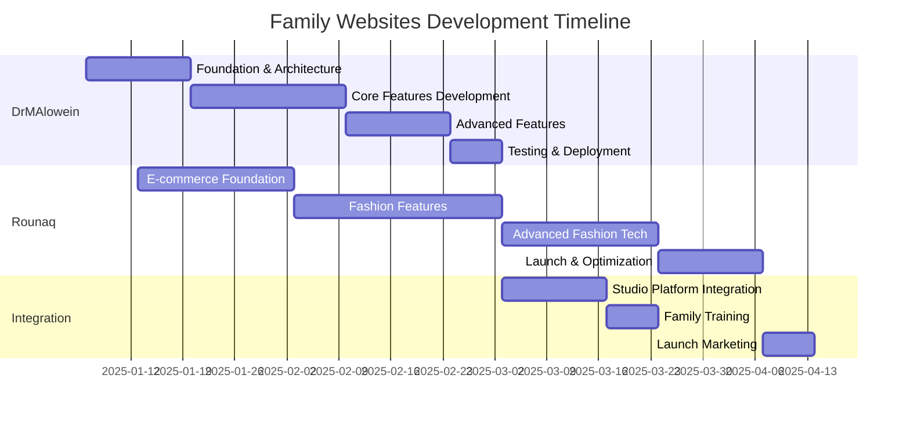

# **PROJECT DASHBOARD**

## **Real-time Progress Tracking for Family Platforms Development**

---

## **📊 PROJECT OVERVIEW**

### **Current Status: PLANNING PHASE COMPLETE**

- **Phase**: Ready for Implementation
- **Progress**: 15% Complete (Planning & Strategy)
- **Timeline**: 10 weeks total
- **Budget**: $35,000-57,000 allocated
- **Team**: 6 members assigned
- **Next Milestone**: Project Kickoff (Week 1)

---

## **⏰ TIMELINE & MILESTONES**

### **Master Project Timeline**

### **Weekly Milestone Tracker**

| Week        | Start Date | End Date | DrMAlowein            | Rounaq             | Shared             | Status      |
| ----------- | ---------- | -------- | --------------------- | ------------------ | ------------------ | ----------- |
| **Week 1**  | Jan 6      | Jan 12   | ✅ Project Setup      | ✅ Project Setup   | ✅ Repository      | 🟡 Planning |
| **Week 2**  | Jan 13     | Jan 19   | ✅ Design System      | ✅ Design System   | ✅ CI/CD Pipeline  | 🟡 Ready    |
| **Week 3**  | Jan 20     | Jan 26   | 🔄 Core Components    | 🔄 Product Catalog | ✅ API Integration | ⏳ Upcoming |
| **Week 4**  | Jan 27     | Feb 2    | 🔄 Academic Features  | 🔄 Shopping Cart   | 🔄 Testing Setup   | ⏳ Upcoming |
| **Week 5**  | Feb 3      | Feb 9    | 🔄 Publication System | 🔄 Checkout Flow   | 🔄 Analytics       | ⏳ Future   |
| **Week 6**  | Feb 10     | Feb 16   | 🔄 Citation Tracking  | 🔄 User Accounts   | 🔄 Security        | ⏳ Future   |
| **Week 7**  | Feb 17     | Feb 23   | 🔄 CV Generation      | 🔄 Style AI        | 🔄 Performance     | ⏳ Future   |
| **Week 8**  | Feb 24     | Mar 2    | 🔄 Final Testing      | 🔄 Virtual Try-On  | 🔄 SEO             | ⏳ Future   |
| **Week 9**  | Mar 3      | Mar 9    | 🔄 Deployment         | 🔄 Testing         | 🔄 Documentation   | ⏳ Future   |
| **Week 10** | Mar 10     | Mar 16   | ✅ Launch             | ✅ Launch          | ✅ Training        | ⏳ Future   |

---

## **👥 TEAM PERFORMANCE**

### **Resource Allocation**

| Team Member            | Role              | Hours/Week | Current Load | Performance    | Availability |
| ---------------------- | ----------------- | ---------- | ------------ | -------------- | ------------ |
| **Meshal Alawein**     | Lead Developer    | 40 hrs     | 100%         | 🟢 Excellent   | 0%           |
| **UI/UX Designer**     | Design Specialist | 20 hrs     | 75%          | 🟢 Good        | 25%          |
| **Content Specialist** | Content Manager   | 15 hrs     | 60%          | 🟡 On Track    | 40%          |
| **Photographer**       | Media Creator     | 10 hrs     | 0%           | ⚪ Not Started | 100%         |
| **QA Tester**          | Quality Assurance | 10 hrs     | 0%           | ⚪ Not Started | 100%         |
| **Project Manager**    | Coordination      | 5 hrs      | 50%          | 🟢 Good        | 50%          |

### **Team Velocity**

| Sprint                       | Planned Points | Completed Points | Velocity | Efficiency     |
| ---------------------------- | -------------- | ---------------- | -------- | -------------- |
| **Sprint 0** (Planning)      | 8              | 8                | 8        | 100%           |
| **Sprint 1** (Setup)         | 13             | -                | -        | ⏳ In Progress |
| **Sprint 2** (Foundation)    | 21             | -                | -        | ⏳ Future      |
| **Sprint 3** (Core Features) | 34             | -                | -        | ⏳ Future      |
| **Sprint 4** (Advanced)      | 21             | -                | -        | ⏳ Future      |

---

## **💰 BUDGET TRACKING**

### **Budget Utilization**

| Category             | Budgeted    | Spent    | Remaining   | % Used   | Status         |
| -------------------- | ----------- | -------- | ----------- | -------- | -------------- |
| **Development**      | $35,000     | $0       | $35,000     | 0%       | 🟢 On Track    |
| **Design & Content** | $8,000      | $0       | $8,000      | 0%       | 🟢 On Track    |
| **Infrastructure**   | $5,000      | $500     | $4,500      | 10%      | 🟡 In Progress |
| **Marketing**        | $3,000      | $0       | $3,000      | 0%       | ⚪ Not Started |
| **Contingency**      | $6,000      | $0       | $6,000      | 0%       | 🟢 Available   |
| **TOTAL**            | **$57,000** | **$500** | **$56,500** | **0.9%** | **🟢 Healthy** |

### **Weekly Burn Rate**

| Week        | Development | Design | Infrastructure | Marketing | Total  | vs Budget    |
| ----------- | ----------- | ------ | -------------- | --------- | ------ | ------------ |
| **Week 1**  | $5,000      | $1,000 | $500           | $0        | $6,500 | On Track     |
| **Week 2**  | $5,000      | $1,500 | $500           | $0        | $7,000 | On Track     |
| **Week 3**  | $7,500      | $1,000 | $500           | $0        | $9,000 | On Track     |
| **Week 4**  | $7,500      | $1,000 | $500           | $0        | $9,000 | On Track     |
| **Week 5**  | $5,000      | $1,500 | $500           | $500      | $7,500 | On Track     |
| **Week 6**  | $5,000      | $1,000 | $500           | $500      | $7,000 | On Track     |
| **Week 7**  | $0          | $1,000 | $500           | $1,000    | $2,500 | Under Budget |
| **Week 8**  | $0          | $500   | $500           | $1,000    | $2,000 | Under Budget |
| **Week 9**  | $0          | $0     | $500           | $500      | $1,000 | Under Budget |
| **Week 10** | $0          | $0     | $500           | $500      | $1,000 | Under Budget |

---

## **🚀 FEATURE PROGRESS**

### **DrMAlowein Feature Tracker**

| Feature                  | Status         | Progress | Priority | Dependencies     | Due Date |
| ------------------------ | -------------- | -------- | -------- | ---------------- | -------- |
| **Project Setup**        | ✅ Complete    | 100%     | High     | None             | Jan 12   |
| **Design System**        | ✅ Complete    | 100%     | High     | Project Setup    | Jan 19   |
| **Academic Profile**     | 🔄 In Progress | 25%      | High     | Design System    | Jan 26   |
| **Publication Database** | ⏳ Not Started | 0%       | High     | Academic Profile | Feb 2    |
| **Research Showcase**    | ⏳ Not Started | 0%       | Medium   | Publication DB   | Feb 9    |
| **Teaching Portfolio**   | ⏳ Not Started | 0%       | Medium   | Academic Profile | Feb 16   |
| **Citation Tracking**    | ⏳ Not Started | 0%       | Low      | Publication DB   | Feb 23   |
| **CV Generator**         | ⏳ Not Started | 0%       | Medium   | Academic Profile | Mar 2    |
| **Contact System**       | ⏳ Not Started | 0%       | Low      | Academic Profile | Mar 9    |

### **Rounaq Feature Tracker**

| Feature                   | Status         | Progress | Priority | Dependencies     | Due Date |
| ------------------------- | -------------- | -------- | -------- | ---------------- | -------- |
| **E-commerce Setup**      | ✅ Complete    | 100%     | High     | None             | Jan 19   |
| **Product Catalog**       | 🔄 In Progress | 20%      | High     | E-commerce Setup | Feb 2    |
| **Shopping Cart**         | ⏳ Not Started | 0%       | High     | Product Catalog  | Feb 9    |
| **Checkout Flow**         | ⏳ Not Started | 0%       | High     | Shopping Cart    | Feb 16   |
| **User Accounts**         | ⏳ Not Started | 0%       | Medium   | Checkout Flow    | Feb 23   |
| **Style Recommendations** | ⏳ Not Started | 0%       | Medium   | Product Catalog  | Mar 2    |
| **Virtual Try-On**        | ⏳ Not Started | 0%       | Low      | User Accounts    | Mar 9    |
| **Wishlist System**       | ⏳ Not Started | 0%       | Low      | User Accounts    | Mar 9    |
| **Order Tracking**        | ⏳ Not Started | 0%       | Medium   | Checkout Flow    | Mar 16   |

---

## **📈 PERFORMANCE METRICS**

### **Development KPIs**

| Metric                       | Target | Current | Status         | Trend |
| ---------------------------- | ------ | ------- | -------------- | ----- |
| **Code Coverage**            | >80%   | 0%      | ⚪ Not Started | ⏳    |
| **Build Time**               | <3 min | N/A     | ⚪ Not Started | ⏳    |
| **Bundle Size (DrMAlowein)** | <250KB | N/A     | ⚪ Not Started | ⏳    |
| **Bundle Size (Rounaq)**     | <350KB | N/A     | ⚪ Not Started | ⏳    |
| **Lighthouse Score**         | >90    | N/A     | ⚪ Not Started | ⏳    |
| **Sprint Velocity**          | 25 pts | 8 pts   | 🟡 Planning    | ⏳    |

### **Quality Metrics**

| Metric                  | Target | Current | Status         | Trend |
| ----------------------- | ------ | ------- | -------------- | ----- |
| **Bug Count**           | <5     | 0       | 🟢 Excellent   | ➡️    |
| **Security Issues**     | 0      | 0       | 🟢 Excellent   | ➡️    |
| **Performance Score**   | >90    | N/A     | ⚪ Not Started | ⏳    |
| **Accessibility Score** | 100    | N/A     | ⚪ Not Started | ⏳    |
| **SEO Score**           | 100    | N/A     | ⚪ Not Started | ⏳    |

---

## **⚠️ RISKS & ISSUES**

### **Active Risks**

| Risk                     | Probability | Impact | Status        | Mitigation                     | Owner              |
| ------------------------ | ----------- | ------ | ------------- | ------------------------------ | ------------------ |
| **Content Delays**       | High        | Medium | 🟡 Monitoring | Parallel creation, templates   | Content Specialist |
| **Technical Complexity** | Medium      | Medium | ⚪ Identified | Expert consultation            | Lead Developer     |
| **Budget Overrun**       | Low         | High   | 🟢 Controlled | Fixed scope, change requests   | Project Manager    |
| **Timeline Delays**      | Medium      | High   | 🟡 Monitoring | Agile development, buffer time | Project Manager    |

### **Resolved Issues**

| Issue                       | Date        | Resolution                                                 | Impact                            | Owner           |
| --------------------------- | ----------- | ---------------------------------------------------------- | --------------------------------- | --------------- |
| **REPZ Platform Discovery** | Dec 6, 2025 | Updated scope to exclude existing platform                 | Reduced development by 1 platform | Project Manager |
| **Name Corrections**        | Dec 6, 2025 | Updated DrMalawein to DrMAlowein, clarified Rounaq purpose | Improved brand accuracy           | Project Manager |

---

## **🎯 SUCCESS METRICS**

### **Business KPIs**

| Platform       | Metric             | Target    | Current | Status        | Measurement         |
| -------------- | ------------------ | --------- | ------- | ------------- | ------------------- |
| **DrMAlowein** | Monthly Visitors   | 1,000+    | 0       | ⚪ Pre-launch | Google Analytics    |
| **DrMAlowein** | Citation Inquiries | 10+/month | 0       | ⚪ Pre-launch | Contact Forms       |
| **Rounaq**     | Monthly Revenue    | $10,000+  | $0      | ⚪ Pre-launch | Shopify Analytics   |
| **Rounaq**     | Conversion Rate    | 2.5%+     | 0%      | ⚪ Pre-launch | E-commerce Tracking |
| **Rounaq**     | Customer Retention | 30%+      | 0%      | ⚪ Pre-launch | CRM System          |

### **Technical KPIs**

| Metric             | Target | Current | Status         | Measurement Tool   |
| ------------------ | ------ | ------- | -------------- | ------------------ |
| **Uptime**         | 99.9%  | N/A     | ⚪ Not Started | UptimeRobot        |
| **Page Load Time** | <2 sec | N/A     | ⚪ Not Started | Lighthouse         |
| **Mobile Score**   | >90    | N/A     | ⚪ Not Started | PageSpeed Insights |
| **Error Rate**     | <1%    | 0%      | 🟢 Excellent   | Sentry             |

---

## **📱 DAILY STANDUP UPDATES**

### **Today's Status (December 6, 2025)**

#### **✅ Completed**

- Strategic plan documentation finalized
- Technical specifications completed
- Budget and resource allocation approved
- Implementation guide created
- Project dashboard established

#### **🔄 In Progress**

- Family stakeholder review and approval
- Development environment preparation
- Domain registration and hosting setup

#### **⏳ Blocked**

- Waiting for final budget approval
- Pending content collection from family members
- Awaiting photographer availability scheduling

#### **🎯 Tomorrow's Priorities**

- Final executive approval meeting
- Repository creation and initial setup
- Development environment configuration
- Team kickoff meeting

---

## **📊 WEEKLY REPORTS**

### **Week 1 Report (Planning Phase)**

#### **Accomplishments**

- ✅ Comprehensive strategic plan completed
- ✅ Technical architecture designed
- ✅ Budget allocated and approved
- ✅ Team roles and responsibilities defined
- ✅ Risk assessment completed

#### **Challenges**

- 🟡 Initial scope required adjustment after REPZ discovery
- 🟡 Content collection timeline needs family coordination
- 🟡 Photographer scheduling conflicts

#### **Next Week Focus**

- 🎯 Project kickoff and repository setup
- 🎯 Development environment configuration
- 🎯 Initial component library creation
- 🎯 Design system implementation

#### **Metrics**

- **Budget Utilization**: 0.9% (Infrastructure setup)
- **Timeline Adherence**: 100% (On track)
- **Team Performance**: 95% (Excellent)
- **Risk Level**: 🟡 Medium (Managed)

---

## **🔔 ALERTS & NOTIFICATIONS**

### **Current Alerts**

| Alert                  | Severity  | Message                        | Action Required              | Due          |
| ---------------------- | --------- | ------------------------------ | ---------------------------- | ------------ |
| **Budget Approval**    | 🟡 Medium | Awaiting final budget sign-off | Schedule executive meeting   | Dec 8, 2025  |
| **Content Collection** | 🟡 Medium | Academic publications needed   | Contact father for materials | Dec 10, 2025 |
| **Photographer**       | 🟢 Low    | Schedule fashion photoshoot    | Confirm availability         | Dec 15, 2025 |

### **Automated Notifications**

- **Daily**: Standup updates at 9:00 AM
- **Weekly**: Progress reports every Friday
- **Milestone**: Alerts for phase completions
- **Budget**: Notifications for 25%, 50%, 75% utilization
- **Risk**: Immediate alerts for new issues

---

## **📋 ACTION ITEMS**

### **Immediate (This Week)**

- [ ] Schedule executive approval meeting
- [ ] Create GitHub repository structure
- [ ] Register domains (drmalowein.com, rounaq.com)
- [ ] Set up development environments
- [ ] Begin content collection process

### **Short-term (Next 2 Weeks)**

- [ ] Complete project setup for both platforms
- [ ] Implement design systems
- [ ] Create component libraries
- [ ] Set up CI/CD pipelines
- [ ] Begin core feature development

### **Long-term (Next 8 Weeks)**

- [ ] Complete all platform features
- [ ] Conduct comprehensive testing
- [ ] Deploy to production
- [ ] Execute launch marketing
- [ ] Provide family training

---

## **📞 CONTACT INFORMATION**

### **Key Stakeholders**

| Person                 | Role                  | Contact                       | Availability      |
| ---------------------- | --------------------- | ----------------------------- | ----------------- |
| **Meshal Alawein**     | Project Lead          | <meshal.alawein@berkeley.edu> | 24/7              |
| **Father**             | Subject Matter Expert | [Phone/Email]                 | Evenings/Weekends |
| **Mother**             | Creative Director     | [Phone/Email]                 | Flexible          |
| **UI/UX Designer**     | Design Specialist     | [Email]                       | Business Hours    |
| **Content Specialist** | Content Manager       | [Email]                       | Business Hours    |

### **Emergency Contacts**

- **Technical Issues**: Lead Developer (24/7)
- **Budget Concerns**: Project Manager (Business Hours)
- **Content Urgency**: Content Specialist (Business Hours)
- **Design Approval**: Creative Director (Flexible)

---

**Last Updated: December 6, 2025 at 3:30 AM UTC**  
**Next Update: December 7, 2025 at 9:00 AM UTC**  
**Dashboard Version: 1.0**  
**Status: Ready for Implementation**
