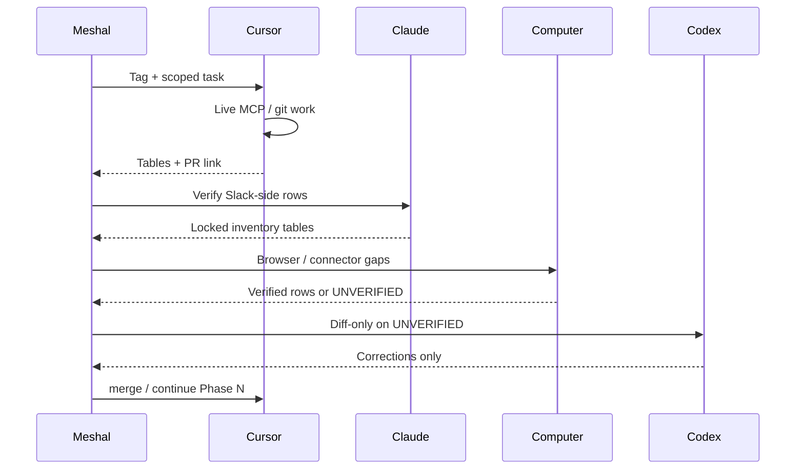

# Unified agent system

**Owner:** Meshal M. Alawein (`contact@meshal.ai`)

This document is the control-plane SSOT for how agents, LLMs, integrations, and
Slack surfaces fit together. It extends
[`slack-agent-runbook.md`](slack-agent-runbook.md) (channel and bot policy) with
orchestration, inventory tracking, and output conventions.

**Machine-readable inventory:** [`catalog/agent-integrations.yaml`](../../catalog/agent-integrations.yaml)

## 1. System map

```mermaid
flowchart TB
  subgraph Human["Meshal (contact@meshal.ai)"]
    H[#admin-ops command center]
  end

  subgraph SlackAgents["Slack agent layer"]
    C[@Cursor]
    CL[@Claude]
    CP[@Computer]
    CG[@Codex]
    N[@Notion AI]
    GH[@GitHub]
  end

  subgraph WorkflowBots["Workflow bots (5)"]
    DM[Daily Agenda → DM]
    P[#posts digest hub]
    CPipe[#content-pipeline]
  end

  subgraph CursorMCP["Cursor MCP plane"]
    G[Gmail / Calendar / Drive]
    R[Railway / Vercel CLI]
    X[Split: GitHub desktop ready / Cloud error; Slack dup Cloud leftover]
  end

  subgraph Canon["Governance SSOT (alawein)"]
    U[unified-agent-system.md]
    S[slack-agent-runbook.md]
    Y[agent-integrations.yaml]
  end

  H --> SlackAgents
  SlackAgents --> CursorMCP
  WorkflowBots --> P
  WorkflowBots --> CPipe
  C --> Canon
  CL --> Canon
  CP --> Canon
```

## 2. Design goals

| Goal | Mechanism |
| --- | --- |
| One inventory | `catalog/agent-integrations.yaml` + this doc |
| One command center | `#admin-ops` for human + agent traffic |
| Verified state only | Live tool reads; `UNVERIFIED` when blocked |
| Minimal chat noise | Dispatch rules; no duplicate audit narratives |
| Repo truth | Cursor commits governance to `alawein` |
| Parallel work | Tagged handoffs + Cursor subscriptions |

## 3. Agent and LLM inventory

| Agent | Surface | Default model | Primary jobs | Status |
| --- | --- | --- | --- | --- |
| **Cursor** | Slack, Cloud Agent, IDE | Composer 2.5 | Implement, commit, PR, MCP, governance docs | Ready |
| **Claude** | Slack bot | Legacy Slack | Slack reads, audits, synthesis | Ready (Tag pending) |
| **Claude Code** | IDE / terminal | Claude | Repo mutation, terminal, MCP | Ready |
| **Computer** | Slack, Perplexity web | Perplexity | Browser audit, design docs, verification | Needs auth (Slack) |
| **Codex** | Slack | GPT Codex | Gap-fill after ChatGPT Codex connect | Needs auth |
| **ChatGPT** | Slack | GPT | Replaced by Codex; never posted | Replaced |
| **Notion AI** | Slack, Notion | Notion AI | Notion workspace reads | Ready |
| **GitHub for Slack** | Slack | — | PR thread mirroring | Ready |

### LLM backends in use (tracked)

| Backend | Where it runs | Account | Notes |
| --- | --- | --- | --- |
| Composer 2.5 | Cursor Cloud Agent | `contact@meshal.ai` | This session's default |
| Claude (legacy Slack) | `@Claude` in Slack | Per-user connect | Enable Claude Tag for modern routing |
| Perplexity | `@Computer` / web | User session | Produced `slack-workspace-design.md` v1.1 |
| GPT Codex | `@Codex` in Slack | ChatGPT Codex connect | Needs account link; S4 remapped |
| GPT | `@ChatGPT` in Slack | — | Replaced; user `U0BUNH33CCA` silent |
| Notion AI | `@Notion AI` | `contact@meshal.ai` | Workspace `8116d8de-…` |
| Workflow bot LLMs | Slack workflows | Unknown | Backends not inventoried yet |

## 4. Integration registry (unified)

Canonical account: **`contact@meshal.ai`**. Any other account is a re-auth candidate.

| Integration | Account | Cursor MCP | Slack / other | Status | Last verified |
| --- | --- | --- | --- | --- | --- |
| Gmail | `contact@meshal.ai` | Ready | — | Locked | 2026-09-05 |
| Google Calendar | `contact@meshal.ai` | Ready | — | Locked | 2026-09-05 |
| Google Drive | `contact@meshal.ai` | Ready | Computer session | Locked | 2026-09-05 |
| Notion | `contact@meshal.ai` | Needs auth | Notion AI | Locked | 2026-09-05 |
| Railway | `contact@meshal.ai` | Ready | — | Locked | 2026-09-05 |
| Vercel (`alawein`) | Team | CLI only | 32 projects; 8 UNVERIFIED | Locked | 2026-09-05 |
| GitHub | Scoped token | Desktop ready / Cloud error | GitHub for Slack | Split | 2026-09-05 |
| Supermemory | — | Dropped (desktop) / Cloud error | — | Dropped | 2026-09-05 |
| Slack MCP (dup) | — | Desktop removed / Cloud error | — | Remove (Cloud leftover) | 2026-09-05 |
| Granola / Neon / Mobbin / PostHog / Zoom / etc. | — | Needs auth | — | Unconnected | 2026-09-05 |

**Cross-surface matching rule:** when Slack claims an integration exists, confirm
the same account and scope in Cursor MCP (or mark `UNVERIFIED`).

## 5. Dispatch and orchestration

### 5.1 Routing matrix

| Task type | Primary agent | Secondary | Never |
| --- | --- | --- | --- |
| Code + PR + governance commit | **Cursor** | Claude Code | Codex alone |
| Slack channel/bot live reads | **Claude** or Cursor | — | Assert without read |
| Browser / GUI verification | **Computer** | Codex (after connect) | Cursor without MCP |
| Notion / Drive file ownership | **Computer** then Codex | Cursor MCP | Inherited claims |
| Design doc lock (`.md`) | **Computer** | Cursor commit | Duplicate narratives |
| Connector gap-fill (diff only) | **Codex** (after connect) | Computer | Full re-audit |

### 5.2 Multi-agent dispatch protocol

Use this in `#admin-ops` threads:

1. **Tag in priority order** — state who answers first.
2. **Each agent posts once** with tables + evidence; no restating prior audits.
3. **Diff-only follow-ups** — later agents fill `UNVERIFIED` rows only.
4. **Cursor lands artifacts** — commits to `alawein/docs/governance/`.
5. **No fake handoffs** — agents cannot invoke each other; Meshal tags the next.



### 5.3 Parallel dispatches (Cursor)

| Capability | Tool | When to use |
| --- | --- | --- |
| Thread follow-up | `subscribe_slack_thread` | Wait for human reply or bot output |
| Channel watch | `subscribe_slack_channel` | Monitor `#kohyr-dev` after invite |
| New channel alert | `subscribe_slack_new_channels` | Fleet growth |
| PR events | `subscribe_github_pr` | Post-merge CI |
| CI terminal | `subscribe_github_ci` | Branch validation |
| Fleet batches | `parallel-batch-execution.md` | Multi-repo codegen (not chat) |

**Rule:** parallel chat agents are coordinated by Meshal tags, not agent-to-agent
messages. Parallel repo work uses `workspace-tools` batch manifests.

### 5.4 Parallel lane template (`#admin-ops`)

When closing integration gaps, run lanes **at the same time**. Do not serialize
browser OAuth behind Cloud Agent probes.

| Lane | Owner | Work | Pass |
| --- | --- | --- | --- |
| A | Meshal or Sider/Claw (browser) | Connect `@Codex` to ChatGPT Codex; DM `Reply OK` | Codex replies |
| B | Meshal or Sider/Claw (browser) | Re-auth `@Computer` | S3 evidence on `#posts` |
| C | Meshal (Slack UI) | `/invite @Cursor` in `#posts` `#content-pipeline` `#job-search` `#social` | Cloud Agent reads 7/7 |
| D | `@Cursor` Cloud Agent | Re-probe channel reads + Cloud MCP matrix | Table with evidence |
| E | Desktop IDE Cursor | Merge PRs, update YAML/audit, local MCP repair | Canon on `main` |
| F | `@Claude` / `@Notion AI` | Diff-only Slack / Notion rows | One table each |

**Desktop vs Cloud MCP rule:** never collapse statuses. A desktop `ready` does
not imply Cloud Agent can call the tool (and the reverse). Inventory rows keep
both surfaces (`cursor_mcp` notes or split columns).

**OpenAI Slack rule:** dispatch `@Codex` only after connect + `Reply OK`. Keep
`@ChatGPT` (`U0BUNH33CCA`) installed but `replaced` until Codex proves reply;
then uninstall ChatGPT.

Sample dispatch (paste into `#admin-ops`):

```markdown
Parallel finalize — run lanes A–F now (do not wait on each other).
A/B: browser OAuth (Meshal or Sider/Claw)
C: /invite @Cursor in #posts #content-pipeline #job-search #social
D: @Cursor re-probe 7-channel reads
E: IDE Cursor lands canon
F: @Claude / @Notion AI diff-only
Do not uninstall ChatGPT until Codex Reply OK.
```

## 6. Chat output standards

Apply in Slack and governance docs. Voice contract:
[`docs/style/VOICE.md`](../style/VOICE.md).

### 6.1 Structure template (every agent turn)

```markdown
## [Agent] — [one-line outcome]

### Status
| Item | State |
| --- | --- |
| ... | 🟢 / 🟡 / 🔴 |

### Findings (table)
| ... | ... |

### Checklist
- [ ] Done item
- [ ] Open item

### Next
One sentence: what Meshal or the next tagged agent should do.
```

### 6.2 Format rules

| Element | Rule |
| --- | --- |
| **Tables** | Default for inventories, integrations, comparisons |
| **Checklists** | Action items only; `- [ ]` / `- [x]` |
| **Diagrams** | Mermaid in governance docs; ASCII in Slack if Mermaid unavailable |
| **Highlights** | Slack: `*bold*` for decisions; avoid emoji spam |
| **Evidence** | One column or footnote: tool name + date |
| **Status icons** | 🟢 verified · 🟡 partial · 🔴 blocked · ⚪ unverified |
| **Banned** | Executive summary padding, duplicate audits, "handing off" without data |

### 6.3 Slack vs repo

| Surface | Format |
| --- | --- |
| Slack thread | Short tables (≤2), checklist, link to PR or doc |
| `alawein` governance | Full tables, mermaid, versioned changelog |
| Computer design | `slack-workspace-design.md` → Cursor commits runbook |

## 7. Tracking checklist (living)

Update `catalog/agent-integrations.yaml` when any row changes.

### 7.1 Inventory maintenance

- [ ] Monthly re-verify all `integrations` rows (live MCP or CLI)
- [ ] After any OAuth change, update account column same day
- [ ] Keep Slack `cursor_can_read` accurate per channel invite
- [ ] Log workflow bot engagement at Sept 19 review gate
- [ ] Inventory workflow-bot LLM backends (currently unknown)

### 7.2 Open unification gaps

- [x] Merge [PR #196](https://github.com/alawein/alawein/pull/196) (unified system + runbook)
- [x] Merge Phase 2 closeout ([PR #198](https://github.com/alawein/alawein/pull/198); #197 closed)
- [x] `/invite @Cursor` in `#kohyr-dev`, `#all-alawein-workspace`
- [ ] Optional `/invite @Cursor` in `#posts`, `#content-pipeline`, `#job-search`, `#social`
- [ ] Fix Cloud Agent leftover Slack MCP error; GitHub MCP ready on desktop only
- [ ] Authenticate Computer in Slack
- [ ] Connect `@Codex` to ChatGPT Codex account; do not dispatch `@ChatGPT`
- [ ] Enable Claude Tag or keep documenting legacy limits
- [ ] Vercel browser inspect: `sam-eval-roadmap`, `guides-eval-loop-app`
- [ ] Add `validate-agent-integrations.py` (future): YAML schema check in CI

## 8. Related canon

| Doc | Role |
| --- | --- |
| [`slack-agent-runbook.md`](slack-agent-runbook.md) | Slack channels, bots, Phase 2–4 cleanup |
| [`parallel-batch-execution.md`](parallel-batch-execution.md) | Multi-repo batch jobs (not chat) |
| [`workspace-resource-map.md`](workspace-resource-map.md) | Fleet resource ownership |
| [`credential-hygiene.md`](credential-hygiene.md) | Secret handling |
| [`catalog/agent-integrations.yaml`](../../catalog/agent-integrations.yaml) | Machine-readable inventory SSOT |
| [`cursor-mcp-repair.md`](cursor-mcp-repair.md) | Broken Cursor MCP repair steps |

## 9. Claude handoff (remaining work)

Tag `@Claude` with this scoped prompt for items Cursor cannot close alone:

> Read `docs/governance/unified-agent-system.md` and
> `catalog/agent-integrations.yaml`. Do not restate the Slack audit.
>
> **Deliver three sections only:**
>
> 1. **External inventory diff** — compare YAML integrations against every
>    connector you can read live (Slack apps list, Notion, any Google scope).
>    Table: `id | yaml_status | live_status | match? | evidence`
> 2. **LLM backend map** — for each Slack app and workflow bot, state the
>    vendor/model if discoverable; else `UNVERIFIED`.
> 3. **Optimized dispatch v2** — one mermaid diagram + 5-row routing table
>    revising §5.1 if your live reads suggest changes.
>
> Rules: tables only, evidence column required, mark blockers `UNVERIFIED`.

## 10. Changelog

### v1.2.0 (2026-09-05)

- Added §5.4 parallel lane template (A–F) for OAuth, invites, Cloud probe, IDE
  canon, and diff-only agents.
- Documented desktop vs Cloud MCP non-collapse rule and Codex vs ChatGPT
  uninstall gate.

### v1.1.0 (2026-09-05)

- OpenAI Slack surface remapped from `@ChatGPT` to `@Codex`.
- Closed merge and Cursor-invite checklist rows after #196 / #198 / live invites.
- Pointed remaining MCP work at Cloud vs desktop split.

### v1.0.0 (2026-09-05)

- Initial unified system: inventory YAML, dispatch protocol, output standards,
  tracking checklist, Claude handoff.
