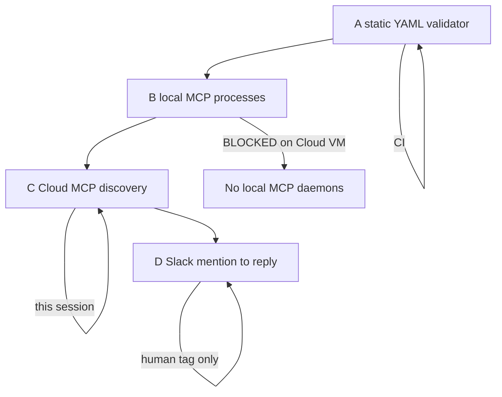
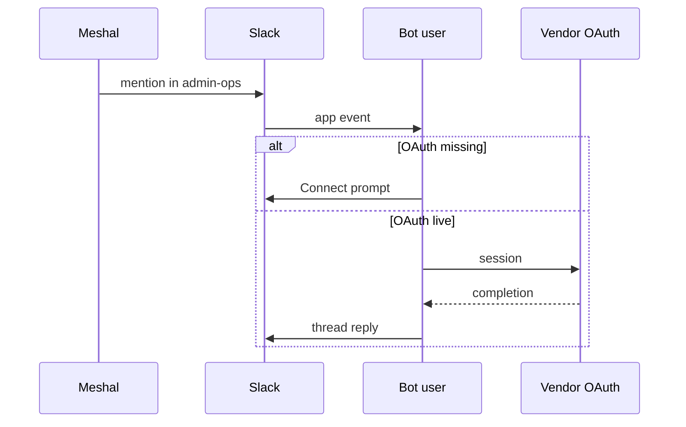

# Integration probe 2026-09-08

Working evidence, not a second inventory. Catalog SSOT remains
`catalog/agent-integrations.yaml`. Slack Canvas is a pointer.
Desktop `C:\Users\mesha\Desktop\ops-shared-inventory` is operator inbox.

**Run:** Cloud Agent `bc-5432d661-d619-57c4-929e-aa74148f1170`
**When:** 2026-09-08 12:52 UTC (probe) plus earlier same-day Slack checks
**Account:** `contact@meshal.ai` / GitHub `alawein`
**Labels:** PROVED / OBSERVED / INFERRED / UNVERIFIED / BLOCKED / RECOMMENDED

## 1. Executive summary

Codex Slack is installed and in `#admin-ops`, but Reply OK failed after a
claimed Connect. ChatGPT Slack is the replaced surface and stays silent by
policy. Notion AI Slack has never posted; Cursor Notion MCP is live and is a
different path. Do not create a parallel inventory. Extend the existing
validator with `scripts/catalog/probe_integrations.py` for static dumps.
Live OAuth stays Meshal-only.

## 2. What already exists (do not fork)

| Surface | Role | Classification |
| --- | --- | --- |
| `catalog/agent-integrations.yaml` | Machine inventory SSOT | PROVED |
| `scripts/catalog/validate-agent-integrations.py` | Static schema/drift | PROVED |
| `docs/governance/slack-agent-runbook.md` | Slack routing | PROVED |
| `docs/operations/admin-ops-integration-checklist.md` | Start-here pointers | PROVED |
| `docs/internal/audits/2026-09-05-slack-integrations-rescan.md` | Prior live rescan | PROVED |
| `docs/internal/audits/2026-09-06-slack-integrations-rescan.md` | Prior live rescan | PROVED |
| MAIOS Canvas `F0C0A1H7258` | Working pointer | OBSERVED |
| Desktop `ops-shared-inventory\routines.yaml` | Operator inbox, last-write 2026-09-08 5:09 AM PT | PROVED (Grok) |

## 3. Layered model



| Layer | Tool | This session |
| --- | --- | --- |
| A static | `validate-agent-integrations.py` / `probe_integrations.py` | PROVED. `--strict` exits 1 only because `jsonschema` is not installed (warning). Zero errors. |
| B local runtime | process/port/MCP server | BLOCKED. Cloud VM has no local MCP daemons to start. |
| C online MCP | GetDynamicTools namespaceStatus | PROVED below. |
| D e2e Slack | human `@` tag | PROVED fail for Codex Reply OK. BLOCKED for auto-send (do not spam). |

## 4. Slack bot identities (PROVED 2026-09-08)

`#admin-ops` `C0B9SRMDJFK` members (ids_only): `U0APESWEF2T` GitHub,
`U0APM5W630C` Meshal, `U0APW2Z3GG2` Cursor, `U0APW7F9S4A` Computer,
`U0AQ8UNAKTK` Notion AI, `U0AQQFJT8AC` Claude, `U0BUNH33CCA` ChatGPT,
`U0BV7V8M3NW` Codex, `U0BV9U2GFED` Kilo.

Catalog note that ChatGPT is not in `#admin-ops` (2026-09-07) is stale.
ChatGPT joined 2026-09-07 08:22 UTC.

## 5. Codex diagnosis

| Question | Result | Label |
| --- | --- | --- |
| Installed Slack bot? | Yes. `@Codex` `U0BV7V8M3NW` | PROVED |
| In `#admin-ops`? | Yes | PROVED |
| Catalog status | `needs_auth` | PROVED (git) |
| Authenticated? | Claimed Connect by Meshal. No Slack reply to prove it | UNVERIFIED |
| Which account? | Must be `contact@meshal.ai` ChatGPT Codex | UNVERIFIED |
| Can receive mentions? | Sep 7 tags produced Connect prompts | PROVED |
| Latest Reply OK delivered? | Parent `1788871213.084829` 2026-09-08 12:40 UTC | PROVED |
| Response attempted? | 0 thread replies. 0 Codex posts on 2026-09-08 public+DM | PROVED |
| Last Codex post | 2026-09-07 02:46 PT Connect button `1788774366.593039` | PROVED |
| Failure class | OAuth incomplete, or Connect completed and Slack eventing still dead | INFERRED |
| Smallest next action | Meshal: Slack Apps → Codex, confirm ChatGPT account, or DM `@Codex` once. Do not re-tag the channel. | RECOMMENDED |

## 6. ChatGPT diagnosis

| Question | Result | Label |
| --- | --- | --- |
| Still installed? | Yes. `@ChatGPT` `U0BUNH33CCA` in `#admin-ops` | PROVED |
| Catalog status | `replaced` | PROVED |
| Public posts | 0 ever in search | PROVED |
| Architecture | Codex replaced ChatGPT Slack. Keep installed until Codex Reply OK, then uninstall | PROVED (runbook v1.2.0) |
| Reconnect? | No. Reconnecting the replaced bot fights the runbook | RECOMMENDED |

## 7. Notion AI diagnosis

| Question | Result | Label |
| --- | --- | --- |
| Slack bot present? | Yes. `@Notion AI` `U0AQ8UNAKTK` in `#admin-ops` | PROVED |
| Public Slack posts | 0 ever | PROVED |
| Cursor Notion MCP | `namespaceStatus: ready`. User search returns Meshal Alawein `contact@meshal.ai` | PROVED |
| Same integration? | No. Slack Notion AI ≠ Notion MCP | PROVED |
| Expected Slack replies? | Runbook says tag `@Notion AI` for Operations Hub / Master Tasks | PROVED |
| Why silent? | Slack app authorized to sit in channel but not to complete mention→reply, or Notion Connections Slack toggle off | INFERRED |
| Smallest next action | Notion Settings → Connections → Slack. Then one Meshal tag. Do not assume MCP is down | RECOMMENDED |

## 8. Cloud MCP discovery (PROVED 2026-09-08)

Ready: Cursor Slack Tools, Slack, Github, Gmail, Google-calendar, Google-drive,
Notion, Railway, Cloudflare-docs, Godaddy, cursor-cloud, cursor-subscriptions,
Treg, Onedrive, Outlook.

needsAuth: Calendly, Cloudflare-bindings/builds/observability, Context,
Docusign, Figma (catalog said error; now needsAuth), Fireflies, Granola,
Huggingface-skills, Lovable, Mobbin, Neon, Posthog, Wonder, Zoom.

error: Supermemory, Todoist.

loading: 1password, Playwright.

Live identity checks this session:

- GitHub MCP `get_me`: login `alawein`, name Meshal Alawein. PROVED
- Notion MCP user search: `contact@meshal.ai`. PROVED
- Gmail `list_labels`: INBOX present; user labels Action/*, Project/Alawein,
  System/Linear, System/GitHub, Subscriptions, DevOps, `AGI (archive)`
  Label_384 (22 threads, 0 unread). Do not fetch AGI archive. PROVED
- Treg catalog row still says token dead 2026-09-07; namespace is ready today.
  Treat as OBSERVED drift, do not call Treg from this audit.

## 9. Message routing



Codex Sep 7 = first branch. Codex Sep 8 Reply OK = no second branch and no
Connect prompt. That is worse than `needs_auth` (silent).

## 10. Tests performed and blocked

| Test | Result |
| --- | --- |
| `validate-agent-integrations.py --strict --json` | FAILED on warning only: jsonschema not installed. 0 errors |
| Slack profile reads Codex / Notion AI / ChatGPT | PROVED bots exist |
| Slack member list `#admin-ops` | PROVED 9 IDs |
| Slack search from those bots | PROVED last Codex 2026-09-07; Notion AI 0; ChatGPT 0 |
| Reply OK thread `1788871213.084829` | PROVED 0 Codex replies |
| Notion / GitHub / Gmail read-only | PROVED |
| Local MCP start/health | BLOCKED |
| Webhook/event delivery logs | BLOCKED (no Slack app admin API) |
| Auto e2e send | BLOCKED (approval required; do not spam) |
| Catalog land of these notes | BLOCKED this PR: open draft [PR #232](https://github.com/alawein/alawein/pull/232) occupies `agent-integrations.yaml` and contradicts ACCEPT 6 |

## 11. Manual actions (Meshal)

```
Lane: Codex Slack
Proved: Reply OK tag 1788871213 has 0 replies
Need: confirm ChatGPT Codex account on the Slack app, or one DM to @Codex
Next: stop channel re-tags until a non-Connect reply exists
```

```
Lane: Notion AI Slack
Proved: bot in admin-ops; 0 public posts; Notion MCP live
Need: Notion Connections Slack toggle, then one tag
Next: do not reconnect ChatGPT Slack
```

```
Lane: ChatGPT Slack
Proved: status replaced; 0 posts; now in admin-ops
Need: keep installed until Codex Reply OK
Next: uninstall only after Codex posts a real 4-liner
```

Five workflow-bot reacts remain open (ACCEPT 6). Park draft PR #232.

## 12. Open risks

- Treating Desktop inventory as git SSOT
- Landing PR #232 (lifts 2026-09-19 gate, marks bots `disable`)
- Calling Treg or fetching `AGI (archive)` mail
- A new Slack chat bot or second inventory YAML

## 13. Re-verify 2026-09-08 13:00 UTC

Same Cloud Agent thread. Live Slack and MCP only. No catalog YAML edit.
No public send. No second inventory.

| Check | Result | Label |
| --- | --- | --- |
| `#admin-ops` members | Same 9 IDs, including ChatGPT `U0BUNH33CCA` | PROVED |
| Profiles | `codex`, `chatgpt`, `notion_ai` in Alawein Workspace | PROVED |
| Codex posts after 2026-09-07 | 0 | PROVED |
| Last Codex post | Connect prompt in thread `1788769288.678259` at `1788774366.593039` (2026-09-07 02:46 PT). Text: connect ChatGPT Codex account | PROVED |
| Reply OK `1788871213.084829` | Still 0 Codex replies. One Cursor note only | PROVED |
| ChatGPT / Notion AI Slack posts | 0 | PROVED |
| GitHub MCP `get_me` | `alawein` / Meshal Alawein | PROVED |
| Notion MCP user search | Meshal Alawein `contact@meshal.ai` | PROVED |
| `probe_integrations.py static` | 0 errors, `ok: true` | PROVED |
| Live CLI (`e2e`, `codex`, …) | exit 2 BLOCKED (session-only) | PROVED |

Cloud MCP this re-verify (namespaceStatus):

- ready: Cursor Slack Tools, Slack, Github, Gmail, Google-calendar,
  Google-drive, notion, Railway, Cloudflare-docs, Godaddy, cursor-cloud,
  cursor-subscriptions, Treg, Onedrive, Outlook
- needsAuth: Calendly, Cloudflare-bindings/builds/observability, Context,
  Docusign, Figma, Fireflies, Granola, Huggingface-skills, Lovable, Mobbin,
  Neon, Posthog, Wonder, Zoom
- error: Supermemory, Todoist
- loading: 1password, Playwright

Drift vs the earlier same-day probe (do not collapse): Figma moved from
`error` to `needsAuth`. Treg and Onedrive/Outlook are ready here; catalog
rows still say Treg token dead / Onedrive needs_auth. Playwright is
`loading` here (catalog historically `ready`). Do not call Treg.

Diagnosis unchanged: Codex Slack is silent after Connect claim; ChatGPT
Slack stays `replaced`; Notion AI Slack is not Notion MCP.
