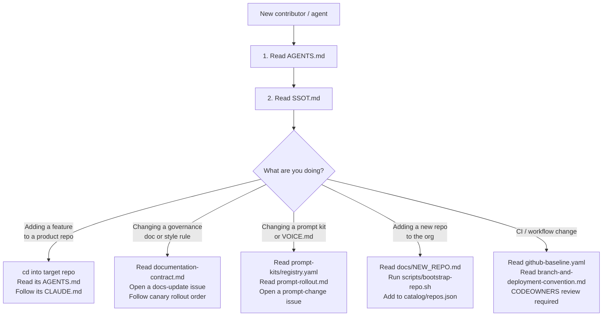

# Onboarding — Alawein Workspace

## What is this repo?

`alawein/alawein` is the governance control plane for the `@alawein` GitHub org.
It contains no product code. It owns:

- Canonical prompt kits (`prompt-kits/`)
- Voice and style contracts (`docs/style/`)
- CI policy templates (`github-baseline.yaml`, `.github/workflows/`)
- Docs doctrine and governance (`docs/governance/`)
- Workspace catalog (`catalog/repos.json`, `catalog/skills.yaml`)

Product code lives in sibling repos. Each sibling is an independent git repo.

---

## Decision Tree



---

## Key Files by Role

| Role | First Read | Second Read | Third Read |
|------|-----------|------------|-----------|
| Frontend dev | target repo's `AGENTS.md` | `design-system/README.md` | `docs/style/VOICE.md` |
| Backend dev | target repo's `AGENTS.md` | `docs/governance/git-operations.md` | — |
| ML / Research | target repo's `AGENTS.md` | `docs/style/VOICE.md` (math section) | — |
| AI / LLMOps | `prompt-kits/AGENT.md` | `prompt-kits/registry.yaml` | `docs/governance/prompt-rollout.md` |
| DevOps | `github-baseline.yaml` | `docs/governance/branch-and-deployment-convention.md` | `.github/workflows/` |
| New repo owner | `docs/NEW_REPO.md` | `scripts/bootstrap-repo.sh` | `catalog/repos.json` schema |

Full capability-domain breakdown: `catalog/skills.yaml`.

---

## Hard Rules (applies workspace-wide)

1. Each sibling repo is an independent git repo — do not assume shared state.
2. Never commit secrets, API keys, or `.env` files.
3. `README.md` and `docs/README.md` are generated — do not hand-edit synced blocks.
4. All governance `.md` files require YAML frontmatter with `type:` and freshness field.
5. Prompt kit changes require a rollout issue and follow `docs/governance/prompt-rollout.md`.
6. CI workflow changes require CODEOWNERS review (`@alawein`).
7. Canary rollout order for style/voice changes: alawein → meshal-web → workspace-tools → alembiq → rest.

---

## Validation Commands

Run these before opening a PR:

```bash
# Doc contract (fast)
bash ./scripts/doctrine/validate-doc-contract.sh --full

# Prompt kit structure
python scripts/doctrine/validate-prompt-kit.py

# Doctrine (full-repo)
python scripts/doctrine/validate-doctrine.py .

# GitHub baseline (control-plane)
python scripts/github/github-baseline-audit.py --local

# Style rules
python scripts/doctrine/build-style-rules.py --check
python scripts/doctrine/validate.py --ci
```

---

## Repo Registry

The canonical list of all workspace repos is `catalog/repos.json`. If you add a
new repo, add it there before opening any governance PR. The `catalog/skills.yaml`
file tracks capability domains — update it if the new repo introduces a new stack
or domain.
