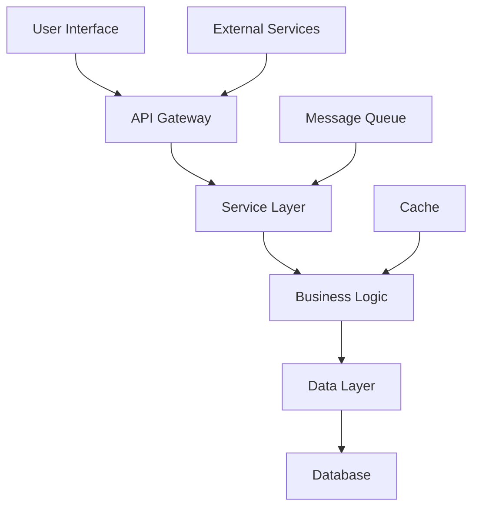
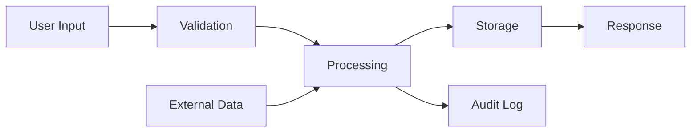
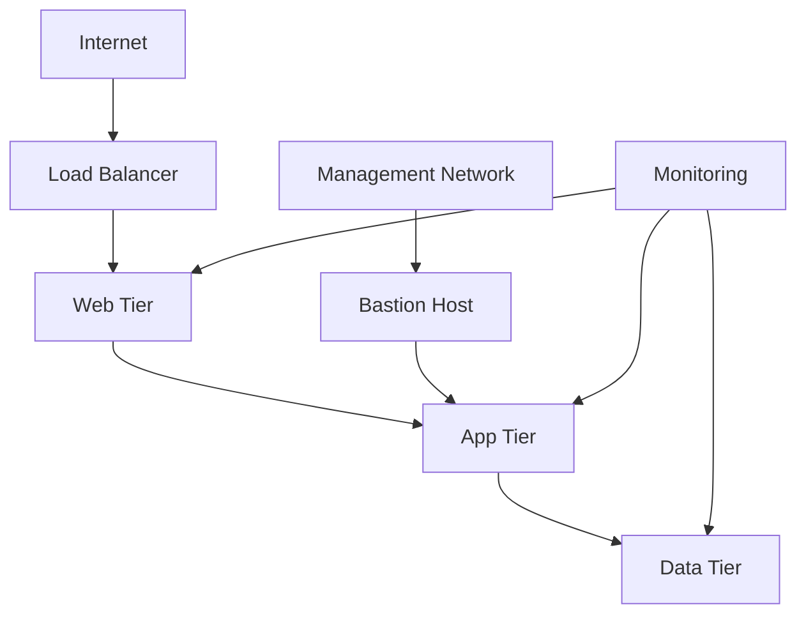
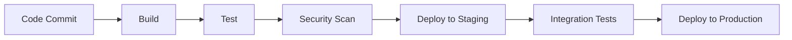

---
document_metadata:
  title: "Architecture Documentation Template"
  document_id: "ARCHITECTURE-TEMPLATE-001"
  version: "1.0.0"
  status: "Active"
  classification: "Internal"
  
  dates:
    created: "2025-12-07"
    last_updated: "2025-12-07"
    next_review: "2026-03-07"
    
  ownership:
    owner: "Engineering Lead"
    maintainer: "Platform Architect"
    reviewers: ["DevOps Lead", "Security Lead", "Development Teams"]
    
  change_summary: |
    [2025-12-07] Initial architecture documentation template creation
    - Standardized architecture documentation structure
    - Included system design and component specifications
    - Added non-functional requirements and scalability considerations
    
  llm_context:
    purpose: "Standardized template for architecture documentation, system design, and technical specifications"
    scope: "System architecture, components, patterns, scalability, security, performance"
    key_concepts: ["architecture", "system design", "components", "scalability", "patterns"]
    related_documents: ["DOCUMENT-TEMPLATE.md", "ARCHITECTURE.md", "SECURITY.md"]
last_verified: 2025-12-09
---

# [System/Application Name] Architecture Documentation

> **Summary:** Comprehensive architecture documentation for [System/Application Name] including system design, components, and technical specifications.

## Quick Reference

| Attribute | Value |
|-----------|-------|
| **Architecture Version** | v1.0.0 |
| **Document ID** | ARCH-XXX-001 |
| **Owner** | Engineering Lead |
| **Last Updated** | 2025-12-07 |
| **Complexity** | [Low/Medium/High] |

---

## Table of Contents

1. [Overview](#overview)
2. [System Architecture](#system-architecture)
3. [Components](#components)
4. [Data Architecture](#data-architecture)
5. [Security Architecture](#security-architecture)
6. [Integration Patterns](#integration-patterns)
7. [Non-Functional Requirements](#non-functional-requirements)
8. [Scalability and Performance](#scalability-and-performance)
9. [Technology Stack](#technology-stack)
10. [Deployment Architecture](#deployment-architecture)

---

## Overview

### System Purpose

[System/Application Name] is a [brief description of what the system does and its business purpose].

### Architecture Goals

- **Scalability**: [Scalability goals and requirements]
- **Reliability**: [Reliability targets and approaches]
- **Security**: [Security objectives and compliance requirements]
- **Performance**: [Performance requirements and targets]
- **Maintainability**: [Maintainability goals and approaches]

### Scope and Boundaries

#### In Scope

- [Component or system 1]
- [Component or system 2]
- [Component or system 3]

#### Out of Scope

- [Component or system 1]
- [Component or system 2]
- [External dependencies]

#### Assumptions and Constraints

- **Assumptions**: [Key assumptions about the system]
- **Constraints**: [Technical, business, or regulatory constraints]
- **Dependencies**: [External systems and dependencies]

---

## System Architecture

### High-Level Architecture



### Architectural Patterns

#### Primary Patterns

- **[Pattern 1]**: [Description and implementation]
- **[Pattern 2]**: [Description and implementation]
- **[Pattern 3]**: [Description and implementation]

#### Design Principles

- **Single Responsibility**: [How this principle is applied]
- **Open/Closed**: [How this principle is applied]
- **Dependency Inversion**: [How this principle is applied]
- **Interface Segregation**: [How this principle is applied]

### Architecture Views

#### 4+1 View Model

1. **Logical View**: [Component organization and relationships]
2. **Process View**: [Concurrency and synchronization]
3. **Development View**: [Module organization and dependencies]
4. **Physical View**: [Hardware and network topology]
5. **Scenarios**: [Use cases and end-to-end flows]

---

## Components

### Component Overview

| Component | Type | Responsibility | Dependencies |
|-----------|------|----------------|--------------|
| **[Component 1]** | [Service/Database/Queue] | [Primary responsibility] | [List of dependencies] |
| **[Component 2]** | [Service/Database/Queue] | [Primary responsibility] | [List of dependencies] |
| **[Component 3]** | [Service/Database/Queue] | [Primary responsibility] | [List of dependencies] |

### Component Details

#### [Component 1]

**Purpose**: [Detailed description of component purpose]

**Interface**:
```typescript
interface [ComponentName]Interface {
  [method1](): [returnType];
  [method2](param: [type]): [returnType];
  [method3](param1: [type], param2: [type]): [returnType];
}
```

**Implementation**:
- **Technology**: [Technology stack used]
- **Configuration**: [Key configuration options]
- **State Management**: [How state is managed]

**Dependencies**:
- **Internal**: [Internal component dependencies]
- **External**: [External service dependencies]
- **Data**: [Data storage dependencies]

#### [Component 2]

**Purpose**: [Detailed description of component purpose]

**Interface**:
```typescript
interface [ComponentName]Interface {
  [method1](): [returnType];
  [method2](param: [type]): [returnType];
  [method3](param1: [type], param2: [type]): [returnType];
}
```

**Implementation**:
- **Technology**: [Technology stack used]
- **Configuration**: [Key configuration options]
- **State Management**: [How state is managed]

**Dependencies**:
- **Internal**: [Internal component dependencies]
- **External**: [External service dependencies]
- **Data**: [Data storage dependencies]

#### [Component 3]

**Purpose**: [Detailed description of component purpose]

**Interface**:
```typescript
interface [ComponentName]Interface {
  [method1](): [returnType];
  [method2](param: [type]): [returnType];
  [method3](param1: [type], param2: [type]): [returnType];
}
```

**Implementation**:
- **Technology**: [Technology stack used]
- **Configuration**: [Key configuration options]
- **State Management**: [How state is managed]

**Dependencies**:
- **Internal**: [Internal component dependencies]
- **External**: [External service dependencies]
- **Data**: [Data storage dependencies]

---

## Data Architecture

### Data Model

#### Entity Relationship Diagram

```mermaid
erDiagram
    Entity1 ||--o{ Entity2 : has
    Entity2 ||--o{ Entity3 : contains
    Entity1 }o--|| Entity4 : belongs to
    
    Entity1 {
        string id PK
        string name
        datetime created_at
        datetime updated_at
    }
    
    Entity2 {
        string id PK
        string entity1_id FK
        string data
        string type
    }
```

#### Data Flow



### Database Architecture

#### Primary Database

- **Type**: [PostgreSQL, MySQL, MongoDB, etc.]
- **Version**: [Database version]
- **Configuration**: [Key configuration settings]
- **Replication**: [Replication strategy]
- **Backup Strategy**: [Backup and recovery procedures]

#### Caching Layer

- **Technology**: [Redis, Memcached, etc.]
- **Configuration**: [Cache configuration]
- **Invalidation Strategy**: [Cache invalidation approach]
- **TTL Policies**: [Time-to-live policies]

#### Data Migration

- **Migration Tool**: [Tool used for migrations]
- **Migration Strategy**: [How migrations are handled]
- **Rollback Procedures**: [How to rollback migrations]
- **Data Consistency**: [How data consistency is maintained]

---

## Security Architecture

### Security Model

#### Authentication

- **Method**: [OAuth 2.0, JWT, SAML, etc.]
- **Implementation**: [How authentication is implemented]
- **Token Management**: [Token generation, validation, and refresh]
- **Session Management**: [Session handling and security]

#### Authorization

- **Model**: [RBAC, ABAC, etc.]
- **Permissions**: [Permission structure and management]
- **Access Control**: [How access is controlled]
- **Privilege Escalation**: [Prevention and detection]

#### Data Protection

- **Encryption at Rest**: [Encryption methods and keys]
- **Encryption in Transit**: [TLS/SSL configuration]
- **Key Management**: [Key rotation and management]
- **Data Classification**: [Data handling by classification]

### Security Controls

#### Network Security

- **Firewall Rules**: [Network security configuration]
- **VPC/Network Segmentation**: [Network isolation]
- **DDoS Protection**: [DDoS mitigation measures]
- **VPN Access**: [Remote access security]

#### Application Security

- **Input Validation**: [Input sanitization and validation]
- **Output Encoding**: [XSS prevention]
- **SQL Injection Prevention**: [Parameterized queries, ORM]
- **CSRF Protection**: [CSRF token implementation]

#### Infrastructure Security

- **Container Security**: [Container hardening and scanning]
- **Orchestration Security**: [Kubernetes security measures]
- **Secrets Management**: [Secret storage and access]
- **Audit Logging**: [Security event logging]

---

## Integration Patterns

### External Integrations

#### Third-Party Services

| Service | Purpose | Protocol | Authentication | Rate Limits |
|---------|---------|----------|----------------|-------------|
| **[Service 1]** | [Purpose] | [REST/GraphQL/etc.] | [Auth method] | [Rate limit] |
| **[Service 2]** | [Purpose] | [REST/GraphQL/etc.] | [Auth method] | [Rate limit] |
| **[Service 3]** | [Purpose] | [REST/GraphQL/etc.] | [Auth method] | [Rate limit] |

#### Integration Patterns

- **API Gateway**: [Gateway configuration and routing]
- **Service Mesh**: [Service mesh implementation]
- **Message Queues**: [Asynchronous communication]
- **Event Streaming**: [Event-driven architecture]

### Internal Communication

#### Service Communication

- **Synchronous**: [REST, gRPC, etc.]
- **Asynchronous**: [Message queues, events]
- **Service Discovery**: [How services find each other]
- **Load Balancing**: [Traffic distribution]

#### Data Synchronization

- **Eventual Consistency**: [Consistency model]
- **Conflict Resolution**: [How conflicts are resolved]
- **Data Replication**: [Replication strategy]
- **Change Data Capture**: [CDC implementation]

---

## Non-Functional Requirements

### Performance Requirements

#### Response Time

| Operation | Target | Maximum | Measurement |
|-----------|--------|---------|-------------|
| **API Calls** | <200ms | <500ms | 95th percentile |
| **Database Queries** | <100ms | <300ms | 95th percentile |
| **Page Load** | <2s | <5s | 95th percentile |

#### Throughput

| Metric | Target | Measurement |
|--------|--------|-------------|
| **Requests/Second** | [target] | Peak load |
| **Concurrent Users** | [target] | Active sessions |
| **Data Processing** | [target] | Records/hour |

#### Resource Utilization

- **CPU Usage**: <70% average, <90% peak
- **Memory Usage**: <80% average, <95% peak
- **Disk I/O**: <80% utilization
- **Network Bandwidth**: <70% utilization

### Availability Requirements

#### Uptime Targets

- **Overall System**: 99.9% uptime
- **Critical Services**: 99.99% uptime
- **Non-Critical Services**: 99.0% uptime
- **Maintenance Windows**: [Scheduled maintenance windows]

#### Fault Tolerance

- **Redundancy**: [Redundancy strategy]
- **Failover**: [Failover procedures]
- **Disaster Recovery**: [DR procedures and RTO/RPO]
- **Data Backup**: [Backup strategy and retention]

### Scalability Requirements

#### Horizontal Scaling

- **Auto-scaling**: [Auto-scaling configuration]
- **Load Distribution**: [Load balancing strategy]
- **Resource Allocation**: [Resource management]
- **Performance Scaling**: [How performance scales with load]

#### Vertical Scaling

- **Resource Limits**: [Maximum resource limits]
- **Upgrade Strategy**: [How to upgrade resources]
- **Performance Impact**: [Impact of resource changes]

---

## Scalability and Performance

### Scaling Strategy

#### Horizontal Scaling

- **Stateless Services**: [How services are designed for scaling]
- **Database Sharding**: [Database scaling approach]
- **Cache Distribution**: [Distributed caching strategy]
- **Load Balancing**: [Load balancing algorithms]

#### Vertical Scaling

- **Resource Optimization**: [Resource optimization techniques]
- **Performance Tuning**: [Performance tuning approaches]
- **Monitoring**: [Resource monitoring and alerting]

### Performance Optimization

#### Caching Strategy

- **Application Caching**: [Application-level caching]
- **Database Caching**: [Database query caching]
- **CDN**: [Content delivery network usage]
- **Browser Caching**: [Client-side caching]

#### Database Optimization

- **Indexing Strategy**: [Database indexing]
- **Query Optimization**: [Query performance tuning]
- **Connection Pooling**: [Database connection management]
- **Read Replicas**: [Read scaling strategy]

---

## Technology Stack

### Backend Technologies

#### Languages and Frameworks

| Technology | Version | Purpose |
|------------|---------|---------|
| **[Language/Framework 1]** | [Version] | [Primary use case] |
| **[Language/Framework 2]** | [Version] | [Primary use case] |
| **[Language/Framework 3]** | [Version] | [Primary use case] |

#### Databases and Storage

| Technology | Version | Purpose |
|------------|---------|---------|
| **[Database 1]** | [Version] | [Primary use case] |
| **[Database 2]** | [Version] | [Primary use case] |
| **[Storage 1]** | [Version] | [Primary use case] |

#### Infrastructure and DevOps

| Technology | Version | Purpose |
|------------|---------|---------|
| **[Infrastructure 1]** | [Version] | [Primary use case] |
| **[Infrastructure 2]** | [Version] | [Primary use case] |
| **[Infrastructure 3]** | [Version] | [Primary use case] |

### Frontend Technologies

#### Frameworks and Libraries

| Technology | Version | Purpose |
|------------|---------|---------|
| **[Framework 1]** | [Version] | [Primary use case] |
| **[Library 1]** | [Version] | [Primary use case] |
| **[Tool 1]** | [Version] | [Primary use case] |

### Monitoring and Observability

#### Monitoring Tools

| Tool | Purpose | Metrics |
|------|---------|---------|
| **[Tool 1]** | [Monitoring purpose] | [Key metrics] |
| **[Tool 2]** | [Monitoring purpose] | [Key metrics] |
| **[Tool 3]** | [Monitoring purpose] | [Key metrics] |

---

## Deployment Architecture

### Infrastructure Architecture

#### Cloud Provider

- **Provider**: [AWS, Azure, GCP, etc.]
- **Region**: [Primary region]
- **Availability Zones**: [AZ configuration]
- **Account Structure**: [Multi-account setup]

#### Network Architecture



#### Compute Architecture

- **Containers**: [Container orchestration platform]
- **Virtual Machines**: [VM usage and configuration]
- **Serverless**: [Serverless components]
- **Storage**: [Storage architecture]

### Deployment Pipeline

#### CI/CD Pipeline



#### Environment Management

| Environment | Purpose | Configuration |
|-------------|---------|---------------|
| **Development** | Development and testing | [Dev configuration] |
| **Staging** | Pre-production testing | [Staging configuration] |
| **Production** | Live environment | [Production configuration] |

### Disaster Recovery

#### Backup Strategy

- **Data Backups**: [Backup frequency and retention]
- **Configuration Backups**: [Infrastructure configuration backup]
- **Application Backups**: [Application state backup]
- **Recovery Testing**: [Recovery testing schedule]

#### Recovery Procedures

1. **Disaster Declaration**: [How to declare a disaster]
2. **Recovery Initiation**: [Recovery activation procedures]
3. **System Restoration**: [Step-by-step recovery]
4. **Validation**: [Recovery validation procedures]

---

## Related Resources

### Architecture Documents

- [`SYSTEM-DESIGN.md`](./SYSTEM-DESIGN.md) - Detailed system design
- [`API-ARCHITECTURE.md`](./API-ARCHITECTURE.md) - API architecture and design
- [`DATA-ARCHITECTURE.md`](./DATA-ARCHITECTURE.md) - Data architecture and modeling

### Technical Documents

- [`SECURITY-ARCHITECTURE.md`](./SECURITY-ARCHITECTURE.md) - Security architecture
- [`PERFORMANCE-GUIDE.md`](./PERFORMANCE-GUIDE.md) - Performance optimization
- [`SCALABILITY-GUIDE.md`](./SCALABILITY-GUIDE.md) - Scaling strategies

### External Resources

- [AWS Architecture Center](https://aws.amazon.com/architecture/) - Architecture patterns
- [Azure Architecture Center](https://docs.microsoft.com/en-us/azure/architecture/) - Architecture guidance
- [Google Cloud Architecture](https://cloud.google.com/architecture) - Architecture best practices

---

## Document History

| Version | Date | Author | Changes |
|---------|------|--------|---------|
| 1.0.0 | 2025-12-07 | Architecture Team | Initial architecture documentation template |

---

## Review and Approval

| Role | Name | Date | Signature |
|------|------|------|-----------|
| **Architecture Lead** | _______________________ | ______ | _________ |
| **Engineering Lead** | _______________________ | ______ | _________ |
| **DevOps Lead** | _______________________ | ______ | _________ |
| **Security Lead** | _______________________ | ______ | _________ |

---

*Document ID: ARCHITECTURE-TEMPLATE-001 | Version: 1.0.0 | Classification: Internal*

**This architecture documentation follows the Alawein Technologies Documentation Governance Policy.**
