# Multi-Agent Governance System Documentation

> Comprehensive guide to the automated code review and governance enforcement
> system

## Table of Contents

- [1. Executive Summary](#1-executive-summary)
- [2. System Architecture](#2-system-architecture)
  - [2.1 Directory Structure](#21-directory-structure)
  - [2.2 Workflow Sequence Diagram](#22-workflow-sequence-diagram)
  - [2.3 Architecture Diagram](#23-architecture-diagram)
- [3. Component Guidelines](#3-component-guidelines)
  - [3.1 GovernanceOrchestrator](#31-governanceorchestrator)
  - [3.2 SkepticReviewer](#32-skepticreviewer)
  - [3.3 GovernanceDashboard](#33-governancedashboard)
  - [3.4 AutoRefactorPipeline](#34-autorefactorpipeline)
- [4. Workflow Documentation](#4-workflow-documentation)
- [5. Skeptic Review Report](#5-skeptic-review-report)

---

## 1. Executive Summary

### Overview

The Multi-Agent Governance System is a TypeScript-based automation framework
that coordinates multiple specialized agents to perform automated code review,
risk assessment, and governance enforcement. The system implements Anthropic's
agentic workflow patterns with a focus on adversarial validation through
self-refutation.

### Key Benefits

| Benefit                       | Description                                                                                       |
| ----------------------------- | ------------------------------------------------------------------------------------------------- |
| **Automated Compliance**      | Continuous validation against TypeScript, ESLint, tests, and security policies                    |
| **Multi-Agent Review**        | Five specialized agents (analyzer, refactor, skeptic, organizer, security) collaborate on changes |
| **Self-Refutation**           | Skeptic agent challenges every proposed change with adversarial questions                         |
| **Real-Time Dashboard**       | Health metrics across 5 categories with historical trend tracking                                 |
| **Safe Refactoring**          | Dry-run capability with validation checkpoints before applying changes                            |
| **Event-Driven Architecture** | EventEmitter-based communication for extensibility and monitoring                                 |

### Key Capabilities

- **Discovery → Analysis → Proposal → Review → Validation → Apply** workflow
  pipeline
- Validation checkpoints for TypeScript compilation, ESLint, tests, and security
  scanning
- Skeptic approval requirement with configurable self-refutation rounds
- Automated dashboard metrics collection and historical trend analysis
- MCP server integration for external tool orchestration

### Integration Points

```text
┌──────────────────────────────────────────────────────────────┐
│                    Repository Workflows                       │
├──────────────────────────────────────────────────────────────┤
│  Pre-commit → Governance Check → CI/CD → Scheduled Audit     │
├──────────────────────────────────────────────────────────────┤
│     MCP Servers: filesystem, git, semgrep, sequential-thinking│
└──────────────────────────────────────────────────────────────┘
```

---

## 2. System Architecture

### 2.1 Directory Structure

```text
automation/
├── agents/
│   └── governance/
│       ├── index.ts              # Module exports and system factory
│       ├── orchestrator.ts       # Multi-agent coordinator
│       ├── skeptic-reviewer.ts   # Adversarial review agent
│       └── dashboard.ts          # Health metrics dashboard
├── workflows/
│   ├── auto-refactor.ts          # Automated refactoring pipeline
│   ├── config/
│   │   └── workflows.yaml        # Workflow registry definitions
│   └── templates/
│       ├── code_review_workflow.yaml
│       └── refactoring_workflow.yaml
└── ...

.ai/
└── mcp/
    └── workflows/
        └── governance-workflow.yaml  # MCP multi-agent configuration

.metaHub/
└── policies/
    ├── root-structure.yaml       # Repository structure rules
    └── protected-files.yaml      # Protected file definitions
```

### 2.2 Workflow Sequence Diagram


### 2.3 Architecture Diagram

```mermaid
flowchart TB
    subgraph External["External Triggers"]
        PC[Pre-commit Hook]
        PR[Pull Request]
        SA[Scheduled Audit]
    end

    subgraph MCP["MCP Server Layer"]
        FS[filesystem]
        GIT[git]
        SEM[semgrep]
        SEQ[sequential-thinking]
    end

    subgraph Orchestration["Governance Orchestrator"]
        direction TB
        ORCH[GovernanceOrchestrator<br/>━━━━━━━━━━━━<br/>• EventEmitter<br/>• Message Queue<br/>• Checkpoint Manager]
    end

    subgraph Agents["Agent Pool"]
        direction TB
        ANA[🔍 Analyzer<br/>static_analysis<br/>complexity_metrics]
        REF[🔧 Refactor<br/>extract_method<br/>add_types]
        SKP[🤔 Skeptic<br/>risk_assessment<br/>self_refutation]
        ORG[📁 Organizer<br/>structure_validation<br/>policy_enforcement]
        SEC[🔒 Security<br/>vulnerability_scan<br/>secrets_detection]
    end

    subgraph Validation["Validation Checkpoints"]
        direction LR
        TS[TypeScript<br/>tsc --noEmit]
        ES[ESLint<br/>npm run lint]
        TEST[Tests<br/>npm test]
        AUD[Security<br/>npm audit]
    end

    subgraph Dashboard["Governance Dashboard"]
        DASH[GovernanceDashboard<br/>━━━━━━━━━━━━<br/>• Health Score: 0-100<br/>• 5 Categories<br/>• Trend History]
    end

    subgraph Pipeline["Auto-Refactor Pipeline"]
        PIPE[AutoRefactorPipeline<br/>━━━━━━━━━━━━<br/>• Opportunity Scanner<br/>• Dry-Run Mode<br/>• Validation Gate]
    end

    subgraph Output["Outputs"]
        RPT[📄 Governance Report<br/>JSON/Markdown]
        MET[📊 Health Metrics<br/>Historical Trends]
        CHG[✅ Applied Changes<br/>With Audit Trail]
    end

    %% External triggers
    PC --> ORCH
    PR --> ORCH
    SA --> ORCH

    %% MCP connections
    ORCH <--> FS
    ORCH <--> GIT
    ORCH <--> SEM
    ORCH <--> SEQ

    %% Agent orchestration
    ORCH --> ANA
    ORCH --> REF
    ORCH --> SKP
    ORCH --> ORG
    ORCH --> SEC

    %% Agent to validation
    ANA --> Validation
    SKP --> Validation

    %% Dashboard integration
    ORCH --> DASH
    Validation --> DASH

    %% Pipeline integration
    REF --> PIPE
    PIPE --> Validation

    %% Outputs
    ORCH --> RPT
    DASH --> MET
    PIPE --> CHG

    %% Event flow styling
    style ORCH fill:#4a90d9,stroke:#2c5282,color:#fff
    style SKP fill:#e53e3e,stroke:#c53030,color:#fff
    style DASH fill:#38a169,stroke:#276749,color:#fff
    style PIPE fill:#d69e2e,stroke:#975a16,color:#fff
```



---

## 3. Component Guidelines

### 3.1 GovernanceOrchestrator

**Location:** `automation/agents/governance/orchestrator.ts`

#### Purpose and Responsibilities

The `GovernanceOrchestrator` is the central coordinator that manages multi-agent
workflows. It:

- Coordinates message passing between agents (analyzer, refactor, skeptic,
  organizer, security)
- Manages validation checkpoints (TypeScript, ESLint, tests, security)
- Tracks proposed changes through review lifecycle
- Generates comprehensive governance reports
- Emits events for external monitoring and integration

#### Key Interfaces and Types

```typescript
// Agent roles in the system
type AgentRole = 'analyzer' | 'refactor' | 'skeptic' | 'organizer' | 'security';

// Message format for inter-agent communication
interface AgentMessage {
  from: AgentRole;
  to: AgentRole | 'orchestrator';
  type:
    | 'proposal'
    | 'review'
    | 'approval'
    | 'rejection'
    | 'question'
    | 'report';
  content: unknown;
  timestamp: Date;
  correlationId: string;
}

// Validation checkpoint definition
interface ValidationCheckpoint {
  name: string;
  check: () => Promise<boolean>;
  required: boolean;
}

// Proposed change tracking
interface ProposedChange {
  id: string;
  agent: AgentRole;
  file: string;
  description: string;
  diff?: string;
  status: 'pending' | 'approved' | 'rejected' | 'applied';
  reviews: ChangeReview[];
}

// Configuration options
interface OrchestratorConfig {
  workspacePath: string; // Root path for validation commands
  minReviewRounds: number; // Minimum reviews before approval (default: 2)
  requireSkepticApproval: boolean; // Block without skeptic approval (default: true)
  autoApplyApproved: boolean; // Auto-apply approved changes (default: false)
  reportPath: string; // Where to save reports
}
```

#### Usage Examples

```typescript
import { createGovernanceOrchestrator } from './automation/agents/governance';

// Create orchestrator with custom configuration
const orchestrator = createGovernanceOrchestrator({
  workspacePath: process.cwd(),
  minReviewRounds: 2,
  requireSkepticApproval: true,
  autoApplyApproved: false,
  reportPath: '.archive/reports/governance',
});

// Listen for events
orchestrator.on('finding', (finding) => {
  console.log(`[${finding.severity}] ${finding.message}`);
});

orchestrator.on('change-proposed', (change) => {
  console.log(`New change proposed: ${change.description}`);
});

orchestrator.on('validation-result', (result) => {
  console.log(`${result.checkpoint}: ${result.passed ? '✅' : '❌'}`);
});

// Register a finding from analysis
orchestrator.registerFinding({
  agent: 'analyzer',
  severity: 'medium',
  category: 'complexity',
  message: 'Function exceeds complexity threshold',
  file: 'src/utils.ts',
  line: 42,
  suggestion: 'Consider extracting helper functions',
});

// Propose a change for review
const changeId = orchestrator.proposeChange({
  agent: 'refactor',
  file: 'src/utils.ts',
  description: 'Extract validation logic to separate function',
  diff: `- function validate(data) { /* 50 lines */ }
+ function validateFormat(data) { /* 20 lines */ }
+ function validateContent(data) { /* 20 lines */ }`,
});

// Submit a review
orchestrator.reviewChange(changeId, {
  reviewer: 'skeptic',
  decision: 'approve',
  comments: 'Change reduces complexity without breaking API',
});

// Run validation checkpoints
const results = await orchestrator.runValidation();
console.log(
  `Validation: ${results.every((r) => r.passed) ? 'PASSED' : 'FAILED'}`,
);

// Generate final report
const report = orchestrator.generateReport();
console.log(`Overall Status: ${report.overallStatus}`);
```

#### Configuration Options

| Option                   | Type    | Default                       | Description                                             |
| ------------------------ | ------- | ----------------------------- | ------------------------------------------------------- |
| `workspacePath`          | string  | `process.cwd()`               | Root directory for running validation commands          |
| `minReviewRounds`        | number  | `2`                           | Minimum number of reviews before change can be approved |
| `requireSkepticApproval` | boolean | `true`                        | If true, changes blocked until skeptic approves         |
| `autoApplyApproved`      | boolean | `false`                       | If true, automatically apply changes once approved      |
| `reportPath`             | string  | `.archive/reports/governance` | Directory for saving governance reports                 |

#### Integration Points

- **Event Emission:** Emits `finding`, `change-proposed`, `change-reviewed`,
  `change-status-updated`, `change-applied`, `change-error`,
  `validation-result`, `validation-failed`
- **MCP Servers:** Integrates with `filesystem`, `git`, `semgrep`,
  `sequential-thinking` via workflow YAML
- **Dashboard:** Feeds metrics to `GovernanceDashboard` for visualization

---

### 3.2 SkepticReviewer

**Location:** `automation/agents/governance/skeptic-reviewer.ts`

#### Purpose and Responsibilities

The `SkepticReviewer` is an adversarial review agent that challenges every
proposed change with "what could go wrong?" analysis. It implements:

- Risk assessment (breaking changes, security, performance, regression,
  compatibility)
- Skeptical question generation
- Concern identification (missing tests, incomplete changes, side effects)
- Self-refutation loop for robust validation
- Confidence scoring based on identified risks

#### Key Interfaces and Types

```typescript
// Comprehensive analysis result
interface SkepticAnalysis {
  changeId: string;
  risks: Risk[];
  questions: string[];
  concerns: Concern[];
  recommendation: 'approve' | 'reject' | 'request-changes';
  confidence: number; // 0.0 to 1.0
  refutationRounds: RefutationRound[];
}

// Risk categories and severity
interface Risk {
  category:
    | 'breaking-change'
    | 'security'
    | 'performance'
    | 'regression'
    | 'compatibility';
  severity: 'critical' | 'high' | 'medium' | 'low';
  description: string;
  mitigation?: string;
}

// Concern types
interface Concern {
  type:
    | 'missing-tests'
    | 'incomplete-change'
    | 'side-effects'
    | 'unclear-intent'
    | 'scope-creep';
  description: string;
  evidence?: string;
}

// Self-refutation tracking
interface RefutationRound {
  round: number;
  challenge: string;
  response: string;
  resolved: boolean;
}

// Configuration
interface SkepticConfig {
  minRefutationRounds: number; // Minimum self-refutation iterations (default: 2)
  riskThreshold: number; // Confidence threshold for approval (default: 0.7)
  requireTestCoverage: boolean; // Flag missing test concerns (default: true)
  blockOnCriticalRisks: boolean; // Reject on critical risks (default: true)
}
```

#### Usage Examples

```typescript
import { createSkepticReviewer } from './automation/agents/governance';
import type { ProposedChange } from './automation/agents/governance';

// Create skeptic with custom configuration
const skeptic = createSkepticReviewer({
  minRefutationRounds: 3, // More thorough review
  riskThreshold: 0.8, // Higher confidence required
  requireTestCoverage: true,
  blockOnCriticalRisks: true,
});

// Analyze a proposed change
const change: ProposedChange = {
  id: 'change-123',
  agent: 'refactor',
  file: 'src/auth/login.ts',
  description: 'Refactor authentication flow',
  diff: `- const token = authenticate(user, password);
+ const { token, refreshToken } = authenticate(user, password);`,
  status: 'pending',
  reviews: [],
};

// Get comprehensive analysis
const analysis = await skeptic.analyzeChange(change);

console.log(`Recommendation: ${analysis.recommendation}`);
console.log(`Confidence: ${(analysis.confidence * 100).toFixed(0)}%`);
console.log(`Risks: ${analysis.risks.length}`);
console.log(`Concerns: ${analysis.concerns.length}`);

// View refutation rounds
for (const round of analysis.refutationRounds) {
  console.log(
    `Round ${round.round}: ${round.resolved ? '✓' : '✗'} ${round.challenge}`,
  );
}

// Generate review for orchestrator integration
const review = await skeptic.generateReview(change);
console.log(review.comments);

// Convert analysis to findings for reporting
const findings = skeptic.analysisToFindings(analysis);
findings.forEach((f) => console.log(`[${f.severity}] ${f.message}`));
```

#### Configuration Options

| Option                 | Type    | Default | Description                                     |
| ---------------------- | ------- | ------- | ----------------------------------------------- |
| `minRefutationRounds`  | number  | `2`     | Number of self-refutation iterations per change |
| `riskThreshold`        | number  | `0.7`   | Minimum confidence score for approval           |
| `requireTestCoverage`  | boolean | `true`  | Flag concern when tests not updated             |
| `blockOnCriticalRisks` | boolean | `true`  | Auto-reject changes with critical risks         |

#### Self-Refutation Process

The skeptic performs iterative self-refutation to challenge its own analysis:

1. **Phase 1: Risk Assessment** - Detect breaking changes, security risks,
   performance impacts
2. **Phase 2: Question Generation** - Generate skeptical questions about edge
   cases
3. **Phase 3: Concern Identification** - Flag missing tests, incomplete changes,
   side effects
4. **Phase 4: Self-Refutation Loop** - For each round:
   - Generate challenge: "What could go wrong?"
   - Attempt to address the challenge
   - Evaluate if the challenge was resolved
5. **Phase 5: Final Recommendation** - Calculate confidence and determine
   decision

---

### 3.3 GovernanceDashboard

**Location:** `automation/agents/governance/dashboard.ts`

#### Dashboard Purpose

The `GovernanceDashboard` provides real-time metrics and health scores for
continuous governance monitoring. It:

- Collects metrics across 5 categories (TypeScript, ESLint, tests, security,
  structure)
- Calculates an overall health score (0-100)
- Tracks historical trends over configurable time periods
- Generates text-based and JSON reports

#### Dashboard Interfaces

```typescript
interface HealthMetrics {
  timestamp: Date;
  overallScore: number; // 0-100 composite score
  categories: {
    typescript: CategoryScore;
    eslint: CategoryScore;
    tests: CategoryScore;
    security: CategoryScore;
    structure: CategoryScore;
  };
  trends: TrendData[]; // Historical data points
}

interface CategoryScore {
  score: number; // 0-100 for this category
  status: 'pass' | 'warn' | 'fail';
  details: string;
  lastCheck: Date;
}

interface TrendData {
  date: string; // YYYY-MM-DD
  score: number;
  issues: number;
}

interface DashboardConfig {
  workspacePath: string; // Root path for checks
  historyPath: string; // Where to save history
  maxHistoryDays: number; // Trend retention (default: 30)
}
```

#### Dashboard Usage

```typescript
import { createGovernanceDashboard } from './automation/agents/governance';

const dashboard = createGovernanceDashboard({
  workspacePath: process.cwd(),
  historyPath: '.archive/reports/governance',
  maxHistoryDays: 30,
});

// Collect all metrics (runs TypeScript, ESLint, tests, security, structure checks)
const metrics = await dashboard.collectMetrics();

console.log(`Overall Health Score: ${metrics.overallScore}/100`);
console.log(`TypeScript: ${metrics.categories.typescript.status}`);
console.log(`ESLint: ${metrics.categories.eslint.details}`);
console.log(`Tests: ${metrics.categories.tests.details}`);

// Generate text-based dashboard report
const report = dashboard.generateReport();
console.log(report);
// ╔══════════════════════════════════════════════════════════════╗
// ║              GOVERNANCE DASHBOARD                            ║
// ║              2025-12-04                                      ║
// ╠══════════════════════════════════════════════════════════════╣
// ║  OVERALL HEALTH SCORE: 85/100                                ║
// ...

// Access current metrics
const currentMetrics = dashboard.getMetrics();
```

#### Dashboard Category Scoring

| Category       | Calculation                                          | Status Thresholds                      |
| -------------- | ---------------------------------------------------- | -------------------------------------- |
| **TypeScript** | 100 - (errors × 10)                                  | pass=100, fail=any errors              |
| **ESLint**     | 100 - (errors × 10) - (warnings × 2)                 | fail=errors>0, warn=warnings>10        |
| **Tests**      | (passed / total) × 100                               | fail=any failures                      |
| **Security**   | 100 - (critical × 30) - (high × 20) - (moderate × 5) | fail=critical/high, warn=moderate      |
| **Structure**  | 100 - (violations × 5)                               | fail=violations>5, warn=any violations |

---

### 3.4 AutoRefactorPipeline

**Location:** `automation/workflows/auto-refactor.ts`

#### Pipeline Purpose

The `AutoRefactorPipeline` identifies and applies safe refactoring operations
with validation. It:

- Scans for refactoring opportunities (large files, complex functions, missing
  types)
- Supports dry-run mode for safe preview
- Validates changes after each refactoring
- Generates summary reports with metrics

#### Pipeline Interfaces

```typescript
interface RefactoringOpportunity {
  id: string;
  type: RefactoringType;
  file: string;
  line?: number;
  severity: 'high' | 'medium' | 'low';
  description: string;
  estimatedImpact: string;
  autoFixable: boolean;
}

type RefactoringType =
  | 'large-file' // Files exceeding maxFileLines
  | 'complex-function' // Functions exceeding complexity threshold
  | 'duplicate-code' // Detected duplicate code blocks
  | 'missing-types' // Missing TypeScript type annotations
  | 'dead-code' // Unused exports or functions
  | 'long-function'; // Functions exceeding maxFunctionLines

interface PipelineConfig {
  workspacePath: string;
  maxFileLines: number; // Default: 500
  maxFunctionComplexity: number; // Default: 10
  maxFunctionLines: number; // Default: 50
  dryRun: boolean; // Default: true (safe mode)
  validateAfterEach: boolean; // Default: true
}
```

#### Pipeline Usage

```typescript
import { createAutoRefactorPipeline } from './automation/workflows/auto-refactor';

const pipeline = createAutoRefactorPipeline({
  workspacePath: process.cwd(),
  maxFileLines: 500,
  maxFunctionLines: 50,
  dryRun: true, // Always start with dry-run
  validateAfterEach: true,
});

// Scan for refactoring opportunities
const opportunities = await pipeline.scan();

console.log(`Found ${opportunities.length} opportunities:`);
for (const opp of opportunities) {
  console.log(`  [${opp.severity}] ${opp.type}: ${opp.description}`);
  console.log(`    File: ${opp.file}${opp.line ? `:${opp.line}` : ''}`);
  console.log(`    Impact: ${opp.estimatedImpact}`);
}

// Validate current state
const validation = await pipeline.validate();
console.log(`Validation: ${validation.passed ? 'PASSED' : 'FAILED'}`);
console.log(validation.message);

// Generate summary report
const report = pipeline.generateReport();
console.log(`Total opportunities: ${report.totalOpportunities}`);
console.log(`By type:`, report.byType);
console.log(`By severity:`, report.bySeverity);
console.log(`Auto-fixable: ${report.autoFixable}`);
```

#### Pipeline Configuration

| Option                  | Type    | Default         | Description                                          |
| ----------------------- | ------- | --------------- | ---------------------------------------------------- |
| `workspacePath`         | string  | `process.cwd()` | Root directory to scan                               |
| `maxFileLines`          | number  | `500`           | Files larger trigger 'large-file' opportunity        |
| `maxFunctionComplexity` | number  | `10`            | Cyclomatic complexity threshold                      |
| `maxFunctionLines`      | number  | `50`            | Functions longer trigger 'long-function' opportunity |
| `dryRun`                | boolean | `true`          | If true, only report without applying changes        |
| `validateAfterEach`     | boolean | `true`          | Run validation after each applied change             |

---

## 4. Workflow Documentation

### Running Governance Checks

#### Quick Start

```bash
# Run governance dashboard to collect metrics
npx ts-node -e "
import { createGovernanceDashboard } from './automation/agents/governance';
const dash = createGovernanceDashboard();
dash.collectMetrics().then(m => console.log(dash.generateReport()));
"

# Scan for refactoring opportunities
npx ts-node -e "
import { createAutoRefactorPipeline } from './automation/workflows/auto-refactor';
const pipe = createAutoRefactorPipeline({ dryRun: true });
pipe.scan().then(opps => console.log(JSON.stringify(opps, null, 2)));
"
```

#### Full Governance Workflow

```typescript
import {
  createGovernanceSystem,
  createGovernanceDashboard,
} from './automation/agents/governance';
import { createAutoRefactorPipeline } from './automation/workflows/auto-refactor';

async function runGovernanceWorkflow() {
  // 1. Initialize components
  const { orchestrator, skeptic } = createGovernanceSystem();
  const dashboard = createGovernanceDashboard();
  const pipeline = createAutoRefactorPipeline({ dryRun: true });

  // 2. Collect current health metrics
  console.log('📊 Collecting health metrics...');
  const metrics = await dashboard.collectMetrics();
  console.log(dashboard.generateReport());

  // 3. Scan for refactoring opportunities
  console.log('\n🔍 Scanning for opportunities...');
  const opportunities = await pipeline.scan();

  // 4. Propose changes for review
  for (const opp of opportunities.filter((o) => o.severity !== 'low')) {
    orchestrator.proposeChange({
      agent: 'refactor',
      file: opp.file,
      description: opp.description,
    });
  }

  // 5. Run validation
  console.log('\n✅ Running validation...');
  const validationResults = await orchestrator.runValidation();

  // 6. Generate final report
  const report = orchestrator.generateReport();
  console.log(`\n📄 Governance Report: ${report.overallStatus.toUpperCase()}`);
  console.log(`   Findings: ${report.findings.length}`);
  console.log(`   Changes: ${report.changes.length}`);

  return report;
}

runGovernanceWorkflow();
```

### Interpreting Dashboard Metrics

The dashboard provides metrics across 5 categories:

| Score Range | Health Status | Action                         |
| ----------- | ------------- | ------------------------------ |
| 90-100      | 🟢 Excellent  | Maintain current practices     |
| 70-89       | 🟡 Good       | Address warnings proactively   |
| 50-69       | 🟠 Fair       | Prioritize improvement tasks   |
| 0-49        | 🔴 Poor       | Immediate remediation required |

### Configuring Self-Refutation Rounds

The skeptic reviewer's self-refutation can be tuned:

```typescript
import { createSkepticReviewer } from './automation/agents/governance';

// Conservative configuration (more thorough review)
const strictSkeptic = createSkepticReviewer({
  minRefutationRounds: 5, // 5 rounds of self-challenge
  riskThreshold: 0.9, // Require 90% confidence
  requireTestCoverage: true,
  blockOnCriticalRisks: true,
});

// Lenient configuration (faster review)
const fastSkeptic = createSkepticReviewer({
  minRefutationRounds: 1, // Single refutation round
  riskThreshold: 0.5, // Accept 50% confidence
  requireTestCoverage: false,
  blockOnCriticalRisks: false,
});
```

### CI/CD Integration

#### GitHub Actions Workflow

```yaml
name: Governance Check

on:
  pull_request:
    branches: [main]
  schedule:
    - cron: '0 9 * * 1' # Weekly on Monday 9 AM

jobs:
  governance:
    runs-on: ubuntu-latest
    steps:
      - uses: actions/checkout@v4

      - name: Setup Node.js
        uses: actions/setup-node@v4
        with:
          node-version: '20'

      - name: Install dependencies
        run: npm ci

      - name: Run Governance Checks
        run: |
          npx ts-node scripts/governance-check.ts

      - name: Upload Report
        uses: actions/upload-artifact@v4
        with:
          name: governance-report
          path: .archive/reports/governance/*.json
```

#### Pre-commit Hook

```bash
#!/bin/sh
# .git/hooks/pre-commit

echo "🔍 Running governance pre-commit checks..."

# Quick validation only
npx ts-node -e "
import { createGovernanceDashboard } from './automation/agents/governance';
const dash = createGovernanceDashboard();
dash.collectMetrics().then(m => {
  if (m.overallScore < 50) {
    console.error('❌ Governance score too low:', m.overallScore);
    process.exit(1);
  }
  console.log('✅ Governance check passed:', m.overallScore);
});
"
```

---

## 5. Skeptic Review Report

> This section contains the self-refutation analysis of the governance system
> implementation

### 5.1 Analysis Summary

| Metric                     | Value                                                                              |
| -------------------------- | ---------------------------------------------------------------------------------- |
| **Components Analyzed**    | GovernanceOrchestrator, SkepticReviewer, GovernanceDashboard, AutoRefactorPipeline |
| **Total Risks Identified** | 6                                                                                  |
| **Critical Risks**         | 1                                                                                  |
| **High Risks**             | 2                                                                                  |
| **Medium Risks**           | 3                                                                                  |
| **Recommendation**         | request-changes                                                                    |
| **Confidence**             | 65%                                                                                |
| **Refutation Rounds**      | 3                                                                                  |

### 5.2 Identified Risks

#### Risk 1: Unhandled Command Execution Failures (Critical)

**Category:** Security / Reliability

**Description:** The `runCommand` method in `GovernanceOrchestrator` and
`execAsync` calls in `GovernanceDashboard` execute shell commands without proper
error handling or input sanitization.

**Evidence:**

```typescript
// orchestrator.ts:135-142
private async runCommand(cmd: string): Promise<boolean> {
  const { exec } = await import('child_process');
  return new Promise((resolve) => {
    exec(cmd, { cwd: this.config.workspacePath }, (error) => {
      resolve(!error);  // Silent failure - no error details preserved
    });
  });
}
```

**Concerns:**

1. Command injection vulnerability if `workspacePath` is user-controlled
2. No timeout mechanism - commands could hang indefinitely
3. Error details are discarded, making debugging difficult

**Mitigation:**

- Add command timeout with `timeout` option in exec
- Sanitize or validate `workspacePath` before use
- Log error details for debugging
- Use `execFile` instead of `exec` for better security

---

#### Risk 2: Race Condition in Change Review Process (High)

**Category:** Regression / Reliability

**Description:** The `reviewChange` method modifies the `reviews` array and
calls `evaluateChangeStatus` without synchronization, creating potential race
conditions in concurrent review scenarios.

**Evidence:**

```typescript
// orchestrator.ts:171-183
public reviewChange(changeId: string, review: Omit<ChangeReview, 'timestamp'>): boolean {
  const change = this.pendingChanges.get(changeId);
  if (!change) return false;

  change.reviews.push({ ...review, timestamp: new Date() });  // Not atomic
  this.emit('change-reviewed', { change, review });

  if (change.reviews.length >= this.config.minReviewRounds) {
    this.evaluateChangeStatus(change);  // May run concurrently
  }
  return true;
}
```

**Concerns:**

1. Two agents reviewing simultaneously could both trigger `evaluateChangeStatus`
2. Review count check is not atomic with the push operation
3. Could result in inconsistent change status

**Mitigation:**

- Use a mutex or queue for review processing
- Implement optimistic locking on change status
- Add review deduplication by reviewer

---

#### Risk 3: Memory Leak in Event Listeners (High)

**Category:** Performance / Reliability

**Description:** The `createGovernanceSystem` factory wires up event listeners
on the orchestrator but provides no cleanup mechanism, leading to potential
memory leaks in long-running processes.

**Evidence:**

```typescript
// index.ts:57-67
orchestrator.on('change-proposed', async (change) => {
  const review = await skeptic.generateReview(change);
  orchestrator.reviewChange(change.id, review);
  // Listener is never removed
});
```

**Concerns:**

1. No `dispose()` or `destroy()` method to clean up listeners
2. In tests or repeated instantiation, listeners accumulate
3. Async listener errors are not caught

**Mitigation:**

- Add a `dispose()` method that removes all listeners
- Return cleanup function from factory
- Wrap async listener in try/catch with error emission

---

#### Risk 4: Self-Refutation Always Resolves (Medium)

**Category:** Incomplete Change

**Description:** The `evaluateResponse` method in SkepticReviewer always returns
`true`, meaning self-refutation never fails. This defeats the purpose of
adversarial review.

**Evidence:**

```typescript
// skeptic-reviewer.ts:237-241
private evaluateResponse(_challenge: string, _response: string): boolean {
  // Simplified evaluation - would be enhanced with semantic analysis
  return true;  // Always resolves!
}
```

**Concerns:**

1. Self-refutation loop provides false confidence
2. All challenges are marked as resolved regardless of validity
3. Confidence score may be artificially high

**Mitigation:**

- Implement actual semantic evaluation of responses
- Integrate with LLM for challenge validation
- Add configurable failure rate for testing

---

#### Risk 5: Dashboard Metrics Collection Side Effects (Medium)

**Category:** Side Effects

**Description:** The `collectMetrics` method runs actual npm commands
(`npm run lint`, `npm run test:run`, `npm audit`) which may have side effects,
require network access, or fail in CI environments.

**Evidence:**

```typescript
// dashboard.ts:66-72
const [typescript, eslint, tests, security, structure] = await Promise.all([
  this.checkTypeScript(), // Runs: npx tsc --noEmit
  this.checkESLint(), // Runs: npm run lint
  this.checkTests(), // Runs: npm run test:run
  this.checkSecurity(), // Runs: npm audit --json
  this.checkStructure(),
]);
```

**Concerns:**

1. `npm audit` requires network access - fails offline
2. Tests may have database or API side effects
3. No option to skip certain checks
4. All checks run in parallel - resource intensive

**Mitigation:**

- Add configuration for which checks to run
- Support offline mode with cached results
- Add `skipTests`, `skipSecurity` options
- Implement resource throttling

---

#### Risk 6: Incomplete Refactoring Pattern Detection (Medium)

**Category:** Incomplete Change

**Description:** The `AutoRefactorPipeline` uses regex-based function detection
which is error-prone for modern JavaScript/TypeScript patterns like arrow
functions in class properties or method shorthand.

**Evidence:**

```typescript
// auto-refactor.ts:186-188
const functionMatches = content.matchAll(
  /(async\s+)?function\s+(\w+)|(\w+)\s*=\s*(async\s+)?\([^)]*\)\s*=>/g,
);
// Misses: methods, getters, setters, class fields
```

**Concerns:**

1. Class methods are not detected
2. Getter/setter methods are ignored
3. Arrow functions without explicit parameter list not caught
4. Line count calculation is approximation

**Mitigation:**

- Use TypeScript compiler API for AST-based analysis
- Integrate with ESLint complexity rule output
- Add dedicated TypeScript analyzer module

### 5.3 Self-Refutation Rounds

#### Round 1: "What is the worst-case scenario?"

**Challenge:** What happens if the governance system is deployed with these
issues?

**Response:** The system could:

- Execute arbitrary commands if workspacePath is compromised (critical)
- Lose review data or double-approve changes under concurrent load
- Consume increasing memory in long-running daemon mode
- Provide false confidence scores, leading to unsafe approvals

**Resolved:** ⚠️ Partially - Critical security issue requires immediate
attention

#### Round 2: "Are there hidden assumptions?"

**Challenge:** What implicit assumptions might break in production?

**Response:** The system assumes:

- All npm scripts exist and work (`lint`, `test:run`)
- Network access is available for security audits
- The workspace has standard Node.js/TypeScript project structure
- Single-threaded execution model

**Resolved:** ⚠️ Partially - Missing validation of assumptions

#### Round 3: "Is there a simpler solution?"

**Challenge:** Are we over-engineering the governance system?

**Response:** The multi-agent pattern adds complexity that may not be needed:

- Simple sequential validation might suffice for most cases
- Self-refutation without LLM integration is effectively a no-op
- Dashboard could be replaced with standard CI/CD reports

**Resolved:** ✅ Yes - Current design is appropriate for extensibility goals

### 5.4 Recommendations

1. **Immediate (Critical):**
   - Add input validation and timeout to command execution
   - Implement proper error logging in runCommand

2. **Short-term (High):**
   - Add synchronization to review process
   - Implement listener cleanup mechanism
   - Add proper error handling for async events

3. **Medium-term (Enhancement):**
   - Integrate LLM for semantic self-refutation evaluation
   - Add TypeScript compiler API for accurate code analysis
   - Implement configurable health check selection

---

## 6. Live Execution Results

> Results from actual execution of governance tools on 2025-12-04

### 6.1 Dashboard Health Metrics

```text
┌─────────────────────────────────────────────────────────────┐
│                    HEALTH SCORE SUMMARY                     │
├─────────────────────────────────────────────────────────────┤
│  Overall Score: 100/100                                     │
│  Status: ✅ Healthy                                         │
└─────────────────────────────────────────────────────────────┘

📋 Category Breakdown:

🔷 TypeScript   [████████████████████] 100/100
   └─ Status: pass | 0 TypeScript errors

📏 ESLint       [████████████████████] 100/100
   └─ Status: pass | 0 errors, 0 warnings

🧪 Tests        [████████████████████] 100/100
   └─ Status: pass | 18/18 tests passing

🔒 Security     [████████████████████] 100/100
   └─ Status: pass | 0 critical, 0 high, 0 moderate

📁 Structure    [████████████████████] 100/100
   └─ Status: pass | 0 structure violations
```

> **Note:** Structure score improved from 45/100 to 100/100 after updating
> `allowedPatterns` in `dashboard.ts` to recognize standard repository files
> (CONTRIBUTING.md, SECURITY.md, GOVERNANCE.md, CODEOWNERS, CLAUDE.md,
> mkdocs.yaml, etc.)

### 6.2 Skeptic Reviewer Analysis

| Component           | Recommendation | Confidence | Critical | High | Medium |
| ------------------- | -------------- | ---------- | -------- | ---- | ------ |
| orchestrator.ts     | REJECT         | 50%        | 1        | 1    | 0      |
| skeptic-reviewer.ts | REJECT         | 40%        | 1        | 1    | 1      |
| dashboard.ts        | REJECT         | 50%        | 1        | 1    | 0      |
| auto-refactor.ts    | REJECT         | 50%        | 1        | 1    | 0      |

**Total Findings:** 9 risks identified (4 critical, 4 high, 1 medium)

### 6.3 Refactoring Opportunities

| Type                      | Count   | Top Files                                                  |
| ------------------------- | ------- | ---------------------------------------------------------- |
| Large File (>300 lines)   | 29      | tools/ai/mcp/server.ts, tools/ai/api/server.ts             |
| Long Function (>50 lines) | 119     | tools/ai/cli/compliance-cli.ts, tools/ai/docs/generator.ts |
| **Total**                 | **148** | -                                                          |

### 6.4 Generated Reports

Reports saved to `.archive/reports/governance/`:

- `skeptic-review-2025-12-04.json` - Full skeptic analysis
- `health-metrics-2025-12-04.json` - Dashboard metrics snapshot
- `refactor-scan-2025-12-04.json` - Refactoring opportunities

---

## Source File References

| Component              | Path                                                                                                         | Lines |
| ---------------------- | ------------------------------------------------------------------------------------------------------------ | ----- |
| GovernanceOrchestrator | [`automation/agents/governance/orchestrator.ts`](../../automation/agents/governance/orchestrator.ts)         | 309   |
| SkepticReviewer        | [`automation/agents/governance/skeptic-reviewer.ts`](../../automation/agents/governance/skeptic-reviewer.ts) | 343   |
| GovernanceDashboard    | [`automation/agents/governance/dashboard.ts`](../../automation/agents/governance/dashboard.ts)               | 266   |
| AutoRefactorPipeline   | [`automation/workflows/auto-refactor.ts`](../../automation/workflows/auto-refactor.ts)                       | 296   |
| Governance Workflow    | [`.ai/mcp/workflows/governance-workflow.yaml`](../../.ai/mcp/workflows/governance-workflow.yaml)             | 174   |
| Workflow Registry      | [`automation/workflows/config/workflows.yaml`](../../automation/workflows/config/workflows.yaml)             | 508   |
| Module Index           | [`automation/agents/governance/index.ts`](../../automation/agents/governance/index.ts)                       | 72    |

---

**Last Updated:** 2025-12-04 **Version:** 1.0.0 **Author:** Governance
Multi-Agent System **Review Status:** Self-refutation analysis complete with
live execution
