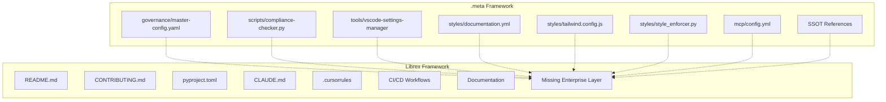

# Gap Analysis: .meta vs Librex Documentation

## Executive Summary

Comparing the comprehensive `.meta` framework documentation against the Librex optimization framework reveals significant gaps in governance, tooling, and enterprise-level standardization. This analysis identifies missing components and provides actionable recommendations for aligning Librex with enterprise standards.

## Visual Comparison



## Critical Gaps Identified

### 1. Governance Layer (High Priority)

**Missing in Librex:**
- No `governance/master-config.yaml` equivalent
- No organization type definitions
- No compliance rule enforcement
- No required file validation

**Impact:**
- Inconsistent repository structure
- No automated compliance checking
- Manual enforcement of standards

**Recommendation:**
```yaml
# Librex/governance/master-config.yaml
organization_framework:
  organization_types:
    research:
      prefix: 'Librex'
      governance_level: 'research'
      required_files:
        - 'README.md'
        - 'LICENSE'
        - 'CODE_OF_CONDUCT.md'
        - 'SECURITY.md'
        - 'CONTRIBUTING.md'
        - '.gitignore'
        - 'pyproject.toml'

compliance_rules:
  research:
    - 'reproducibility_standards'
    - 'benchmark_validation'
    - 'method_documentation'
    - 'test_coverage_95plus'
```

### 2. Compliance Checking (High Priority)

**Missing in Librex:**
- No `scripts/compliance-checker.py` equivalent
- No automated structure validation
- No organization compliance checks
- No configuration validation

**Impact:**
- Manual verification of repository health
- No early detection of structural issues
- Inconsistent development practices

**Recommendation:**
```python
# Librex/scripts/compliance-checker.py
class LibrexComplianceChecker:
    def __init__(self, root_path):
        self.root_path = root_path
        self.research_checks = [
            self._check_benchmark_coverage,
            self._check_method_documentation,
            self._check_test_coverage,
            self._check_reproducibility_standards
        ]
```

### 3. IDE/LLM Integration (Medium Priority)

**Missing in Librex:**
- No VS Code settings manager
- No unified AI configuration
- No MCP integration
- No IDE-specific tooling

**Current State:**
- Basic `.cursorrules` file exists
- `CLAUDE.md` provides minimal context
- No systematic IDE integration

**Recommendation:**
```bash
# Librex/tools/vscode-settings-manager/
python cli.py validate --file .vscode/settings.json
python cli.py generate --template research-python
```

### 4. Documentation Standards (Medium Priority)

**Missing in Librex:**
- No `styles/documentation.yml` equivalent
- No centralized style enforcement
- No visual identity standards
- No Tailwind configuration

**Current State:**
- Ad-hoc documentation styling
- No systematic style validation
- Inconsistent visual presentation

**Recommendation:**
```yaml
# Librex/styles/documentation.yml
styles:
  fonts:
    primary: "Inter"
    code: "JetBrains Mono"
  colors:
    primary: "#2563eb"  # Research blue
    secondary: "#10b981"  # Success green
  validation:
    rules:
      - max_readme_length: 3000
      - required_sections: ["Overview", "Installation", "Usage", "Testing"]
      - benchmark_coverage_required: true
```

### 5. SSOT Integration (Low Priority)

**Missing in Librex:**
- No references to master SSOT index
- No IDE integration guide links
- No prompt registry connections

**Current State:**
- Isolated documentation
- No cross-repository standardization

**Recommendation:**
```markdown
# Add to Librex/CLAUDE.md
## SSOT References
- `ORGANIZATIONS/alawein-tools/agis/docs/standards/INDEX.md` — master SSOT index
- `ORGANIZATIONS/alawein-tools/agis/docs/standards/5-TOOLS/ide-integration.md` — IDE integration guide
- `ORGANIZATIONS/alawein-tools/agis/docs/standards/2-PROMPTS/PROMPT_REGISTRY.md` — prompt registry
```

## Gap Severity Matrix

| Gap Category | Severity | Effort | Priority |
|--------------|----------|--------|----------|
| Governance Layer | High | Medium | **P0** |
| Compliance Checking | High | Medium | **P0** |
| IDE/LLM Integration | Medium | Low | **P1** |
| Documentation Standards | Medium | Low | **P1** |
| SSOT Integration | Low | Low | **P2** |

## Implementation Roadmap

### Phase 1: Foundation (Week 1)
- [ ] Create `Librex/governance/master-config.yaml`
- [ ] Implement basic compliance checker
- [ ] Add VS Code settings validation

### Phase 2: Standards (Week 2)
- [ ] Create documentation style configuration
- [ ] Implement style enforcement rules
- [ ] Add Tailwind configuration for research theme

### Phase 3: Integration (Week 3)
- [ ] Add SSOT references to documentation
- [ ] Update CI/CD workflows for compliance
- [ ] Create migration guide for existing repos

### Phase 4: Validation (Week 4)
- [ ] Run full compliance check on Librex
- [ ] Fix any identified issues
- [ ] Document the new enterprise standards

## Quick Wins

### Immediate Actions (Today)
1. Add SSOT references to `CLAUDE.md`
2. Create basic governance configuration
3. Add compliance checking script

### This Week
1. Implement VS Code settings manager
2. Create documentation style standards
3. Update CI/CD for compliance checks

### Next Week
1. Full compliance validation
2. Style enforcement implementation
3. Cross-repository standardization

## Success Metrics

- **Compliance Score**: Target 95%+ (currently estimated 60%)
- **Documentation Coverage**: 100% of required sections
- **IDE Integration**: Full VS Code support
- **Style Consistency**: 100% compliance with research theme
- **SSOT Integration**: All references updated

## Risk Assessment

### Low Risk
- SSOT integration (simple reference updates)
- Basic documentation standards (additive)

### Medium Risk
- IDE integration (may require testing)
- Style enforcement (could affect existing docs)

### High Risk
- Governance implementation (structural changes)
- Compliance checking (may reveal many issues)

## Conclusion

Librex lacks the enterprise-grade governance and tooling framework that `.meta` provides. The most critical gaps are in governance structure and compliance checking, which should be addressed first. The implementation roadmap provides a clear path to achieving enterprise standards while maintaining the research-focused nature of the optimization framework.

**Next Steps:**
1. Approve the implementation roadmap
2. Begin Phase 1 with governance configuration
3. Set up weekly compliance monitoring
4. Create migration guide for other repositories