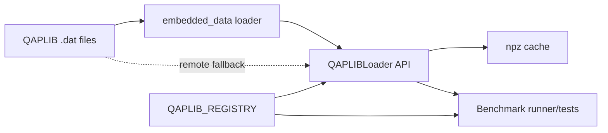

# QOPLIB Parity Audit

This note captures the concrete components we need to mirror while bringing the quantum-oriented QOPLIB benchmarks online.

## QAPLIB building blocks to replicate

| Layer | Canonical implementation | Responsibilities | QOPLIB delta |
| --- | --- | --- | --- |
| Registry | [`QAPLIBInstance`](alawein-technologies-llc/librex/equilibria/benchmarks/qaplib/registry.py:15) / [`QAPLIB_REGISTRY`](alawein-technologies-llc/librex/equilibria/benchmarks/qaplib/registry.py:145) | Normalized metadata (size, class, URLs), filtering helpers, custom registration | Need a `QOPLIBInstance` variant that handles quadratic programs (objective, constraints, domain types) plus statistics for continuous vs discrete problems. |
| Loader | [`QAPLIBLoader`](alawein-technologies-llc/librex/equilibria/benchmarks/qaplib/loader.py:29) | Unified loading from embedded payloads, repo-backed `.dat` files, cache, and remote download + synthetic fallback; legacy key normalization. | Duplicate the API surface but parse `.qplib` (quadratic form header, constraint blocks) and expose matrices/vectors (`Q`, `c`, `A`, bounds). |
| Embedded data | [`EMBEDDED_INSTANCES`](alawein-technologies-llc/librex/equilibria/benchmarks/qaplib/embedded_data.py:88) backed by [`datasets/qaplib/raw`](alawein-technologies-llc/datasets/qaplib/download_subset.py:1) | Deterministic on-disk fixtures for CI + documentation on how to refresh them. | Curate ~6 representative QOPLIB instances (mix of convex/non-convex, binary/continuous) and surface provenance metadata (dimension, constraint count, problem type). |
| Benchmark runner | [`QAPLIBBenchmarkRunner`](alawein-technologies-llc/librex/equilibria/benchmarks/qaplib/benchmark_runner.py:347) + [`run_qaplib_benchmark`](alawein-technologies-llc/librex/equilibria/benchmarks/qaplib/benchmark_runner.py:296) | Legacy orchestration hook plus richer benchmarking utilities (summaries, comparisons). | Provide a thin wrapper that can evaluate quadratic-program solvers (objective evaluation, feasibility checks) while maintaining the same ergonomics. |
| Tests | [`test_qaplib_comprehensive.py`](alawein-technologies-llc/librex/tests/benchmarks/test_qaplib_comprehensive.py:1) | End-to-end validation of loader, registry, embedded payloads, API shims, and runner serialization. | Add a mirrored test module that asserts `.qplib` parsing, metadata filters, and synthetic fallbacks; reuse fixtures and golden paths where possible. |

## Dataflow pattern to mirror

## Actionable gaps for QOPLIB

1. **File ingestion** – Write a `.qplib` parser that understands objective sections (`quadratic`, `linear`), bound declarations, constraint matrices, and variable domains (continuous/binary/integer). Provide deterministic synthetic fallback when downloads fail.
2. **Metadata coverage** – Extend registry metadata to include:
   - problem family (QP, QCQP, MIQP, etc.)
   - number of variables/constraints
   - continuous vs mixed-integer counts
   - original status labels from the official catalog.
3. **Curated subset** – Start with a manageable sample (e.g., `QPLIB_0018`, `QPLIB_0031`, `QPLIB_0689`, `QPLIB_10069`, `QPLIB_2456`, `QPLIB_0698`) stored under `datasets/qoplib/raw` with SHA256 verification baked into the loader/registry metadata.
4. **API surface** – Export module-level helpers (`load_qoplib_instance`, `list_qoplib_instances`, `get_qoplib_metadata`) so downstream users can drop-in replace the QAP helpers.
5. **Testing/story** – Mirror the QAP comprehensive suite with parser fuzzing for sparse matrices, binary-domain enforcement, and cache fallbacks. Ensure coverage stays above 90% by embedding a few small `.qplib` payloads directly in fixtures.

Delivering on these items will complete the audit portion and give us a checklist for full parity.
