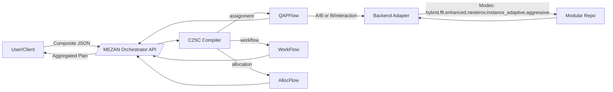

# MEZAN Architecture (Visual)

- C2SC maps composite problem into subproblems.
- Backend adapter transforms schemas and calls modular solvers.
- Orchestrator aggregates and returns a unified response.

