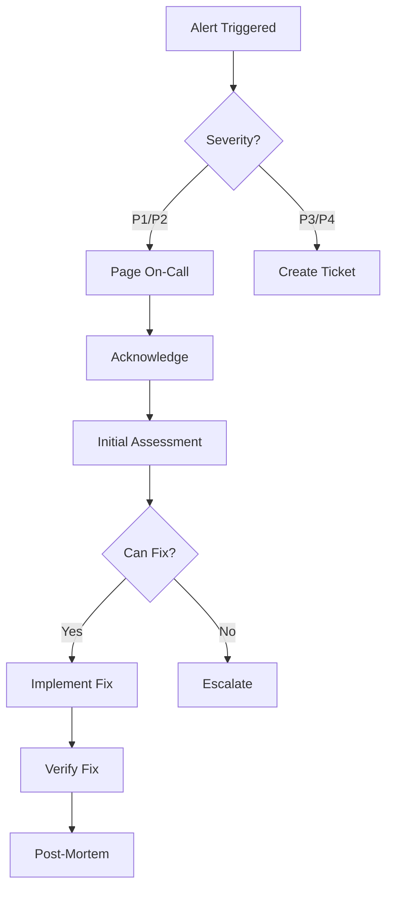

# MEZAN ORCHEX Operations Runbook

## Table of Contents

1. [Overview](#overview)
2. [Daily Operations](#daily-operations)
3. [Monitoring & Alerts](#monitoring--alerts)
4. [Incident Response](#incident-response)
5. [Maintenance Procedures](#maintenance-procedures)
6. [Backup & Recovery](#backup--recovery)
7. [Scaling Operations](#scaling-operations)
8. [Security Operations](#security-operations)
9. [Troubleshooting Playbooks](#troubleshooting-playbooks)
10. [Emergency Procedures](#emergency-procedures)

## Overview

This runbook provides operational procedures for maintaining MEZAN ORCHEX in production. It covers routine operations, incident response, and emergency procedures.

### Key Contacts

| Role | Name | Contact | Escalation |
|------|------|---------|------------|
| Primary On-Call | DevOps Team | ops@mezan.io | Slack: #ORCHEX-ops |
| Secondary On-Call | Platform Team | platform@mezan.io | PagerDuty |
| Management | CTO | cto@mezan.io | Phone: +1-xxx-xxx |
| Security | Security Team | security@mezan.io | Slack: #security |

### System Information

- **Production URL**: https://ORCHEX.mezan.io
- **Monitoring**: https://grafana.mezan.io
- **Status Page**: https://status.mezan.io
- **Documentation**: https://docs.mezan.io

## Daily Operations

### Morning Checklist (9:00 AM)

```bash
#!/bin/bash
# Morning health check script

echo "=== ORCHEX Morning Health Check ==="
echo "Date: $(date)"

# 1. Check service status
echo "1. Checking services..."
docker-compose ps

# 2. Check health endpoints
echo "2. Checking health..."
curl -s http://localhost:8080/health | jq .

# 3. Check error rates
echo "3. Checking error rates..."
docker-compose logs --tail=1000 ORCHEX-api | grep ERROR | wc -l

# 4. Check disk usage
echo "4. Checking disk usage..."
df -h /opt/ORCHEX

# 5. Check backup status
echo "5. Checking last backup..."
ls -la /backup/ORCHEX-backup-* | tail -1

# 6. Check certificate expiry
echo "6. Checking SSL certificate..."
echo | openssl s_client -servername ORCHEX.mezan.io -connect ORCHEX.mezan.io:443 2>/dev/null | openssl x509 -noout -dates

echo "=== Check Complete ==="
```

### Routine Tasks

#### Log Rotation

```bash
# Rotate logs daily
0 0 * * * /usr/sbin/logrotate /etc/logrotate.d/ORCHEX

# Configuration (/etc/logrotate.d/ORCHEX)
/opt/ORCHEX/logs/*.log {
    daily
    rotate 30
    compress
    delaycompress
    notifempty
    create 640 ORCHEX ORCHEX
    sharedscripts
    postrotate
        docker-compose kill -s USR1 ORCHEX-api
    endscript
}
```

#### Metrics Collection

```bash
# Collect daily metrics
#!/bin/bash
METRICS_FILE="/opt/ORCHEX/metrics/daily-$(date +%Y%m%d).json"

# API metrics
curl -s http://localhost:9090/metrics | grep atlas_ > $METRICS_FILE

# Database metrics
docker-compose exec postgres psql -U ORCHEX -c \
    "SELECT * FROM pg_stat_database WHERE datname='ORCHEX'" >> $METRICS_FILE

# Redis metrics
docker-compose exec redis redis-cli INFO >> $METRICS_FILE
```

## Monitoring & Alerts

### Key Metrics

| Metric | Warning | Critical | Action |
|--------|---------|----------|--------|
| CPU Usage | >70% | >90% | Scale horizontally |
| Memory Usage | >80% | >95% | Restart/Scale |
| API Latency | >1s | >3s | Check database/cache |
| Error Rate | >1% | >5% | Check logs/rollback |
| Disk Usage | >70% | >85% | Clean logs/backups |
| Queue Size | >1000 | >5000 | Scale workers |

### Alert Configuration

```yaml
# Prometheus alert rules
groups:
  - name: atlas_alerts
    interval: 30s
    rules:
      - alert: HighCPU
        expr: rate(container_cpu_usage_seconds_total[5m]) > 0.9
        for: 5m
        labels:
          severity: critical
          service: ORCHEX
        annotations:
          summary: "High CPU usage on {{ $labels.instance }}"
          description: "CPU usage is above 90% for 5 minutes"

      - alert: APIDown
        expr: up{job="ORCHEX-api"} == 0
        for: 1m
        labels:
          severity: critical
          service: ORCHEX
        annotations:
          summary: "ORCHEX API is down"
          description: "ORCHEX API has been down for 1 minute"
```

### Response Procedures

#### High CPU Alert

```bash
# 1. Check current CPU usage
docker stats --no-stream

# 2. Identify high CPU processes
docker-compose exec ORCHEX-api top

# 3. Check for runaway queries
docker-compose exec postgres psql -U ORCHEX -c \
    "SELECT pid, query, state FROM pg_stat_activity WHERE state != 'idle'"

# 4. Scale if needed
./scripts/scale.sh ORCHEX-api 3 scale

# 5. If issue persists, restart service
docker-compose restart ORCHEX-api
```

## Incident Response

### Severity Levels

| Level | Description | Response Time | Examples |
|-------|-------------|---------------|----------|
| P1 | Critical - Service Down | 15 mins | Complete outage |
| P2 | Major - Degraded Service | 30 mins | Partial outage |
| P3 | Minor - Feature Impact | 2 hours | Non-critical bug |
| P4 | Low - Cosmetic | Next business day | UI issues |

### Incident Response Process



### Incident Command Structure

```bash
# Create incident channel
/incident create "API responding slowly" --severity P2

# Assign roles
/incident role @john commander
/incident role @jane communicator
/incident role @bob investigator

# Update status
/incident status investigating
/incident update "Identified database lock issue"

# Resolution
/incident status resolved
/incident postmortem schedule tomorrow 2pm
```

## Maintenance Procedures

### Scheduled Maintenance

#### Pre-Maintenance (T-24h)

```bash
# 1. Send notification
curl -X POST $SLACK_WEBHOOK \
    -d '{"text":"Scheduled maintenance tomorrow 2-4 AM UTC"}'

# 2. Update status page
curl -X POST https://api.statuspage.io/v1/incidents \
    -H "Authorization: OAuth $TOKEN" \
    -d '{"incident": {"name": "Scheduled Maintenance", "status": "scheduled"}}'

# 3. Backup current state
./scripts/backup.sh

# 4. Prepare rollback plan
cp docker-compose.yml docker-compose.yml.backup
docker tag mezan-ORCHEX:latest mezan-ORCHEX:rollback
```

#### During Maintenance

```bash
# 1. Enable maintenance mode
docker-compose exec ORCHEX-api python -c \
    "from ORCHEX import maintenance; maintenance.enable()"

# 2. Perform updates
docker-compose down
# ... perform updates ...
docker-compose up -d

# 3. Verify services
./scripts/health_check.sh

# 4. Disable maintenance mode
docker-compose exec ORCHEX-api python -c \
    "from ORCHEX import maintenance; maintenance.disable()"
```

### Database Maintenance

```bash
# Vacuum and analyze
docker-compose exec postgres psql -U ORCHEX -c "VACUUM ANALYZE;"

# Reindex
docker-compose exec postgres psql -U ORCHEX -c "REINDEX DATABASE ORCHEX;"

# Check table sizes
docker-compose exec postgres psql -U ORCHEX -c "
    SELECT schemaname, tablename,
           pg_size_pretty(pg_total_relation_size(schemaname||'.'||tablename)) AS size
    FROM pg_tables
    WHERE schemaname NOT IN ('pg_catalog', 'information_schema')
    ORDER BY pg_total_relation_size(schemaname||'.'||tablename) DESC;"
```

## Backup & Recovery

### Backup Procedures

#### Automated Backups

```bash
# Cron job for daily backups
0 2 * * * /opt/ORCHEX/scripts/backup.sh

# Backup script
#!/bin/bash
BACKUP_DIR="/backup"
TIMESTAMP=$(date +%Y%m%d-%H%M%S)

# Database backup
docker-compose exec -T postgres pg_dumpall -U ORCHEX | \
    gzip > $BACKUP_DIR/postgres-$TIMESTAMP.sql.gz

# Redis backup
docker-compose exec -T redis redis-cli BGSAVE
sleep 5
docker cp ORCHEX-redis:/data/ORCHEX.rdb $BACKUP_DIR/redis-$TIMESTAMP.rdb

# Application data
tar czf $BACKUP_DIR/data-$TIMESTAMP.tar.gz /opt/ORCHEX/data

# Upload to S3
aws s3 cp $BACKUP_DIR/ s3://ORCHEX-backups/$TIMESTAMP/ --recursive

# Clean old backups
find $BACKUP_DIR -mtime +30 -delete
```

### Recovery Procedures

#### Point-in-Time Recovery

```bash
# 1. Stop services
docker-compose stop ORCHEX-api

# 2. Restore database
gunzip -c /backup/postgres-20240101-020000.sql.gz | \
    docker-compose exec -T postgres psql -U ORCHEX

# 3. Restore Redis
docker-compose stop redis
docker cp /backup/redis-20240101-020000.rdb ORCHEX-redis:/data/ORCHEX.rdb
docker-compose start redis

# 4. Restore application data
tar xzf /backup/data-20240101-020000.tar.gz -C /

# 5. Start services
docker-compose start ORCHEX-api

# 6. Verify
./scripts/health_check.sh
```

#### Disaster Recovery

```bash
# Complete system recovery
#!/bin/bash

# 1. Provision new infrastructure
terraform apply -auto-approve

# 2. Restore from S3
aws s3 sync s3://ORCHEX-backups/latest/ /backup/

# 3. Deploy application
docker-compose up -d

# 4. Restore data
./scripts/restore.sh /backup/

# 5. Update DNS
aws route53 change-resource-record-sets \
    --hosted-zone-id Z123456 \
    --change-batch file://dns-update.json

# 6. Verify
curl https://ORCHEX.mezan.io/health
```

## Scaling Operations

### Horizontal Scaling

```bash
# Scale up during high load
./scripts/scale.sh ORCHEX-api 5 scale

# Auto-scaling based on metrics
./scripts/scale.sh ORCHEX-api auto

# Monitor scaling
watch docker-compose ps
```

### Vertical Scaling

```bash
# Update resource limits
# Edit docker-compose.yml
services:
  ORCHEX-api:
    deploy:
      resources:
        limits:
          cpus: '4'  # Increased from 2
          memory: 4G  # Increased from 2G

# Apply changes
docker-compose up -d

# Verify new limits
docker inspect ORCHEX-api | jq '.[0].HostConfig.Memory'
```

### Load Testing

```bash
# Run load test
docker run --rm -it --network=ORCHEX-network \
    grafana/k6 run -u 100 -d 30s - <<EOF
import http from 'k6/http';
import { check } from 'k6';

export default function() {
    let response = http.get('http://ORCHEX-api:8080/api/v1/status');
    check(response, {
        'status is 200': (r) => r.status === 200,
        'response time < 500ms': (r) => r.timings.duration < 500,
    });
}
EOF
```

## Security Operations

### Security Scanning

```bash
# Vulnerability scanning
docker run --rm -v /var/run/docker.sock:/var/run/docker.sock \
    aquasec/trivy image mezan-ORCHEX:latest

# Security audit
docker run --rm -it -v $(pwd):/app \
    aquasec/trivy config /app

# Check for secrets
docker run --rm -v $(pwd):/app trufflesecurity/trufflehog \
    filesystem /app --json
```

### Access Control

```bash
# Rotate API keys
#!/bin/bash
NEW_KEY=$(openssl rand -base64 32)

# Update configuration
sed -i "s/ANTHROPIC_API_KEY=.*/ANTHROPIC_API_KEY=$NEW_KEY/" .env

# Restart services
docker-compose restart ORCHEX-api

# Verify
docker-compose exec ORCHEX-api env | grep ANTHROPIC_API_KEY
```

### Audit Logging

```bash
# Enable audit logging
docker-compose exec ORCHEX-api python -c "
from ORCHEX.audit import enable_audit_logging
enable_audit_logging(level='INFO', file='/app/logs/audit.log')
"

# Review audit logs
grep "AUTH\|ACCESS\|MODIFY" /opt/ORCHEX/logs/audit.log | tail -100

# Archive audit logs
tar czf audit-$(date +%Y%m).tar.gz /opt/ORCHEX/logs/audit.log
aws s3 cp audit-*.tar.gz s3://ORCHEX-audit-logs/
```

## Troubleshooting Playbooks

### API Not Responding

```bash
#!/bin/bash
echo "=== API Troubleshooting ==="

# 1. Check container status
docker-compose ps ORCHEX-api

# 2. Check logs
docker-compose logs --tail=100 ORCHEX-api | grep ERROR

# 3. Check port binding
netstat -tulpn | grep 8080

# 4. Test internal connectivity
docker-compose exec ORCHEX-api curl -v http://localhost:8080/health

# 5. Check resources
docker stats --no-stream ORCHEX-api

# 6. Restart if needed
docker-compose restart ORCHEX-api

# 7. Force recreate if still failing
docker-compose up -d --force-recreate ORCHEX-api
```

### Database Connection Issues

```bash
#!/bin/bash
echo "=== Database Troubleshooting ==="

# 1. Check PostgreSQL status
docker-compose ps postgres

# 2. Test connection
docker-compose exec postgres pg_isready -U ORCHEX

# 3. Check active connections
docker-compose exec postgres psql -U ORCHEX -c \
    "SELECT count(*) FROM pg_stat_activity"

# 4. Kill idle connections
docker-compose exec postgres psql -U ORCHEX -c "
    SELECT pg_terminate_backend(pid)
    FROM pg_stat_activity
    WHERE state = 'idle'
    AND state_change < now() - interval '10 minutes'"

# 5. Check locks
docker-compose exec postgres psql -U ORCHEX -c "
    SELECT pid, usename, query, state
    FROM pg_stat_activity
    WHERE wait_event_type = 'Lock'"
```

### High Memory Usage

```bash
#!/bin/bash
echo "=== Memory Troubleshooting ==="

# 1. Check memory usage
docker stats --no-stream

# 2. Identify memory leaks
docker-compose exec ORCHEX-api python -c "
import tracemalloc
import gc
tracemalloc.start()
# ... application code ...
snapshot = tracemalloc.take_snapshot()
top_stats = snapshot.statistics('lineno')
for stat in top_stats[:10]:
    print(stat)
"

# 3. Clear caches
docker-compose exec redis redis-cli FLUSHALL

# 4. Restart with memory limit
docker-compose down
docker-compose up -d --scale ORCHEX-api=1
```

## Emergency Procedures

### Complete Service Failure

```bash
#!/bin/bash
# EMERGENCY: Complete service recovery

# 1. Alert team
curl -X POST $PAGERDUTY_URL -d '{"event_action": "trigger", "payload": {"summary": "ORCHEX Complete Failure", "severity": "critical"}}'

# 2. Switch to backup instance
ssh backup-server "cd /opt/ORCHEX && docker-compose up -d"

# 3. Update DNS to backup
aws route53 change-resource-record-sets --hosted-zone-id Z123456 --change-batch '{"Changes": [{"Action": "UPSERT", "ResourceRecordSet": {"Name": "ORCHEX.mezan.io", "Type": "A", "TTL": 60, "ResourceRecords": [{"Value": "BACKUP_IP"}]}}]}'

# 4. Investigate primary
ssh primary-server "cd /opt/ORCHEX && docker-compose logs --tail=1000 > /tmp/crash-logs.txt"

# 5. Start recovery
ssh primary-server "cd /opt/ORCHEX && ./scripts/disaster-recovery.sh"
```

### Data Corruption

```bash
#!/bin/bash
# EMERGENCY: Data corruption recovery

# 1. Stop writes immediately
docker-compose exec ORCHEX-api python -c \
    "from ORCHEX import readonly; readonly.enable()"

# 2. Backup corrupted data
docker-compose exec postgres pg_dump -U ORCHEX ORCHEX > corrupted-$(date +%s).sql

# 3. Restore from last known good backup
LAST_GOOD=$(ls -t /backup/postgres-*.sql.gz | head -1)
gunzip -c $LAST_GOOD | docker-compose exec -T postgres psql -U ORCHEX

# 4. Verify data integrity
docker-compose exec postgres psql -U ORCHEX -c \
    "SELECT COUNT(*) FROM information_schema.tables WHERE table_schema = 'public'"

# 5. Resume operations
docker-compose exec ORCHEX-api python -c \
    "from ORCHEX import readonly; readonly.disable()"
```

### Security Breach

```bash
#!/bin/bash
# EMERGENCY: Security breach response

# 1. Isolate affected systems
docker-compose stop

# 2. Rotate all credentials
./scripts/rotate-all-credentials.sh

# 3. Preserve evidence
docker-compose logs > /secure/evidence-$(date +%s).log
docker inspect $(docker ps -aq) > /secure/containers-$(date +%s).json

# 4. Deploy clean instance
docker-compose down -v
docker system prune -af
git pull --verify-signatures
docker-compose up -d

# 5. Audit access logs
grep "AUTH\|LOGIN\|ACCESS" /opt/ORCHEX/logs/*.log > /secure/access-audit.log

# 6. Notify security team
curl -X POST $SECURITY_WEBHOOK -d '{"text": "Security incident detected and contained"}'
```

## Appendix

### Useful Commands

```bash
# Container debugging
docker exec -it ORCHEX-api /bin/bash
docker logs --since 1h ORCHEX-api
docker inspect ORCHEX-api

# Network debugging
docker network ls
docker network inspect ORCHEX-network
docker port ORCHEX-api

# Volume management
docker volume ls
docker volume inspect ORCHEX-data
docker system df

# Process management
docker-compose restart ORCHEX-api
docker-compose stop && docker-compose start
docker-compose down && docker-compose up -d

# Cleanup
docker system prune -af --volumes
docker image prune -af
docker container prune -f
```

### Environment Variables

```bash
# Production settings
ATLAS_ENV=production
LOG_LEVEL=INFO
WORKERS=4
MAX_REQUESTS=1000
DATABASE_POOL_SIZE=20
REDIS_MAX_CONNECTIONS=50
ENABLE_METRICS=true
ENABLE_TRACING=true
```

### Performance Tuning

```bash
# Kernel parameters (/etc/sysctl.conf)
net.core.somaxconn = 65535
net.ipv4.tcp_max_syn_backlog = 8192
net.ipv4.ip_local_port_range = 1024 65535
vm.overcommit_memory = 1
fs.file-max = 100000

# Docker daemon (/etc/docker/daemon.json)
{
  "log-driver": "json-file",
  "log-opts": {
    "max-size": "10m",
    "max-file": "3"
  },
  "storage-driver": "overlay2",
  "max-concurrent-downloads": 10,
  "max-concurrent-uploads": 5
}
```

---

**Last Updated:** November 2024
**Version:** 3.5.0
**Owner:** MEZAN Operations Team
**Review Cycle:** Monthly