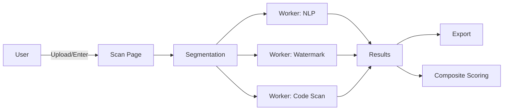

# Attributa.dev Architecture Audit

Executive Summary
- [To be completed after analysis]

1. System Overview
- Frontend: React + Vite + TypeScript, shadcn UI, Tailwind.
- Analysis libraries: src/lib (GLTR, DetectGPT (simplified), watermark, citations, code security, scoring).
- Workers: src/workers for offloading compute.
- Services: src/services for API abstraction; optional Supabase edge functions.

2. Data Flow
- Ingest → Segment → Analyze (GLTR/Curvature/Watermark/Citations/Code) → Score → Results/Exports.

3. Mermaid Diagram

4. Evaluation
Performance
- Model loading/caching; avoid re-instantiation; code-split heavy analyzers.
- React Query cache tuning for results; memoization of derived metrics.
- PDF parsing cost management; chunking large inputs; worker concurrency caps.

Scalability
- Concurrency in workers; backpressure for large files; rate limiting for citation lookups.
- Edge function latency and pagination for large result sets.

Security
- No dynamic code execution; strict static code analysis.
- Supabase RLS policies enforced; storage bucket policies; secrets in edge env only.
- CSP and input validation; size/time limits for user inputs.

Maintainability
- Clear component boundaries; re-usable hooks; cohesive modules.
- Design tokens centralized; shadcn variants extended instead of ad-hoc classes.
- Tests: unit for analyzers; integration for flows; E2E happy path.

5. Risks and SPOFs
- Single citation provider (Crossref) rate limiting.
- Large-model memory pressure; fallback strategies.
- Long-running PDF parsing blocking main thread if not offloaded.

6. Recommendations
- Ensure analyzer model singletons and caches.
- Add SEO/meta helper across pages (if missing) and canonical links.
- Enforce worker pool with queue for large jobs; configurable concurrency.
- Add CSP and tighten headers where deployed.
- Strengthen RLS policy tests and linting via Supabase linter.

7. Action Plan
- Owners, effort, ETA per recommendation; measurable acceptance criteria.

8. Appendices
- References: README.md, README_ANALYZERS.md, CONTRIBUTING.md.
- Test commands: npm test; CI workflows in .github/workflows.
