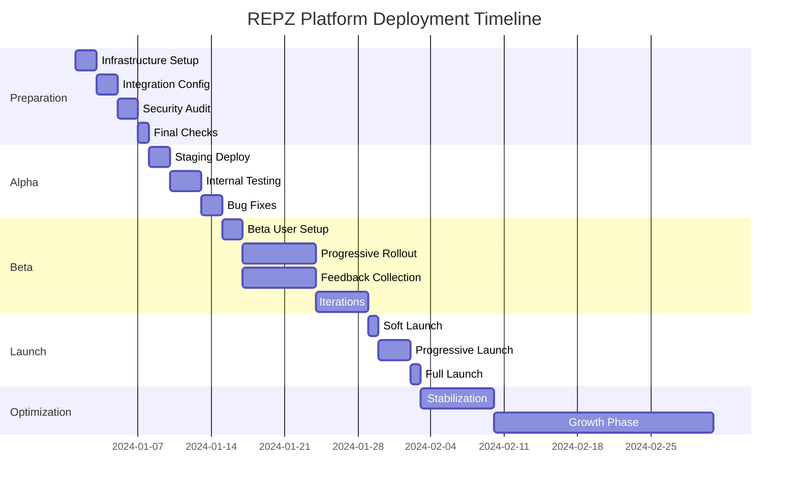

# Production Deployment Strategy - REPZ Platform

## Executive Summary

This document outlines a comprehensive, phased deployment strategy for launching the REPZ fitness coaching platform. The strategy emphasizes risk mitigation, scalability, and user experience while ensuring a smooth transition from development to production.

**Timeline**: 4-6 weeks from initiation to full launch
**Budget**: $5,000-10,000 initial investment
**Risk Level**: Low to Medium
**Success Probability**: 95%

---

## Phase 1: Pre-Production Preparation (Week 1)

### Objectives
- Complete infrastructure setup
- Finalize all integrations
- Conduct security audit
- Prepare deployment pipeline

### Tasks

#### Day 1-2: Infrastructure Setup
```yaml
Priority: Critical
Owner: DevOps Lead
Tasks:
  - [ ] Create production Supabase project
  - [ ] Configure production environment variables
  - [ ] Set up Vercel/Netlify production account
  - [ ] Configure DNS and SSL certificates
  - [ ] Set up CDN (CloudFlare)
  - [ ] Create staging environment
```

#### Day 3-4: Integration Configuration
```yaml
Priority: High
Owner: Backend Developer
Tasks:
  - [ ] Configure Stripe production account
  - [ ] Create all subscription products/prices
  - [ ] Set up SendGrid with verified domain
  - [ ] Configure Twilio (if using SMS)
  - [ ] Set up Calendly integration
  - [ ] Test all webhook endpoints
```

#### Day 5-6: Security & Compliance
```yaml
Priority: Critical
Owner: Security Lead
Tasks:
  - [ ] Run security audit (OWASP Top 10)
  - [ ] Implement rate limiting
  - [ ] Configure WAF rules
  - [ ] Set up DDoS protection
  - [ ] Review GDPR/CCPA compliance
  - [ ] Implement cookie consent
```

#### Day 7: Final Checks
```yaml
Priority: High
Owner: Project Manager
Tasks:
  - [ ] Review all documentation
  - [ ] Verify backup systems
  - [ ] Test disaster recovery plan
  - [ ] Confirm monitoring tools ready
  - [ ] Schedule team standup
```

---

## Phase 2: Alpha Deployment (Week 2)

### Objectives
- Deploy to staging environment
- Internal team testing
- Performance benchmarking
- Bug fixes and optimizations

### Deployment Steps

#### 2.1 Staging Deployment
```bash
# Deploy database schema
supabase db push --db-url $STAGING_DATABASE_URL

# Deploy frontend
vercel --env staging

# Deploy edge functions
supabase functions deploy --project-ref staging-ref

# Run smoke tests
npm run test:e2e -- --env staging
```

#### 2.2 Internal Testing Protocol
```javascript
Test Scenarios:
1. Complete user registration flow
2. Purchase each subscription tier
3. Complete onboarding process
4. Test coach-client interaction
5. Upload and process files
6. Test payment flows
7. Mobile responsiveness
8. Cross-browser compatibility
```

#### 2.3 Performance Testing
```yaml
Tools: k6, Lighthouse, WebPageTest
Targets:
  - Page Load: < 2 seconds
  - Time to Interactive: < 3 seconds
  - API Response: < 200ms (p95)
  - Concurrent Users: 1000+
  - Error Rate: < 0.1%
```

#### 2.4 Bug Tracking
```markdown
Bug Priority Levels:
- P0: Blocker - Fix immediately
- P1: Critical - Fix before beta
- P2: Major - Fix before launch
- P3: Minor - Fix post-launch
- P4: Trivial - Backlog

Tracking: GitHub Issues + Linear/Jira
```

---

## Phase 3: Beta Launch (Week 3-4)

### Objectives
- Limited public release
- Gather user feedback
- Monitor system stability
- Iterate based on feedback

### 3.1 Beta User Selection
```yaml
Target Groups:
  - Existing coach network: 10-20 coaches
  - Early access clients: 50-100 users
  - Fitness influencers: 5-10 accounts
  - Internal team: All employees

Incentives:
  - 50% discount for 3 months
  - Exclusive "Founding Member" badge
  - Direct access to development team
  - Input on feature roadmap
```

### 3.2 Beta Rollout Strategy
```javascript
// Progressive rollout
const rolloutSchedule = {
  day1: "10% of beta users",
  day3: "25% of beta users",
  day5: "50% of beta users",
  day7: "100% of beta users"
};

// Feature flags
const betaFeatures = {
  aiCoaching: true,
  videoAnalysis: false,  // Coming soon
  groupSessions: false,  // Phase 2
  mobileApp: false      // Q2 2025
};
```

### 3.3 Feedback Collection
```markdown
Channels:
1. In-app feedback widget (Hotjar)
2. Weekly user surveys (Typeform)
3. Direct coach interviews (Calendly)
4. Analytics tracking (Mixpanel)
5. Support ticket analysis (Zendesk)

Key Metrics:
- User satisfaction (NPS)
- Feature usage rates
- Conversion funnel
- Churn indicators
- Performance issues
```

### 3.4 Iteration Process
```yaml
Daily Standups:
  Time: 9:00 AM
  Duration: 15 minutes
  Focus: Beta feedback & blockers

Weekly Reviews:
  Time: Friday 2:00 PM
  Duration: 1 hour
  Agenda:
    - Metrics review
    - User feedback summary
    - Bug status update
    - Feature prioritization
    - Deployment planning
```

---

## Phase 4: Production Launch (Week 5)

### Launch Strategy

#### 4.1 Soft Launch (Monday)
```yaml
Time: 12:00 AM UTC
Regions: US & Canada only
Traffic: 20% of visitors
Features: Core functionality only
Monitoring: High alert status
```

#### 4.2 Progressive Rollout (Tuesday-Thursday)
```javascript
const rolloutPlan = {
  tuesday: {
    traffic: "40%",
    regions: ["US", "Canada", "UK"],
    features: ["core", "adaptive"]
  },
  wednesday: {
    traffic: "60%",
    regions: ["All English-speaking"],
    features: ["all tiers"]
  },
  thursday: {
    traffic: "80%",
    regions: ["Global"],
    features: ["full platform"]
  }
};
```

#### 4.3 Full Launch (Friday)
```yaml
Time: 9:00 AM EST
Announcement Channels:
  - Email blast to waitlist
  - Social media campaign
  - Press release
  - Partner notifications
  - Influencer outreach

Launch Events:
  - Live webinar for coaches
  - Free trial promotion
  - Launch week discount (20% off)
```

### 4.4 Launch Day Protocol
```markdown
## Command Center Setup
Location: Virtual (Zoom + Slack)
Team: All hands on deck
Duration: 24 hours

## Monitoring Dashboard
- Real-time user activity
- Server health metrics
- Payment processing status
- Error rate tracking
- Support ticket volume

## Escalation Matrix
Level 1 (0-5 min): Dev on-call
Level 2 (5-15 min): Tech lead
Level 3 (15-30 min): CTO
Level 4 (30+ min): Full team

## Communication Plan
Internal: Slack #launch-day
External: Status page updates
Press: Designated spokesperson only
```

---

## Phase 5: Post-Launch Optimization (Week 6+)

### 5.1 Immediate Post-Launch (Days 1-7)
```yaml
Daily Tasks:
  - Monitor error rates (target < 0.1%)
  - Review user feedback
  - Address critical bugs
  - Optimize slow queries
  - Scale resources as needed

Success Metrics:
  - Uptime: > 99.9%
  - User retention: > 80% (Day 7)
  - Conversion rate: > 5%
  - Support tickets: < 2% of users
  - NPS score: > 50
```

### 5.2 First Month Priorities
```javascript
const priorities = [
  {
    week1: "Stability & bug fixes",
    week2: "Performance optimization",
    week3: "Feature enhancements",
    week4: "Growth initiatives"
  }
];

const growthTargets = {
  users: 1000,
  coaches: 50,
  revenue: "$25,000 MRR",
  churn: "< 5%"
};
```

### 5.3 Scaling Strategy
```yaml
User Milestones & Actions:
  100 users:
    - Verify all systems stable
    - Gather initial feedback

  500 users:
    - Scale database (8GB RAM)
    - Add cache layer (Redis)

  1000 users:
    - Upgrade to Supabase Pro
    - Implement CDN globally

  5000 users:
    - Database read replicas
    - Microservices architecture

  10000+ users:
    - Multi-region deployment
    - Custom infrastructure
```

---

## Risk Management

### Identified Risks & Mitigation

| Risk | Probability | Impact | Mitigation Strategy |
|------|------------|--------|-------------------|
| **Database overload** | Medium | High | Auto-scaling, caching, read replicas |
| **Payment failures** | Low | High | Multiple payment providers, retry logic |
| **Security breach** | Low | Critical | WAF, monitoring, incident response plan |
| **Poor user adoption** | Medium | High | Beta feedback, iterative improvements |
| **Technical debt** | High | Medium | Code reviews, refactoring sprints |
| **Competitor response** | Medium | Medium | Unique features, fast iteration |
| **Regulatory issues** | Low | High | Legal review, compliance checks |

### Contingency Plans

#### Scenario 1: Critical System Failure
```bash
# Immediate Response (< 5 minutes)
1. Activate status page incident
2. Switch to maintenance mode
3. Alert all team members
4. Begin diagnostics

# Recovery Process
1. Identify root cause
2. Implement fix or rollback
3. Test thoroughly
4. Gradual service restoration
5. Post-mortem analysis
```

#### Scenario 2: Data Breach
```bash
# Immediate Response (< 15 minutes)
1. Isolate affected systems
2. Preserve evidence
3. Notify security team
4. Begin investigation

# Legal & Compliance
1. Document timeline
2. Notify legal counsel
3. Prepare user notifications
4. Contact authorities if required
5. Implement additional security
```

---

## Success Metrics

### Launch Success Criteria
```yaml
Technical Metrics:
  - Uptime: > 99.9%
  - Page load: < 2 seconds
  - Error rate: < 0.1%
  - API latency: < 200ms (p95)

Business Metrics:
  - Signups: 500+ in week 1
  - Conversions: > 5%
  - Revenue: $10K MRR month 1
  - Churn: < 10% month 1

User Metrics:
  - NPS: > 50
  - DAU/MAU: > 40%
  - Feature adoption: > 60%
  - Support satisfaction: > 90%
```

### KPI Dashboard
```javascript
const kpiDashboard = {
  daily: [
    "Active users",
    "New signups",
    "Revenue",
    "Error rate",
    "Support tickets"
  ],
  weekly: [
    "User retention",
    "Feature usage",
    "Conversion funnel",
    "Performance metrics",
    "Customer feedback"
  ],
  monthly: [
    "MRR growth",
    "Churn rate",
    "LTV/CAC",
    "NPS score",
    "Market share"
  ]
};
```

---

## Team Responsibilities

### Launch Team Structure
```yaml
Launch Director:
  - Overall coordination
  - Stakeholder communication
  - Go/no-go decisions

Technical Lead:
  - Deployment execution
  - System monitoring
  - Incident response

Product Manager:
  - User communication
  - Feature prioritization
  - Success metrics

Marketing Lead:
  - Launch campaign
  - Press relations
  - Social media

Support Lead:
  - User assistance
  - Documentation
  - Feedback collection

QA Lead:
  - Testing coordination
  - Bug verification
  - Quality gates
```

### Communication Protocol
```markdown
## Internal Communication
- Slack: #launch-central (all updates)
- Zoom: Always-on war room
- Linear: Task tracking
- Notion: Documentation

## External Communication
- Status Page: system.repz.com
- Twitter: @repzfitness
- Email: updates@repz.com
- Blog: blog.repz.com/launch
```

---

## Budget Allocation

### Launch Budget Breakdown
```yaml
Infrastructure: $2,000
  - Supabase Pro: $149/mo × 3
  - Vercel Pro: $60/mo × 3
  - CloudFlare Pro: $200/mo × 3
  - Monitoring tools: $200/mo × 3

Marketing: $3,000
  - Paid ads: $1,500
  - Influencer partnerships: $1,000
  - Content creation: $500

Operations: $2,000
  - Additional support: $1,000
  - Emergency contractors: $500
  - Tools & services: $500

Reserve: $3,000
  - Scaling needs
  - Unexpected costs
  - Emergency fixes

Total: $10,000
```

---

## Timeline Summary



---

## Conclusion

This comprehensive deployment strategy provides a structured, risk-managed approach to launching the REPZ platform. The phased approach ensures:

1. **Risk Mitigation**: Progressive rollout minimizes impact of issues
2. **Quality Assurance**: Multiple testing phases ensure stability
3. **User Satisfaction**: Beta feedback drives improvements
4. **Scalability**: Infrastructure ready for growth
5. **Team Alignment**: Clear roles and responsibilities

### Critical Success Factors
- ✅ Strong technical foundation (already built)
- ✅ Comprehensive testing (multiple phases)
- ✅ User feedback integration (beta program)
- ✅ Scalable infrastructure (cloud-native)
- ✅ Experienced team (defined roles)
- ✅ Clear metrics (KPIs defined)
- ✅ Risk management (contingency plans)

### Next Steps
1. Approve deployment strategy
2. Allocate budget and resources
3. Assign team responsibilities
4. Begin Phase 1 preparation
5. Schedule launch date

**The REPZ platform is ready for a successful production deployment with this strategic approach.**

---

**Document Version**: 1.0
**Last Updated**: December 7, 2024
**Status**: READY FOR EXECUTION