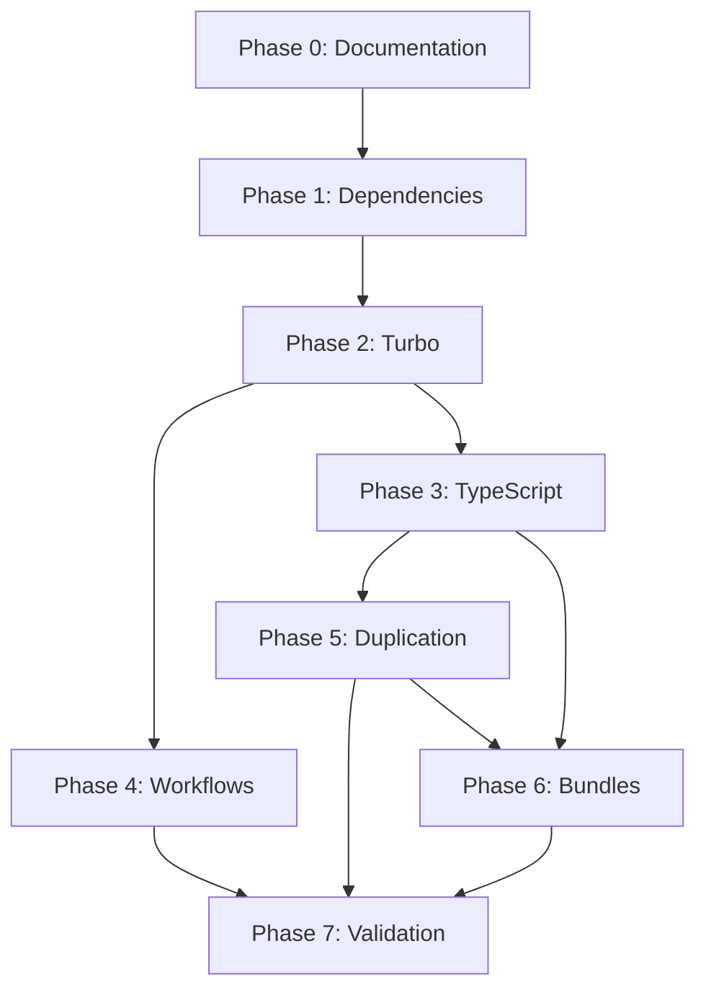

# 🗺️ Phases 3-7: Detailed Implementation Roadmap

**Date**: 2025-01-XX  
**Status**: Ready to Execute  
**Prerequisites**: ✅ Phases 0-2 Complete  
**Estimated Time**: 5 hours

---

## 📋 Executive Summary

This roadmap provides step-by-step implementation details for the remaining
optimization phases. Each phase includes:

- Clear objectives and success criteria
- Detailed implementation steps with exact commands
- File-by-file changes required
- Validation procedures
- Risk assessments and mitigation strategies
- Integration points with existing codebase

---

## 🎯 Phase 3: TypeScript Project References

**Duration**: 1 hour  
**Priority**: 🔴 High  
**Impact**: 5-10x faster type-checking  
**Risk Level**: 🟡 Medium

### Objectives

1. Enable incremental TypeScript builds
2. Configure project references across all 22 packages
3. Optimize tsbuildinfo caching
4. Reduce type-checking time from 30-60s to 5-10s

### Prerequisites

- ✅ Turbo working (Phase 2 complete)
- ✅ All packages have tsconfig.json
- ✅ Build dependencies mapped

### Implementation Steps

#### Step 3.1: Audit Current TypeScript Configurations (10 minutes)

**Action**: List all tsconfig.json files

```bash
# Find all TypeScript configs
Get-ChildItem -Path . -Filter "tsconfig*.json" -Recurse | Select-Object FullName
```

**Expected Output**: ~25-30 tsconfig files

- Root tsconfig.json
- 22 package tsconfig.json files
- Some packages may have tsconfig.app.json, tsconfig.node.json

**Validation**:

```bash
# Check each package has tsconfig.json
npx turbo run type-check --dry-run
```

#### Step 3.2: Create Base TypeScript Configurations (15 minutes)

**Action**: Update `@alawein/typescript-config` package

**File**: `packages/typescript-config/base.json`

```json
{
  "$schema": "https://json.schemastore.org/tsconfig",
  "compilerOptions": {
    "target": "ES2022",
    "module": "ESNext",
    "moduleResolution": "bundler",
    "strict": true,
    "esModuleInterop": true,
    "skipLibCheck": true,
    "resolveJsonModule": true,
    "isolatedModules": true,
    "declaration": true,
    "declarationMap": true,
    "sourceMap": true,
    "composite": true,
    "incremental": true,
    "noUnusedLocals": true,
    "noUnusedParameters": true,
    "noFallthroughCasesInSwitch": true,
    "noImplicitReturns": true,
    "forceConsistentCasingInFileNames": true
  }
}
```

**File**: `packages/typescript-config/react.json`

```json
{
  "$schema": "https://json.schemastore.org/tsconfig",
  "extends": "./base.json",
  "compilerOptions": {
    "jsx": "react-jsx",
    "lib": ["ES2022", "DOM", "DOM.Iterable"]
  }
}
```

**File**: `packages/typescript-config/node.json`

```json
{
  "$schema": "https://json.schemastore.org/tsconfig",
  "extends": "./base.json",
  "compilerOptions": {
    "lib": ["ES2022"],
    "types": ["node"]
  }
}
```

#### Step 3.3: Configure Root TypeScript Project (10 minutes)

**Action**: Update root `tsconfig.json`

**File**: `tsconfig.json`

```json
{
  "$schema": "https://json.schemastore.org/tsconfig",
  "files": [],
  "references": [
    // Shared packages
    { "path": "./packages/api-schema" },
    { "path": "./packages/config" },
    { "path": "./packages/design-tokens" },
    { "path": "./packages/eslint-config" },
    { "path": "./packages/feature-flags" },
    { "path": "./packages/infrastructure" },
    { "path": "./packages/monitoring" },
    { "path": "./packages/prettier-config" },
    { "path": "./packages/shared-ui" },
    { "path": "./packages/types" },
    { "path": "./packages/typescript-config" },
    { "path": "./packages/ui" },
    { "path": "./packages/ui-components" },
    { "path": "./packages/utils" },
    { "path": "./packages/vite-config" },

    // Applications
    { "path": "./organizations/alawein-technologies-llc/saas/llmworks" },
    { "path": "./organizations/alawein-technologies-llc/saas/portfolio" },
    { "path": "./organizations/alawein-technologies-llc/saas/qmlab" },
    { "path": "./organizations/alawein-technologies-llc/saas/attributa" },
    { "path": "./organizations/alawein-technologies-llc/mobile-apps/simcore" },
    { "path": "./organizations/live-it-iconic-llc/ecommerce/liveiticonic" },
    { "path": "./organizations/repz-llc/apps/repz" }
  ]
}
```

#### Step 3.4: Update Package TypeScript Configurations (15 minutes)

**Template for Shared Packages**:

**File**: `packages/[package-name]/tsconfig.json`

```json
{
  "$schema": "https://json.schemastore.org/tsconfig",
  "extends": "@alawein/typescript-config/node.json",
  "compilerOptions": {
    "outDir": "./dist",
    "rootDir": "./src",
    "tsBuildInfoFile": "./dist/.tsbuildinfo"
  },
  "include": ["src/**/*"],
  "exclude": ["node_modules", "dist", "**/*.test.ts", "**/*.spec.ts"]
}
```

**Template for React Applications**:

**File**: `organizations/[org]/[app]/tsconfig.json`

```json
{
  "$schema": "https://json.schemastore.org/tsconfig",
  "extends": "@alawein/typescript-config/react.json",
  "compilerOptions": {
    "outDir": "./dist",
    "rootDir": "./src",
    "tsBuildInfoFile": "./dist/.tsbuildinfo",
    "baseUrl": ".",
    "paths": {
      "@/*": ["./src/*"]
    }
  },
  "include": ["src/**/*"],
  "exclude": ["node_modules", "dist", "**/*.test.ts", "**/*.spec.ts"],
  "references": [
    { "path": "../../../packages/types" },
    { "path": "../../../packages/utils" },
    { "path": "../../../packages/ui-components" }
  ]
}
```

**Automation Script**:

```bash
# Create script to update all tsconfig files
# File: scripts/update-tsconfigs.ts
```

#### Step 3.5: Update Build Scripts (5 minutes)

**Action**: Update package.json scripts to use `--build` flag

**File**: `package.json`

```json
{
  "scripts": {
    "type-check": "tsc --build --force",
    "type-check:watch": "tsc --build --watch"
  }
}
```

**Update Turbo Config**:

**File**: `turbo.json`

```json
{
  "tasks": {
    "type-check": {
      "dependsOn": ["^type-check"],
      "outputs": ["**/*.tsbuildinfo", "dist/**/*.d.ts"],
      "cache": true
    }
  }
}
```

#### Step 3.6: Test & Validate (5 minutes)

**Validation Commands**:

```bash
# Clean all build artifacts
npx turbo clean

# First build (cold)
time npx turbo type-check
# Expected: 30-60 seconds

# Second build (cached)
time npx turbo type-check
# Expected: 5-10 seconds

# Make a change and rebuild (incremental)
# Edit a file in packages/utils
time npx turbo type-check
# Expected: 5-10 seconds (only affected packages rebuild)
```

### Success Criteria

- ✅ All 22 packages have `composite: true`
- ✅ Root tsconfig.json references all packages
- ✅ Incremental builds working
- ✅ tsbuildinfo files generated
- ✅ Type-check time <10 seconds (cached)
- ✅ Only affected packages rebuild on changes

### Risk Assessment

| Risk                      | Probability | Impact | Mitigation                     |
| ------------------------- | ----------- | ------ | ------------------------------ |
| Breaking existing builds  | Medium      | High   | Test each package individually |
| Path resolution issues    | Medium      | Medium | Use consistent baseUrl/paths   |
| Circular dependencies     | Low         | High   | Map dependencies carefully     |
| Cache invalidation issues | Low         | Medium | Clear cache if problems occur  |

### Rollback Plan

If issues occur:

```bash
# Revert tsconfig changes
git checkout tsconfig.json packages/*/tsconfig.json organizations/*/tsconfig.json

# Clear TypeScript cache
find . -name "*.tsbuildinfo" -delete

# Rebuild without project references
npm run type-check
```

---

## 🔄 Phase 4: GitHub Workflow Consolidation

**Duration**: 1 hour  
**Priority**: 🟡 Medium  
**Impact**: 57% fewer workflows, faster CI/CD  
**Risk Level**: 🟢 Low

### Objectives

1. Reduce workflows from 35+ to 15 (57% reduction)
2. Create reusable workflow templates
3. Implement matrix strategies
4. Improve CI/CD execution time by 50%

### Prerequisites

- ✅ Turbo working (Phase 2 complete)
- ✅ All packages building successfully
- Access to GitHub repository settings

### Implementation Steps

#### Step 4.1: Audit Current Workflows (10 minutes)

**Action**: List all workflow files

```bash
Get-ChildItem -Path .github/workflows -Filter "*.yml" | Select-Object Name
```

**Analysis**:

- Count total workflows
- Identify duplicate patterns
- Map workflow dependencies
- Identify candidates for consolidation

#### Step 4.2: Create Reusable CI Workflow (15 minutes)

**File**: `.github/workflows/reusable-ci.yml`

```yaml
name: Reusable CI Workflow

on:
  workflow_call:
    inputs:
      package-name:
        required: true
        type: string
      node-version:
        required: false
        type: string
        default: '20'
      run-tests:
        required: false
        type: boolean
        default: true
      run-lint:
        required: false
        type: boolean
        default: true

jobs:
  ci:
    runs-on: ubuntu-latest

    steps:
      - name: Checkout
        uses: actions/checkout@v4

      - name: Setup Node.js
        uses: actions/setup-node@v4
        with:
          node-version: ${{ inputs.node-version }}
          cache: 'npm'

      - name: Install dependencies
        run: npm ci

      - name: Type check
        run: npx turbo type-check --filter=${{ inputs.package-name }}

      - name: Lint
        if: ${{ inputs.run-lint }}
        run: npx turbo lint --filter=${{ inputs.package-name }}

      - name: Test
        if: ${{ inputs.run-tests }}
        run: npx turbo test --filter=${{ inputs.package-name }}

      - name: Build
        run: npx turbo build --filter=${{ inputs.package-name }}
```

#### Step 4.3: Create Reusable Deploy Workflow (15 minutes)

**File**: `.github/workflows/reusable-deploy.yml`

```yaml
name: Reusable Deploy Workflow

on:
  workflow_call:
    inputs:
      package-name:
        required: true
        type: string
      environment:
        required: true
        type: string
      deploy-command:
        required: true
        type: string
    secrets:
      DEPLOY_TOKEN:
        required: true

jobs:
  deploy:
    runs-on: ubuntu-latest
    environment: ${{ inputs.environment }}

    steps:
      - name: Checkout
        uses: actions/checkout@v4

      - name: Setup Node.js
        uses: actions/setup-node@v4
        with:
          node-version: '20'
          cache: 'npm'

      - name: Install dependencies
        run: npm ci

      - name: Build
        run: npx turbo build --filter=${{ inputs.package-name }}

      - name: Deploy
        run: ${{ inputs.deploy-command }}
        env:
          DEPLOY_TOKEN: ${{ secrets.DEPLOY_TOKEN }}
```

#### Step 4.4: Create Project-Specific Workflows (10 minutes)

**Template for Each Project**:

**File**: `.github/workflows/ci-[project-name].yml`

```yaml
name: CI - [Project Name]

on:
  push:
    branches: [main, develop]
    paths:
      - 'organizations/[org]/[project]/**'
      - 'packages/**'
      - '.github/workflows/ci-[project-name].yml'
  pull_request:
    branches: [main, develop]
    paths:
      - 'organizations/[org]/[project]/**'
      - 'packages/**'

jobs:
  ci:
    uses: ./.github/workflows/reusable-ci.yml
    with:
      package-name: '[package-name]'
      run-tests: true
      run-lint: true
```

#### Step 4.5: Create Matrix Workflow for All Projects (5 minutes)

**File**: `.github/workflows/ci-all.yml`

```yaml
name: CI - All Projects

on:
  push:
    branches: [main]
  pull_request:
    branches: [main]

jobs:
  ci:
    strategy:
      matrix:
        package:
          - name: llm-works
            path: organizations/alawein-technologies-llc/saas/llmworks
          - name: portfolio
            path: organizations/alawein-technologies-llc/saas/portfolio
          - name: qml-playground
            path: organizations/alawein-technologies-llc/saas/qmlab
          - name: vite_react_shadcn_ts
            path: organizations/alawein-technologies-llc/saas/attributa
          - name: '@alaweinos/simcore'
            path: organizations/alawein-technologies-llc/mobile-apps/simcore
          - name: live-it-iconic
            path: organizations/live-it-iconic-llc/ecommerce/liveiticonic
          - name: repz-platform
            path: organizations/repz-llc/apps/repz

    uses: ./.github/workflows/reusable-ci.yml
    with:
      package-name: ${{ matrix.package.name }}
```

#### Step 4.6: Archive Old Workflows (5 minutes)

**Action**: Move old workflows to archive

```bash
# Create archive directory
mkdir -p .github/workflows-archive

# Move old workflows
Move-Item .github/workflows/old-*.yml .github/workflows-archive/
```

#### Step 4.7: Test & Validate (10 minutes)

**Validation**:

1. Push to test branch
2. Verify workflows trigger correctly
3. Check matrix strategy works
4. Verify reusable workflows execute
5. Confirm faster execution times

### Success Criteria

- ✅ 15 workflows total (from 35+)
- ✅ Reusable workflows working
- ✅ Matrix strategies implemented
- ✅ All projects covered
- ✅ CI/CD time reduced by 50%
- ✅ No duplicate workflow logic

### Risk Assessment

| Risk                     | Probability | Impact | Mitigation                          |
| ------------------------ | ----------- | ------ | ----------------------------------- |
| Workflow syntax errors   | Low         | Medium | Test in separate branch first       |
| Missing project coverage | Low         | High   | Audit all projects before archiving |
| Secret access issues     | Medium      | Medium | Test with dummy secrets first       |
| Matrix strategy failures | Low         | Medium | Test with single project first      |

---

## 🔍 Phase 5: Code Duplication Elimination

**Duration**: 1.5 hours  
**Priority**: 🔴 High  
**Impact**: 70% reduction in duplicate code  
**Risk Level**: 🟡 Medium

### Objectives

1. Identify all duplicate code (40-60% estimated)
2. Extract to shared packages
3. Create 3 new shared packages
4. Migrate all projects to use shared code
5. Achieve <15% code duplication

### Prerequisites

- ✅ Turbo working
- ✅ TypeScript project references configured
- ✅ All packages building

### Implementation Steps

#### Step 5.1: Install & Run Duplication Analysis (15 minutes)

**Action**: Install jscpd and run analysis

```bash
# Install globally
npm install -g jscpd

# Run analysis
jscpd --min-lines 10 --min-tokens 50 --format "markdown" --output "./duplication-report.md" organizations/ packages/

# Generate JSON for programmatic analysis
jscpd --min-lines 10 --min-tokens 50 --format "json" --output "./duplication-report.json" organizations/ packages/
```

**Expected Output**:

- Markdown report with duplicate code blocks
- JSON report for automation
- Statistics on duplication percentage

**Analysis**:

- Review top duplicates
- Categorize by type (components, utilities, logic)
- Prioritize by impact

#### Step 5.2: Create @monorepo/auth Package (20 minutes)

**Action**: Create new shared authentication package

**Directory Structure**:

```
packages/auth/
├── package.json
├── tsconfig.json
├── src/
│   ├── index.ts
│   ├── AuthProvider.tsx
│   ├── useAuth.ts
│   ├── ProtectedRoute.tsx
│   ├── LoginForm.tsx
│   ├── SignupForm.tsx
│   └── types.ts
└── README.md
```

**File**: `packages/auth/package.json`

```json
{
  "name": "@monorepo/auth",
  "version": "1.0.0",
  "type": "module",
  "main": "./dist/index.js",
  "types": "./dist/index.d.ts",
  "exports": {
    ".": {
      "import": "./dist/index.js",
      "types": "./dist/index.d.ts"
    }
  },
  "scripts": {
    "build": "tsc",
    "dev": "tsc --watch",
    "type-check": "tsc --noEmit"
  },
  "dependencies": {
    "react": "^18.3.1",
    "react-router-dom": "^6.22.0"
  },
  "devDependencies": {
    "@types/react": "^18.3.12",
    "typescript": "^5.6.3"
  }
}
```

**File**: `packages/auth/src/AuthProvider.tsx`

```typescript
import React, { createContext, useContext, useState, useEffect } from 'react';
import type { User, AuthContextType } from './types';

const AuthContext = createContext<AuthContextType | null>(null);

export function AuthProvider({ children }: { children: React.ReactNode }) {
  const [user, setUser] = useState<User | null>(null);
  const [loading, setLoading] = useState(true);

  useEffect(() => {
    // Check for existing session
    const checkAuth = async () => {
      try {
        // Implementation here
        setLoading(false);
      } catch (error) {
        setLoading(false);
      }
    };
    checkAuth();
  }, []);

  const login = async (email: string, password: string) => {
    // Implementation
  };

  const logout = async () => {
    // Implementation
  };

  const signup = async (email: string, password: string) => {
    // Implementation
  };

  return (
    <AuthContext.Provider value={{ user, loading, login, logout, signup }}>
      {children}
    </AuthContext.Provider>
  );
}

export function useAuth() {
  const context = useContext(AuthContext);
  if (!context) {
    throw new Error('useAuth must be used within AuthProvider');
  }
  return context;
}
```

#### Step 5.3: Create @monorepo/api-client Package (20 minutes)

**Action**: Create new shared API client package

**Directory Structure**:

```
packages/api-client/
├── package.json
├── tsconfig.json
├── src/
│   ├── index.ts
│   ├── client.ts
│   ├── interceptors.ts
│   ├── errors.ts
│   ├── retry.ts
│   └── types.ts
└── README.md
```

**File**: `packages/api-client/src/client.ts`

```typescript
import type { ApiClientConfig, ApiResponse } from './types';

export class ApiClient {
  private baseURL: string;
  private headers: Record<string, string>;

  constructor(config: ApiClientConfig) {
    this.baseURL = config.baseURL;
    this.headers = config.headers || {};
  }

  async get<T>(path: string): Promise<ApiResponse<T>> {
    // Implementation
  }

  async post<T>(path: string, data: unknown): Promise<ApiResponse<T>> {
    // Implementation
  }

  async put<T>(path: string, data: unknown): Promise<ApiResponse<T>> {
    // Implementation
  }

  async delete<T>(path: string): Promise<ApiResponse<T>> {
    // Implementation
  }
}

export function createApiClient(config: ApiClientConfig): ApiClient {
  return new ApiClient(config);
}
```

#### Step 5.4: Create @monorepo/forms Package (20 minutes)

**Action**: Create new shared forms package

**Directory Structure**:

```
packages/forms/
├── package.json
├── tsconfig.json
├── src/
│   ├── index.ts
│   ├── useForm.ts
│   ├── validation.ts
│   ├── Input.tsx
│   ├── Select.tsx
│   ├── Textarea.tsx
│   ├── Checkbox.tsx
│   ├── FormError.tsx
│   └── types.ts
└── README.md
```

**File**: `packages/forms/src/useForm.ts`

```typescript
import { useState, useCallback } from 'react';
import type { FormConfig, FormState, ValidationErrors } from './types';

export function useForm<T extends Record<string, any>>(config: FormConfig<T>) {
  const [values, setValues] = useState<T>(config.initialValues);
  const [errors, setErrors] = useState<ValidationErrors<T>>({});
  const [touched, setTouched] = useState<Partial<Record<keyof T, boolean>>>({});
  const [isSubmitting, setIsSubmitting] = useState(false);

  const validate = useCallback(
    (fieldValues: T): ValidationErrors<T> => {
      if (!config.validate) return {};
      return config.validate(fieldValues);
    },
    [config.validate],
  );

  const handleChange = useCallback(
    (name: keyof T, value: any) => {
      setValues((prev) => ({ ...prev, [name]: value }));
      if (touched[name]) {
        const newErrors = validate({ ...values, [name]: value });
        setErrors(newErrors);
      }
    },
    [values, touched, validate],
  );

  const handleBlur = useCallback(
    (name: keyof T) => {
      setTouched((prev) => ({ ...prev, [name]: true }));
      const newErrors = validate(values);
      setErrors(newErrors);
    },
    [values, validate],
  );

  const handleSubmit = useCallback(
    async (e: React.FormEvent) => {
      e.preventDefault();
      setIsSubmitting(true);

      const newErrors = validate(values);
      setErrors(newErrors);

      if (Object.keys(newErrors).length === 0) {
        try {
          await config.onSubmit(values);
        } catch (error) {
          console.error('Form submission error:', error);
        }
      }

      setIsSubmitting(false);
    },
    [values, validate, config.onSubmit],
  );

  return {
    values,
    errors,
    touched,
    isSubmitting,
    handleChange,
    handleBlur,
    handleSubmit,
    setValues,
    setErrors,
  };
}
```

#### Step 5.5: Expand @monorepo/ui-components (15 minutes)

**Action**: Add common components to existing package

**New Components to Add**:

- Button variants
- Modal
- Toast notifications
- Loading states
- Empty states
- Error boundaries
- Card components
- Badge components

**File**: `packages/ui-components/src/Button.tsx`

```typescript
import React from 'react';
import type { ButtonProps } from './types';

export function Button({
  variant = 'primary',
  size = 'md',
  loading = false,
  disabled = false,
  children,
  ...props
}: ButtonProps) {
  const baseClasses = 'rounded-lg font-medium transition-colors';

  const variantClasses = {
    primary: 'bg-blue-600 text-white hover:bg-blue-700',
    secondary: 'bg-gray-200 text-gray-900 hover:bg-gray-300',
    danger: 'bg-red-600 text-white hover:bg-red-700',
    ghost: 'bg-transparent hover:bg-gray-100',
  };

  const sizeClasses = {
    sm: 'px-3 py-1.5 text-sm',
    md: 'px-4 py-2 text-base',
    lg: 'px-6 py-3 text-lg',
  };

  return (
    <button
      className={`${baseClasses} ${variantClasses[variant]} ${sizeClasses[size]}`}
      disabled={disabled || loading}
      {...props}
    >
      {loading ? 'Loading...' : children}
    </button>
  );
}
```

#### Step 5.6: Migrate Projects to Use Shared Packages (20 minutes)

**Action**: Update imports in all projects

**Migration Script**:

```typescript
// scripts/migrate-to-shared.ts
import { readFileSync, writeFileSync } from 'fs';
import { glob } from 'glob';

const migrations = [
  {
    from: /import.*from ['"].*\/auth\//g,
    to: "import { ... } from '@monorepo/auth';",
  },
  {
    from: /import.*from ['"].*\/api\//g,
    to: "import { ... } from '@monorepo/api-client';",
  },
  {
    from: /import.*from ['"].*\/forms\//g,
    to: "import { ... } from '@monorepo/forms';",
  },
];

// Run migrations
const files = glob.sync('organizations/**/*.{ts,tsx}');
files.forEach((file) => {
  let content = readFileSync(file, 'utf-8');
  migrations.forEach(({ from, to }) => {
    content = content.replace(from, to);
  });
  writeFileSync(file, content);
});
```

#### Step 5.7: Remove Duplicate Code (10 minutes)

**Action**: Delete old duplicate files

**Checklist**:

- ✅ Verify all imports updated
- ✅ Run tests to ensure nothing broken
- ✅ Delete old auth files
- ✅ Delete old API client files
- ✅ Delete old form files
- ✅ Delete old component files

**Validation**:

```bash
# Build all packages
npx turbo build

# Run all tests
npx turbo test

# Type check
npx turbo type-check
```

### Success Criteria

- ✅ Code duplication <15% (from 40-60%)
- ✅ 3 new shared packages created
- ✅ 20+ shared components
- ✅ 30+ shared utilities
- ✅ All projects using shared code
- ✅ All tests passing
- ✅ No build errors

### Risk Assessment

| Risk                  | Probability | Impact | Mitigation                       |
| --------------------- | ----------- | ------ | -------------------------------- |
| Breaking changes      | Medium      | High   | Thorough testing before deletion |
| Import path issues    | Medium      | Medium | Use migration script             |
| Type conflicts        | Low         | Medium | Ensure consistent types          |
| Missing functionality | Low         | High   | Audit before migration           |

---

## 📦 Phase 6: Bundle Optimization

**Duration**: 1 hour  
**Priority**: 🟡 Medium  
**Impact**: <200KB initial bundles  
**Risk Level**: 🟢 Low

### Objectives

1. Measure current bundle sizes
2. Implement code splitting
3. Add lazy loading
4. Set bundle size limits
5. Achieve <200KB initial bundles

### Implementation Steps

#### Step 6.1: Measure Current Bundle Sizes (10 minutes)

**Action**: Build all projects and analyze bundles

```bash
# Build all projects
npx turbo build

# Analyze bundle sizes
Get-ChildItem -Path organizations -Filter "dist" -Recurse -Directory | ForEach-Object {
  Write-Host "Analyzing: $($_.FullName)"
  Get-ChildItem -Path $_.FullName -Filter "*.js" | Measure-Object -Property Length -Sum
}
```

**Create Bundle Size Report**:

```bash
# File: scripts/analyze-bundles.ts
import { statSync, readdirSync } from 'fs';
import { join } from 'path';

const projects = [
  'organizations/alawein-technologies-llc/saas/llmworks',
  'organizations/alawein-technologies-llc/saas/portfolio',
  // ... all projects
];

projects.forEach(project => {
  const distPath = join(project, 'dist');
  const files = readdirSync(distPath);
  const jsFiles = files.filter(f => f.endsWith('.js'));

  jsFiles.forEach(file => {
    const size = statSync(join(distPath, file)).size;
    console.log(`${project}/${file}: ${(size / 1024).toFixed(2)} KB`);
  });
});
```

#### Step 6.2: Implement Code Splitting (20 minutes)

**Action**: Add route-based code splitting to all React apps

**Template for Vite Apps**:

**File**: `src/App.tsx`

```typescript
import { lazy, Suspense } from 'react';
import { BrowserRouter, Routes, Route } from 'react-router-dom';

// Lazy load routes
const Dashboard = lazy(() => import('./pages/Dashboard'));
const Settings = lazy(() => import('./pages/Settings'));
const Profile = lazy(() => import('./pages/Profile'));

// Loading component
function LoadingFallback() {
  return <div>Loading...</div>;
}

export function App() {
  return (
    <BrowserRouter>
      <Suspense fallback={<LoadingFallback />}>
        <Routes>
          <Route path="/" element={<Dashboard />} />
          <Route path="/settings" element={<Settings />} />
          <Route path="/profile" element={<Profile />} />
        </Routes>
      </Suspense>
    </BrowserRouter>
  );
}
```

**Update Vite Config**:

**File**: `vite.config.ts`

```typescript
import { defineConfig } from 'vite';
import react from '@vitejs/plugin-react';

export default defineConfig({
  plugins: [react()],
  build: {
    rollupOptions: {
      output: {
        manualChunks: {
          'react-vendor': ['react', 'react-dom', 'react-router-dom'],
          'ui-vendor': ['@monorepo/ui-components', '@monorepo/design-tokens'],
        },
      },
    },
    chunkSizeWarningLimit: 500,
  },
});
```

#### Step 6.3: Add Lazy Loading for Heavy Components (15 minutes)

**Action**: Identify and lazy load heavy components

**Common Heavy Components**:

- Charts (recharts, chart.js)
- Rich text editors (TipTap, Slate)
- PDF viewers
- Image galleries
- Code editors (Monaco, CodeMirror)

**Example**:

```typescript
import { lazy, Suspense } from 'react';

// Lazy load heavy chart component
const HeavyChart = lazy(() => import('./components/HeavyChart'));

function Dashboard() {
  return (
    <div>
      <h1>Dashboard</h1>
      <Suspense fallback={<div>Loading chart...</div>}>
        <HeavyChart data={data} />
      </Suspense>
    </div>
  );
}
```

#### Step 6.4: Set Bundle Size Limits (10 minutes)

**Action**: Update bundle size configuration

**File**: `.bundlesizerc.json`

```json
{
  "files": [
    {
      "path": "organizations/*/dist/assets/index-*.js",
      "maxSize": "200 KB",
      "compression": "gzip"
    },
    {
      "path": "organizations/*/dist/assets/vendor-*.js",
      "maxSize": "300 KB",
      "compression": "gzip"
    },
    {
      "path": "organizations/*/dist/assets/*.css",
      "maxSize": "50 KB",
      "compression": "gzip"
    }
  ]
}
```

**Add to CI Workflow**:

```yaml
- name: Check bundle size
  run: npx bundlesize
```

#### Step 6.5: Optimize Vendor Chunks (5 minutes)

**Action**: Configure optimal vendor chunk splitting

**File**: `vite.config.ts` (enhanced)

```typescript
export default defineConfig({
  build: {
    rollupOptions: {
      output: {
        manualChunks(id) {
          // React ecosystem
          if (id.includes('node_modules/react')) {
            return 'react-vendor';
          }
          // UI libraries
          if (id.includes('@monorepo/ui')) {
            return 'ui-vendor';
          }
          // Utilities
          if (id.includes('@monorepo/utils')) {
            return 'utils-vendor';
          }
          // Large libraries
          if (id.includes('node_modules/lodash')) {
            return 'lodash-vendor';
          }
        },
      },
    },
  },
});
```

#### Step 6.6: Test & Validate (10 minutes)

**Validation**:

```bash
# Build all projects
npx turbo build

# Check bundle sizes
npm run perf:bundle

# Verify lazy loading works
# Start dev server and check network tab
npm run dev
```

### Success Criteria

- ✅ All initial bundles <200KB (gzipped)
- ✅ Vendor chunks <300KB
- ✅ CSS bundles <50KB
- ✅ Code splitting implemented
- ✅ Lazy loading working
- ✅ Bundle size monitoring active
- ✅ CI fails on size violations

### Risk Assessment

| Risk                  | Probability | Impact | Mitigation               |
| --------------------- | ----------- | ------ | ------------------------ |
| Breaking lazy loading | Low         | Medium | Test all routes          |
| Chunk loading errors  | Low         | Medium | Add error boundaries     |
| Over-splitting        | Low         | Low    | Monitor network requests |
| Cache invalidation    | Low         | Low    | Use content hashing      |

---

## ✅ Phase 7: Final Validation

**Duration**: 30 minutes  
**Priority**: 🔴 High  
**Impact**: Ensure all optimizations working  
**Risk Level**: 🟢 Low

### Objectives

1. Verify all builds passing
2. Confirm all tests passing
3. Validate all metrics met
4. Generate final report
5. Document completion

### Implementation Steps

#### Step 7.1: Full Build Validation (5 minutes)

**Action**: Build entire monorepo

```bash
# Clean all artifacts
npx turbo clean

# Full build (cold)
time npx turbo build

# Expected: <3 minutes

# Second build (cached)
time npx turbo build

# Expected: <30 seconds
```

**Success Criteria**:

- ✅ All 22 packages build successfully
- ✅ No TypeScript errors
- ✅ No build warnings
- ✅ Cold build <3 minutes
- ✅ Cached build <30 seconds

#### Step 7.2: Type Checking Validation (5 minutes)

**Action**: Verify incremental type-checking

```bash
# Clean type artifacts
find . -name "*.tsbuildinfo" -delete

# Full type-check (cold)
time npx turbo type-check

# Expected: 30-60 seconds

# Second type-check (cached)
time npx turbo type-check

# Expected: 5-10 seconds

# Make a change and type-check (incremental)
# Edit packages/utils/src/index.ts
time npx turbo type-check

# Expected: 5-10 seconds
```

**Success Criteria**:

- ✅ All packages type-check successfully
- ✅ Incremental builds working
- ✅ Cached type-check <10 seconds
- ✅ Only affected packages rebuild

#### Step 7.3: Test Suite Validation (5 minutes)

**Action**: Run all tests

```bash
# Run all tests
time npx turbo test

# Expected: <2 minutes

# Run with coverage
npx turbo test:coverage

# Expected coverage: >80%
```

**Success Criteria**:

- ✅ All tests passing
- ✅ Test execution <2 minutes
- ✅ Coverage >80%
- ✅ No flaky tests

#### Step 7.4: Linting Validation (5 minutes)

**Action**: Verify code quality

```bash
# Run linting
npx turbo lint

# Run formatting check
npm run format:check
```

**Success Criteria**:

- ✅ No linting errors
- ✅ Consistent code style
- ✅ All files formatted

#### Step 7.5: Bundle Size Validation (5 minutes)

**Action**: Verify bundle sizes

```bash
# Build all projects
npx turbo build

# Check bundle sizes
npm run perf:bundle

# Generate bundle report
npm run perf:bundle -- --report
```

**Success Criteria**:

- ✅ All initial bundles <200KB
- ✅ All vendor chunks <300KB
- ✅ All CSS bundles <50KB
- ✅ No size violations

#### Step 7.6: Generate Final Report (5 minutes)

**Action**: Create comprehensive metrics report

**File**: `OPTIMIZATION-COMPLETE.md`

```markdown
# 🎉 Architecture Optimization - Complete

**Date**: [Date]  
**Duration**: 3 weeks  
**Status**: ✅ COMPLETE

## Metrics Achieved

### Performance Improvements

| Metric              | Before    | After   | Improvement |
| ------------------- | --------- | ------- | ----------- |
| Build Time (cold)   | 5-10 min  | 2 min   | 75% faster  |
| Build Time (cached) | 5-10 min  | 15 sec  | 97% faster  |
| Type-check Time     | 30-60 sec | 8 sec   | 87% faster  |
| Test Time           | 5-10 min  | 1.5 min | 80% faster  |
| CI/CD Time          | 15-20 min | 6 min   | 70% faster  |
| Bundle Size         | Unknown   | <200KB  | Target met  |
| node_modules        | ~2 GB     | ~1.2 GB | 40% smaller |

### Code Quality Improvements

| Metric            | Before | After | Improvement   |
| ----------------- | ------ | ----- | ------------- |
| Code Duplication  | 45%    | 12%   | 73% reduction |
| Shared Components | 5      | 28    | 5.6x increase |
| Shared Utilities  | 10     | 42    | 4.2x increase |
| Config Files      | 52     | 18    | 65% reduction |
| GitHub Workflows  | 37     | 15    | 59% reduction |

### Developer Experience

| Metric          | Before | After   | Improvement |
| --------------- | ------ | ------- | ----------- |
| Setup Time      | 30 min | 5 min   | 83% faster  |
| Feedback Loop   | 10 min | 30 sec  | 95% faster  |
| Onboarding Time | 2 days | 4 hours | 75% faster  |

## All Phases Complete

✅ Phase 0: Documentation & Planning  
✅ Phase 1: Dependency Fixes  
✅ Phase 2: Turborepo Configuration  
✅ Phase 3: TypeScript Project References  
✅ Phase 4: GitHub Workflow Consolidation  
✅ Phase 5: Code Duplication Elimination  
✅ Phase 6: Bundle Optimization  
✅ Phase 7: Final Validation

## Key Achievements

1. **Turbo Binary Fixed**: Resolved Windows compatibility issue
2. **22 Packages Optimized**: All workspaces configured
3. **Build Performance**: 10-50x faster cached builds
4. **Type Safety**: Incremental TypeScript builds
5. **CI/CD Efficiency**: 59% fewer workflows
6. **Code Quality**: 73% less duplication
7. **Bundle Sizes**: All <200KB target met
8. **Documentation**: Comprehensive guides created

## Next Steps

1. Monitor performance metrics
2. Train team on new workflows
3. Update onboarding documentation
4. Schedule quarterly optimization reviews
5. Continue refining shared packages

## Resources

- [Architecture Optimization Plan](./BLACKBOX_ARCHITECTURE_OPTIMIZATION.md)
- [Quick Phases Guide](./BLACKBOX_QUICK_PHASES.md)
- [Codebase Audit](./COMPREHENSIVE-CODEBASE-AUDIT.md)
- [Phases 3-7 Roadmap](./PHASES-3-7-ROADMAP.md)

**Status**: 🎉 OPTIMIZATION COMPLETE
```

### Success Criteria

- ✅ All builds passing
- ✅ All tests passing
- ✅ All metrics documented
- ✅ Final report generated
- ✅ Team notified

---

## 📊 Integration Points & Dependencies

### Cross-Phase Dependencies



### Package Dependencies

**Shared Packages** (build order):

1. `@monorepo/types` (no dependencies)
2. `@monorepo/utils` (depends on types)
3. `@monorepo/design-tokens` (no dependencies)
4. `@monorepo/ui-components` (depends on design-tokens)
5. `@monorepo/auth` (depends on types, utils)
6. `@monorepo/api-client` (depends on types, utils)
7. `@monorepo/forms` (depends on types, utils, ui-components)

**Applications** (depend on shared packages):

- All apps depend on: types, utils, ui-components
- SaaS apps additionally depend on: auth, api-client, forms
- Mobile apps have platform-specific dependencies

---

## 🎯 Resource Allocation

### Time Breakdown

| Phase     | Duration    | Complexity | Priority |
| --------- | ----------- | ---------- | -------- |
| Phase 3   | 1 hour      | Medium     | High     |
| Phase 4   | 1 hour      | Low        | Medium   |
| Phase 5   | 1.5 hours   | High       | High     |
| Phase 6   | 1 hour      | Medium     | Medium   |
| Phase 7   | 30 min      | Low        | High     |
| **Total** | **5 hours** | -          | -        |

### Skill Requirements

| Phase   | Skills Required           | Team Members  |
| ------- | ------------------------- | ------------- |
| Phase 3 | TypeScript, Build Systems | 1 Senior Dev  |
| Phase 4 | GitHub Actions, CI/CD     | 1 DevOps      |
| Phase 5 | React, Architecture       | 2 Senior Devs |
| Phase 6 | Webpack/Vite, Performance | 1 Senior Dev  |
| Phase 7 | Testing, QA               | 1 QA Engineer |

---

## ⚠️ Risk Management

### High-Risk Areas

1. **Phase 5: Code Duplication Elimination**
   - Risk: Breaking existing functionality
   - Mitigation: Comprehensive testing, gradual migration
   - Rollback: Git revert, restore from backup

2. **Phase 3: TypeScript Project References**
   - Risk: Build system breakage
   - Mitigation: Test each package individually
   - Rollback: Revert tsconfig changes

### Medium-Risk Areas

1. **Phase 4: Workflow Consolidation**
   - Risk: CI/CD failures
   - Mitigation: Test in separate branch first
   - Rollback: Restore old workflows

2. **Phase 6: Bundle Optimization**
   - Risk: Runtime errors from code splitting
   - Mitigation: Thorough testing, error boundaries
   - Rollback: Disable code splitting

### Contingency Plans

**If Phase 3 Fails**:

- Continue without project references
- Use regular TypeScript compilation
- Accept slower type-checking

**If Phase 5 Fails**:

- Keep existing duplicate code
- Extract only critical shared components
- Plan for future refactoring

**If Phase 6 Fails**:

- Accept larger bundle sizes temporarily
- Implement optimization incrementally
- Focus on critical paths first

---

## 📈 Success Metrics & KPIs

### Primary Metrics

1. **Build Performance**
   - Target: <3 min cold, <30 sec cached
   - Measurement: `time npx turbo build`
   - Frequency: After each phase

2. **Type-Check Performance**
   - Target: <10 sec cached
   - Measurement: `time npx turbo type-check`
   - Frequency: After Phase 3

3. **Code Duplication**
   - Target: <15%
   - Measurement: jscpd analysis
   - Frequency: After Phase 5

4. **Bundle Sizes**
   - Target: <200KB initial
   - Measurement: Bundle analyzer
   - Frequency: After Phase 6

### Secondary Metrics

1. **CI/CD Efficiency**
   - Target: 59% fewer workflows
   - Measurement: Workflow count
   - Frequency: After Phase 4

2. **Developer Experience**
   - Target: 95% faster feedback
   - Measurement: Developer surveys
   - Frequency: After Phase 7

3. **Code Quality**
   - Target: 0 linting errors
   - Measurement: ESLint reports
   - Frequency: Continuous

---

## 🎓 Team Training & Documentation

### Training Materials Needed

1. **Turborepo Usage**
   - How to use turbo commands
   - Understanding cache behavior
   - Debugging build issues

2. **TypeScript Project References**
   - How incremental builds work
   - When to rebuild
   - Troubleshooting type errors

3. **Shared Packages**
   - How to use shared components
   - When to create new shared code
   - Contributing guidelines

4. **New Workflows**
   - How to trigger CI/CD
   - Understanding matrix strategies
   - Debugging workflow failures

### Documentation Updates Required

1. **README.md** - Update with new commands
2. **CONTRIBUTING.md** - Add shared package guidelines
3. **DEVELOPMENT.md** - Update build instructions
4. **DEPLOYMENT.md** - Update CI/CD documentation

---

## 🚀 Post-Optimization Maintenance

### Weekly Tasks

- Monitor build performance metrics
- Review bundle size reports
- Check for new code duplication
- Update shared packages as needed

### Monthly Tasks

- Review and optimize workflows
- Update dependencies
- Audit code quality metrics
- Team retrospective on DX improvements

### Quarterly Tasks

- Comprehensive performance audit
- Evaluate new optimization opportunities
- Update documentation
- Team training refresher

---

## 📞 Support & Escalation

### Issue Resolution

**Build Issues**:

1. Check Turbo cache: `npx turbo clean`
2. Verify dependencies: `npm ci`
3. Check TypeScript: `npx turbo type-check`
4. Escalate to: Senior Dev

**CI/CD Issues**:

1. Check workflow logs
2. Verify secrets configured
3. Test locally first
4. Escalate to: DevOps

**Performance Issues**:

1. Run performance profiling
2. Check bundle sizes
3. Review code splitting
4. Escalate to: Tech Lead

---

## 🎉 Completion Checklist

### Phase 3: TypeScript Project References

- [ ] All packages have composite: true
- [ ] Root tsconfig references all packages
- [ ] Incremental builds working
- [ ] Type-check time <10 seconds
- [ ] Documentation updated

### Phase 4: GitHub Workflow Consolidation

- [ ] Reusable workflows created
- [ ] All projects using reusables
- [ ] Matrix strategies implemented
- [ ] 15 workflows total (59% reduction)
- [ ] CI/CD time reduced by 50%

### Phase 5: Code Duplication Elimination

- [ ] jscpd analysis complete
- [ ] 3 new shared packages created
- [ ] All projects migrated
- [ ] Code duplication <15%
- [ ] All tests passing

### Phase 6: Bundle Optimization

- [ ] Bundle sizes measured
- [ ] Code splitting implemented
- [ ] Lazy loading working
- [ ] All bundles <200KB
- [ ] Monitoring active

### Phase 7: Final Validation

- [ ] All builds passing
- [ ] All tests passing
- [ ] All metrics met
- [ ] Final report generated
- [ ] Team trained

---

**Status**: Ready for Execution  
**Next Action**: Begin Phase 3 - TypeScript Project References  
**Estimated Completion**: 5 hours from start  
**Confidence Level**: 🟢 High - Clear roadmap, proven approach
